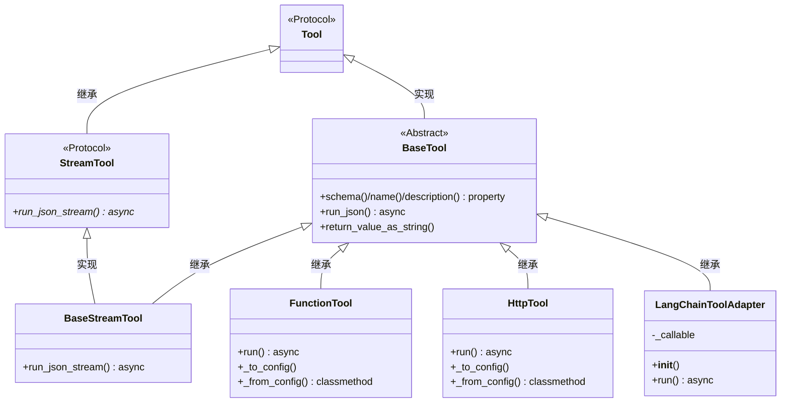

# 源码解析

AutoGen 框架源码解析

1. 版本：autogen-core 0.7.5

2. 大致目录（不断完善中）

   ```mermaid
   flowchart TB
   	A("Team (Group)") --> C(Termination)
   	A --> B(Agent)
   	A --> D(RunTime)
   	
   	B-->E(Model Client)
   	B-->F(WorkBench)
   	B-->G(RunTime)
   	
   	H(Message)
   	
   	F-->I(Tool)
   ```


# 1. Model Client

1. 探索以 `OpenAIChatCompletionClient` 为代表的 Model Client

2. OpenAIChatCompletionClient相关继承关系为

   ```
   OpenAIChatCompletionClient -> BaseOpenAIChatCompletionClient -> ChatCompletionClient
   ```

3. Model Client 的实现分为两部分

   ```bash
   autogen_core/models/			# 定义基础的抽象类和数据结构
   autogen_ext/models/openai/		# 定义具体的方法和实现
   ```

   

## 1.1 样例代码

```python
from autogen_ext.models.openai import OpenAIChatCompletionClient
from autogen_core.models import ModelFamily
import asyncio
from autogen_core.models import UserMessage

model_client = OpenAIChatCompletionClient(
    model="Qwen3-8B-AWQ",
    base_url="http://localhost:7393/v1",
    api_key="EMPTY",
    model_info={
        "vision": True,
        "function_calling": True,
        "json_output": True,
        "family": ModelFamily.UNKNOWN,
        "structured_output": True,
    }
)

async def main():
    messages=[
        UserMessage(content="Write a very short story about a dragon.", source="user")
    ]

    async for response in model_client.create_stream(messages=messages):
        if isinstance(response, str):
            # A partial response is a string.
            print(response, flush=True, end="")
        else:
            # The last response is a CreateResult object with the complete message.
            print("\n\n------------\n")
            print("The complete response:", flush=True)
            print(response.content, flush=True)


asyncio.run(main())
```


## 1.2 模型定义

### 1.2.1 Model Info & Family

1. `ModelInfo` 对 LLM Model 自身的描述支持

   `autogen_core/models/_model_client.py`

   ```python
   class ModelInfo(TypedDict, total=False):
       """ModelInfo is a dictionary that contains information about a model's properties.
       It is expected to be used in the model_info property of a model client.
   
       We are expecting this to grow over time as we add more features.
       """
   
       vision: Required[bool]
       """True if the model supports vision, aka image input, otherwise False."""
       function_calling: Required[bool]
       """True if the model supports function calling, otherwise False."""
       json_output: Required[bool]
       """True if the model supports json output, otherwise False. Note: this is different to structured json."""
       family: Required[ModelFamily.ANY | str]
       """Model family should be one of the constants from :py:class:`ModelFamily` or a string representing an unknown model family."""
       structured_output: Required[bool]
       """True if the model supports structured output, otherwise False. This is different to json_output."""
       multiple_system_messages: Optional[bool]
       """True if the model supports multiple, non-consecutive system messages, otherwise False."""
   
   ```

   

2. （结构）同一模型的不同版本，构成一个Family。

   同一Family内的模型能力相近（`ModelInfo` ），但可以不同。

   - 比如：`gpt-4o-mini-search-preview-2025-03-11` 和 `gpt-4o-search-preview-2025-03-11` 都属于 `ModelFamily.GPT_4O`

   ```python
   class ModelFamily:
       """A model family is a group of models that share similar characteristics from a capabilities perspective. This is different to discrete supported features such as vision, function calling, and JSON output.
       ...
       """
   ```

   注意：

   - 实际上重要的是`ModelInfo`，而`ModelInfo`是以单个模型定义的，而不是以Famliy定义的。
   - 因此Famliy这一概念在代码中并无重要应用。


3. AutoGen在源码内部预设若干模型`ModelInfo`，比如

   ```python
       "gpt-4o-mini-search-preview-2025-03-11": {
           "vision": False,
           "function_calling": True,
           "json_output": True,
           "family": ModelFamily.GPT_4O,
           "structured_output": True,
           "multiple_system_messages": True,
       },
   ```


### 1.2.2 非预设模型的使用

不在`autogen_core.models.ModelFamily`中的模型，在构建时要写`model_info`

参考注释：[autogen_ext.models.openai — AutoGen](https://microsoft.github.io/autogen/stable/reference/python/autogen_ext.models.openai.html#autogen_ext.models.openai.OpenAIChatCompletionClient.Examples)

```python
model_client = OpenAIChatCompletionClient(
    model="deepseek-chat",
    api_key="*****",
    base_url="https://api.deepseek.com",
    model_info={
        "vision": False,
        "function_calling": True,
        "json_output": False,
        "family": ModelFamily.UNKNOWN,
        "structured_output": True,
    }
)
```


## 1.3 与LLM交互的数据结构

### 1.3.1 传入LLM的Message

注意：此处定义的Message仅用于调用LLM，并非Agent和Agent之间通信的Message

`autogen_core/models/_types.py`

1. 定义4种Message

   ```python
   class SystemMessage(BaseModel):
       """System message contains instructions for the model coming from the developer.
       """
   
       content: str
       """The content of the message."""
   
       type: Literal["SystemMessage"] = "SystemMessage"
   
   
   class UserMessage(BaseModel):
       """User message contains input from end users, or a catch-all for data provided to the model."""
   
       content: Union[str, List[Union[str, Image]]]
       """The content of the message."""
   
       source: str
       """The name of the agent that sent this message."""
   
       type: Literal["UserMessage"] = "UserMessage"
   
   
   class AssistantMessage(BaseModel):
       """Assistant message are sampled from the language model."""
   
       content: Union[str, List[FunctionCall]]
       """The content of the message."""
   
       thought: str | None = None
       """The reasoning text for the completion if available. Used for reasoning model and additional text content besides function calls."""
   
       source: str
       """The name of the agent that sent this message."""
   
       type: Literal["AssistantMessage"] = "AssistantMessage"
   
   
   class FunctionExecutionResult(BaseModel):
       """Function execution result contains the output of a function call."""
   
       content: str
       """The output of the function call."""
   
       name: str
       """(New in v0.4.8) The name of the function that was called."""
   
       call_id: str
       """The ID of the function call. Note this ID may be empty for some models."""
   
       is_error: bool | None = None
       """Whether the function call resulted in an error."""
   
   
   class FunctionExecutionResultMessage(BaseModel):
       """Function execution result message contains the output of multiple function calls."""
   
       content: List[FunctionExecutionResult]
   
       type: Literal["FunctionExecutionResultMessage"] = "FunctionExecutionResultMessage"
   ```


2. 4种Message统称为`LLMMessage`

   ```python
   LLMMessage = Annotated[
       Union[SystemMessage, UserMessage, AssistantMessage, FunctionExecutionResultMessage], Field(discriminator="type")
   ]
   ```

   

### 1.3.2 Result

1. 调用 Model Client 的单条结果格式（非流式，或者流式的单条信息）

   ```python
   class CreateResult(BaseModel):
       """Create result contains the output of a model completion."""
   
       finish_reason: FinishReasons
       """The reason the model finished generating the completion."""
   
       content: Union[str, List[FunctionCall]]
       """The output of the model completion."""
   
       usage: RequestUsage
       """The usage of tokens in the prompt and completion."""
   
       cached: bool
       """Whether the completion was generated from a cached response."""
   
       logprobs: Optional[List[ChatCompletionTokenLogprob] | None] = None
       """The logprobs of the tokens in the completion."""
   
       thought: Optional[str] = None
       """The reasoning text for the completion if available. Used for reasoning models
       and additional text content besides function calls."""
   ```

   - 关于 `RequestUsage`

     ```python
     class RequestUsage:
         prompt_tokens: int
         completion_tokens: int
     ```

     

   - 关于 `FinishReasons`

     ```python
     FinishReasons = Literal["stop", "length", "function_calls", "content_filter", "unknown"]
     ```

   

2. 调用 LLM 的单次结果返回

   `openai/types/chat/chat_completion.py`

   ```python
   class Choice(BaseModel):
       finish_reason: Literal["stop", "length", "tool_calls", "content_filter", "function_call"]
       """The reason the model stopped generating tokens.
   
       This will be `stop` if the model hit a natural stop point or a provided stop
       sequence, `length` if the maximum number of tokens specified in the request was
       reached, `content_filter` if content was omitted due to a flag from our content
       filters, `tool_calls` if the model called a tool, or `function_call`
       (deprecated) if the model called a function.
       """
   
       index: int
       """The index of the choice in the list of choices."""
   
       logprobs: Optional[ChoiceLogprobs] = None
       """Log probability information for the choice."""
   
       message: ChatCompletionMessage
       """A chat completion message generated by the model."""
   
   
   class ChatCompletion(BaseModel):
       id: str
       """A unique identifier for the chat completion."""
   
       choices: List[Choice]
       """A list of chat completion choices.
       """
   
       created: int
       """The Unix timestamp (in seconds) of when the chat completion was created."""
   
       model: str
       """The model used for the chat completion."""
       
       ...
   ```

   


## 1.4 抽象基类ChatCompletionClient

`autogen_core/models/_model_client.py`

```python
class ChatCompletionClient(ComponentBase[BaseModel], ABC):
    # Caching has to be handled internally as they can depend on the create args that were stored in the constructor
    @abstractmethod
    async def create(
        self,
        messages: Sequence[LLMMessage],
        *,
        tools: Sequence[Tool | ToolSchema] = [],
        tool_choice: Tool | Literal["auto", "required", "none"] = "auto",
        json_output: Optional[bool | type[BaseModel]] = None,
        extra_create_args: Mapping[str, Any] = {},
        cancellation_token: Optional[CancellationToken] = None,
    ) -> CreateResult:
        ...

    @abstractmethod
    def create_stream(
        self,
        messages: Sequence[LLMMessage],
        *,
        tools: Sequence[Tool | ToolSchema] = [],
        tool_choice: Tool | Literal["auto", "required", "none"] = "auto",
        json_output: Optional[bool | type[BaseModel]] = None,
        extra_create_args: Mapping[str, Any] = {},
        cancellation_token: Optional[CancellationToken] = None,
    ) -> AsyncGenerator[Union[str, CreateResult], None]:
        ...

    @abstractmethod
    async def close(self) -> None: ...

    @abstractmethod
    def actual_usage(self) -> RequestUsage: ...

    @abstractmethod
    def total_usage(self) -> RequestUsage: ...

    @abstractmethod
    def count_tokens(self, messages: Sequence[LLMMessage], *, tools: Sequence[Tool | ToolSchema] = []) -> int: ...

    @abstractmethod
    def remaining_tokens(self, messages: Sequence[LLMMessage], *, tools: Sequence[Tool | ToolSchema] = []) -> int: ...

    # Deprecated
    @property
    @abstractmethod
    def capabilities(self) -> ModelCapabilities: ...  # type: ignore

    @property
    @abstractmethod
    def model_info(self) -> ModelInfo: ...
```


## 1.5 具体实现

主要实现在`BaseOpenAIChatCompletionClient`中，

`OpenAIChatCompletionClient`仅重点实现序列化和反序列化方法：`_to_config()`和`_from_config()`

`autogen_ext/models/openai/_openai_client.py`

### 1.5.1  _process_create_args()

（主要逻辑，忽略了部分分支和辅助功能）

信息预处理

```python
def _process_create_args(...):
    # step 1: 处理输出格式
    if json_output is not None:
        if json_output is True:
            # JSON mode.
            create_args["response_format"] = ResponseFormatJSONObject(type="json_object")
        elif json_output is False:
            # Text mode.
            create_args["response_format"] = ResponseFormatText(type="text")
        elif isinstance(json_output, type) and issubclass(json_output, BaseModel):
            # Beta client mode with Pydantic model class.
            response_format_value = json_output
            
    # step 2: 针对 Some models accept only one system message(or, it will read only the last one)
    # So, merge system messages into one (if multiple and continuous)
    if not self.model_info.get("multiple_system_messages", False):
        for idx, message in enumerate(messages):
            if isinstance(message, SystemMessage):
            	system_message_content += message.content + "\n"
            ...
            
    # step 3: 不知为何物的oai转换
    oai_messages_nested = [to_oai_type(m, ...) for m in messages]
    oai_messages = [item for sublist in oai_messages_nested for item in sublist]
    
    # step 4: 工具描述格式的转换
    converted_tools = convert_tools(tools)
    ...
    
    return CreateParams(
        messages=oai_messages,
        tools=converted_tools,
        response_format=response_format_value,
        create_args=create_args,
    )
```


### 1.5.2 create()

（主要逻辑，忽略了部分分支和辅助功能）

```python
async def create(...):
    # step 1: 参数处理
    create_params = self._process_create_args(
        messages,
        tools,
        tool_choice,
        json_output,
        extra_create_args,
    )
    
    # step 2: 创建future
    #  asyncio.ensure_future() 的作用是，如果传入的是coroutine，把它封装成future，保证可被Event Loop调度
    future = asyncio.ensure_future(
        self._client.chat.completions.create(
            messages=create_params.messages,
            stream=False,
            tools=(create_params.tools if len(create_params.tools) > 0 else NOT_GIVEN),
            **create_params.create_args,
        )
    )
    
    # step 3: 执行这个futre
    result: Union[ParsedChatCompletion[BaseModel], ChatCompletion] = await future
        
    # step 4: token使用情况，信息统计
    usage = RequestUsage(
        prompt_tokens=getattr(result.usage, "prompt_tokens", 0) if result.usage is not None else 0,
        completion_tokens=getattr(result.usage, "completion_tokens", 0) if result.usage is not None else 0,
    )
    
    choice = result.choices[0]
    # step 5.1: (如需要) 生成拟调用工具的清单（注意，此处并不是立即调用）
    if choice.message.tool_calls is not None:
        content = []
        for tool_call in choice.message.tool_calls:
            content.append(
                FunctionCall(
                    id=tool_call.id,
                    arguments=tool_call.function.arguments,
                    name=normalize_name(tool_call.function.name),
                )
            )
            finish_reason = "tool_calls"
    
    # step 5.2: 返回结果 
    else:
        finish_reason = choice.finish_reason
        content = choice.message.content or ""
    
    # step 6: 生成响应
    response = CreateResult(
        finish_reason=normalize_stop_reason(finish_reason),
        content=content,
        usage=usage,
        cached=False,
        logprobs=logprobs,
        thought=thought,
    )
    
    return response
```


### 1.5.3 create_stream()

只保留核心逻辑

```python
async def create_stream(...):
    # step 1: 参数处理
    create_params = self._process_create_args(...)
    
    # step 2: 创建future
    chunks = self._create_stream_chunks(
        tool_params=create_params.tools,
        oai_messages=create_params.messages,
        create_args=create_params.create_args,
        cancellation_token=cancellation_token,
    )
    
    # step 3: 执行future
    async for chunk in chunks:
        # OpenAI 在流式响应时，tool和content似乎相互排斥的，
        # 即一条chunk中，要么是文字性的content，要么是tool call
        
        # step 3.1： First try get content
        if choice.delta.content:
            content_deltas.append(choice.delta.content)
            if len(choice.delta.content) > 0:
                yield choice.delta.content
            continue
        
        # step 3.2: get tool calls
        if choice.delta.tool_calls is not None:
            for tool_call_chunk in choice.delta.tool_calls:
                idx = tool_call_chunk.index
                full_tool_calls[idx] = FunctionCall(...)
                
    # step 4: token使用情况，信息统计
    usage = RequestUsage(
        prompt_tokens=prompt_tokens,
        completion_tokens=completion_tokens,
    )
    
    # step 5: 生成响应
    result = CreateResult(
        finish_reason=normalize_stop_reason(stop_reason),
        content=content,
        usage=usage,
        cached=False,
        logprobs=logprobs,
        thought=thought,
    )
    
    yield result
```


与异步迭代器调用方式相关的`_create_stream_chunks()`

```python
    async def _create_stream_chunks(...):
        stream_future = asyncio.ensure_future(
            self._client.chat.completions.create(
                messages=oai_messages,
                stream=True,
                tools=tool_params if len(tool_params) > 0 else NOT_GIVEN,
                **create_args,
            )
        )
        if cancellation_token is not None:
            cancellation_token.link_future(stream_future)
        stream = await stream_future
        
        while True:
            try:
                chunk_future = asyncio.ensure_future(anext(stream))
                if cancellation_token is not None:
                    cancellation_token.link_future(chunk_future)
                chunk = await chunk_future
                yield chunk
            except StopAsyncIteration:
                break
```

# 2. Tool

## 2.1 样例代码(FunctionTool)

FunctionTool的文档：https://microsoft.github.io/autogen/stable/reference/python/autogen_core.tools.html#autogen_core.tools.FunctionTool

```python
from autogen_core.tools import FunctionTool
from autogen_core import CancellationToken
from pydantic import BaseModel

async def sentiment_analysis(text: str) -> dict:
    """Given a text, return the sentiment."""
    positive_words = {"happy", "joy", "love", "excellent", "good", "great"}
    return positive_words

tool = FunctionTool(sentiment_analysis, description="Sentiment Analysis", strict=True)

async def run():

    # example: run_json
    result = await tool.run_json({"text": "I am very happy today!"}, CancellationToken())
    print(result)

    result_str = tool.return_value_as_string(result)
    print(f"result as string: {result_str}")

    # example: run example
    class ArgsModel(BaseModel):
        text: str

    args = ArgsModel(text="I love programming!")
    result2 = await tool.run(args, CancellationToken())
    print(result2)

async def save_load_example():
    # example: save and load state
    state = tool._to_config()
    print(f"Saved state: {state}")

    new_tool = FunctionTool._from_config(state)
    print("State loaded successfully.")


if __name__ == "__main__":
    import asyncio
    asyncio.run(run())
    asyncio.run(save_load_example())
```


样例中输出的tool.schema

```json
{
  "name": "sentiment_analysis",
  "description": "Sentiment Analysis",
  "parameters": {
    "type": "object",
    "properties": {
      "text": {
        "description": "text",
        "title": "Text",
        "type": "string"
      }
    },
    "required": [
      "text"
    ],
    "additionalProperties": false
  },
  "strict": true
}
```


## 2.2 Tool 基类和派生类

### 2.2.1  Tool

`autogen_core/tools/_base.py`

一个Tool必须包含以下方法

```python
class Tool(Protocol):
    @property
    def name(self) -> str: ...

    @property
    def description(self) -> str: ...

    @property
    def schema(self) -> ToolSchema: ...

    def args_type(self) -> Type[BaseModel]: ...

    def return_type(self) -> Type[Any]: ...

    def state_type(self) -> Type[BaseModel] | None: ...

    def return_value_as_string(self, value: Any) -> str: ...

    async def run_json(
        self, args: Mapping[str, Any], cancellation_token: CancellationToken, call_id: str | None = None
    ) -> Any: ...

    async def save_state_json(self) -> Mapping[str, Any]: ...

    async def load_state_json(self, state: Mapping[str, Any]) -> None: ...
        
```


### 2.2.3 UML类图



注意：`BaseTool.run_json()`方法会调用子类的`run()`方法


### 2.2.2 ToolSchema

`autogen_core/tools/_base.py`

（TypedDict 类似于使用pydantic定义了ToolSchema）

```python
class ParametersSchema(TypedDict):
    type: str
    properties: Dict[str, Any]
    required: NotRequired[Sequence[str]]
    additionalProperties: NotRequired[bool]
        
class ToolSchema(TypedDict):
    parameters: NotRequired[ParametersSchema]
    name: str
    description: NotRequired[str]
    strict: NotRequired[bool]			# 默认为False，schema是否只编写显示定义的参数
```


### 2.2.4 BaseTool

（只列出了关键方法）

```python
class BaseTool(ABC, Tool, ComponentBase):
    @property
    def schema(self) -> ToolSchema:

        # step 1: 获得一份Json Schema描述文件
        # self._args_type is a Pydantic BaseModel
        model_schema: Dict[str, Any] = self._args_type.model_json_schema()
        ...

        # step 2: 转换成 ParametersSchema 和 ToolSchema
        parameters = ParametersSchema(
            type="object",
            properties=model_schema["properties"],
            required=model_schema.get("required", []),
            additionalProperties=model_schema.get("additionalProperties", False),
        )

        ...

        tool_schema = ToolSchema(
            name=self._name,
            description=self._description,
            parameters=parameters,
            strict=self._strict,
        )
        return tool_schema

    @property
    def name(self) -> str:
        return self._name

    @property
    def description(self) -> str:
        return self._description


    def return_value_as_string(self, value: Any) -> str:
        if isinstance(value, BaseModel):
            dumped = value.model_dump()
            if isinstance(dumped, dict):
                return json.dumps(dumped)
            return str(dumped)

        return str(value)

    @abstractmethod
    async def run(self, args: ArgsT, cancellation_token: CancellationToken) -> ReturnT: 
        ...

    async def run_json(
        self, args: Mapping[str, Any], cancellation_token: CancellationToken, ...
    ) -> Any:

        # 调用子类的 run 方法
        return_value = await self.run(self._args_type.model_validate(args), cancellation_token)
        
        return return_value
```


## 2.3 FunctionTool的实现

### 2.3.1 描述

```python
class FunctionToolConfig(BaseModel):
    """Configuration for a function tool."""

    source_code: str
    name: str
    description: str
    global_imports: Sequence[Import]		# 是否有依赖模块
    has_cancellation_support: bool			# 是否支持async的cancel
```


### 2.3.2  FunctionTool 

保留了主要逻辑

```python
class FunctionTool(BaseTool, Component):

    def __init__(self, func: Callable[..., Any], description: str, name: str | None = None, 
                 global_imports: Sequence[Import] = [], strict: bool = False) -> None:
        
        self._func = func
        self._global_imports = global_imports

        # step 1: 获取完整函数传入和传出参数描述
        self._signature = get_typed_signature(func)
        func_name = ...

        # step 2: 生成函数参数模型 pydantic.BaseModel
        args_model = args_base_model_from_signature(func_name + "args", self._signature)
        ...

        super().__init__(args_model, return_type, func_name, description, strict)

    async def run(self, args: BaseModel, cancellation_token: CancellationToken) -> Any:

        ...

        if asyncio.iscoroutinefunction(self._func):
            # 如果是coroutine函数，直接await调用
            if self._has_cancellation_support:
                result = await self._func(**kwargs, cancellation_token=cancellation_token)
            else:
                result = await self._func(**kwargs)
        else:
            # 如果是同步函数，创建一个新线程来调用，避免阻塞事件循环
            if self._has_cancellation_support:
                result = await asyncio.get_event_loop().run_in_executor(
                    None,
                    functools.partial(
                        self._func,
                        **kwargs,
                        cancellation_token=cancellation_token,
                    ),
                )
            else:
                # 如果不支持cancel，封装一层再调用
                future = asyncio.get_event_loop().run_in_executor(
                    None, functools.partial(self._func, **kwargs)
                )
                cancellation_token.link_future(future)
                result = await future

        return result

    def _to_config(self) -> FunctionToolConfig:
        return FunctionToolConfig(
            source_code=dedent(to_code(self._func)),
            global_imports=self._global_imports,
            name=self.name,
            description=self.description,
            has_cancellation_support=self._has_cancellation_support,
        )

    @classmethod
    def _from_config(cls, config: FunctionToolConfig) -> Self:

        # step 1： Execute imports first
        for import_stmt in config.global_imports:
            import_code = import_to_str(import_stmt)
            try:
                exec(import_code, exec_globals)
            except :
                ...


        # step 2: build function code in the memory
        try:
            exec(config.source_code, exec_globals)
            func_name = config.source_code.split("def ")[1].split("(")[0]
        except Exception as e:
            ...

        # step 3: Get function and verify it's callable
        func: Callable[..., Any] = exec_globals[func_name]
        if not callable(func):
            raise TypeError(f"Expected function but got {type(func)}")

        return cls(func, name=config.name, description=config.description, global_imports=config.global_imports)

```


## 2.4 HttpTool

1. 文档：[autogen_ext.tools.http — AutoGen 文档](https://msdocs.cn/autogen/stable/reference/python/autogen_ext.tools.http.html#autogen_ext.tools.http.HttpTool)

2. `HttpTool` 内部使用 `httpx.AsyncClient`

3. 灵活度不高，不推荐

   - 比如无法处理流式响应或者文件上传等

4. 样例代码

   ```python
   from autogen_core import CancellationToken
   from autogen_ext.tools.http import HttpTool
   
   # Define a JSON schema for a base64 decode tool
   base64_schema = {
       "type": "object",
       "properties": {
           "value": {"type": "string", "description": "The base64 value to decode"},
       },
       "required": ["value"],
   }
   
   # Create an HTTP tool for the httpbin API
   tool = HttpTool(
       name="base64_decode",
       description="base64 decode a value",
       scheme="https",
       host="httpbin.org",
       port=443,
       path="/base64/{value}",
       method="GET",
       json_schema=base64_schema,
   )
   
   
   async def main():
       result = await tool.run_json({"value": "YWJjZGU="}, CancellationToken())
       print(result)
   
   import asyncio
   asyncio.run(main())
   ```

   


# 3. Workbench

1. 官方定义

   > A workbench is responsible for managing the lifecycle of the tools and **providing a single interface to call them**.

2. 文档：[autogen_core.tools — AutoGen](https://microsoft.github.io/autogen/stable/reference/python/autogen_core.tools.html#autogen_core.tools.Workbench)

   注意：

   - `start() / stop() / reset()` 实际上没实现
   - 一般使用的是`StaticStreamWorkbench`

3. UML类图

   ```mermaid
   classDiagram
       class Workbench {
           <<Abstract>>
       }
       
       class StreamWorkbench {
           <<Abstract>>
           +call_tool_stream()* 
       }
       
       class StaticWorkbench {
           +list_tools() async
           +call_tool() async
           +save_state() async
           +load_state() async
           -_to_config()
           +_from_config() classmethod
       }
       
       class StaticStreamWorkbench {
           +call_tool_stream() async
       }
       
       Workbench <|-- StreamWorkbench : 继承
       Workbench <|-- StaticWorkbench : 继承
       StaticWorkbench <|-- StaticStreamWorkbench : 继承
       StreamWorkbench <|-- StaticStreamWorkbench : 继承
   ```

   

## 3.1 样例代码

```python
from autogen_core.tools import FunctionTool, StaticStreamWorkbench
from autogen_ext.tools.http import HttpTool

async def sentiment_analysis(text: str) -> dict:
    """Given a text, return the sentiment."""
    positive_words = {"happy", "joy", "love", "excellent", "good", "great"}
    return positive_words


async def build():
    tool1 = FunctionTool(sentiment_analysis, description="Sentiment Analysis", strict=True)
    tool2 = HttpTool(
        name="base64_decode",
        description="base64 decode a value",
        scheme="https",
        host="httpbin.org",
        port=443,
        path="/base64/{value}",
        method="GET",
        json_schema={
            "type": "object",
            "properties": {
                "value": {"type": "string", "description": "The base64 value to decode"},
            },
            "required": ["value"],
        }
    )


    workbench = StaticStreamWorkbench(tools=[tool1, tool2])

    return workbench

async def run():
    workbench = await build()

    tool_list = await workbench.list_tools()
    print("Available tools in the workbench:", tool_list)

    result = await workbench.call_tool("sentiment_analysis", {"text": "I am very happy today!"})
    print("Sentiment Analysis Result:", result)

    result = await workbench.call_tool("base64_decode", {"value": "YWJjZGU="})
    print("Sentiment Analysis Result:", result)


async def save_load_example():
    workbench = await build()

    state = await workbench.save_state()
    config = workbench._to_config()

    # HttpTool 存在一些问题，导致失败
    new_workbench = StaticStreamWorkbench._from_config(config)
    await new_workbench.load_state(state)


if __name__ == "__main__":
    import asyncio
    # asyncio.run(run())
    asyncio.run(save_load_example())
```


## 3.2 Workbench基类

```python
class Workbench(ABC, ComponentBase[BaseModel]):

    @abstractmethod
    async def list_tools(self) -> List[ToolSchema]:
        ...

    @abstractmethod
    async def call_tool(
        self,
        name: str,
        arguments: Mapping[str, Any] | None = None,
        cancellation_token: CancellationToken | None = None,
        call_id: str | None = None,
    ) -> ToolResult:
        ...

    @abstractmethod
    async def start(self) -> None:
        """
        Start the workbench and initialize any resources.
        """
        ...

    @abstractmethod
    async def stop(self) -> None:
        """
        Stop the workbench and release any resources.
        """
        ...

    @abstractmethod
    async def reset(self) -> None:
        """
        Reset the workbench to its initialized, started state.
        """
        ...

    @abstractmethod
    async def save_state(self) -> Mapping[str, Any]:
        """
        Save the state of the workbench.
        """
        ...

    @abstractmethod
    async def load_state(self, state: Mapping[str, Any]) -> None:
        """
        Load the state of the workbench.
        """
        ...

    async def __aenter__(self) -> Self:
        await self.start()
        return self

    async def __aexit__(
        self, exc_type: Optional[Type[BaseException]], exc_val: Optional[BaseException], exc_tb: Optional[TracebackType]
    ) -> None:
        await self.stop()


```


## 3.3 数据格式

### 3.3.1 WorkbenchConfig

```python
class StaticWorkbenchConfig(BaseModel):
    tools: List[ComponentModel] = []
    tool_overrides: Dict[str, ToolOverride] = Field(default_factory=dict)
```

其中, `ToolOverride`几乎不会被用到

```python
class ToolOverride(BaseModel):
    """Override configuration for a tool's name and/or description."""

    name: Optional[str] = None
    description: Optional[str] = None
```


### 3.3.2 ToolResult

```python
class ToolResult(BaseModel):
    """
    A result of a tool execution by a workbench.
    """

    type: Literal["ToolResult"] = "ToolResult"

    name: str
    """The name of the tool that was executed."""

    result: List[ResultContent]
    """The result of the tool execution."""

    is_error: bool = False
    """Whether the tool execution resulted in an error."""

    def to_text(self, replace_image: str | None = None) -> str:
        """
        Convert the result to a text string.

        Args:
            replace_image (str | None): The string to replace the image content with.
                If None, the image content will be included in the text as base64 string.

        Returns:
            str: The text representation of the result.
        """
        ...
        return "\n".join(parts)
```


其中

```python
class TextResultContent(BaseModel):
    """
    Text result content of a tool execution.
    """

    type: Literal["TextResultContent"] = "TextResultContent"

    content: str
    """The text content of the result."""

class ImageResultContent(BaseModel):
    """
    Image result content of a tool execution.
    """

    type: Literal["ImageResultContent"] = "ImageResultContent"

    content: Image
    """The image content of the result."""

ResultContent = Annotated[TextResultContent | ImageResultContent, Field(discriminator="type")]

```


## 3.4 具体实现

### 3.4.1  StaticWorkbench

`call_tool()`核心逻辑

- 调用`tool.run_json()`
- 调用`tool.return_value_as_string()`

```python
class StaticWorkbench(Workbench, Component[StaticWorkbenchConfig]):
    def __init__(
        self, tools: List[BaseTool[Any, Any]], 
        tool_overrides: Optional[Dict[str, ToolOverride]] = None
    ) -> None:
            self._tools = tools
            ...

    async def list_tools(self) -> List[ToolSchema]:
        result_schemas: List[ToolSchema] = []
        for tool in self._tools:
            original_schema = tool.schema
            ...
            result_schemas.append(schema)
        return result_schemas

    async def call_tool(
        self,
        name: str,
        arguments: Mapping[str, Any] | None = None,
        cancellation_token: CancellationToken | None = None,
        call_id: str | None = None,
    ) -> ToolResult:

        # step 1: get the tool
        tool = next((tool for tool in self._tools if tool.name == original_name), None)
        if tool is None:
            return ToolResult(
                name=name,  # Return the requested name (which might be overridden)
                result=[TextResultContent(content=f"Tool {name} not found.")],
                is_error=True,
            )
        
        ...

        # step 2: call the tool
        result_future = asyncio.ensure_future(tool.run_json(arguments, cancellation_token, call_id=call_id))
        actual_tool_output = await result_future
        result_str = tool.return_value_as_string(actual_tool_output)

        return ToolResult(name=name, result=[TextResultContent(content=result_str)], is_error=is_error)


    async def save_state(self) -> Mapping[str, Any]:
        tool_states = StateicWorkbenchState()
        for tool in self._tools:
            tool_states.tools[tool.name] = await tool.save_state_json()
        return tool_states.model_dump()

    async def load_state(self, state: Mapping[str, Any]) -> None:
        parsed_state = StateicWorkbenchState.model_validate(state)
        for tool in self._tools:
            if tool.name in parsed_state.tools:
                await tool.load_state_json(parsed_state.tools[tool.name])

    def _to_config(self) -> StaticWorkbenchConfig:
        return StaticWorkbenchConfig(
            tools=[tool.dump_component() for tool in self._tools], tool_overrides=self._tool_overrides
        )
    
    @classmethod
    def _from_config(cls, config: StaticWorkbenchConfig) -> Self:
        return cls(tools=[BaseTool.load_component(tool) for tool in config.tools],
                   tool_overrides=config.tool_overrides)
```


###  3.4.2 StaticStreamWorkbench

（主要逻辑，忽略了部分分支和辅助功能）

```python
async def call_tool_stream(...):
    if isinstance(tool, StreamTool):
        previous_result: Any | None = None
        async for result in tool.run_json_stream(arguments, cancellation_token, call_id=call_id):
            if previous_result is not None:
                yield previous_result
            previous_result = result
         actual_tool_output = previous_result
    else:
         result_future = asyncio.ensure_future(tool.run_json(arguments, cancellation_token, call_id=call_id))
         cancellation_token.link_future(result_future)
         actual_tool_output = await result_future
    yield ToolResult(...)
```


