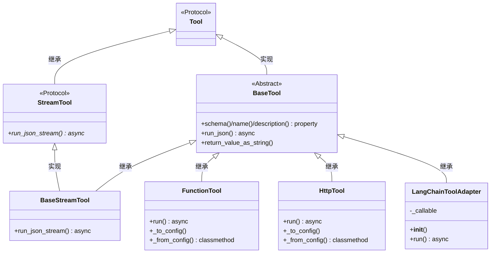
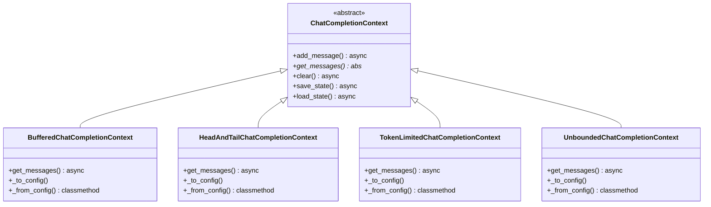
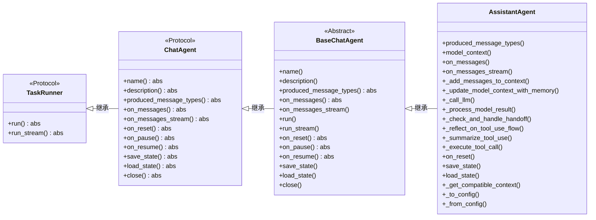
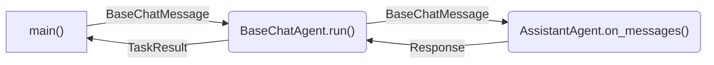
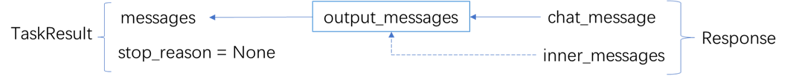
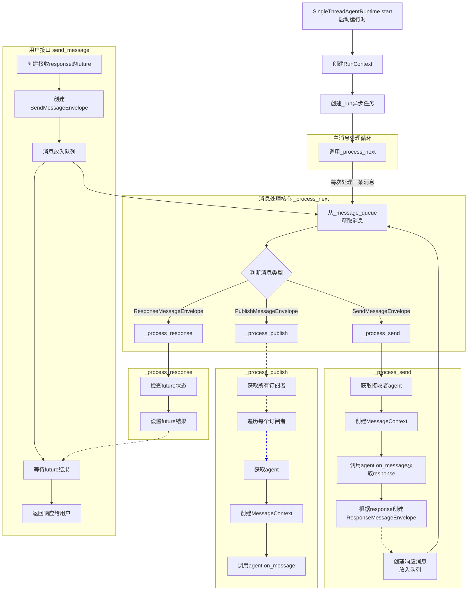
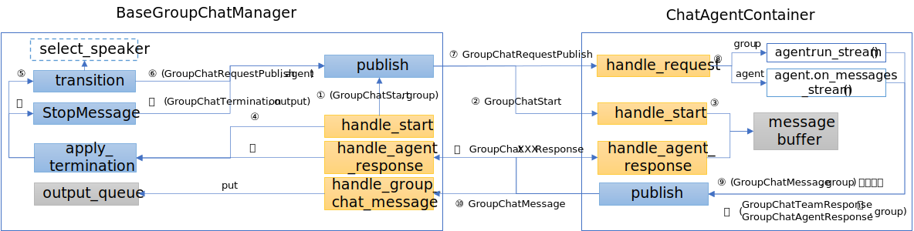
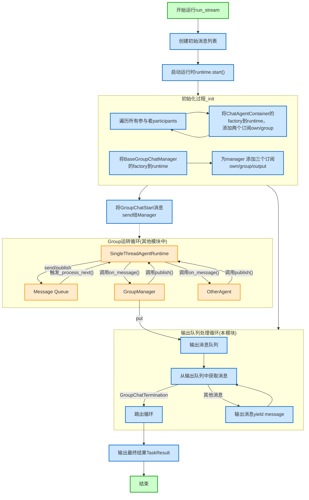

#  源码解析

AutoGen 框架源码解析

1. 版本：autogen-core 0.7.5


# 1. Model Client

1. 探索以 `OpenAIChatCompletionClient` 为代表的 Model Client

2. OpenAIChatCompletionClient相关继承关系为

   ```
   OpenAIChatCompletionClient -> BaseOpenAIChatCompletionClient -> ChatCompletionClient
   ```

3. Model Client 的实现分为两部分

   ```bash
   autogen_core/models/			# 定义基础的抽象类和数据结构
   autogen_ext/models/openai/		# 定义具体的方法和实现
   ```

   

## 1.1 样例代码

```python
from autogen_ext.models.openai import OpenAIChatCompletionClient
from autogen_core.models import ModelFamily
import asyncio
from autogen_core.models import UserMessage

model_client = OpenAIChatCompletionClient(
    model="Qwen3-8B-AWQ",
    base_url="http://localhost:7393/v1",
    api_key="EMPTY",
    model_info={
        "vision": True,
        "function_calling": True,
        "json_output": True,
        "family": ModelFamily.UNKNOWN,
        "structured_output": True,
    }
)

async def main():
    messages=[
        UserMessage(content="Write a very short story about a dragon.", source="user")
    ]

    async for response in model_client.create_stream(messages=messages):
        if isinstance(response, str):
            # A partial response is a string.
            print(response, flush=True, end="")
        else:
            # The last response is a CreateResult object with the complete message.
            print("\n\n------------\n")
            print("The complete response:", flush=True)
            print(response.content, flush=True)


asyncio.run(main())
```


## 1.2 模型定义

### 1.2.1 Model Info & Family

1. `ModelInfo` 对 LLM Model 自身的描述支持

   `autogen_core/models/_model_client.py`

   ```python
   class ModelInfo(TypedDict, total=False):
       """ModelInfo is a dictionary that contains information about a model's properties.
       It is expected to be used in the model_info property of a model client.
   
       We are expecting this to grow over time as we add more features.
       """
   
       vision: Required[bool]
       """True if the model supports vision, aka image input, otherwise False."""
       function_calling: Required[bool]
       """True if the model supports function calling, otherwise False."""
       json_output: Required[bool]
       """True if the model supports json output, otherwise False. Note: this is different to structured json."""
       family: Required[ModelFamily.ANY | str]
       """Model family should be one of the constants from :py:class:`ModelFamily` or a string representing an unknown model family."""
       structured_output: Required[bool]
       """True if the model supports structured output, otherwise False. This is different to json_output."""
       multiple_system_messages: Optional[bool]
       """True if the model supports multiple, non-consecutive system messages, otherwise False."""
   
   ```

   

2. （结构）同一模型的不同版本，构成一个Family。

   同一Family内的模型能力相近（`ModelInfo` ），但可以不同。

   - 比如：`gpt-4o-mini-search-preview-2025-03-11` 和 `gpt-4o-search-preview-2025-03-11` 都属于 `ModelFamily.GPT_4O`

   ```python
   class ModelFamily:
       """A model family is a group of models that share similar characteristics from a capabilities perspective. This is different to discrete supported features such as vision, function calling, and JSON output.
       ...
       """
   ```

   注意：

   - 实际上重要的是`ModelInfo`，而`ModelInfo`是以单个模型定义的，而不是以Famliy定义的。
   - 因此Famliy这一概念在代码中并无重要应用。


3. AutoGen在源码内部预设若干模型`ModelInfo`，比如

   ```python
       "gpt-4o-mini-search-preview-2025-03-11": {
           "vision": False,
           "function_calling": True,
           "json_output": True,
           "family": ModelFamily.GPT_4O,
           "structured_output": True,
           "multiple_system_messages": True,
       },
   ```


### 1.2.2 非预设模型的使用

不在`autogen_core.models.ModelFamily`中的模型，在构建时要写`model_info`

参考注释：[autogen_ext.models.openai — AutoGen](https://microsoft.github.io/autogen/stable/reference/python/autogen_ext.models.openai.html#autogen_ext.models.openai.OpenAIChatCompletionClient.Examples)

```python
model_client = OpenAIChatCompletionClient(
    model="deepseek-chat",
    api_key="*****",
    base_url="https://api.deepseek.com",
    model_info={
        "vision": False,
        "function_calling": True,
        "json_output": False,
        "family": ModelFamily.UNKNOWN,
        "structured_output": True,
    }
)
```


## 1.3 与LLM交互的数据结构

### 1.3.1 传入LLM的Message

注意：此处定义的Message仅用于调用LLM，并非Agent和Agent之间通信的Message

`autogen_core/models/_types.py`

1. 定义4种Message

   ```python
   class SystemMessage(BaseModel):
       """System message contains instructions for the model coming from the developer.
       """
   
       content: str
       """The content of the message."""
   
       type: Literal["SystemMessage"] = "SystemMessage"
   
   
   class UserMessage(BaseModel):
       """User message contains input from end users, or a catch-all for data provided to the model."""
   
       content: Union[str, List[Union[str, Image]]]
       """The content of the message."""
   
       source: str
       """The name of the agent that sent this message."""
   
       type: Literal["UserMessage"] = "UserMessage"
   
   
   class AssistantMessage(BaseModel):
       """Assistant message are sampled from the language model."""
   
       content: Union[str, List[FunctionCall]]
       """The content of the message."""
   
       thought: str | None = None
       """The reasoning text for the completion if available. Used for reasoning model and additional text content besides function calls."""
   
       source: str
       """The name of the agent that sent this message."""
   
       type: Literal["AssistantMessage"] = "AssistantMessage"
   
   
   class FunctionExecutionResult(BaseModel):
       """Function execution result contains the output of a function call."""
   
       content: str
       """The output of the function call."""
   
       name: str
       """(New in v0.4.8) The name of the function that was called."""
   
       call_id: str
       """The ID of the function call. Note this ID may be empty for some models."""
   
       is_error: bool | None = None
       """Whether the function call resulted in an error."""
   
   
   class FunctionExecutionResultMessage(BaseModel):
       """Function execution result message contains the output of multiple function calls."""
   
       content: List[FunctionExecutionResult]
   
       type: Literal["FunctionExecutionResultMessage"] = "FunctionExecutionResultMessage"
   ```


2. 4种Message统称为`LLMMessage`

   ```python
   LLMMessage = Annotated[
       Union[SystemMessage, UserMessage, AssistantMessage, FunctionExecutionResultMessage], Field(discriminator="type")
   ]
   ```

   

### 1.3.2 Result

1. 调用 Model Client 的单条结果格式（非流式，或者流式的单条信息）

   ```python
   class CreateResult(BaseModel):
       """Create result contains the output of a model completion."""
   
       finish_reason: FinishReasons
       """The reason the model finished generating the completion."""
   
       content: Union[str, List[FunctionCall]]
       """The output of the model completion."""
   
       usage: RequestUsage
       """The usage of tokens in the prompt and completion."""
   
       cached: bool
       """Whether the completion was generated from a cached response."""
   
       logprobs: Optional[List[ChatCompletionTokenLogprob] | None] = None
       """The logprobs of the tokens in the completion."""
   
       thought: Optional[str] = None
       """The reasoning text for the completion if available. Used for reasoning models
       and additional text content besides function calls."""
   ```

   - 关于 `RequestUsage`

     ```python
     class RequestUsage:
         prompt_tokens: int
         completion_tokens: int
     ```

     

   - 关于 `FinishReasons`

     ```python
     FinishReasons = Literal["stop", "length", "function_calls", "content_filter", "unknown"]
     ```

   

2. 调用 LLM 的单次结果返回

   `openai/types/chat/chat_completion.py`

   ```python
   class Choice(BaseModel):
       finish_reason: Literal["stop", "length", "tool_calls", "content_filter", "function_call"]
       """The reason the model stopped generating tokens.
   
       This will be `stop` if the model hit a natural stop point or a provided stop
       sequence, `length` if the maximum number of tokens specified in the request was
       reached, `content_filter` if content was omitted due to a flag from our content
       filters, `tool_calls` if the model called a tool, or `function_call`
       (deprecated) if the model called a function.
       """
   
       index: int
       """The index of the choice in the list of choices."""
   
       logprobs: Optional[ChoiceLogprobs] = None
       """Log probability information for the choice."""
   
       message: ChatCompletionMessage
       """A chat completion message generated by the model."""
   
   
   class ChatCompletion(BaseModel):
       id: str
       """A unique identifier for the chat completion."""
   
       choices: List[Choice]
       """A list of chat completion choices.
       """
   
       created: int
       """The Unix timestamp (in seconds) of when the chat completion was created."""
   
       model: str
       """The model used for the chat completion."""
       
       ...
   ```

   


## 1.4 抽象基类ChatCompletionClient

`autogen_core/models/_model_client.py`

```python
class ChatCompletionClient(ComponentBase[BaseModel], ABC):
    # Caching has to be handled internally as they can depend on the create args that were stored in the constructor
    @abstractmethod
    async def create(
        self,
        messages: Sequence[LLMMessage],
        *,
        tools: Sequence[Tool | ToolSchema] = [],
        tool_choice: Tool | Literal["auto", "required", "none"] = "auto",
        json_output: Optional[bool | type[BaseModel]] = None,
        extra_create_args: Mapping[str, Any] = {},
        cancellation_token: Optional[CancellationToken] = None,
    ) -> CreateResult:
        ...

    @abstractmethod
    def create_stream(
        self,
        messages: Sequence[LLMMessage],
        *,
        tools: Sequence[Tool | ToolSchema] = [],
        tool_choice: Tool | Literal["auto", "required", "none"] = "auto",
        json_output: Optional[bool | type[BaseModel]] = None,
        extra_create_args: Mapping[str, Any] = {},
        cancellation_token: Optional[CancellationToken] = None,
    ) -> AsyncGenerator[Union[str, CreateResult], None]:
        ...

    @abstractmethod
    async def close(self) -> None: ...

    @abstractmethod
    def actual_usage(self) -> RequestUsage: ...

    @abstractmethod
    def total_usage(self) -> RequestUsage: ...

    @abstractmethod
    def count_tokens(self, messages: Sequence[LLMMessage], *, tools: Sequence[Tool | ToolSchema] = []) -> int: ...

    @abstractmethod
    def remaining_tokens(self, messages: Sequence[LLMMessage], *, tools: Sequence[Tool | ToolSchema] = []) -> int: ...

    # Deprecated
    @property
    @abstractmethod
    def capabilities(self) -> ModelCapabilities: ...  # type: ignore

    @property
    @abstractmethod
    def model_info(self) -> ModelInfo: ...
```


## 1.5 具体实现

主要实现在`BaseOpenAIChatCompletionClient`中，

`OpenAIChatCompletionClient`仅重点实现序列化和反序列化方法：`_to_config()`和`_from_config()`

`autogen_ext/models/openai/_openai_client.py`

### 1.5.1  _process_create_args()

（主要逻辑，忽略了部分分支和辅助功能）

信息预处理

```python
def _process_create_args(...):
    # step 1: 处理输出格式
    if json_output is not None:
        if json_output is True:
            # JSON mode.
            create_args["response_format"] = ResponseFormatJSONObject(type="json_object")
        elif json_output is False:
            # Text mode.
            create_args["response_format"] = ResponseFormatText(type="text")
        elif isinstance(json_output, type) and issubclass(json_output, BaseModel):
            # Beta client mode with Pydantic model class.
            response_format_value = json_output
            
    # step 2: 针对 Some models accept only one system message(or, it will read only the last one)
    # So, merge system messages into one (if multiple and continuous)
    if not self.model_info.get("multiple_system_messages", False):
        for idx, message in enumerate(messages):
            if isinstance(message, SystemMessage):
            	system_message_content += message.content + "\n"
            ...
            
    # step 3: 不知为何物的oai转换
    oai_messages_nested = [to_oai_type(m, ...) for m in messages]
    oai_messages = [item for sublist in oai_messages_nested for item in sublist]
    
    # step 4: 工具描述格式的转换
    converted_tools = convert_tools(tools)
    ...
    
    return CreateParams(
        messages=oai_messages,
        tools=converted_tools,
        response_format=response_format_value,
        create_args=create_args,
    )
```


### 1.5.2 create()

（主要逻辑，忽略了部分分支和辅助功能）

```python
async def create(...):
    # step 1: 参数处理
    create_params = self._process_create_args(
        messages,
        tools,
        tool_choice,
        json_output,
        extra_create_args,
    )
    
    # step 2: 创建future
    #  asyncio.ensure_future() 的作用是，如果传入的是coroutine，把它封装成future，保证可被Event Loop调度
    future = asyncio.ensure_future(
        self._client.chat.completions.create(
            messages=create_params.messages,
            stream=False,
            tools=(create_params.tools if len(create_params.tools) > 0 else NOT_GIVEN),
            **create_params.create_args,
        )
    )
    
    # step 3: 执行这个futre
    result: Union[ParsedChatCompletion[BaseModel], ChatCompletion] = await future
        
    # step 4: token使用情况，信息统计
    usage = RequestUsage(
        prompt_tokens=getattr(result.usage, "prompt_tokens", 0) if result.usage is not None else 0,
        completion_tokens=getattr(result.usage, "completion_tokens", 0) if result.usage is not None else 0,
    )
    
    choice = result.choices[0]
    # step 5.1: (如需要) 生成拟调用工具的清单（注意，此处并不是立即调用）
    if choice.message.tool_calls is not None:
        content = []
        for tool_call in choice.message.tool_calls:
            content.append(
                FunctionCall(
                    id=tool_call.id,
                    arguments=tool_call.function.arguments,
                    name=normalize_name(tool_call.function.name),
                )
            )
            finish_reason = "tool_calls"
    
    # step 5.2: 返回结果 
    else:
        finish_reason = choice.finish_reason
        content = choice.message.content or ""
    
    # step 6: 生成响应
    response = CreateResult(
        finish_reason=normalize_stop_reason(finish_reason),
        content=content,
        usage=usage,
        cached=False,
        logprobs=logprobs,
        thought=thought,
    )
    
    return response
```


### 1.5.3 create_stream()

只保留核心逻辑

```python
async def create_stream(...):
    # step 1: 参数处理
    create_params = self._process_create_args(...)
    
    # step 2: 创建future
    chunks = self._create_stream_chunks(
        tool_params=create_params.tools,
        oai_messages=create_params.messages,
        create_args=create_params.create_args,
        cancellation_token=cancellation_token,
    )
    
    # step 3: 执行future
    async for chunk in chunks:
        # OpenAI 在流式响应时，tool和content似乎相互排斥的，
        # 即一条chunk中，要么是文字性的content，要么是tool call
        
        # step 3.1： First try get content
        if choice.delta.content:
            content_deltas.append(choice.delta.content)
            if len(choice.delta.content) > 0:
                yield choice.delta.content
            continue
        
        # step 3.2: get tool calls
        if choice.delta.tool_calls is not None:
            for tool_call_chunk in choice.delta.tool_calls:
                idx = tool_call_chunk.index
                full_tool_calls[idx] = FunctionCall(...)
                
    # step 4: token使用情况，信息统计
    usage = RequestUsage(
        prompt_tokens=prompt_tokens,
        completion_tokens=completion_tokens,
    )
    
    # step 5: 生成响应
    result = CreateResult(
        finish_reason=normalize_stop_reason(stop_reason),
        content=content,
        usage=usage,
        cached=False,
        logprobs=logprobs,
        thought=thought,
    )
    
    yield result
```


与异步迭代器调用方式相关的`_create_stream_chunks()`

```python
    async def _create_stream_chunks(...):
        stream_future = asyncio.ensure_future(
            self._client.chat.completions.create(
                messages=oai_messages,
                stream=True,
                tools=tool_params if len(tool_params) > 0 else NOT_GIVEN,
                **create_args,
            )
        )
        if cancellation_token is not None:
            cancellation_token.link_future(stream_future)
        stream = await stream_future
        
        while True:
            try:
                chunk_future = asyncio.ensure_future(anext(stream))
                if cancellation_token is not None:
                    cancellation_token.link_future(chunk_future)
                chunk = await chunk_future
                yield chunk
            except StopAsyncIteration:
                break
```


# 2. Tool

## 2.1 样例代码(FunctionTool)

FunctionTool的文档：https://microsoft.github.io/autogen/stable/reference/python/autogen_core.tools.html#autogen_core.tools.FunctionTool

```python
from autogen_core.tools import FunctionTool
from autogen_core import CancellationToken
from pydantic import BaseModel

async def sentiment_analysis(text: str) -> dict:
    """Given a text, return the sentiment."""
    positive_words = {"happy", "joy", "love", "excellent", "good", "great"}
    return positive_words

tool = FunctionTool(sentiment_analysis, description="Sentiment Analysis", strict=True)

async def run():

    # example: run_json
    result = await tool.run_json({"text": "I am very happy today!"}, CancellationToken())
    print(result)

    result_str = tool.return_value_as_string(result)
    print(f"result as string: {result_str}")

    # example: run example
    class ArgsModel(BaseModel):
        text: str

    args = ArgsModel(text="I love programming!")
    result2 = await tool.run(args, CancellationToken())
    print(result2)

async def save_load_example():
    # example: save and load state
    state = tool._to_config()
    print(f"Saved state: {state}")

    new_tool = FunctionTool._from_config(state)
    print("State loaded successfully.")


if __name__ == "__main__":
    import asyncio
    asyncio.run(run())
    asyncio.run(save_load_example())
```


样例中输出的tool.schema

```json
{
  "name": "sentiment_analysis",
  "description": "Sentiment Analysis",
  "parameters": {
    "type": "object",
    "properties": {
      "text": {
        "description": "text",
        "title": "Text",
        "type": "string"
      }
    },
    "required": [
      "text"
    ],
    "additionalProperties": false
  },
  "strict": true
}
```


## 2.2 Tool 基类和派生类

### 2.2.1  Tool

`autogen_core/tools/_base.py`

一个Tool必须包含以下方法

```python
class Tool(Protocol):
    @property
    def name(self) -> str: ...

    @property
    def description(self) -> str: ...

    @property
    def schema(self) -> ToolSchema: ...

    def args_type(self) -> Type[BaseModel]: ...

    def return_type(self) -> Type[Any]: ...

    def state_type(self) -> Type[BaseModel] | None: ...

    def return_value_as_string(self, value: Any) -> str: ...

    async def run_json(
        self, args: Mapping[str, Any], cancellation_token: CancellationToken, call_id: str | None = None
    ) -> Any: ...

    async def save_state_json(self) -> Mapping[str, Any]: ...

    async def load_state_json(self, state: Mapping[str, Any]) -> None: ...
        
```


### 2.2.3 UML类图



注意：`BaseTool.run_json()`方法会调用子类的`run()`方法


### 2.2.2 ToolSchema

`autogen_core/tools/_base.py`

（TypedDict 类似于使用pydantic定义了ToolSchema）

```python
class ParametersSchema(TypedDict):
    type: str
    properties: Dict[str, Any]
    required: NotRequired[Sequence[str]]
    additionalProperties: NotRequired[bool]
        
class ToolSchema(TypedDict):
    parameters: NotRequired[ParametersSchema]
    name: str
    description: NotRequired[str]
    strict: NotRequired[bool]			# 默认为False，schema是否只编写显示定义的参数
```


### 2.2.4 BaseTool

`autogen_core/tools/_base.py`

（只列出了关键方法）

```python
class BaseTool(ABC, Tool, ComponentBase):
    @property
    def schema(self) -> ToolSchema:

        # step 1: 获得一份Json Schema描述文件
        # self._args_type is a Pydantic BaseModel
        model_schema: Dict[str, Any] = self._args_type.model_json_schema()
        ...

        # step 2: 转换成 ParametersSchema 和 ToolSchema
        parameters = ParametersSchema(
            type="object",
            properties=model_schema["properties"],
            required=model_schema.get("required", []),
            additionalProperties=model_schema.get("additionalProperties", False),
        )

        ...

        tool_schema = ToolSchema(
            name=self._name,
            description=self._description,
            parameters=parameters,
            strict=self._strict,
        )
        return tool_schema

    @property
    def name(self) -> str:
        return self._name

    @property
    def description(self) -> str:
        return self._description


    def return_value_as_string(self, value: Any) -> str:
        if isinstance(value, BaseModel):
            dumped = value.model_dump()
            if isinstance(dumped, dict):
                return json.dumps(dumped)
            return str(dumped)

        return str(value)

    @abstractmethod
    async def run(self, args: ArgsT, cancellation_token: CancellationToken) -> ReturnT: 
        ...

    async def run_json(
        self, args: Mapping[str, Any], cancellation_token: CancellationToken, ...
    ) -> Any:

        # 调用子类的 run 方法
        return_value = await self.run(self._args_type.model_validate(args), cancellation_token)
        
        return return_value
```


## 2.3 FunctionTool的实现

`autogen_core/tools/_function_tool.py`

### 2.3.1 描述

```python
class FunctionToolConfig(BaseModel):
    """Configuration for a function tool."""

    source_code: str
    name: str
    description: str
    global_imports: Sequence[Import]		# 是否有依赖模块
    has_cancellation_support: bool			# 是否支持async的cancel
```


### 2.3.2  FunctionTool 

保留了主要逻辑

```python
class FunctionTool(BaseTool, Component):

    def __init__(self, func: Callable[..., Any], description: str, name: str | None = None, 
                 global_imports: Sequence[Import] = [], strict: bool = False) -> None:
        
        self._func = func
        self._global_imports = global_imports

        # step 1: 获取完整函数传入和传出参数描述
        self._signature = get_typed_signature(func)
        func_name = ...

        # step 2: 生成函数参数模型 pydantic.BaseModel
        args_model = args_base_model_from_signature(func_name + "args", self._signature)
        ...

        super().__init__(args_model, return_type, func_name, description, strict)

    async def run(self, args: BaseModel, cancellation_token: CancellationToken) -> Any:

        ...

        if asyncio.iscoroutinefunction(self._func):
            # 如果是coroutine函数，直接await调用
            if self._has_cancellation_support:
                result = await self._func(**kwargs, cancellation_token=cancellation_token)
            else:
                result = await self._func(**kwargs)
        else:
            # 如果是同步函数，创建一个新线程来调用，避免阻塞事件循环
            if self._has_cancellation_support:
                result = await asyncio.get_event_loop().run_in_executor(
                    None,
                    functools.partial(
                        self._func,
                        **kwargs,
                        cancellation_token=cancellation_token,
                    ),
                )
            else:
                # 如果不支持cancel，封装一层再调用
                future = asyncio.get_event_loop().run_in_executor(
                    None, functools.partial(self._func, **kwargs)
                )
                cancellation_token.link_future(future)
                result = await future

        return result

    def _to_config(self) -> FunctionToolConfig:
        return FunctionToolConfig(
            source_code=dedent(to_code(self._func)),
            global_imports=self._global_imports,
            name=self.name,
            description=self.description,
            has_cancellation_support=self._has_cancellation_support,
        )

    @classmethod
    def _from_config(cls, config: FunctionToolConfig) -> Self:

        # step 1： Execute imports first
        for import_stmt in config.global_imports:
            import_code = import_to_str(import_stmt)
            try:
                exec(import_code, exec_globals)
            except :
                ...


        # step 2: build function code in the memory
        try:
            exec(config.source_code, exec_globals)
            func_name = config.source_code.split("def ")[1].split("(")[0]
        except Exception as e:
            ...

        # step 3: Get function and verify it's callable
        func: Callable[..., Any] = exec_globals[func_name]
        if not callable(func):
            raise TypeError(f"Expected function but got {type(func)}")

        return cls(func, name=config.name, description=config.description, global_imports=config.global_imports)

```


## 2.4 HttpTool

`autogen_ext/tools/http/_http_tool.py`

1. 文档：[autogen_ext.tools.http — AutoGen 文档](https://msdocs.cn/autogen/stable/reference/python/autogen_ext.tools.http.html#autogen_ext.tools.http.HttpTool)

2. `HttpTool` 内部使用 `httpx.AsyncClient`

3. 灵活度不高，不推荐

   - 比如无法处理流式响应或者文件上传等

4. 样例代码

   ```python
   from autogen_core import CancellationToken
   from autogen_ext.tools.http import HttpTool
   
   # Define a JSON schema for a base64 decode tool
   base64_schema = {
       "type": "object",
       "properties": {
           "value": {"type": "string", "description": "The base64 value to decode"},
       },
       "required": ["value"],
   }
   
   # Create an HTTP tool for the httpbin API
   tool = HttpTool(
       name="base64_decode",
       description="base64 decode a value",
       scheme="https",
       host="httpbin.org",
       port=443,
       path="/base64/{value}",
       method="GET",
       json_schema=base64_schema,
   )
   
   
   async def main():
       result = await tool.run_json({"value": "YWJjZGU="}, CancellationToken())
       print(result)
   
   import asyncio
   asyncio.run(main())
   ```

   


# 3. Workbench

1. 官方定义

   > A workbench is responsible for managing the lifecycle of the tools and **providing a single interface to call them**.

2. 文档：[autogen_core.tools — AutoGen](https://microsoft.github.io/autogen/stable/reference/python/autogen_core.tools.html#autogen_core.tools.Workbench)

   注意：

   - `start() / stop() / reset()` 实际上没实现
   - 一般使用的是`StaticStreamWorkbench`

3. UML类图

   ```mermaid
   classDiagram
       class Workbench {
           <<Abstract>>
       }
       
       class StreamWorkbench {
           <<Abstract>>
           +call_tool_stream()* 
       }
       
       class StaticWorkbench {
           +list_tools() async
           +call_tool() async
           +save_state() async
           +load_state() async
           -_to_config()
           +_from_config() classmethod
       }
       
       class StaticStreamWorkbench {
           +call_tool_stream() async
       }
       
       Workbench <|-- StreamWorkbench : 继承
       Workbench <|-- StaticWorkbench : 继承
       StaticWorkbench <|-- StaticStreamWorkbench : 继承
       StreamWorkbench <|-- StaticStreamWorkbench : 继承
   ```

   

## 3.1 样例代码

```python
from autogen_core.tools import FunctionTool, StaticStreamWorkbench
from autogen_ext.tools.http import HttpTool

async def sentiment_analysis(text: str) -> dict:
    """Given a text, return the sentiment."""
    positive_words = {"happy", "joy", "love", "excellent", "good", "great"}
    return positive_words


async def build():
    tool1 = FunctionTool(sentiment_analysis, description="Sentiment Analysis", strict=True)
    tool2 = HttpTool(
        name="base64_decode",
        description="base64 decode a value",
        scheme="https",
        host="httpbin.org",
        port=443,
        path="/base64/{value}",
        method="GET",
        json_schema={
            "type": "object",
            "properties": {
                "value": {"type": "string", "description": "The base64 value to decode"},
            },
            "required": ["value"],
        }
    )


    workbench = StaticStreamWorkbench(tools=[tool1, tool2])

    return workbench

async def run():
    workbench = await build()

    tool_list = await workbench.list_tools()
    print("Available tools in the workbench:", tool_list)

    result = await workbench.call_tool("sentiment_analysis", {"text": "I am very happy today!"})
    print("Sentiment Analysis Result:", result)

    result = await workbench.call_tool("base64_decode", {"value": "YWJjZGU="})
    print("Sentiment Analysis Result:", result)


async def save_load_example():
    workbench = await build()

    state = await workbench.save_state()
    config = workbench._to_config()

    # HttpTool 存在一些问题，导致失败
    new_workbench = StaticStreamWorkbench._from_config(config)
    await new_workbench.load_state(state)


if __name__ == "__main__":
    import asyncio
    # asyncio.run(run())
    asyncio.run(save_load_example())
```


## 3.2 Workbench基类

`autogen_core/tools/_workbench.py`

```python
class Workbench(ABC, ComponentBase[BaseModel]):

    @abstractmethod
    async def list_tools(self) -> List[ToolSchema]:
        ...

    @abstractmethod
    async def call_tool(
        self,
        name: str,
        arguments: Mapping[str, Any] | None = None,
        cancellation_token: CancellationToken | None = None,
        call_id: str | None = None,
    ) -> ToolResult:
        ...

    @abstractmethod
    async def start(self) -> None:
        """
        Start the workbench and initialize any resources.
        """
        ...

    @abstractmethod
    async def stop(self) -> None:
        """
        Stop the workbench and release any resources.
        """
        ...

    @abstractmethod
    async def reset(self) -> None:
        """
        Reset the workbench to its initialized, started state.
        """
        ...

    @abstractmethod
    async def save_state(self) -> Mapping[str, Any]:
        """
        Save the state of the workbench.
        """
        ...

    @abstractmethod
    async def load_state(self, state: Mapping[str, Any]) -> None:
        """
        Load the state of the workbench.
        """
        ...

    async def __aenter__(self) -> Self:
        await self.start()
        return self

    async def __aexit__(
        self, exc_type: Optional[Type[BaseException]], exc_val: Optional[BaseException], exc_tb: Optional[TracebackType]
    ) -> None:
        await self.stop()


```


## 3.3 数据格式

### 3.3.1 WorkbenchConfig

```python
class StaticWorkbenchConfig(BaseModel):
    tools: List[ComponentModel] = []
    tool_overrides: Dict[str, ToolOverride] = Field(default_factory=dict)
```

其中, `ToolOverride`几乎不会被用到

```python
class ToolOverride(BaseModel):
    """Override configuration for a tool's name and/or description."""

    name: Optional[str] = None
    description: Optional[str] = None
```


### 3.3.2 ToolResult

`autogen_core/tools/_workbench.py`

```python
class ToolResult(BaseModel):
    """
    A result of a tool execution by a workbench.
    """

    type: Literal["ToolResult"] = "ToolResult"

    name: str
    """The name of the tool that was executed."""

    result: List[ResultContent]
    """The result of the tool execution."""

    is_error: bool = False
    """Whether the tool execution resulted in an error."""

    def to_text(self, replace_image: str | None = None) -> str:
        """
        Convert the result to a text string.

        Args:
            replace_image (str | None): The string to replace the image content with.
                If None, the image content will be included in the text as base64 string.

        Returns:
            str: The text representation of the result.
        """
        ...
        return "\n".join(parts)
```


其中

```python
class TextResultContent(BaseModel):
    """
    Text result content of a tool execution.
    """

    type: Literal["TextResultContent"] = "TextResultContent"

    content: str
    """The text content of the result."""

class ImageResultContent(BaseModel):
    """
    Image result content of a tool execution.
    """

    type: Literal["ImageResultContent"] = "ImageResultContent"

    content: Image
    """The image content of the result."""

ResultContent = Annotated[TextResultContent | ImageResultContent, Field(discriminator="type")]

```


## 3.4 具体实现

`autogen_core/tools/_static_workbench.py`

### 3.4.1  StaticWorkbench

`call_tool()`核心逻辑

- 调用`tool.run_json()`
- 调用`tool.return_value_as_string()`

```python
class StaticWorkbench(Workbench, Component[StaticWorkbenchConfig]):
    def __init__(
        self, tools: List[BaseTool[Any, Any]], 
        tool_overrides: Optional[Dict[str, ToolOverride]] = None
    ) -> None:
            self._tools = tools
            ...

    async def list_tools(self) -> List[ToolSchema]:
        result_schemas: List[ToolSchema] = []
        for tool in self._tools:
            original_schema = tool.schema
            ...
            result_schemas.append(schema)
        return result_schemas

    async def call_tool(
        self,
        name: str,
        arguments: Mapping[str, Any] | None = None,
        cancellation_token: CancellationToken | None = None,
        call_id: str | None = None,
    ) -> ToolResult:

        # step 1: get the tool
        tool = next((tool for tool in self._tools if tool.name == original_name), None)
        if tool is None:
            return ToolResult(
                name=name,  # Return the requested name (which might be overridden)
                result=[TextResultContent(content=f"Tool {name} not found.")],
                is_error=True,
            )
        
        ...

        # step 2: call the tool
        result_future = asyncio.ensure_future(tool.run_json(arguments, cancellation_token, call_id=call_id))
        actual_tool_output = await result_future
        result_str = tool.return_value_as_string(actual_tool_output)

        return ToolResult(name=name, result=[TextResultContent(content=result_str)], is_error=is_error)


    async def save_state(self) -> Mapping[str, Any]:
        tool_states = StateicWorkbenchState()
        for tool in self._tools:
            tool_states.tools[tool.name] = await tool.save_state_json()
        return tool_states.model_dump()

    async def load_state(self, state: Mapping[str, Any]) -> None:
        parsed_state = StateicWorkbenchState.model_validate(state)
        for tool in self._tools:
            if tool.name in parsed_state.tools:
                await tool.load_state_json(parsed_state.tools[tool.name])

    def _to_config(self) -> StaticWorkbenchConfig:
        return StaticWorkbenchConfig(
            tools=[tool.dump_component() for tool in self._tools], tool_overrides=self._tool_overrides
        )
    
    @classmethod
    def _from_config(cls, config: StaticWorkbenchConfig) -> Self:
        return cls(tools=[BaseTool.load_component(tool) for tool in config.tools],
                   tool_overrides=config.tool_overrides)
```


###  3.4.2 StaticStreamWorkbench

（主要逻辑，忽略了部分分支和辅助功能）

```python
async def call_tool_stream(...):
    if isinstance(tool, StreamTool):
        previous_result: Any | None = None
        async for result in tool.run_json_stream(arguments, cancellation_token, call_id=call_id):
            if previous_result is not None:
                yield previous_result
            previous_result = result
         actual_tool_output = previous_result
    else:
         result_future = asyncio.ensure_future(tool.run_json(arguments, cancellation_token, call_id=call_id))
         cancellation_token.link_future(result_future)
         actual_tool_output = await result_future
    yield ToolResult(...)
```


# 4. Message

## 4.1 Message Type

### 4.1.1 官方介绍

1. 官方介绍：

   - [Messages — AutoGen](https://microsoft.github.io/autogen/stable/user-guide/agentchat-user-guide/tutorial/messages.html)
   - [Message and Communication — AutoGen](https://microsoft.github.io/autogen/stable/user-guide/core-user-guide/framework/message-and-communication.html#)

   > At a high level, messages in AgentChat can be categorized into two types: **agent-agent messages** and an **agent’s internal events** and messages.
   >
   > 1. Agent-Agent
   >
   >    - [`TextMessage`](https://microsoft.github.io/autogen/stable/reference/python/autogen_agentchat.messages.html#autogen_agentchat.messages.TextMessage) 
   >    - [`MultiModalMessage`](https://microsoft.github.io/autogen/stable/reference/python/autogen_agentchat.messages.html#autogen_agentchat.messages.MultiModalMessage)
   >
   >    The [`TextMessage`](https://microsoft.github.io/autogen/stable/reference/python/autogen_agentchat.messages.html#autogen_agentchat.messages.TextMessage) and [`MultiModalMessage`](https://microsoft.github.io/autogen/stable/reference/python/autogen_agentchat.messages.html#autogen_agentchat.messages.MultiModalMessage) we have created can be passed to agents directly via the [`on_messages`](https://microsoft.github.io/autogen/stable/reference/python/autogen_agentchat.base.html#autogen_agentchat.base.ChatAgent.on_messages) method
   >
   > 2. Internal Events
   >
   >    subclasses of the base class [`BaseAgentEvent`](https://microsoft.github.io/autogen/stable/reference/python/autogen_agentchat.messages.html#autogen_agentchat.messages.BaseAgentEvent)
   >
   >    -  [`ToolCallRequestEvent`](https://microsoft.github.io/autogen/stable/reference/python/autogen_agentchat.messages.html#autogen_agentchat.messages.ToolCallRequestEvent)
   >    -  [`ToolCallExecutionEvent`](https://microsoft.github.io/autogen/stable/reference/python/autogen_agentchat.messages.html#autogen_agentchat.messages.ToolCallExecutionEvent)
   >
   >    Typically, events are created by the agent itself and are contained in the [`inner_messages`](https://microsoft.github.io/autogen/stable/reference/python/autogen_agentchat.base.html#autogen_agentchat.base.Response.inner_messages) field of the [`Response`](https://microsoft.github.io/autogen/stable/reference/python/autogen_agentchat.base.html#autogen_agentchat.base.Response) returned from [`on_messages`](https://microsoft.github.io/autogen/stable/reference/python/autogen_agentchat.base.html#autogen_agentchat.base.ChatAgent.on_messages).

   

2. 整体上分为两类：Message 和Event 两部分

   - 继承自 `BaseChatMessage` 的 message
     - `TextMessage`，`MultiModalMessage`，…

   - 继承自 `BaseAgentEvent` 的 Event
     - `ToolCallRequestEvent`，…

   

3. 允许用户自定义Message

   - 继承自  `BaseChatMessage` 或 `BaseAgentEvent`


### 4.1.2 实际情况

1. 部分（核心的）Message 和 Event的UML类图

   (`autogen_agentchat/messages.py`)

   ```mermaid
   classDiagram
       class BaseMessage {
           <<Abstract>>
           +to_text()
           +dump()
           +load()
       }
   
       class BaseChatMessage {
           <<Abstract>>
           +source: str
           +models_usage: RequestUsage | None
           +metadata: Dict[str, str]
           +to_model_text()* str
           +to_model_message()* UserMessage
       }
   
       class BaseTextChatMessage {
           <<Abstract>>
           +content: str
           +to_text() str
           +to_model_text() str
           +to_model_message() UserMessage
       }
   
       class BaseAgentEvent {
           <<Abstract>>
           +source: str
           +models_usage: RequestUsage | None
           +metadata: Dict[str, str]
       }
   
       class TextMessage {
           +type: Literal["TextMessage"]
       }
   
       class MultiModalMessage {
           +content: List[str | Image]
           +type: Literal["MultiModalMessage"]
           +to_model_text(image_placeholder: str | None) str
           +to_text(iterm: bool) str
           +to_model_message() UserMessage
       }
   
       class StopMessage {
           +type: Literal["StopMessage"]
       }
   
       class ToolCallRequestEvent {
           +content: List[FunctionCall]
           +type: Literal["ToolCallRequestEvent"]
           +to_text() str
       }
   
       class SelectSpeakerEvent {
           +content: List[str]
           +type: Literal["SelectSpeakerEvent"]
           +to_text() str
       }
   
   
       %% 继承关系
       BaseMessage <|-- BaseChatMessage
       BaseMessage <|-- BaseAgentEvent
       
       BaseChatMessage <|-- BaseTextChatMessage
       BaseChatMessage <|-- MultiModalMessage
       
       BaseTextChatMessage <|-- TextMessage
       BaseTextChatMessage <|-- StopMessage
       
       BaseAgentEvent <|-- ToolCallRequestEvent
       BaseAgentEvent <|-- SelectSpeakerEvent
   
   ```

2. `BaseChatMessage`和`BaseAgentEvent`都继承自`BaseMessage`

   `BaseMessage`提供序列化和反序列化的方法：`load() / dump()`

   - 因此以此为起点的Message、Event均可以序列化和反序列化


3. 作用分析

   - `TextMessage` 和 `MultiModalMessage` 实际上起到了官方文档中 **agent-agent messages **的作用

   - `StopMessage`，`ToolCallRequestEvent `和 `SelectSpeakerEvent` 实际上起到了官方文档中  **agent’s internal events** 的作用

   即，**继承自`BaseChatMessage`的Message 也可以起到 Event 的作用**


### 4.1.3  Event 相关的类

1. 继承自`BaseAgentEvent`的Event，通常都含有具体信息

   - 作为某些信息的传递载体

   | **序号** |             **名称**             | **描述**                                                     |
   | :------: | :------------------------------: | ------------------------------------------------------------ |
   |    1     | BaseAgentEvent(BaseMessage, ABC) | 基类                                                         |
   |    2     |       ToolCallRequestEvent       | An  event signaling a request to use tools.                  |
   |          |      ToolCallExecutionEvent      | An event signaling the execution of tool calls.              |
   |    3     |       CodeGenerationEvent        | An  event signaling code generation event.                   |
   |    4     |        CodeExecutionEvent        | An  event signaling code execution event.                    |
   |    5     |     UserInputRequestedEvent      | An  event signaling a that the user proxy has requested user input. Published  prior to invoking the input callback. |
   |    6     |         MemoryQueryEvent         | An  event signaling the results of memory queries.           |
   |    7     |  ModelClientStreamingChunkEvent  | An  event signaling a text output chunk from a model client in streaming mode. |
   |    8     |           ThoughtEvent           | An  event signaling the thought process of a model. It is used to communicate the  reasoning tokens generated by a reasoning model, or the extra text content  generated by a function call. |
   |    9     |        SelectSpeakerEvent        | An  event signaling the selection of speakers for a conversation. |
   |    10    |          SelectorEvent           | An  event emitted from the SelectorGroupChat.                |


2. Group中的Event

   - 没有AutoGen中的公共基类
   - 仅充当信号，**保障Group的运行**
   - 甚至类中没有具体实现的方法

   | **序号** | **名称**                | **描述**                                                     |
   | :------: | ----------------------- | ------------------------------------------------------------ |
   |    1     | SerializableException   | A  serializable exception.                                   |
   |    2     | GroupChatStart          | A  request to start a group chat.                            |
   |    3     | GroupChatRequestPublish | A  request to publish a message to a group chat.             |
   |    4     | GroupChatAgentResponse  | A  response published to a group chat.                       |
   |    5     | GroupChatMessage        | A  request to publish a message to a group chat.             |
   |    6     | GroupChatTermination    | A  message indicating that a group chat has terminated.      |
   |    7     | GroupChatReset          | A  request to reset the agents in the group chat.            |
   |    8     | GroupChatPause          | A  request to pause the group chat.                          |
   |    9     | GroupChatResume         | A  request to resume the group chat.                         |
   |    10    | GroupChatError          | A  message indicating that an error occurred in the group chat. |

   

3. logger模块中的Event，没有公共基类，仅作为记录点使用

   - 作为日志记录点

   | **序号** | **名称**                        | **描述**                                                     |
   | -------- | ------------------------------- | ------------------------------------------------------------ |
   | 1        | LLMCallEvent                    | To  be used by model clients to log the call to the LLM.     |
   | 2        | LLMStreamStartEvent             | To  be used by model clients to log the start of a stream.   |
   | 3        | LLMStreamEndEvent               | To  be used by model clients to log the end of a stream.     |
   | 4        | ToolCallEvent                   | Used  by subclasses of autogen_core.tools.BaseTool to log executions of tools. |
   | 5        | MessageEvent                    |                                                              |
   | 6        | MessageDroppedEvent             |                                                              |
   | 7        | MessageHandlerExceptionEvent    |                                                              |
   | 8        | AgentConstructionExceptionEvent |                                                              |

   

### 4.1.4 实际情况总结

1. 起到官方文档中  **agent-agent messages** 的作用
   - 继承自`BaseChatMessage`的部分Message类
2. 起到官方文档中  **agent’s internal events** 的作用，也就是构成框架运行机制的，都有哪些情况？
   - 继承自`BaseAgentEvent`
   - 没有继承自`BaseAgentEvent`的Group中的Event
   - 继承自`BaseChatMessage`的部分Message类

3. logger模块中的Event，称为"Event"
   - 但未参与框架运行，仅作为日志记录点


## 4.2 Message基类

`autogen_agentchat/messages.py`

1. BaseMessage

   ```python
   class BaseMessage(BaseModel, ABC):
       def to_text(self) -> str:
       def dump(self) -> Mapping[str, Any]:
       def load(cls, data: Mapping[str, Any]) -> Self:
   ```

2. BaseChatMessage

   ```python
   class BaseChatMessage(BaseMessage, ABC):
       id: str = Field(default_factory=lambda: str(uuid.uuid4()))
       """Unique identifier for this message."""
     
       source: str
       """The name of the agent that sent this message."""
     
       models_usage: RequestUsage | None = None
       """The model client usage incurred when producing this message."""
     
       metadata: Dict[str, str] = {}
       """Additional metadata about the message."""
     
       created_at: datetime = Field(default_factory=lambda: datetime.now(timezone.utc))
       """The time when the message was created."""
     
       def to_model_text(self) -> str:
       def to_model_message(self) -> UserMessage:     
   ```

3. BaseTextChatMessage

   ```python
   class BaseTextChatMessage(BaseChatMessage, ABC):
       """Base class for all text-only :class:`BaseChatMessage` types.
       It has implementations for :meth:`to_text`, :meth:`to_model_text`,
       and :meth:`to_model_message` methods.
     
       Inherit from this class if your message content type is a string.
       """
     
       content: str
       """The content of the message."""
     
       def to_text(self) -> str:
           return self.content
     
       def to_model_text(self) -> str:
           return self.content
     
       def to_model_message(self) -> UserMessage:
           return UserMessage(content=self.content, source=self.source)
   ```

4. BaseAgentEvent

   ```python
   class BaseAgentEvent(BaseMessage, ABC):
       """Base class for agent events.
       """
   
       id: str = Field(default_factory=lambda: str(uuid.uuid4()))
       """Unique identifier for this event."""
   
       source: str
       """The name of the agent that sent this message."""
   
       models_usage: RequestUsage | None = None
       """The model client usage incurred when producing this message."""
   
       metadata: Dict[str, str] = {}
       """Additional metadata about the message."""
   
       created_at: datetime = Field(default_factory=lambda: datetime.now(timezone.utc))
       """The time when the message was created."""
   ```


# 5. Message Handlers

## 5.1 Message Handlers 概念

1. 官方描述

   - When an agent receives a message the runtime will invoke the agent’s message handler ([`on_message()`](https://microsoft.github.io/autogen/stable/reference/python/autogen_core.html#autogen_core.Agent.on_message)) which should implement the agents message handling logic. 
   - The [`RoutedAgent`](https://microsoft.github.io/autogen/stable/reference/python/autogen_core.html#autogen_core.RoutedAgent) base class provides a mechanism for associating message types with message handlers with the `message_handler()` decorator

2. Message Handler ：用于处理 Message 的相关逻辑

   - 动态分配：**可以根据不同的 Message Type，自动选择对应的处理函数**

   - 自动注册：**自动注册处理函数**

     

3. Message Handler 功能的主要实现在 `RoutedAgent`中

   - `autogen_core/_routed_agent.py` 中的设计展现了高水平的python应用技巧和设计理念，**但其中的部分做法相当不推荐**。

     

4. **此处重点分析`@message_handler`的相关逻辑，`@rpc`和`@event`逻辑大体相同**


## 5.2 初识 RoutedAgent 

### 5.2.1 介绍

1. 与`AssistantAgent`不同，信息处理的程序逻辑也封装在一个叫"Agent"之中（RoutedAgent）

   ```mermaid
   classDiagram
       class Agent{
           <<Protocol>>
           + bind_id_and_runtime(): abs
           + on_message(): abs
           + save_state(): abs
           + load_state(): abs
           + close(): abs
       }
   
       class BaseAgent{
           + on_message()
           + send_message()
           + publish_message()
           + register()
       }
   
       class RoutedAgent{
           + on_message_impl()
           + _discover_handlers() 
       }
   
       BaseAgent <|-- RoutedAgent
       Agent <|.. BaseAgent
   ```

   注意：这里的`Agent` 并不是 `AssistantAgent`的基类

   - `RoutedAgent`和`AssistantAgent`是两条无交叉的继承链，详见`ChatAgentContainer`

   - 此处就可以看出AutoGen团队，对Agent的概念存在重大改变

     

2. 在`BaseAgent`中，需要子类手动实现`on_message_impl()`方法

   ```python
   class BaseAgent(ABC, Agent):
       @final
       async def on_message(self, message: Any, ctx: MessageContext) -> Any:
           return await self.on_message_impl(message, ctx)
   
       @abstractmethod
       async def on_message_impl(self, message: Any, ctx: MessageContext) -> Any: ...
   ```

   

3. RoutedAgent 的核心作用是管理子类中使用`@message_handler`的函数

   - 根据输入的不同类型，动态地决定将使用哪个信息处理函数（被`@message_handler`修饰的）作为`on_message_impl()`的核心逻辑


4. 个人看法：似无必要如此设计

   - 根据不同的输入，选择不同的处理逻辑，这本身是用户逻辑，不应该由框架承担

   - 如果由用户自行实现（策略模式）逻辑很简单，但由框架实现则十分困难

   - 框架承担这部分选择逻辑后，用户在使用时未必对细节清楚，因此也不会放心。可能仍会更倾向于自己实现。

   - 整体上，仍认为框架只需要用户实现一个预设的接口（比如`on_message_impl()`），而对其中的实现逻辑完全开放给用户即可。


### 5.2.3 使用案例

RoutedAgent 可以根据传入message的类型是`TextMessage` 还是`MultiModalMessage`，动态决定使用`on_text_message()`还是`on_image_message()`

```python
from autogen_core import AgentId, MessageContext, RoutedAgent, SingleThreadedAgentRuntime, message_handler
from autogen_agentchat.messages import TextMessage, MultiModalMessage

class MyAgent(RoutedAgent):
    @message_handler
    async def on_text_message(self, message: TextMessage, ctx: MessageContext) -> None:
        print(f"Hello, {message.source}, you said {message.content}!")

    @message_handler
    async def on_image_message(self, message: MultiModalMessage, ctx: MessageContext) -> None:
        print(f"Hello, {message.source}, you sent me {message.content}!")


async def main():
    runtime = SingleThreadedAgentRuntime()
    await MyAgent.register(runtime, "my_agent", lambda: MyAgent("My Agent"))

    runtime.start()
    agent_id = AgentId("my_agent", "default")
    await runtime.send_message(TextMessage(content="Hello, World!", source="User"), agent_id)
    await runtime.send_message(MultiModalMessage(content=["http://example.com/image.png"], source="User"), agent_id)
    await runtime.stop_when_idle()

import asyncio
asyncio.run(main())
```


案例中的信息传递的主要流程

```
SingleThreadedAgentRuntime.send_message() 
--> ...(详见AgentRuntime) 
--> SingleThreadedAgentRuntime._process_next() 
--> SingleThreadedAgentRuntime._process_send() 
--> BaseAgent.on_message()
--> RoutedAgent.on_message_impl()
--> 动态选择 MyAgent.on_text_message()
```


## 5.3  MessageHandler类

RoutedAgent 中管理的 handler 元素是 MessageHandler 对象

```python
class MessageHandler(Protocol[AgentT, ReceivesT, ProducesT]):  
    target_types: Sequence[type]							# 输入参数类型
    produces_types: Sequence[type]							# 输出参数类型
    is_message_handler: Literal[True]						# 判断是否为handler的标志
    router: Callable[[ReceivesT, MessageContext], bool]		  # 用于判断是当前handler是否可被用来处理当前信息
        
    # agent_instance binds to self in the method
    @staticmethod
    async def __call__(agent_instance: AgentT, message: ReceivesT, ctx: MessageContext) -> ProducesT: ...
```


### 5.3.1 创建逻辑

MessageHandler 对象的创建逻辑

- **并非使用传统的 handler = MessageHandler(..) 创建方式 **

而是基于以下两点，**在使用逻辑上等效创建**了MessageHandler 对象

1. 使用了鸭子类型的概念：如果这个对象（dog）中，有我需要用到的一切方法和属性，那这个对象就是我认为的那个类（Duck）的对象，

   - 因此我能向往常一样使用这个对象，

   - 至于这个这个对象（dog）究竟是不是 Duck 类的对象，已经不重要了

   这种"只看外在，不看本质"的思路，在编程时避免了复杂的继承关系，得到广泛认同和使用

2. Python中一切皆对象，甚至可以向函数中添加属性

   以下代码是能正常运行的。但相当不推荐下面风格！

   函数就是函数，类就是类，这种代码编写风格会给代码阅读带来极大麻烦

   ```python
   def f(): 
       pass
   f.x = 1
   f.y = 2
   # 现在 f 就可以被当作有 x、y 属性的对象用了
   
   print(f.x)
   ```

   


### 5.3.2 创建步骤

MessageHandler 对象**创建**的主要步骤：

1. 用户使用`@message_handler`装饰成员函数，进入到装饰器函数`message_handler()`的内部逻辑中

2. `message_handler()内部逻辑`

   - 首先进行对传入`func`（被装饰函数）进行类型解析，获得 `target_types`, `produces_types`

   - 构建一个新函数 `wrapper()` 其中主要是执行`func()`

   - 对`wrapper()`添加属性： `target_types`, `produces_types`，`is_message_handler`,  `router`


   - 返回`wrapper()`

此时

- `wrapper()`即可以被认为是函数（`MessageHandler.__call__()`就是用于执行`wrapper()`内逻辑的）
- `wrapper()`又可以被认为是 MessageHandler 对象（鸭子类型的概念）


### 5.3.3  注册管理实现

`autogen_core/_routed_agent.py` 中的`message_handler() `被作为装饰器函数

（只展示核心逻辑）

```python
"""
先做三个声明：可传入参数的类型组合
"""
@overload
def message_handler(...) -> ...: ...

@overload
def message_handler(...) -> ...: ...

@overload
def message_handler(...) -> ...: ...

"""
message_handler() 具体实现
"""
def message_handler(
    func: None | Callable[[AgentT, ReceivesT, MessageContext], Coroutine[Any, Any, ProducesT]] = None,
    *,
    strict: bool = True,
    match: None | Callable[[ReceivesT, MessageContext], bool] = None,
) -> (
    Callable[
        [Callable[[AgentT, ReceivesT, MessageContext], Coroutine[Any, Any, ProducesT]]],
        MessageHandler[AgentT, ReceivesT, ProducesT],
    ]
    | MessageHandler[AgentT, ReceivesT, ProducesT]
):
    
    """
    由于 @message_handler() 可以传入参数，因此在实现上需要两层嵌套
    详见python装饰器实现原理
    """

    def decorator(
        func: Callable[[AgentT, ReceivesT, MessageContext], Coroutine[Any, Any, ProducesT]],
    ) -> MessageHandler[AgentT, ReceivesT, ProducesT]:
        
        # step 1: 获取传入func的输入和输出参数列表
        type_hints = get_type_hints(func)


        # step 2: 获取输入message和输出return的类型列表
        target_types = get_types(type_hints["message"])
        return_types = get_types(type_hints["return"])


        # step 3: 定义wrapper函数，调用原始函数
        @wraps(func)
        async def wrapper(self: AgentT, message: ReceivesT, ctx: MessageContext) -> ProducesT:
            ...
            return_value = await func(self, message, ctx)
            ...
            return return_value
        
        # step 4: 给wrapper函数添加属性, 让它变成一个MessageHandler
        wrapper_handler = cast(MessageHandler[AgentT, ReceivesT, ProducesT], wrapper)
        wrapper_handler.target_types = list(target_types)
        wrapper_handler.produces_types = list(return_types)
        wrapper_handler.is_message_handler = True               # 标记这是一个handler

        # 如果有match函数，就用它，
        # 否则默认返回True，相当于只要输入message类型匹配，这个handler就可以被使用
        wrapper_handler.router = match or (lambda _message, _ctx: True)     

        return wrapper_handler

    if func is None and not callable(func):
        return decorator
    elif callable(func):
        return decorator(func)
    else:
        raise ValueError("Invalid arguments")
```


## 5.4 RoutedAgent 实现逻辑

在之前的案例中

```python
class MyAgent(RoutedAgent):
    @message_handler
    async def on_text_message(self, message: TextMessage, ctx: MessageContext) -> None:
        print(f"Hello, {message.source}, you said {message.content}!")
```

on_text_message() 使用 message_handler() 进行装饰，已经可以认为是 MessageHandler 对象，

并同时又是MyAgent实例的方法，也就是使用`dir(my_agent)`可以获取到 on_text_message() 这个方法。


### 5.4.1 主要逻辑

```python
class RoutedAgent(BaseAgent):

    def __init__(self, description: str) -> None:
        # 用于存储handler的容器
        # key: message type, value: list of handlers
        self._handlers: DefaultDict[
            Type[Any],
            List[MessageHandler[RoutedAgent, Any, Any]],
        ] = DefaultDict(list)

        # 将已经注册的handler加入到容器中
        #   就是在继承子类（链）中查找所有的使用@message_handler, @rpc, @event 的方法
        handlers = self._discover_handlers()
        for message_handler in handlers:
            for target_type in message_handler.target_types:
                self._handlers[target_type].append(message_handler)

        super().__init__(description)

    async def on_message_impl(self, message: Any, ctx: MessageContext) -> Any | None:
        
        # 根据message的类型，找到候选的handler
        key_type: Type[Any] = type(message)
        handlers = self._handlers.get(key_type)

        # 依次尝试这些handler，找到第一个router返回True的handler，并调用它
        if handlers is not None:
            for h in handlers:
                # h.router 是一个函数，接受message和ctx两个参数，返回bool
                # 可以是用户在使用@message_handler()传入match()函数
                # 也可以是MessageHandler类的默认router函数（直接返回True）
                if h.router(message, ctx):
                    return await h(self, message, ctx)
        
        # 如果没有找到合适的handler，调用on_unhandled_message
        return await self.on_unhandled_message(message, ctx)

    async def on_unhandled_message(self, message: Any, ctx: MessageContext) -> None:
        logger.info(f"Unhandled message: {message}")

    @classmethod
    def _discover_handlers(cls) -> Sequence[MessageHandler[Any, Any, Any]]:
        handlers: List[MessageHandler[Any, Any, Any]] = []

        # 查找当前类的全部属性和方法
        for attr in dir(cls):
            # 过滤出可调用的属性（方法）
            if callable(getattr(cls, attr, None)):
                # 获取属性（方法）
                handler = getattr(cls, attr)
                # 关键点：如果这个属性（方法）有is_message_handler属性，说明它是一个MessageHandler对象
                if hasattr(handler, "is_message_handler"):
                    # 将其加入到handlers列表中
                    handlers.append(cast(MessageHandler[Any, Any, Any], handler))
        return handlers

```


### 5.4.2 rpc() 注册管理

与`message_handler()`主要区别在于

```python
wrapper_handler.router = lambda _message, _ctx: (_ctx.is_rpc) and (match(_message, _ctx) if match else True)
```

默认的router判断方式，需要 _ctx.is_rpc = True 才返回 True


### 5.4.3 event() 注册管理

与`message_handler()`主要区别在于

- wrapper 函数中没有返回值
- wrapper_handler.router 的默认函数，需要_ctx.is_rpc = False 才返回 True

```python
def event(...):
    def decorator(...):
        ...
    	@wraps(func)
        async def wrapper(self: AgentT, message: ReceivesT, ctx: MessageContext) -> None:
            if type(message) not in target_types:
                if strict:
                    raise CantHandleException(f"Message type {type(message)} not in target types {target_types}")
                else:
                    logger.warning(f"Message type {type(message)} not in target types {target_types}")

            return_value = await func(self, message, ctx)  # type: ignore

            if return_value is not None:
                if strict:
                    raise ValueError(f"Return type {type(return_value)} is not None.")
                else:
                    logger.warning(f"Return type {type(return_value)} is not None. It will be ignored.")

            return None
        ...
	    wrapper_handler.router = lambda _message, _ctx: (not _ctx.is_rpc) and (match(_message, _ctx) if match else True)
```

# 6. 记忆

1. AutoGen中的记忆分为两部分：

   - 短期记忆：以`Model Context`实现，属于和LLM对话的上下文信息，临时存储
   - 长期记忆：以`Memory`实现，负责将“有价值的信息”长期保存到数据库

   

2. 两种记忆的关系

   - 每次 Agent 调用 LLM 前，都会先在`Memory`检索中检索相关信息，添加到`Model Context`中
   - `Model Context`中的有用信息会更新`Memory`（待确认）

3. Assistant Agent State 中包含的是`Model Context`

   [Managing State — AutoGen](https://microsoft.github.io/autogen/stable/user-guide/agentchat-user-guide/tutorial/state.html#saving-and-loading-agents)

   > For [`AssistantAgent`](https://microsoft.github.io/autogen/stable/reference/python/autogen_agentchat.agents.html#autogen_agentchat.agents.AssistantAgent), its state consists of the model_context. If you write your own custom agent, consider overriding the [`save_state()`](https://microsoft.github.io/autogen/stable/reference/python/autogen_agentchat.agents.html#autogen_agentchat.agents.BaseChatAgent.save_state) and [`load_state()`](https://microsoft.github.io/autogen/stable/reference/python/autogen_agentchat.agents.html#autogen_agentchat.agents.BaseChatAgent.load_state) methods to customize the behavior. The default implementations save and load an empty state.


## 6.1 短期记忆 Model Context

1. 官方文档：[Model Context — AutoGen](https://microsoft.github.io/autogen/stable/user-guide/core-user-guide/components/model-context.html#model-context)
2. 代码在`autogen_core/model_context/`中

### 6.1.1 UML类图



1. 几种Context的实现之间的主要区别在于`get_messages()`的实现
   - 实际上把全部的上下文都保存下来了
   - 但是在使用时每次取出的上下文，几个类不一样
2. `AssistantAgent`中使用的是`UnboundedChatCompletionContext`


### 6.1.2 ChatCompletionContext

只是一个简单的消息列表，并实现了state的save/load

```python
class ChatCompletionContext(ABC, ComponentBase[BaseModel]):
    component_type = "chat_completion_context"

    def __init__(self, initial_messages: List[LLMMessage] | None = None) -> None:
        self._messages: List[LLMMessage] = []
        if initial_messages is not None:
            self._messages.extend(initial_messages)
        self._initial_messages = initial_messages

    async def add_message(self, message: LLMMessage) -> None:
        """Add a message to the context."""
        self._messages.append(message)

    @abstractmethod
    async def get_messages(self) -> List[LLMMessage]: ...

    async def clear(self) -> None:
        """Clear the context."""
        self._messages = []

    async def save_state(self) -> Mapping[str, Any]:
        return ChatCompletionContextState(messages=self._messages).model_dump()

    async def load_state(self, state: Mapping[str, Any]) -> None:
        self._messages = ChatCompletionContextState.model_validate(state).messages


class ChatCompletionContextState(BaseModel):
    messages: List[LLMMessage] = Field(default_factory=list)
```


### 6.1.3  具体实现

1. `UnboundedChatCompletionContext`

   ```python
   class UnboundedChatCompletionContext(ChatCompletionContext, Component[UnboundedChatCompletionContextConfig]):
       """An unbounded chat completion context that keeps a view of the all the messages."""
   
       component_config_schema = UnboundedChatCompletionContextConfig
       component_provider_override = "autogen_core.model_context.UnboundedChatCompletionContext"
   
       async def get_messages(self) -> List[LLMMessage]:
           # 返回全部信息
           return self._messages
   
       def _to_config(self) -> UnboundedChatCompletionContextConfig:
           return UnboundedChatCompletionContextConfig(initial_messages=self._initial_messages)
   
       @classmethod
       def _from_config(cls, config: UnboundedChatCompletionContextConfig) -> Self:
           return cls(initial_messages=config.initial_messages)
   ```

2. `BufferedChatCompletionContext`

   ```python
   class BufferedChatCompletionContext(ChatCompletionContext, Component[BufferedChatCompletionContextConfig]):
       ... 
       async def get_messages(self) -> List[LLMMessage]:
           # 返回最近的 self._buffer_size 条信息
           messages = self._messages[-self._buffer_size :]
           # Handle the first message is a function call result message.
           if messages and isinstance(messages[0], FunctionExecutionResultMessage):
               # Remove the first message from the list.
               messages = messages[1:]
           return messages
   ```

   

3. `HeadAndTailChatCompletionContext` 返回消息列表`self._messages`的头部和尾部的指定条数信息

4. `TokenLimitedChatCompletionContext`根据`token`限制量返回message


### 6.1.4 使用样例代码

实际上实现了LLM的对轮对话

```python
from autogen_core import AgentId, MessageContext, RoutedAgent, SingleThreadedAgentRuntime, message_handler
from autogen_core.model_context import BufferedChatCompletionContext
from autogen_core.models import AssistantMessage, ChatCompletionClient, SystemMessage, UserMessage
from autogen_agentchat.messages import TextMessage
from model import qwen_model_client as model_client


class SimpleAgentWithContext(RoutedAgent):
    def __init__(self, model_client: ChatCompletionClient) -> None:
        super().__init__("A simple agent")
        self._system_messages = [SystemMessage(content="You are a helpful AI assistant.")]
        self._model_client = model_client
        self._model_context = BufferedChatCompletionContext(buffer_size=5)

    @message_handler
    async def handle_user_message(self, message: TextMessage, ctx: MessageContext) -> TextMessage:
        # Prepare input to the chat completion model.
        user_message = UserMessage(content=message.content, source="user")
        # Add message to model context.
        await self._model_context.add_message(user_message)
        # Generate a response.
        response = await self._model_client.create(
            self._system_messages + (await self._model_context.get_messages()),
            cancellation_token=ctx.cancellation_token,
        )
        # Return with the model's response.
        assert isinstance(response.content, str)
        # Add message to model context.
        await self._model_context.add_message(AssistantMessage(content=response.content, source=self.metadata["type"]))

        return TextMessage(content=response.content, source="assistant")

async def main():

    runtime = SingleThreadedAgentRuntime()
    await SimpleAgentWithContext.register(
        runtime,
        "simple_agent_context",
        lambda: SimpleAgentWithContext(model_client=model_client),
    )
    # Start the runtime processing messages.
    runtime.start()
    agent_id = AgentId("simple_agent_context", "default")

    # First question.
    message = TextMessage(content="Hello, what are some fun things to do in Seattle?", source="user")
    print(f"Question: {message.content}")
    response = await runtime.send_message(message, agent_id)
    print(f"Response: {response.content}")
    print("-----")

    # Second question.
    message = TextMessage(content="What was the first thing you mentioned?", source="user")
    print(f"Question: {message.content}")
    response = await runtime.send_message(message, agent_id)
    print(f"Response: {response.content}")

    # Stop the runtime processing messages.
    await runtime.stop()
    await model_client.close()

if __name__ == "__main__":
    import asyncio
    asyncio.run(main())
```


## 6.2 长期记忆 Memory

1. 官方文档：[Memory and RAG — AutoGen](https://microsoft.github.io/autogen/stable/user-guide/agentchat-user-guide/memory.html#)

2. 实现分为两部分

   - `autogen_core/memory/`中的抽象基类、数据结构和`ListMemory`

   - `autogen_ext/memory`中重点实现的`ChromaDBVectorMemory`和`RedisMemory`

     

### 6.2.1 数据结构

```python
# 数据类型
class MemoryMimeType(Enum):
    """Supported MIME types for memory content."""

    TEXT = "text/plain"
    JSON = "application/json"
    MARKDOWN = "text/markdown"
    IMAGE = "image/*"
    BINARY = "application/octet-stream"


ContentType = Union[str, bytes, Dict[str, Any], Image]

# 单条记忆内容
class MemoryContent(BaseModel):
    """A memory content item."""

    content: ContentType
    """The content of the memory item. It can be a string, bytes, dict, or :class:`~autogen_core.Image`."""

    mime_type: MemoryMimeType | str
    """The MIME type of the memory content."""

    metadata: Dict[str, Any] | None = None
    """Metadata associated with the memory item."""

    model_config = ConfigDict(arbitrary_types_allowed=True)

    @field_serializer("mime_type")
    def serialize_mime_type(self, mime_type: MemoryMimeType | str) -> str:
        """Serialize the MIME type to a string."""
        if isinstance(mime_type, MemoryMimeType):
            return mime_type.value
        return mime_type
    
# 检索结果
class MemoryQueryResult(BaseModel):
    """Result of a memory :meth:`~autogen_core.memory.Memory.query` operation."""

    results: List[MemoryContent]
```


### 6.2.2 抽象基类Memory

```python
class Memory(ABC, ComponentBase[BaseModel]):
    """Protocol defining the interface for memory implementations.

    A memory is the storage for data that can be used to enrich or modify the model context.
    """

    component_type = "memory"

    @abstractmethod
    async def update_context(
        self,
        model_context: ChatCompletionContext,
    ) -> UpdateContextResult:
        """更新传入的短期记忆"""
        ...

    @abstractmethod
    async def query(
        self,
        query: str | MemoryContent,
        cancellation_token: CancellationToken | None = None,
        **kwargs: Any,
    ) -> MemoryQueryResult:
        """记忆检索"""
        ...

    @abstractmethod
    async def add(self, content: MemoryContent, cancellation_token: CancellationToken | None = None) -> None:
        ...

    @abstractmethod
    async def clear(self) -> None:
        """Clear all entries from memory."""
        ...

    @abstractmethod
    async def close(self) -> None:
        """Clean up any resources used by the memory implementation."""
        ...
```


### 6.2.3 简单实现：ListMemory

只实现了基于List的Memory

(只展示了核心方法)

```python
class ListMemory(Memory, Component[ListMemoryConfig]):
    def __init__(self, name: str | None = None, memory_contents: List[MemoryContent] | None = None) -> None:
        self._name = name or "default_list_memory"
        self._contents: List[MemoryContent] = memory_contents if memory_contents is not None else []

    async def update_context(
        self,
        model_context: ChatCompletionContext,
    ):
        # 将当前全部memory，形成一条新message，添加到model_context中
        memory_strings = [f"{i}. {str(memory.content)}" for i, memory in enumerate(self._contents, 1)]

        if memory_strings:
            memory_context = "\nRelevant memory content (in chronological order):\n" + "\n".join(memory_strings) + "\n"
            await model_context.add_message(SystemMessage(content=memory_context))


    async def query(
        self,
        query: str | MemoryContent = "",
        cancellation_token: CancellationToken | None = None,
        **kwargs: Any,
    ) -> MemoryQueryResult:
        """Return all memories without any filtering.
        """
        return MemoryQueryResult(results=self._contents)

    async def add(self, content: MemoryContent, cancellation_token: CancellationToken | None = None) -> None:
        """Add new content to memory.
        """
        self._contents.append(content)

    async def clear(self) -> None:
        """Clear all memory content."""
        self._contents = []
```


### 6.2.4 具体实现：**ChromaDBVectorMemory**

官方文档：[autogen_ext.memory.chromadb — AutoGen](https://microsoft.github.io/autogen/stable/reference/python/autogen_ext.memory.chromadb.html#)

（只保留核心逻辑）

```python
class ChromaDBVectorMemory(Memory, Component[ChromaDBVectorMemoryConfig]):

    def __init__(self, config: ChromaDBVectorMemoryConfig | None = None) -> None:
        self._config = config or PersistentChromaDBVectorMemoryConfig()
        self._client: ClientAPI | None = None
        self._collection: Collection | None = None


    def _ensure_initialized(self) -> None:
        """懒惰初始化"""

        # step 1: 创建客户端
        if self._client is None:
            from chromadb.config import Settings
            settings = Settings(allow_reset=self._config.allow_reset)
            self._client = HttpClient(
                host=self._config.host,
                port=self._config.port,
                ssl=self._config.ssl,
                headers=self._config.headers,
                settings=settings,
                tenant=self._config.tenant,
                database=self._config.database,
            )

        # step 2: 创建collection 
        if self._collection is None:
            # Create embedding function
            embedding_function = self._create_embedding_function()

            # Create or get collection with embedding function
            self._collection = self._client.get_or_create_collection(
                name=self._config.collection_name,
                metadata={"distance_metric": self._config.distance_metric},
                embedding_function=embedding_function,
            )


    def _create_embedding_function(self) -> Any:
        """创建embedding model cliient"""
        return embedding_functions.SentenceTransformerEmbeddingFunction(model_name=config.model_name)


    def _extract_text(self, content_item: str | MemoryContent) -> str:
        """Extract searchable text from content."""
        if isinstance(content_item, str):
            return content_item

        content = content_item.content
        mime_type = content_item.mime_type

        if mime_type in [MemoryMimeType.TEXT, MemoryMimeType.MARKDOWN]:
            return str(content)
        elif mime_type == MemoryMimeType.JSON:
            if isinstance(content, dict):
                # Store original JSON string representation
                return str(content).lower()

    def _calculate_score(self, distance: float) -> float:
        """Convert ChromaDB distance to a similarity score."""
        if self._config.distance_metric == "cosine":
            return 1.0 - (distance / 2.0)
        return 1.0 / (1.0 + distance)

    async def update_context(
        self,
        model_context: ChatCompletionContext,
    ) -> UpdateContextResult:
        
        """更新短期记忆 model context"""
        messages = await model_context.get_messages()
        if not messages:
            return UpdateContextResult(memories=MemoryQueryResult(results=[]))

        # step 1：Extract query from last message
        last_message = messages[-1]
        query_text = last_message.content if isinstance(last_message.content, str) else str(last_message)

        # step 2: Query memory and get results
        query_results = await self.query(query_text)

        # step 2: compact all to one string and add to context
        if query_results.results:
            # Format results for context
            memory_strings = [f"{i}. {str(memory.content)}" for i, memory in enumerate(query_results.results, 1)]
            memory_context = "\nRelevant memory content:\n" + "\n".join(memory_strings)

            # Add to context
            await model_context.add_message(SystemMessage(content=memory_context))

        return UpdateContextResult(memories=query_results)

    async def add(self, content: MemoryContent, cancellation_token: CancellationToken | None = None) -> None:
        
        # step 1: lazy initialization
        self._ensure_initialized()

        # step 2: add
        # Extract text from content
        text = self._extract_text(content)

        # Use metadata directly from content
        metadata_dict = content.metadata or {}
        metadata_dict["mime_type"] = str(content.mime_type)

        # Add to ChromaDB
        self._collection.add(documents=[text], metadatas=[metadata_dict], ids=[str(uuid.uuid4())])

    async def query(
        self,
        query: str | MemoryContent,
        cancellation_token: CancellationToken | None = None,
        **kwargs: Any,
    ) -> MemoryQueryResult:
        
        # step 1: lazy initialization
        self._ensure_initialized()


        # step 2: query the vector datebase
        # Extract text for query
        query_text = self._extract_text(query)

        # Query ChromaDB
        results = self._collection.query(
            query_texts=[query_text],
            n_results=self._config.k,
            include=["documents", "metadatas", "distances"],
            **kwargs,
        )


        # step 3: process the result
        # Convert results to MemoryContent list

        # step 3.1: if the result is empty
        memory_results: List[MemoryContent] = []

        if (
            not results
            or not results.get("documents")
            or not results.get("metadatas")
            or not results.get("distances")
        ):
            return MemoryQueryResult(results=memory_results)

        # step 3.2: extract the info and generate the result
        documents: List[Document] = results["documents"][0] if results["documents"] else []
        metadatas: List[Metadata] = results["metadatas"][0] if results["metadatas"] else []
        distances: List[float] = results["distances"][0] if results["distances"] else []
        ids: List[str] = results["ids"][0] if results["ids"] else []

        for doc, metadata_dict, distance, doc_id in zip(documents, metadatas, distances, ids, strict=False):
            # Calculate score
            score = self._calculate_score(distance)
            metadata = dict(metadata_dict)
            metadata["score"] = score
            metadata["id"] = doc_id
            if self._config.score_threshold is not None and score < self._config.score_threshold:
                continue

            # Extract mime_type from metadata
            mime_type = str(metadata_dict.get("mime_type", MemoryMimeType.TEXT.value))

            # Create MemoryContent
            content = MemoryContent(
                content=doc,
                mime_type=mime_type,
                metadata=metadata,
            )
            memory_results.append(content)

        return MemoryQueryResult(results=memory_results)


    async def clear(self) -> None:
        """
        清除数据库中的当前collection下的数据
        """
        self._ensure_initialized()

        results = self._collection.get()
        if results and results["ids"]:
            self._collection.delete(ids=results["ids"])


    async def close(self) -> None:
        """Clean up ChromaDB client and resources."""
        self._collection = None
        self._client = None

    async def reset(self) -> None:
        """
        清除数据库中的全部信息
        """
        self._ensure_initialized()
        self._client.reset()


    def _to_config(self) -> ChromaDBVectorMemoryConfig:
        """Serialize the memory configuration."""
        return self._config

    @classmethod
    def _from_config(cls, config: ChromaDBVectorMemoryConfig) -> Self:
        """Deserialize the memory configuration."""
        return cls(config=config)

```

# 7. Agent

UML类图




1. `on_pause()` 和 `on_resume()`两个方法实际并未实现

2. 以`AssistantAgent`为例

   - `run() / run_stream()`两个最外层入口在`BaseChatAgent`中实现
   - `on_messages() / on_messages_stream()` 两个核心处理逻辑在 `AssistantAgent`中实现

3. `AssistantAgent`的实际调用逻辑

   ```mermaid
   flowchart
   	A1["BaseChatAgent.run()"] --> B1["AssistantAgent.on_messages()"]
   	A2["BaseChatAgent.run_stream()"]  --> B2["AssistantAgent.on_messages_stream()"]
   	
   	B1 --> B2
   ```

   

4. `BaseChatAgent`中提供了默认的`on_messages_stream()`方法：调用子类的`on_messages() `方法

   ```python
       async def on_messages_stream(
           self, messages: Sequence[BaseChatMessage], cancellation_token: CancellationToken
       ) -> AsyncGenerator[BaseAgentEvent | BaseChatMessage | Response, None]:
           response = await self.on_messages(messages, cancellation_token)
           for inner_message in response.inner_messages or []:
               yield inner_message
           yield response
   ```

   


## 7.1 抽象基类

### 7.1.1 TaskRunner 和 TaskResult

`autogen_agentchat/base/_task.py`

```python
class TaskResult(BaseModel):
    """Result of running a task."""

    messages: Sequence[SerializeAsAny[BaseAgentEvent | BaseChatMessage]]
    """Messages produced by the task."""

    stop_reason: str | None = None
    """The reason the task stopped."""


class TaskRunner(Protocol):
    """A task runner."""

    async def run(
        self,
        *,
        task: str | BaseChatMessage | Sequence[BaseChatMessage] | None = None,
        cancellation_token: CancellationToken | None = None,
        output_task_messages: bool = True,
    ) -> TaskResult:
        pass

    def run_stream(
        self,
        *,
        task: str | BaseChatMessage | Sequence[BaseChatMessage] | None = None,
        cancellation_token: CancellationToken | None = None,
        output_task_messages: bool = True,
    ) -> AsyncGenerator[BaseAgentEvent | BaseChatMessage | TaskResult, None]:
        pass
```


### 7.1.2  ChatAgent 和 Response

`autogen_agentchat/base/_chat_agent.py`

```python
class Response:
    """A response from calling :meth:`ChatAgent.on_messages`."""

    chat_message: SerializeAsAny[BaseChatMessage]
    """A chat message produced by the agent as the response."""

    inner_messages: Sequence[SerializeAsAny[BaseAgentEvent | BaseChatMessage]] | None = None
    """Inner messages produced by the agent, they can be :class:`BaseAgentEvent`
    or :class:`BaseChatMessage`."""
```


ChatAgent 是一个**抽象基类**，声明了Agent应该有的方法

- 定义了 Agent 运行和启停等动作 

```python
class ChatAgent(ABC, TaskRunner, ComponentBase[BaseModel]):
    """Protocol for a chat agent."""

    component_type = "agent"

    @property
    @abstractmethod
    def name(self) -> str:

    @property
    @abstractmethod
    def description(self) -> str:

    @property
    @abstractmethod
    def produced_message_types(self) -> Sequence[type[BaseChatMessage]]:

    @abstractmethod
    async def on_messages(self, messages: Sequence[BaseChatMessage], cancellation_token: CancellationToken) -> Response:
        """Handles incoming messages and returns a response."""

    @abstractmethod
    def on_messages_stream(
        self, messages: Sequence[BaseChatMessage], cancellation_token: CancellationToken
    ) -> AsyncGenerator[BaseAgentEvent | BaseChatMessage | Response, None]:


    @abstractmethod
    async def on_reset(self, cancellation_token: CancellationToken) -> None:
        """Resets the agent to its initialization state."""

    @abstractmethod
    async def on_pause(self, cancellation_token: CancellationToken) -> None:

    @abstractmethod
    async def on_resume(self, cancellation_token: CancellationToken) -> None:

    @abstractmethod
    async def save_state(self) -> Mapping[str, Any]:

    @abstractmethod
    async def load_state(self, state: Mapping[str, Any]) -> None:

    @abstractmethod
    async def close(self) -> None:
```


## 7.2 BaseChatAgent

`BaseChatAgent`在`ChatAgent`基础上**添加并实现了**

- `run()`
- `run_stream()`

注意：**`BaseChatAgent.run()`是事实上Agent运行的最外层入口**


### 7.2.1 run() 

（只保留核心逻辑）

```python
async def run(
    self,
    *,
    task: str | BaseChatMessage | Sequence[BaseChatMessage] | None = None,
    cancellation_token: CancellationToken | None = None,
    output_task_messages: bool = True,
) -> TaskResult:
    
    input_messages: List[BaseChatMessage] = []
    output_messages: List[BaseAgentEvent | BaseChatMessage] = []
   
	# step 1: 针对不同类型的task，将其添加到input_messages中
    if isinstance(task, str):
        text_msg = TextMessage(content=task, source="user")
        input_messages.append(text_msg)
        if output_task_messages:
            output_messages.append(text_msg)
            
    if isinstance(task, BaseChatMessage):
        input_messages.append(task)
        if output_task_messages:
            output_messages.append(task)
    
    # step 2: 调用agent.on_messages()
    response = await self.on_messages(input_messages, cancellation_token)
    
    # step 3: 生成结果
    if response.inner_messages is not None:
        output_messages += response.inner_messages
    output_messages.append(response.chat_message)
    
    return TaskResult(messages=output_messages)
```


### 7.2.2 run_stream()

（只保留核心逻辑）

```python
async def run_stream(
    self,
    *,
    task: str | BaseChatMessage | Sequence[BaseChatMessage] | None = None,
    cancellation_token: CancellationToken | None = None,
    output_task_messages: bool = True,
) -> AsyncGenerator[BaseAgentEvent | BaseChatMessage | TaskResult, None]:
    
    # ...
    
    # 与run()的主要区别在于，是通过async for调用的 on_messages_stream()
    async for message in self.on_messages_stream(input_messages, cancellation_token):
        if isinstance(message, Response):
            yield message.chat_message
            output_messages.append(message.chat_message)
            yield TaskResult(messages=output_messages)
        else:
            yield message
            if isinstance(message, ModelClientStreamingChunkEvent):
               # Skip the model client streaming chunk events.
               continue
            output_messages.append(message)
```


### 7.2.3 save / load_state()

```python
    async def save_state(self) -> Mapping[str, Any]:
        """Export state. Default implementation for stateless agents."""
        return BaseState().model_dump()

    async def load_state(self, state: Mapping[str, Any]) -> None:
        """Restore agent from saved state. Default implementation for stateless agents."""
        BaseState.model_validate(state)
```


### 7.2.4 运行实例

代码执行时的调用流程

```python
result = await agent.run(task="What is the weather in New York?")
```


（假设只传入一条Messgae，而不是一个列表）




数据流




## 7.3 AssistantAgent 

### 7.3.1 整体介绍

1. 官方文档：[autogen_agentchat.agents — AutoGen](https://microsoft.github.io/autogen/stable/reference/python/autogen_agentchat.agents.html#autogen_agentchat.agents.AssistantAgent)

2. 官方文档中的流程图

   

3. 详细定义了各种事件类型，比如

   - `on_messages()` / `on_messages_stream()`

   - `on_reset()`

   并添加当前Agent特有的方法

   - `_call_llm()`

   - `_update_model_context_with_memory()`

   - ` _execute_tool_call`

   - `save_state()`

   - `load_state()`


### 7.3.2 `__init__()`

```python
    def __init__(
        self, name, model_client, *,
        tools = None,
        workbench = None,
        handoffs = None,
        model_context = None,
        description = "An agent that provides assistance with ability to use tools.",
        system_message = "You are a helpful AI assistant. Solve tasks using your tools. Reply with TERMINATE when the task has been completed.",
        model_client_stream = False,
        reflect_on_tool_use = None,
        max_tool_iterations = 1,
        tool_call_summary_format = "{result}",
        tool_call_summary_formatter = None,
        output_content_type = None,
        output_content_type_format = None,
        memory = None,
        metadata = None,
    ):
        super().__init__(name=name, description=description)
        self._metadata = metadata or {}
        self._model_client = model_client
        self._model_client_stream = model_client_stream

        # step 1：初始化输出类型
        self._output_content_type: type[BaseModel] | None = output_content_type
        self._output_content_type_format = output_content_type_format
        self._structured_message_factory = ...
        ...

        # step 2: 初始化长期记忆 
        self._memory = None
        if memory is not None:
            if isinstance(memory, list):
                self._memory = memory
        ...

        # step 3: 初始化系统消息
        self._system_messages: List[SystemMessage] = []
        if system_message is None:
            self._system_messages = []
        else:
            self._system_messages = [SystemMessage(content=system_message)]
        
        
        # step 4: 初始化Tool
        self._tools: List[BaseTool[Any, Any]] = []
        if tools is not None:
            for tool in tools:
                if isinstance(tool, BaseTool):
                    # step 4.1: 如果是 BaseTool 的实例，直接添加
                    self._tools.append(tool)
                elif callable(tool):
                    # step 4.2: 如果是可调用对象，包装成 FunctionTool
                    if hasattr(tool, "__doc__") and tool.__doc__ is not None:
                        description = tool.__doc__
                    else:
                        description = ""
                    self._tools.append(FunctionTool(tool, description=description))

        # step 4.3: Check if tool names are unique.
        tool_names = [tool.name for tool in self._tools]
        if len(tool_names) != len(set(tool_names)):
            raise ValueError(f"Tool names must be unique: {tool_names}")

        # step 5: Handoff.
        # step 5.1: 初始化 Handoff 工具
        self._handoff_tools: List[BaseTool[Any, Any]] = []
        self._handoffs: Dict[str, HandoffBase] = {}

        ...

        # step 5.2: Check if handoff tool names are unique.
        handoff_tool_names = [tool.name for tool in self._handoff_tools]
        if len(handoff_tool_names) != len(set(handoff_tool_names)):
            raise ValueError(f"Handoff names must be unique: {handoff_tool_names}")
        
        # Create sets for faster lookup
        tool_names_set = set(tool_names)
        handoff_tool_names_set = set(handoff_tool_names)

        # Check if there's any overlap between handoff tool names and tool names
        overlap = tool_names_set.intersection(handoff_tool_names_set)
        ...


        # step 6: Workbench
        if workbench is not None:
            if self._tools:
                raise ValueError("Tools cannot be used with a workbench.")
            if isinstance(workbench, Sequence):
                self._workbench = workbench
            else:
                self._workbench = [workbench]
        else:
            self._workbench = [StaticStreamWorkbench(self._tools)]

        # step 7: Model context
        if model_context is not None:
            self._model_context = model_context
        else:
            self._model_context = UnboundedChatCompletionContext()

        # step 8: Others
        ...
        self._is_running = False

```


### 7.3.3  on_messages_stream()

on_messages() 中调用 on_messages_stream()

```python
async def on_messages(...):
    async for message in self.on_messages_stream(messages, cancellation_token):
        if isinstance(message, Response):
            return message
```


```python
async def on_messages_stream(
    self,
    messages: Sequence[BaseChatMessage],
    cancellation_token: CancellationToken,
) -> AsyncGenerator[Union[BaseAgentEvent, BaseChatMessage, Response], None]:
    
    # step 0: 创建临时变量
    agent_name = self.name
    model_context = self._model_context
    memory = self._memory
    system_messages = self._system_messages
    workbench = self._workbench
    handoff_tools = self._handoff_tools
    handoffs = self._handoffs
    model_client = self._model_client
    model_client_stream = self._model_client_stream
    reflect_on_tool_use = self._reflect_on_tool_use
    max_tool_iterations = self._max_tool_iterations
    tool_call_summary_format = self._tool_call_summary_format
    tool_call_summary_formatter = self._tool_call_summary_formatter
    output_content_type = self._output_content_type
    
    # step 1: 使用 message_context 统一管理全部信息
    #  短期记忆 message_context 是 ChatCompletionContext 实例，可以认为就是一个存放消息的列表
    # 	提供 add, get, clear, save, load 等基础操作
    await self._add_messages_to_context(model_context, messages)
    
    # step 2: 将记忆更新到 model context 中
    for event_msg in await self._update_model_context_with_memory(...): 
        inner_messages.append(event_msg)
    
    # step 3: 调用LLM
    async for inference_output in self._call_llm(...): 
        if isinstance(inference_output, CreateResult):
            model_result = inference_output
        else:
            # 返回中间信息
            # Streaming chunk event
            yield inference_output
	
	# step 4: 消息后处理
	async for output_event in self._process_model_result(...):
        yield output_event
    
```


### 7.3.2 _call_llm()

```python
    async def _call_llm(cls,
        model_client, model_client_stream, system_messages,
        model_context, workbench, handoff_tools, agent_name,
        cancellation_token, output_content_type, message_id,
    ) -> AsyncGenerator[Union[CreateResult, ModelClientStreamingChunkEvent], None]:
        """Call the language model with given context and configuration.
        """
        # step 1: 获取全部消息，忽略图片信息
        all_messages = await model_context.get_messages()
        llm_messages = cls._get_compatible_context(model_client=model_client, messages=system_messages + all_messages)
        
        # step 2: 获取工具
        tools = [tool for wb in workbench for tool in await wb.list_tools()] + handoff_tools
        
        # step 3: 调用LLM Client
        if model_client_stream:
            model_result: Optional[CreateResult] = None

            async for chunk in model_client.create_stream(
                llm_messages,
                tools=tools,
                json_output=output_content_type,
                cancellation_token=cancellation_token,
            ):
                if isinstance(chunk, CreateResult):
                    model_result = chunk
                elif isinstance(chunk, str):
                    yield ModelClientStreamingChunkEvent(content=chunk, source=agent_name, full_message_id=message_id)
                else:
                    raise RuntimeError(f"Invalid chunk type: {type(chunk)}")
            if model_result is None:
                raise RuntimeError("No final model result in streaming mode.")
            yield model_result
        else:
            model_result = await model_client.create(
                llm_messages,
                tools=tools,
                cancellation_token=cancellation_token,
                json_output=output_content_type,
            )
            yield model_result
```


### 7.3.3 _process_model_result()

```python
async def _process_model_result(
    cls, model_result, inner_messages,
    cancellation_token, agent_name, system_messages,
    model_context, workbench, handoff_tools, handoffs,
    model_client, model_client_stream,  reflect_on_tool_use,
    tool_call_summary_format, tool_call_summary_formatter,
    max_tool_iterations, output_content_type,
    message_id, format_string,
):
    # PART A: 循环部分
    for loop_iteration in range(max_tool_iterations):
        
        # step 1: 按指定格式输出文字结果
        if isinstance(current_model_result.content, str):
            if output_content_type:
                content = output_content_type.model_validate_json(current_model_result.content)
                yield Response(...)
            else:
                yield Response(...)
            return
        
        # step 2：执行 Tool Call
        # 该部分的设计相当精彩，结合了 异步+ 生产者 + 消费者 + 流式返回
        
        # step 2.1: 生产者部分
        # stream 用于生产者和消费者之间的通信
        stream = asyncio.Queue[BaseAgentEvent | BaseChatMessage | None]()
        async def _execute_tool_calls(function_calls, stream_queue):
            # _execute_tool_call() 中执行具体的工具调用
            # 	并将调用结果放入 stream 中
            results = await asyncio.gather(
            	*[
                    cls._execute_tool_call(
                        tool_call=call,
                        workbench=workbench,
                        stream=stream_queue,
                        ...
                    )
                    for call in function_calls
                ]
            )
            # Signal the end of streaming by putting None in the queue.
            stream_queue.put_nowait(None)
            return results

        task = asyncio.create_task(_execute_tool_calls(current_model_result.content, stream))
        
        # step 2.2: 消费者部分
        while True:
            event = await stream.get()
            if event is None:
                # End of streaming, break the loop.
                break
            if isinstance(event, BaseAgentEvent) or isinstance(event, BaseChatMessage):
                yield event
                inner_messages.append(event)
            else:
                raise RuntimeError(f"Unexpected event type: {type(event)}")

        # step 2.3: 异步编程需要显式等待task完成
        executed_calls_and_results = await task
        exec_results = [result for _, result in executed_calls_and_results]
        
        # step 2.4: 调用结果保存
        await model_context.add_message(FunctionExecutionResultMessage(content=exec_results))
        inner_messages.append(tool_call_result_msg)
        
        # step 3: 处理 handoff 相关
        handoff_output = cls._check_and_handle_handoff(...)
        if handoff_output:
            yield handoff_output
            return
        
        # step 4: 再调用一次_call_llm()
        async for llm_output in cls._call_llm(...):
            if isinstance(llm_output, CreateResult):
                next_model_result = llm_output
            else:
                # Streaming chunk event
                yield llm_output
        
        current_model_result = next_model_result
        
        
   # PART B：后处理
   if reflect_on_tool_use:
        # _reflect_on_tool_use_flow(...) 的主要逻辑就是调用model_client.create/create_stream() 获取响应
        # 作用是将输出转换成指定格式
        async for reflection_response in cls._reflect_on_tool_use_flow(...):
            yield reflection_response
   else:
      # _summarize_tool_use 将工具调用输出为 ToolCallSummaryMessage 格式
      yield cls._summarize_tool_use(...)
   return
```


### 7.3.4 _execute_tool_call()

（主要逻辑，忽略了部分分支和辅助功能）

```python
async def _execute_tool_call(
    tool_call, workbench, handoff_tools,
    agent_name, cancellation_token, stream,
):
    # step 1: 参数解包
    arguments = json.loads(tool_call.arguments)
    
    # step 2: 针对handoff
    for handoff_tool in handoff_tools:
        if tool_call.name == handoff_tool.name:
            # Run handoff tool call.
            result = await handoff_tool.run_json(arguments, cancellation_token, call_id=tool_call.id)
            result_as_str = handoff_tool.return_value_as_string(result)
            return ( tool_call, FunctionExecutionResult(...) )
        
    # step 3: 针对WorkBench
    for wb in workbench:
        tool_result: ToolResult | None = None
        async for event in wb.call_tool_stream(...):
        	if isinstance(event, ToolResult):
                tool_result = event
             elif isinstance(event, BaseAgentEvent) or isinstance(event, BaseChatMessage):
                await stream.put(event)
        return ( tool_call, FunctionExecutionResult(...) )
        
```


### 7.3.5  _check_and_handle_handoff()

（主要逻辑，忽略了部分分支和辅助功能）

```python
def _check_and_handle_handoff(
    model_result: CreateResult,
    executed_calls_and_results: List[Tuple[FunctionCall, FunctionExecutionResult]],
    inner_messages: List[BaseAgentEvent | BaseChatMessage],
    handoffs: Dict[str, HandoffBase],
    agent_name: str,
):
    # step 1: 提取出handoff
    handoff_reqs = [call for call in model_result.content if isinstance(call, FunctionCall) and call.name in handoffs]
    
    # step 2: 提取相关消息
    tool_calls: List[FunctionCall] = []
    tool_call_results: List[FunctionExecutionResult] = []
    selected_handoff = handoffs[handoff_reqs[0].name]
    selected_handoff_message = selected_handoff.message
    handoff_context: List[LLMMessage] = []
    ...
    
    return Response(chat_message=HandoffMessage(...), inner_messages=inner_messages)
```


# 8. Termination

1. 官方文档：[Termination — AutoGen](https://microsoft.github.io/autogen/stable/user-guide/agentchat-user-guide/tutorial/termination.html)

2. 要点

   - > A termination condition is a callable that takes a sequence of [`BaseAgentEvent`](https://microsoft.github.io/autogen/stable/reference/python/autogen_agentchat.messages.html#autogen_agentchat.messages.BaseAgentEvent) or [`BaseChatMessage`](https://microsoft.github.io/autogen/stable/reference/python/autogen_agentchat.messages.html#autogen_agentchat.messages.BaseChatMessage) objects **since the last time the condition was called**, and returns a [`StopMessage`](https://microsoft.github.io/autogen/stable/reference/python/autogen_agentchat.messages.html#autogen_agentchat.messages.StopMessage) if the conversation should be terminated, or `None` otherwise.

   - > Once a termination condition has been reached, it must be reset by calling [`reset()`](https://microsoft.github.io/autogen/stable/reference/python/autogen_agentchat.base.html#autogen_agentchat.base.TerminationCondition.reset) before it can be used again. They are stateful but reset automatically after each run ([`run()`](https://microsoft.github.io/autogen/stable/reference/python/autogen_agentchat.base.html#autogen_agentchat.base.TaskRunner.run) or [`run_stream()`](https://microsoft.github.io/autogen/stable/reference/python/autogen_agentchat.base.html#autogen_agentchat.base.TaskRunner.run_stream)) is finished.

   - > They can be combined using the AND and OR operators.


## 8.1 Termination基类

`autogen_agentchat/base/_termination.py`

1. `TerminationCondition`定义了基础逻辑

2. `AndTerminationCondition` 和 `OrTerminationCondition` 定义了两个Terminnation之间的逻辑运算

   - ```
     max_msg_termination | text_termination
     ```

   - ```
     max_msg_termination & text_termination
     ```


### 8.1.1 TerminationCondition

```python
class TerminationCondition(ABC, ComponentBase[BaseModel]):
    component_type = "termination"

    @property
    @abstractmethod
    def terminated(self) -> bool:
        """Check if the termination condition has been reached"""

    @abstractmethod
    async def __call__(self, messages: Sequence[BaseAgentEvent | BaseChatMessage]) -> StopMessage | None:
        """
        传入Messages，判断是否满足Terminnation Condition
        如果满足，返回StopMessage，不满足则返回None
        """
        ...

    @abstractmethod
    async def reset(self) -> None:
        """Reset the termination condition."""
        ...

    def __and__(self, other: "TerminationCondition") -> "TerminationCondition":
        """Combine two termination conditions with an AND operation."""
        return AndTerminationCondition(self, other)

    def __or__(self, other: "TerminationCondition") -> "TerminationCondition":
        """Combine two termination conditions with an OR operation."""
        return OrTerminationCondition(self, other)
```

注：

```python
combined_termination = max_msg_termination | text_termination

# 相当于
combined_termination = max_msg_termination.__or__(text_termination)
```


### 8.1.2 OrTerminationCondition

```python
class OrTerminationCondition(TerminationCondition, Component[OrTerminationConditionConfig]):

    def __init__(self, *conditions: TerminationCondition) -> None:
        self._conditions = conditions

    @property
    def terminated(self) -> bool:
        # 只要有一个已经terminated，就返回True
        return any(condition.terminated for condition in self._conditions)

    async def __call__(self, messages: Sequence[BaseAgentEvent | BaseChatMessage]) -> StopMessage | None:
        if self.terminated:
            raise RuntimeError("Termination condition has already been reached")
        
        # step 1：并发运行全部的condition
        stop_messages = await asyncio.gather(*[condition(messages) for condition in self._conditions])
        stop_messages_filter = [stop_message for stop_message in stop_messages if stop_message is not None]
        
        # step 2: 若没有任何StopMessage，就返回None，说明还没有达到条件
        if len(stop_messages_filter) > 0:
            # step 2：将单个的StopMessage，拼接成整体
            content = ", ".join(stop_message.content for stop_message in stop_messages_filter)
            source = ", ".join(stop_message.source for stop_message in stop_messages_filter)
            return StopMessage(content=content, source=source)
        
        return None

    async def reset(self) -> None:
        for condition in self._conditions:
            await condition.reset()

    def _to_config(self) -> OrTerminationConditionConfig:
        """Convert the OR termination condition to a config."""
        return OrTerminationConditionConfig(conditions=[condition.dump_component() for condition in self._conditions])

    @classmethod
    def _from_config(cls, config: OrTerminationConditionConfig) -> Self:
        """Create an OR termination condition from a config."""
        conditions = [TerminationCondition.load_component(condition_model) for condition_model in config.conditions]
        return cls(*conditions)

```


### 8.1.3 AndTerminationCondition

仅在与或逻辑上与`OrTerminationCondition`有区别


## 8.2 典型TextMention

### 8.2.1 TextMentionTermination

`autogen_agentchat/conditions/_terminations.py`

（核心逻辑）

```python
    async def __call__(self, messages: Sequence[BaseAgentEvent | BaseChatMessage]) -> StopMessage | None:
        if self._terminated:
            raise TerminatedException("Termination condition has already been reached")
        for message in messages:
            if self._sources is not None and message.source not in self._sources:
                continue

            content = message.to_text()
            # 检查message中有没有出现预设的关键词self._termination_text
            if self._termination_text in content:
                self._terminated = True
                return StopMessage(
                    content=f"Text '{self._termination_text}' mentioned", source="TextMentionTermination"
                )
        return None
```


### 8.2.2 ExternalTermination

`autogen_agentchat/conditions/_terminations.py`


1. 用于实现Term的Stop：[Teams — AutoGen](https://microsoft.github.io/autogen/stable/user-guide/agentchat-user-guide/tutorial/teams.html#stopping-a-team)

   > Calling [`set()`](https://microsoft.github.io/autogen/stable/reference/python/autogen_agentchat.conditions.html#autogen_agentchat.conditions.ExternalTermination.set) on [`ExternalTermination`](https://microsoft.github.io/autogen/stable/reference/python/autogen_agentchat.conditions.html#autogen_agentchat.conditions.ExternalTermination) will stop the team when the current agent’s turn is over. Thus, the team may not stop immediately. 

   **并非立刻终止**

2. 样例代码

   ```python
   # Create a new team with an external termination condition.
   external_termination = ExternalTermination()
   team = RoundRobinGroupChat(
       [primary_agent, critic_agent],
       termination_condition=external_termination | text_termination,  # Use the bitwise OR operator to combine conditions.
   )
   
   # Run the team in a background task.
   run = asyncio.create_task(Console(team.run_stream(task="Write a short poem about the fall season.")))
   
   # Wait for some time.
   await asyncio.sleep(0.1)
   
   # Stop the team.
   external_termination.set()
   
   # Wait for the team to finish.
   await run
   ```

   

3. `ExternalTermination`核心逻辑

   ```python
       def set(self) -> None:
           """Set the termination condition to terminated."""
           self._setted = True
   	async def __call__(self, messages: Sequence[BaseAgentEvent | BaseChatMessage]) -> StopMessage | None:
           if self._terminated:
               raise TerminatedException("Termination condition has already been reached")
           if self._setted:
               self._terminated = True
               return StopMessage(content="External termination requested", source="ExternalTermination")
           return None
   ```


## 8.3 CancellationToken

(`autogen_core/_cancellation_token.py`)

1. 用于实现Term的Abort，官方文档：[Teams — AutoGen](https://microsoft.github.io/autogen/stable/user-guide/agentchat-user-guide/tutorial/teams.html#aborting-a-team)

   > Different from stopping a team, aborting a team will immediately stop the team and raise a [`CancelledError`](https://docs.python.org/3/library/asyncio-exceptions.html#asyncio.CancelledError) exception.

   **立刻终止**

2. 样例代码

   ```python
   from autogen_core import CancellationToken
   # Create a cancellation token.
   cancellation_token = CancellationToken()
   
   # Use another coroutine to run the team.
   run = asyncio.create_task(
       team.run(
           task="Translate the poem to Spanish.",
           cancellation_token=cancellation_token,
       )
   )
   
   # Cancel the run.
   cancellation_token.cancel()
   
   try:
       result = await run  # This will raise a CancelledError.
   except asyncio.CancelledError:
       print("Task was cancelled.")
   ```

   

3. `CancellationToken`逻辑

   基于python的`asyncio.Future.cancel()`实现：[Futures — Python 3.14.2 documentation](https://docs.python.org/3/library/asyncio-future.html#asyncio.Future.cancel)

   ```python
   class CancellationToken:
       """A token used to cancel pending async calls"""
   
       def __init__(self) -> None:
           self._cancelled: bool = False
           self._lock: threading.Lock = threading.Lock()
           self._callbacks: List[Callable[[], None]] = []
   
       def cancel(self) -> None:
           """Cancel pending async calls linked to this cancellation token."""
           with self._lock:
               if not self._cancelled:
                   self._cancelled = True
                   for callback in self._callbacks:
                       callback()
   
       def is_cancelled(self) -> bool:
           """Check if the CancellationToken has been used"""
           with self._lock:
               return self._cancelled
   
       def add_callback(self, callback: Callable[[], None]) -> None:
           """Attach a callback that will be called when cancel is invoked"""
           with self._lock:
               if self._cancelled:
                   callback()
               else:
                   self._callbacks.append(callback)
   
       def link_future(self, future: Future[Any]) -> Future[Any]:
           """Link a pending async call to a token to allow its cancellation"""
           with self._lock:
               if self._cancelled:
                   future.cancel()
               else:
   
                   def _cancel() -> None:
                       future.cancel()
   
                   self._callbacks.append(_cancel)
           return future
   ```

   

4. 执行逻辑：

   - 在`BaseGroupChat.run_stream()`中会将`CancellationToken`对象链接到当前`future`上

     ```python
                     if cancellation_token is not None:
                         cancellation_token.link_future(message_future)
     ```

   - `CancellationToken.link_future()`中向`self._callbacks`添加回调函数，用于终断当前future的执行

     ```python
                     def _cancel() -> None:
                         future.cancel()
     ```

   - `CancellationToken.cancel()`执行`self._callbacks`中全部的回调函数
     - 执行`future.cancel()`


# 9. Topic

1. 关于AgentID：[Agent Identity and Lifecycle — AutoGen](https://microsoft.github.io/autogen/stable/user-guide/core-user-guide/core-concepts/agent-identity-and-lifecycle.html)
2. 关于通信的两种方式：[Message and Communication — AutoGen](https://microsoft.github.io/autogen/stable/user-guide/core-user-guide/framework/message-and-communication.html#direct-messaging)
   - 点对点：the sender must provide the recipient’s agent ID
   - 广播：broadcast is one to many and the sender does not provide recipients’ agent IDs.
3. 关于Topic的官方文档：[Topic and Subscription — AutoGen](https://microsoft.github.io/autogen/stable/user-guide/core-user-guide/core-concepts/topic-and-subscription.html)
4. 基于广播（发布订阅）通信的好处
   - sender 和 receiver 解耦
   - sender 不必阻塞等待 receiver 的消息
   - 实现可异步运行的事件驱动（event-driven）


## 9.1 AgentID

（`autogen_core/_agent_id.py`）

注意：**此处的 Agent 是指`RoutedAgent`的子类，并非指`BaseChatAgent`的子类（如`AssistantAgent`）**

1. Agent ID = (Agent Type, Agent Key)

2. **agent type 不是指 agent class **
   - 相同的 **agent factory function** 产生的 agent 具有相同的agent type
     - agent type 的具体值，可设置

   - For example, different factory functions can produce the same agent class but with different constructor parameters.

3. agent key 用于区分相同 agent type 下的不同 agent 实例

4. For example, `("code_reviewer", review_request_id)`.
   - a runtime has registered the agent type `"code_reviewer"` with a factory function
   - Each code review request has a unique ID `review_request_id`


## 9.2 TopicID

(`autogen_core/_topic.py`)

1. Topic = (Topic Type, Topic Source)

   - Topic Type 人为设置的Topic名称
   - Topic Source 同一Topic Type下的不同Topic区分

2. 比如，Topic = ( `"GitHub_Issues"` ,  `"github.com/{repo_name}/issues/{issue_number}"`

3. 在实际使用中，通常只重视Topic Type

   Topic = ( `f"group_topic_{self._team_id}"`, `...` )


## 9.3 Subscription概念

1. Subscription 的主要概念：

   A subscription maps topic to agent IDs.


​      注意：If a topic has no subscription, messages published to this topic will not be delivered to any agent. 


2. 图中的功能`Subscription`通过 `TypeSubscription`和`SubscriptionManager`共同实现

   

## 9.4 TypeSubscription

（`autogen_core/_type_subscription.py`）

1. `TypeSubscription` 是 抽象基类`Subscription`的具体实现

   -  抽象基类`Subscription` 与 上一小节图中的 `Subscription`并不等价！

2. `TypeSubscription` 管理的映射：Topic Type –> Agent Type

   - agent id = agent type (同一个factory产生的) + agent key
   - topic id = topic type（用户自定义名称）+ topic source

   **一个 TypeSubscription 实例管理的是  topic type 与 agent type 之间的映射**

   

3. 核心逻辑具体实现

   ```python
   class TypeSubscription(Subscription):
       
       def __init__(self, topic_type: str, agent_type: str | AgentType, id: str | None = None):
           self._topic_type = topic_type
           if isinstance(agent_type, AgentType):
               self._agent_type = agent_type.type
           else:
               self._agent_type = agent_type
           self._id = id or str(uuid.uuid4())
   
   	...
       def is_match(self, topic_id: TopicId) -> bool:
           return topic_id.type == self._topic_type
       
       def map_to_agent(self, topic_id: TopicId) -> AgentId:
           if not self.is_match(topic_id):
               raise CantHandleException("TopicId does not match the subscription")
   		# 注意返回的 AgentID 中的 key 是 topic_id.source
           return AgentId(type=self._agent_type, key=topic_id.source)
   
   
   ```

   简单使用

   ```python
   from autogen_core import TypeSubscription
   subscription = TypeSubscription(topic_type="t1", agent_type="a1")
   subscription = TypeSubscription(topic_type="t1", agent_type="a2")
   ```

   


## 9.5 SubscriptionManager

`autogen_core/_runtime_impl_helpers.py`

在`SingleThreadedAgentRuntime`中使用

```python
class SubscriptionManager:
    def __init__(self) -> None:
        # 每个 Subscription 是 agent type 与 topic type 之间的映射 
        self._subscriptions: List[Subscription] = []
        # topic id = (topic type, topic source)
        self._seen_topics: Set[TopicId] = set()
            
        # 根据 self._subscriptions 和 self._seen_topics 实时维护的一个字典，
        # 每个topic id都对应到哪些agent id
        self._subscribed_recipients: DefaultDict[TopicId, List[AgentId]] = defaultdict(list)

    async def add_subscription(self, subscription: Subscription) -> None:
        # Check if the subscription already exists
        if any(sub == subscription for sub in self._subscriptions):
            raise ValueError("Subscription already exists")

        self._subscriptions.append(subscription)
        self._rebuild_subscriptions(self._seen_topics)

    async def remove_subscription(self, id: str) -> None:
        # Check if the subscription exists
        if not any(sub.id == id for sub in self._subscriptions):
            raise ValueError("Subscription does not exist")

        def is_not_sub(x: Subscription) -> bool:
            return x.id != id

        self._subscriptions = list(filter(is_not_sub, self._subscriptions))

        # Rebuild the subscriptions
        self._rebuild_subscriptions(self._seen_topics)

    async def get_subscribed_recipients(self, topic: TopicId) -> List[AgentId]:
        if topic not in self._seen_topics:
            self._build_for_new_topic(topic)
        return self._subscribed_recipients[topic]

    # TODO: optimize this...
    def _rebuild_subscriptions(self, topics: Set[TopicId]) -> None:
        self._subscribed_recipients.clear()
        for topic in topics:
            self._build_for_new_topic(topic)

    def _build_for_new_topic(self, topic: TopicId) -> None:
        # 添加新topic
        self._seen_topics.add(topic)
        for subscription in self._subscriptions:
            if subscription.is_match(topic):
                self._subscribed_recipients[topic].append(subscription.map_to_agent(topic))
```


# 10. AgentRuntime

`AgentRuntime` 是一个抽象基类

- 通信机制的具体实现

- ###### agent生命周期管理

主要的实现在`SingleThreadedAgentRuntime`（简称为 STAR）


## 10.1 介绍

1. AgentRunime介绍：[Agent Runtime Environments — AutoGen](https://microsoft.github.io/autogen/stable/user-guide/core-user-guide/core-concepts/architecture.html)

   >  facilitates communication between agents, manages their identities and lifecycles, and enforce security and privacy boundaries.

   有两种类型：*standalone* 和 *distributed*

2. an example of standalone runtime is the [`SingleThreadedAgentRuntime`](https://microsoft.github.io/autogen/stable/reference/python/autogen_core.html#autogen_core.SingleThreadedAgentRuntime)

   

3. ###### UML图

   ```mermaid
   classDiagram
       direction LR
       class AgentRuntime {
           <<Protocol>>
           + send_message() abs
           + publish_message() abs
           + register_factory() abs
           + save_state() abs
           + load_state() abs
           + add_subscription() abs
           + remove_subscription() abs
       }
       
       class SingleThreadedAgentRuntime{
       	- _process_send()
       	- _process_publish()
       	- _process_response()
       	- _process_next()
       	- _get_agent()
       	+ send_message()
       	+ publish_message()
       	+ save_state()
       	+ load_state()
       	+ start()
       	+ stop/stop_when_idle/stop_when()
       	+ close()
       	+ register_factory()
       	+ add_subscription()
       	+ remove_subscription()
       }
       
       class GrpcWorkerAgentRuntime{
       }
       
       AgentRuntime <|-- SingleThreadedAgentRuntime
       AgentRuntime <|-- GrpcWorkerAgentRuntime
   ```

   

4. `SingleThreadedAgentRuntime`官方文档：[autogen_core — AutoGen](https://microsoft.github.io/autogen/stable/reference/python/autogen_core.html#autogen_core.SingleThreadedAgentRuntime)

   > A single-threaded agent runtime that processes all messages using a single asyncio queue. Messages are delivered in the order they are received, and the runtime processes each message in a separate asyncio task concurrently.


## 10.2 样例代码

```python
# agnents.py
from autogen_core import AgentId, TopicId, MessageContext, RoutedAgent, message_handler
from autogen_agentchat.messages import TextMessage


class ReceiverAgent(RoutedAgent):
    @message_handler
    async def on_text_message(self, message: TextMessage, ctx: MessageContext) -> TextMessage:
        print(f"ReceiverAgent received text from {message.source}: {message.content}")
        return TextMessage(content=f"Received your message: {message.content}", source="ReceiverAgent")


class SubscriberAgent(RoutedAgent):

    @message_handler
    async def on_text_message(self, message: TextMessage, ctx: MessageContext) -> None:
        print(f"SubscriberAgent received text from {message.source}: {message.content}")


class HandlerAgent(RoutedAgent):

    def __init__(self, name, description):
        self.name = name
        super().__init__(description)

    async def handler_broadcast(self, text: str) -> None:
        print(f"HandlerAgent broadcasting message: {text}")
        await self.publish_message(
            message=TextMessage(content="HandlerAgent Broadcast", source=self.name),
            topic_id=TopicId(type="default", source=self.name)
        )

    async def handler_send(self, target_agent_id: AgentId, text: str) -> None:
        print(f"HandlerAgent sending message to {target_agent_id}: {text}")
        await self.send_message(
            message=TextMessage(content=f"HandlerAgent says: {text}", source=self.name),
            recipient=target_agent_id
        )

    @message_handler
    async def on_text_message(self, message: TextMessage, ctx: MessageContext) -> None:

        if "broadcast" in message.content.lower():
            await self.handler_broadcast(text=message.content)

        elif "send" in message.content.lower():
            target_agent_id = AgentId(type="receiver_agent", key="default")
            await self.handler_send(target_agent_id=target_agent_id, text=message.content)

        else:
            print(f"HandlerAgent received text from {message.source}: {message.content}")
```


```python
# main.py
import os, sys
sys.path.append(
    os.path.abspath(os.path.join(os.path.dirname(__file__), '..'))
)

from agents import HandlerAgent, ReceiverAgent, SubscriberAgent
from autogen_core import AgentId, TopicId, SingleThreadedAgentRuntime, TypeSubscription
from autogen_agentchat.messages import TextMessage

async def main():

    runtime = SingleThreadedAgentRuntime()
    
    await ReceiverAgent.register(
        runtime,
        type="receiver_agent",
        factory=lambda: ReceiverAgent("Receiver Agent")
    )

    await SubscriberAgent.register(
        runtime,
        type="subscriber_agent",
        factory=lambda: SubscriberAgent("Subscriber Agent")
    )

    await HandlerAgent.register(
        runtime,
        type="hander_agent",
        factory=lambda: HandlerAgent(name="Hander Agent", description="Handles broadcasting and sending messages")
    )

    await runtime.add_subscription(TypeSubscription(topic_type="default", agent_type="subscriber_agent"))
    await runtime.add_subscription(TypeSubscription(topic_type="default", agent_type="receiver_agent"))

    runtime.start()

    hander_agent_id = AgentId(type="hander_agent", key="default")

    print("========= Sending test messages to HandlerAgent =========")
    await runtime.send_message(
        message=TextMessage(content="Hello", source="TestSuite"),
        recipient=hander_agent_id
    )


    print("\n========= Broadcasting and Sending via HandlerAgent =========")
    await runtime.send_message(
        message=TextMessage(content="This is a broadcast message", source="TestSuite"),
        recipient=hander_agent_id
    )

    await runtime.send_message(
        message=TextMessage(content="Please send a message to the receiver agent", source="TestSuite"),
        recipient=hander_agent_id
    )

    print("\n========= General Broadcast =========")
    await runtime.publish_message(
        message=TextMessage(content="General broadcast message", source="TestSuite"),
        topic_id=TopicId(type="default", source="TestSuite")
    )
    await runtime.stop_when_idle()

import asyncio
asyncio.run(main())
```


## 10.3 启停管理

(`autogen_core/_single_threaded_agent_runtime.py`)

### 10.3.1 RunContext与start

**`SingleThreadedAgentRuntime` 和 `RunContext` 为关联关系，相互引用**

1. 两者调用关系

   - `STAR.start()` 创建 RunContext 实例， 调用`RunContext.__init__`(STAR实例runtime)

   - `RunContext.__init__() ` 将 `RunContext._run()` 添加到Event Loop中

   - `RunContext._run() `  

     ```python
         async def _run(self) -> None:
             while True:
                 if self._stopped.is_set():
                     return
     
                 await self._runtime._process_next()  # type: ignore
     ```

     不断调用`STAR._process_next()`，直到收到结束信号

     self._stopped 是一个 asyncio.Event()

   - `STAR._process_next()` 中从消息队列中获取一个消息，并根据消息类型进行不同处理

     ```
     SendMessageEnvelope --> STAR._process_send()
     PublishMessageEnvelope --> STAR._process_publish()
     ResponseMessageEnvelope --> STAR._process_response()
     ```

     在调用对应函数前，首先调用`InterventionHandler`进行消息预处理？

   

2. Send 属于 Agent 之间的点对点通信

   发送消息，并获取响应

   ```
   Send a message to an agent and get a response.
   ```

   

3. Publish 属于广播消息，不期待马上有响应

   ```
   Publish a message to all agents in the given namespace, or if no namespace is provided, the namespace of the sender.
   
           No responses are expected from publishing.
   ```

   

4. Response 

   ```python
   async def _process_response(self, message_envelope: ResponseMessageEnvelope):
       # 核心部分就是设置结果值
       message_envelope.future.set_result(message_envelope.message)
   ```

   


### 10.3.2 RunContext与Stop

源码

```python
class RunContext:
    def __init__(self, runtime: SingleThreadedAgentRuntime) -> None:
        self._runtime = runtime
        self._run_task = asyncio.create_task(self._run())
        self._stopped = asyncio.Event()		# 用于判断是否应该退出当前Runtime

    async def _run(self) -> None:
        while True:
            if self._stopped.is_set():
                return

            await self._runtime._process_next()  # type: ignore

    async def stop(self) -> None:
        """立即退出，强制清除消息队列"""
        self._stopped.set()
        self._runtime._message_queue.shutdown(immediate=True)  # type: ignore
        await self._run_task

    async def stop_when_idle(self) -> None:
        """等待消息队列没有待处理消息后退出"""
        await self._runtime._message_queue.join()  # type: ignore
        self._stopped.set()
        self._runtime._message_queue.shutdown(immediate=True)  # type: ignore
        await self._run_task

    async def stop_when(self, condition: Callable[[], bool], check_period: float = 1.0) -> None:
        """根据用户的自定义condition确定何时退出，或者执行check_period秒后强制退出"""
        async def check_condition() -> None:
            while not condition():
                await asyncio.sleep(check_period)
            await self.stop()

        await asyncio.create_task(check_condition())
```


1. `_message_queue.shutdown(immediate=True)`的作用是直接清空队列中的内容

2. `STAR._process_publish()/send()/response()`的三个方法最后一步均为`_message_queue.task_done()`

   - 当队列中没有元素时，会自动唤醒`_message_queue.join()`的调用处

   详见async.Queue

3. `STAR.stop()/stop_when_idle()/stop_when()`实际上就是调用`RunContext.stop()/stop_when_idle()/stop_when()`


## 10.4 注册管理

### 10.4.1 注册流程

```python
    await ReceiverAgent.register(
        runtime,
        type="receiver_agent",
        factory=lambda: ReceiverAgent("Receiver Agent")
    )
```

从样例代码中开始，逐层分析调用


1. `BaseAgent.register()`

   ```python
       @classmethod
       async def register(
           cls,
           runtime: AgentRuntime,
           type: str,
           factory: Callable[[], Self | Awaitable[Self]],
           *,
           skip_class_subscriptions: bool = False,
           skip_direct_message_subscription: bool = False,
       ) -> AgentType:
           
           # step 1: 传入的type就是作为agent_type的值使用
           agent_type = AgentType(type)
           
           # step 2: 调用runtime.register_factory()
           agent_type = await runtime.register_factory(type=agent_type, agent_factory=factory, expected_class=cls)
   		
           ...
   		
           # serializer 相关
           # TODO: deduplication
           for _message_type, serializer in cls._handles_types():
               runtime.add_message_serializer(serializer)
   
           return agent_type
   ```

   

2. `STAR.register_factory()`

   （只保留核心逻辑）

   ```python
       async def register_factory(
           self,
           type: str | AgentType,
           agent_factory: Callable[[], T | Awaitable[T]],
           *,
           expected_class: type[T] | None = None,
       ) -> AgentType:
           
           # 异常处理相关
           if isinstance(type, str):
               type = AgentType(type)
   
           if type.type in self._agent_factories:
               raise ValueError(f"Agent with type {type} already exists.")
   		
           # step 1: 定义装饰函数，确保无论factory是否为协程函数，均能正确创建agent instance
           async def factory_wrapper() -> T:
               # step 1.1: 尝试创建 
               maybe_agent_instance = agent_factory()
               
               if inspect.isawaitable(maybe_agent_instance):
                   # step 1.i1: 若传入的factory函数为coro function
                   # 执行该coro function
                   agent_instance = await maybe_agent_instance
               else:
                   # step 1.i2: 普通对象 
                   agent_instance = maybe_agent_instance
               return agent_instance
   		
           # step 2: 将装饰后的函数添加的字典工厂中，key为agent type
           self._agent_factories[type.type] = factory_wrapper
   
           return type
   ```

   

   结合前一步，此时逻辑上相当于

   ```python
   @factory_wrapper
   def lambda_func():
   	return ReceiverAgent("Receiver Agent")
       
   self._agent_factories["receiver_agent"] = lambda_func
   ```

   

### 10.4.2 Agent构造流程

**设计理念是懒惰初始化（Lazy Initialization）**

- 只有当需要对应的Agent时，Runtime才调用agent factory去创建agent实例

  即，需要实例的地方，执行`agent_instance = await self._get_agent(agent_id)`


1. `STAR._get_agent()`

   ```python
       async def _get_agent(self, agent_id: AgentId) -> Agent:
           
           # step 1: 如果已经创建了
           if agent_id in self._instantiated_agents:
               return self._instantiated_agents[agent_id]
   		
           # step 2: agent factory 的字典工厂中找不到
           if agent_id.type not in self._agent_factories:
               raise LookupError(f"Agent with name {agent_id.type} not found.")
   		
           # step 3: 获取agent type对应的factory函数
           agent_factory = self._agent_factories[agent_id.type]
           
           # step 4: 执行该factory函数
           # 简化理解就是 agent = await factory()
           agent = await self._invoke_agent_factory(agent_factory, agent_id)
           
           # step 5: 记录该实例
           self._instantiated_agents[agent_id] = agent
           return agent
   ```

2. `STAR._invoke_agent_factory()`

   （主要逻辑）

   ```python
       async def _invoke_agent_factory(
           self,
           agent_factory: Callable[[], T | Awaitable[T]] | Callable[[AgentRuntime, AgentId], T | Awaitable[T]],
           agent_id: AgentId,
       ) -> T:
   
           if len(inspect.signature(agent_factory).parameters) == 0:
               factory_one = cast(Callable[[], T], agent_factory)
               agent = factory_one()
           elif len(inspect.signature(agent_factory).parameters) == 2:
   			# 针对有些 agent factory 函数需要传入runtime自身的情况
               factory_two = cast(Callable[[AgentRuntime, AgentId], T], agent_factory)
               agent = factory_two(self, agent_id)
   
   
           if inspect.isawaitable(agent):
               agent = cast(T, await agent)
               
           return agent
   ```

   


## 10.5 信息处理核心逻辑

### 10.5.1 STAR._process_next()

（忽略了tracing和异常后的主要逻辑）

```python
    async def _process_next(self) -> None:
        """Process the next message in the queue."""

        # step 1: 获取一条消息
        try:
            message_envelope = await self._message_queue.get()
        except QueueShutDown:
            if self._background_exception is not None:
                e = self._background_exception
                self._background_exception = None
                raise e from None
            return

        # step 2: 处理消息
        match message_envelope:
            # step 2.i1: SendMessageEnvelope类型
            case SendMessageEnvelope(message=message, sender=sender, recipient=recipient, future=future):
                # 处理发送消息
                task = asyncio.create_task(self._process_send(message_envelope))
                self._background_tasks.add(task)
            
            # step 2.i2: PublishMessageEnvelope类型
            case PublishMessageEnvelope(
                message=message,
                sender=sender,
                topic_id=topic_id,
            ):
                # 处理发布消息
                task = asyncio.create_task(self._process_publish(message_envelope))
                self._background_tasks.add(task)
            
            # step 2.i3: ResponseMessageEnvelope类型
            case ResponseMessageEnvelope(message=message, sender=sender, recipient=recipient, future=future):
                # 处理响应消息
                task = asyncio.create_task(self._process_response(message_envelope))
                self._background_tasks.add(task)

        # step 3: 向Event Loop让出控制权
        # Yield control to the message loop to allow other tasks to run
        await asyncio.sleep(0)
```


同时忽略了`InterventionHandler`和用于判断是否丢弃message的逻辑

- 未发现传入`InterventionHandler`的逻辑

- autogen中唯一的`InterventionHandler`的具体实现`DefaultInterventionHandler`中没有处理逻辑

  (`autogen_core/_intervention.py`)

  ```python
  class DefaultInterventionHandler(InterventionHandler):
      """Simple class that provides a default implementation for all intervention
      handler methods, that simply returns the message unchanged. Allows for easy
      subclassing to override only the desired methods."""
  
      async def on_send(
          self, message: Any, *, message_context: MessageContext, recipient: AgentId
      ) -> Any | type[DropMessage]:
          return message
  
      async def on_publish(self, message: Any, *, message_context: MessageContext) -> Any | type[DropMessage]:
          return message
  
      async def on_response(self, message: Any, *, sender: AgentId, recipient: AgentId | None) -> Any | type[DropMessage]:
          return message
  
  ```

  


### 10.5.2 STAR._process_send()

（忽略了tracing和异常处理的主要逻辑）

通过send方式发送的消息，`message_context.is_rpc = True` 这对于选择recipient_agent 选择 哪个message_handler()处理消息有一定影响

- 如果目标agent不存在被`@message_handler`装饰的函数，会选择被`@rpc`装饰的函数

```python
async def _process_send(message_envelope):
    
    # step 1: 通过注册表或 agent factory 获取（被ChatAgentContainer包裹的）agent 实例
    recipient_agent = await self._get_agent(recipient)
    
    # step 2： 构造message context
    message_context = MessageContext(
        sender=message_envelope.sender,
        topic_id=None,
        is_rpc=True,	# 注意此处
        cancellation_token=message_envelope.cancellation_token,
        message_id=message_envelope.message_id,
    )
    
    # step 3：调用recipient_agent.on_message()生成响应
    response = await recipient_agent.on_message(
        message_envelope.message,
        ctx=message_context,
    )
    
    # step 4：放入message_queue
    await self._message_queue.put(
        ResponseMessageEnvelope(
            message=response,
            future=message_envelope.future,
            sender=message_envelope.recipient,
            recipient=message_envelope.sender,
            metadata=get_telemetry_envelope_metadata(),
        )
    )
    self._message_queue.task_done()		# 表明传入的消息已处理结束
```


### 10.5.3 STAR._process_publish()

（忽略了tracing和异常处理的主要逻辑）

通过publish方式发送的消息，`message_context.is_rpc = False` 这对于选择recipient_agent 选择 哪个message_handler()处理消息有一定影响

- 如果目标agent不存在被`@message_handler`装饰的函数，会选择被`@event`装饰的函数

```python
async def _process_publish(self, message_envelope: PublishMessageEnvelope) -> None:
    
    # step 1: 获取当前message对应topic的所有订阅者
    recipients = await self._subscription_manager.get_subscribed_recipients(message_envelope.topic_id)
    
    # step 2: 构建需要执行的tasks
    responses: List[Awaitable[Any]] = []
    for agent_id in recipients:
        
        # step 2.0: Avoid sending the message back to the sender
        if message_envelope.sender is not None and agent_id == message_envelope.sender:
            continue

        # step 2.1: 生成MessageContext
        message_context = MessageContext(
            sender=message_envelope.sender,
            topic_id=message_envelope.topic_id,
            is_rpc=False,
            cancellation_token=message_envelope.cancellation_token,
            message_id=message_envelope.message_id,
        )        

        # step 2.2：获取agent实例
        agent = await self._get_agent(agent_id)   

        # step 2.3：定义一个只在当前publish内使用的_on_message函数
        async def _on_message(agent: Agent, message_context: MessageContext) -> Any:

            try:
                # 调用agent的on_message方法
                # 此处实际上可以获取response，但没有使用
                return await agent.on_message(
                    message_envelope.message,
                    ctx=message_context,
                )
            except:
                ...
        
        # step 2.4：构建task
        future = _on_message(agent, message_context)
        responses.append(future)
    
    # step 3：并发执行所有task    
    await asyncio.gather(*responses)
    self._message_queue.task_done()		# 表明传入的消息已处理结束
```


### 10.5.4 STAR._process_response()

```python
    async def _process_response(self, message_envelope: ResponseMessageEnvelope) -> None:

        # 将response放入消息队列中
        content = (
            message_envelope.message.__dict__
            if hasattr(message_envelope.message, "__dict__")
            else message_envelope.message
        )

        message_envelope.future.set_result(message_envelope.message)
        self._message_queue.task_done()		# 表明传入的消息已处理结束
```


## 10.6  简化的处理逻辑

### 10.6.1 简化的核心代码

```python
class RunContext:

    def __init__(self, runtime):
        self._runtime = runtime
        self._task = asyncio.create_task(self._run())

    async def _run(self):
        while True:
            self._runtime._process_next()


class SingleThreadAgentRuntime:

    def __init__(self):
        self._message_queue = asyncio.Queue()
        self._subscription_manager = SubscriptionManager()
        self._serialization_registry = SerializationRegistry()


    async def _process_publish(self, message_envelope):
        # step 1: get all the recipients subscribed to the topic
        recipients = await self._subscription_manager.get_subscribed_recipients(message_envelope.topic_id)
        
        responses = []
        for agent_id in recipients:
            # step 1: get the recipient agent
            agent = await self._get_agent(agent_id)

            # step 2: generate the context
            ctx = MessageContext(...)

            async def _on_message(agent: Agent, message_context: MessageContext) -> Any:
                return await agent.on_message(message_envelope.message, ctx)
            
            future = _on_message(agent, message_context)
            responses.append(future)

        return await asyncio.gather(*responses)

    async def _process_send(self, message_envelope):

        # step 1: get the recipient agent
        recipient = message_envelope.recipient
        recipient_agent = await self._get_agent(recipient)

        # step 2: generate the context
        ctx = MessageContext(...)

        # step 3: call the recipient's on_message
        response = await recipient_agent.on_message(message_envelope.message, ctx)

        # step 4: put the response into the message queue
        # 此处不如直接设置message_envelope.future.set_result(response)高效
        # 但为了统一处理流程，还是放入消息队列
        await self._message_queue.put( ResponseMessageEnvelope(response, ...) )

    async def _process_response(self, message_envelope):
        # set the result to the future if the task is done.
        if not message_envelope.future.cancelled():
            message_envelope.future.set_result(message_envelope.message)

    async def _process_next(self):
        
        # step 1: get the message
        message_envelope = await self._message_queue.get()

        # step 2: use the self._intervention_handlers to pre-process the message
        # handler(message_envelope)

        # step 2: call the special process function based on the message type
        if type(message_envelope) == "SendMessageEnvelope":
            await self._process_send(message_envelope)
        
        elif type(message_envelope) == "PublishMessageEnvelope":
            await self._process_publish(message_envelope)

        elif type(message_envelope) == "ResponseMessageEnvelope":
            await self._process_response(message_envelope)

        await asyncio.sleep(0)  


    def start(self):
        self._run_context = RunContext(self)

    def send_message(self, message, ...):
        # step 1: create the future for get the response
        future = asyncio.get_event_loop().create_future()

        # step 2: create the message envelope
        message_envelope = SendMessageEnvelope(message, future, ...)

        # step 3: put the message into the message queue
        self._message_queue.put(message_envelope)

        # step 4: it will get the response when the future.set_result() is called
        response = await future

        return response
```


### 10.6.2 简化的核心逻辑图 




## 10.7 分布式

**The distributed agent runtime is an experimental feature. Expect breaking changes to the API.**

1. A distributed runtime, as shown in the diagram above, consists of a *host servicer* and multiple *workers*. 

   - The host servicer facilitates communication between agents across workers and maintains the states of connections.
   - The workers run agents and communicate with the host servicer via *gateways*. 

   

    

   


# 11. Team (Group)

1. 以 [`RoundRobinGroupChat`](https://microsoft.github.io/autogen/stable/reference/python/autogen_agentchat.teams.html#autogen_agentchat.teams.RoundRobinGroupChat) 为例进行展开

2. 样例代码

   ```python
   async def main() -> None:
       model_client = OpenAIChatCompletionClient(model="gpt-4o")
   
       async def get_weather(location: str) -> str:
           return f"The weather in {location} is sunny."
   
       assistant = AssistantAgent(
           "Assistant",
           model_client=model_client,
           tools=[get_weather],
       )
       termination = TextMentionTermination("TERMINATE")
       # 此处在RoundRobinGroupChat初始化时，需要传入创建好的Agent
       team = RoundRobinGroupChat([assistant], termination_condition=termination)
       await Console(team.run_stream(task="What's the weather in New York?"))
   
   
   asyncio.run(main())
   ```

   


## 11.1 核心类关系介绍

1. 官方文档

   - [`BaseGroupChat`](https://microsoft.github.io/autogen/stable/reference/python/autogen_agentchat.teams.html#autogen_agentchat.teams.BaseGroupChat)
   - [`ChatAgent`](https://microsoft.github.io/autogen/stable/reference/python/autogen_agentchat.base.html#autogen_agentchat.base.ChatAgent)

1. 各个（抽象）基类之间继承关系

   核心关注`BaseGroupChat`, `ChatAgent`, `BaseGroupChatManager`, `AgentRuntime`之间关系

   ```mermaid
   classDiagram
   
       class TaskRunner{
           <<Protocol>>
           run() abs
           run_stream() abs
       }
   
   
       class ChatAgent{
           <<Abstract>>
           on_messages_stream() abs
           on_reset() abs
           on_pause() abs
           on_resume() abs
           save_state() abs
           load_state() abs
           close() abs
       }
   
       class BaseChatAgent{
           + run()
           + run_stream()
       }
   
       class Agent{
           <<Protocol>>
           bind_id_and_runtime() abs
           on_message() abs
           save_state() abs
           load_state() abs
           close() abs
       }
   
       class BaseAgent{
           + on_message()
           + send_message()
           + publish_message()
           + register()
       }
   
       class RoutedAgent{
           + on_message_impl()
           + _discover_handlers() 
       }
   
       class SequentialRoutedAgent{
           + on_message_impl()
       }
   
   
       class BaseGroupChatManager{
           select_speaker() abs
           + handle_start()
       }
   
       class Team{
           <<Abstract>>
           pause() abs
           resume() abs
           save_state() abs
           load_state() abs
       }
   
       class AgentRuntime{
           <<Protocol>>
           send_message() abs
           publish_message() abs
           register_factory() abs
           save_state() abs
           load_state() abs
           add_subscription() abs
       }
   
       class BaseGroupChat{
           - _create_manager_factory() abs
           - _create_participant_factory()
           + run()
           + run_stream()
           + reset()
           + pause()
           + resume()
           + save_state()
           + load_state()
       }
   
       BaseGroupChat "1" <-- "*" ChatAgent
       BaseGroupChat  *-- BaseGroupChatManager
       
       TaskRunner <|-- ChatAgent
       Team <|.. BaseGroupChat
       TaskRunner <|-- Team
       
       BaseAgent <-- AgentRuntime
       BaseGroupChat <-- AgentRuntime
   
       SequentialRoutedAgent <|-- BaseGroupChatManager
       RoutedAgent <|-- SequentialRoutedAgent
       BaseAgent <|-- RoutedAgent
       Agent <|.. BaseAgent
   
       ChatAgent <|.. BaseChatAgent
   ```


2. 实现业务逻辑的类之间的关系

   ```mermaid
   classDiagram
   
       BaseChatAgent <|-- AssistantAgent
       RoundRobinGroupChat <--"*" AssistantAgent
       RoundRobinGroupChat *-- RoundRobinGroupChatManager
       RoundRobinGroupChat <-- SingleThreadedAgentRuntime
   
       BaseAgent <|-- RoundRobinGroupChatManager
       BaseAgent <-- SingleThreadedAgentRuntime
   
       class BaseChatAgent{
           + run()
           + run_stream()
       }
   
       class RoundRobinGroupChat{
           + _create_group_chat_manager_factory()
           + _to_config()
           + _from_config()
       }
   
       class AssistantAgent{
           + ...
       }
   
       class BaseAgent{
           + on_message()
           + send_message()
           + publish_message()
           + register()
       }
   
       class RoundRobinGroupChatManager{
           + select_speaker()
           + reset()
           + save_state()
           + load_state()
       }
   
       class SingleThreadedAgentRuntime{
           + send_message()
           + publish_message()
           + register_factory()
       }
   
   
   ```

   

   

## 11.2 GroupChatManager

### 11.2.1 介绍

1. 相当于事实上的Group层级的Runtime，控制整个Group的运行

2. UML类图

   ```mermaid
   classDiagram
   
       direction RL
   
       class Agent{
           <<Protocol>>
           bind_id_and_runtime() abs
           on_message() abs
           save_state() abs
           load_state() abs
           close() abs
       }
   
       class BaseAgent{
           + on_message()
           + send_message()
           + publish_message()
           + register()
       }
   
       class RoutedAgent{
           + on_message_impl()
           + _discover_handlers() 
       }
   
       class SequentialRoutedAgent{
           + on_message_impl()
       }
   
   
       class BaseGroupChatManager{
           select_speaker() abs
           - _signal_termination()
           - _apply_termination_condition()
           + handle_start()
           + handle_group_chat_message()
           + handle_agent_response()
           + _transition_to_next_speakers()
       }
       
       class RoundRobinGroupChatManager{
           select_speaker()
       }
   
       class SelectorGroupChatManager{
           select_speaker()
       }
   
       SequentialRoutedAgent <|-- BaseGroupChatManager
       RoutedAgent <|-- SequentialRoutedAgent
       BaseAgent <|-- RoutedAgent
       Agent <|.. BaseAgent
   
       BaseGroupChatManager <|.. RoundRobinGroupChatManager
       BaseGroupChatManager <|.. SelectorGroupChatManager
   
   
   
   ```

   


### 11.2.2 SequentialRoutedAgent

相比于`RoutedAgent`，添加了一个`FIFOLock`，用于保证到达的消息能按序处理（先进先出）

（`autogen_agentchat/teams/_group_chat/_sequential_routed_agent.py`）

```python
class FIFOLock:
    """A lock that ensures coroutines acquire the lock in the order they request it."""

    def __init__(self) -> None:
        self._queue = asyncio.Queue[asyncio.Event]()
        self._locked = False

    async def acquire(self) -> None:
        # If the lock is not held by any coroutine, set the lock to be held
        # by the current coroutine.
        if not self._locked:
            self._locked = True
            return

        # If the lock is held by another coroutine, create an event and put it
        # in the queue. Wait for the event to be set.
        event = asyncio.Event()
        await self._queue.put(event)
        await event.wait()

    def release(self) -> None:
        if not self._queue.empty():
            # If there are events in the queue, get the next event and set it.
            # asyncio.Queue.get_nowait() 相比于 asyncio.Queue.get() 的行为，
            # 区别在于如果队列为空，立刻抛出异常asyncio.QueueEmpty，不会阻塞
            next_event = self._queue.get_nowait()
            next_event.set()
        else:
            # If there are no events in the queue, release the lock.
            self._locked = False
```


```python
class SequentialRoutedAgent(RoutedAgent):
    """A subclass of :class:`autogen_core.RoutedAgent` that ensures
    that messages of certain types are processed sequentially
    using a FIFO lock.

    This is useful for agents that need to maintain a strict order of
    processing messages, such as in a group chat scenario.
    """

    def __init__(self, description: str, sequential_message_types: Sequence[type[Any]]) -> None:
        super().__init__(description=description)
        self._fifo_lock = FIFOLock()
        self._sequential_message_types = sequential_message_types

    async def on_message_impl(self, message: Any, ctx: MessageContext) -> Any | None:
        if any(isinstance(message, sequential_type) for sequential_type in self._sequential_message_types):
            # Acquire the FIFO lock to ensure that this message is processed
            # in the order it was received.
            await self._fifo_lock.acquire()
            try:
                return await super().on_message_impl(message, ctx)
            finally:
                # Release the FIFO lock to allow the next message to be processed.
                self._fifo_lock.release()
        # If the message is not of a sequential type, process it normally.
        return await super().on_message_impl(message, ctx)
```


### 11.2.3 BaseGroupChatManager简化核心代码

（`/autogen_agentchat/teams/_group_chat/_base_group_chat_manager.py`）

```python
class BaseGroupChatManager(SequentialRoutedAgent, ABC):

    def __init__(self, ...) -> None:
        self._group_topic_type = group_topic_type
        self._output_topic_type = output_topic_type

        self._participant_descriptions = participant_descriptions
        self._participant_name_to_topic_type = {...}

        self._termination_condition = termination_condition
        self._message_thread: List[BaseAgentEvent | BaseChatMessage] = []


    @rpc
    async def handle_start(self, message: GroupChatStart, ctx: MessageContext) -> None:

        # step 1: Check if the conversation has already terminated.
        if self._termination_condition.terminated:
            stop_message = StopMessage(...)
            await self._signal_termination(stop_message)
            return
        
        # step 2: Output the start message
        ...
        for msg in message.messages:
            await self._output_message_queue.put(msg)

        # step 3: Publish the start message to the group chat topic.
        await self.publish_message(
            GroupChatStart(messages=message.messages),
            topic_id=DefaultTopicId(type=self._group_topic_type),
            cancellation_token=ctx.cancellation_token,
        )

        # step 4: Update the local message store list
        self._message_thread.extend(messages)

        # step 5: Check termination condition
        if await self._apply_termination_condition(message.messages):
            return
        
        # step 6: select and run the next speaker
        await self._transition_to_next_speakers(ctx.cancellation_token)

    @event
    async def handle_group_chat_message(self, message: GroupChatMessage, ctx: MessageContext) -> None:
        """Handle a group chat message by appending the content to its output message queue."""
        await self._output_message_queue.put(message.message)
        
    @event
    async def handle_agent_response(
        self, message: GroupChatAgentResponse | GroupChatTeamResponse, 
        ctx: MessageContext
    ):
        
        # step 1: add the message to the local message store
        ...
        await self.update_message_thread(message)

        # step 2: Check termination condition
        if await self._apply_termination_condition(message.messages):
            return
        
        # step 3: select and run the next speaker
        await self._transition_to_next_speakers(ctx.cancellation_token)


    async def _transition_to_next_speakers(self, cancellation_token: CancellationToken) -> None:
        
        # step 1: Select the next speaker(s)
        next_speakers = await self.select_speaker(self._message_thread)

        # step 2: log the selected speaker(s)
        select_msg = SelectSpeakerEvent(content=speaker_names, source=self._name)
        await self.publish_message(
            GroupChatMessage(message=select_msg),
            topic_id=DefaultTopicId(type=self._output_topic_type),
        )
        await self._output_message_queue.put(select_msg)

        if isinstance(next_speakers, str):
            next_speakers = [next_speakers]

        # step 3: publish messages to the next speaker(s)
        for speaker in next_speakers:
            speaker_topic_type = self._participant_name_to_topic_type[speaker_name]
            await self.publish_message(
                GroupChatRequestPublish(),
                topic_id=DefaultTopicId(type=speaker_topic_type),
                cancellation_token=cancellation_token,
            )

    @abstractmethod
    async def select_speaker(self, thread: Sequence[BaseAgentEvent | BaseChatMessage]) -> List[str] | str:
        """
        In the RoundRobinChatManager, this method selects the next speaker in a round fashion.
        
        current_speaker_index = self._next_speaker_index
        self._next_speaker_index = (current_speaker_index + 1) % len(self._participant_names)
        current_speaker = self._participant_names[current_speaker_index]
        """

        current_speaker = ...
        return current_speaker

    async def _signal_termination(self, message: StopMessage) -> None:
        
        # step 1: Publish the termination event to the output topic.
        termination_event = GroupChatTermination(message=message)
        await self.publish_message(
            termination_event,
            topic_id=DefaultTopicId(type=self._output_topic_type),
        )

        # step 2: Put the termination event in the output message queue.
        await self._output_message_queue.put(termination_event)

    
    async def _apply_termination_condition(
        self, delta: Sequence[BaseAgentEvent | BaseChatMessage], ...
    ) -> bool:

        # step 1: Check if the termination condition is already met.
        stop_message = await self._termination_condition(delta)
        if stop_message is not None:
            # step 1.1: Reset the termination conditions and turn count.
            await self._termination_condition.reset()
            self._current_turn = 0

            # step 1.2: Signal termination to all participants.
            await self._signal_termination(stop_message)

            return True

        # step 2: Increment the turn count and check if max turns is reached.
        self._current_turn += 1
        if self._current_turn >= self._max_turns:
            stop_message = StopMessage(...)

            # step 2.1: Reset the termination conditions and turn count.
            await self._termination_condition.reset()
            self._current_turn = 0

            # step 2.2: Signal termination to all participants.
            await self._signal_termination(stop_message)

            return True
        
        return False
```


### 11.2.4 select_speaker()具体实现

1. `RoundRobinGroupChatManager`

   ```python
       async def select_speaker(self, thread: Sequence[BaseAgentEvent | BaseChatMessage]) -> List[str] | str:
           """Select a speaker from the participants in a round-robin fashion.
           """
           current_speaker_index = self._next_speaker_index
           self._next_speaker_index = (current_speaker_index + 1) % len(self._participant_names)
           current_speaker = self._participant_names[current_speaker_index]
           return current_speaker
   ```

2. `SelectorGroupChatManager`

   （简化逻辑）

   ```python
       async def _select_speaker(self, roles: str, participants: List[str], max_attempts: int) -> str:
   
           # step 1: construct the prompt
           model_context_messages = await self._model_context.get_messages()
           model_context_history = self.construct_message_history(model_context_messages)
           select_speaker_prompt = self._selector_prompt.format(
               roles=roles, participants=str(participants), history=model_context_history
           )
           select_speaker_messages = [UserMessage(content=select_speaker_prompt, source="user")]
   
           num_attempts = 0
           while num_attempts < max_attempts:
               num_attempts += 1
   
               # step 2: call the model to select a speaker
               response = await self._model_client.create(messages=select_speaker_messages)
               select_speaker_messages.append(AssistantMessage(content=response.content, source="selector"))
   
               # step 3: parse and validate the response
               mentions = self._mentioned_agents(response.content, self._participant_names)
   
               if len(mentions) == 0:
                   feedback = f"No valid name was mentioned. Please select from: {str(participants)}."
                   select_speaker_messages.append(UserMessage(content=feedback, source="user"))
   
               elif len(mentions) > 1:
                   feedback = (f"Expected exactly one name to be mentioned. Please select only one from: {str(participants)}.")
                   select_speaker_messages.append(UserMessage(content=feedback, source="user"))
               
               else:
                   agent_name = list(mentions.keys())[0]
                   if (
                       not self._allow_repeated_speaker
                       and self._previous_speaker is not None
                       and agent_name == self._previous_speaker
                   ):
                       trace_logger.debug(f"Model selected the previous speaker: {agent_name} (attempt {num_attempts})")
                       feedback = (f"Repeated speaker is not allowed, please select a different name from: {str(participants)}.")
                       select_speaker_messages.append(UserMessage(content=feedback, source="user"))
                   else:
                       # Valid selection
                       trace_logger.debug(f"Model selected a valid name: {agent_name} (attempt {num_attempts})")
                       return agent_name
   
           if self._previous_speaker is not None:
               trace_logger.warning(f"Model failed to select a speaker after {max_attempts}, using the previous speaker.")
               return self._previous_speaker
   
           return participants[0]
   ```

   


## 11.3 ChatAgentContainer

### 11.3.1 介绍

1. 问题

   - `SingleThreadedAgentRuntime`针对的是`RoutedAgent`子类（拥有对message handler 动态分配能力）
     - `BaseGroupChatManager`是`RoutedAgent`子类
   - `AssistantAgent`是`BaseChatAgent`子类，并非`RoutedAgent`子类

   如何让`AssistantAgent`能在`SingleThreadedAgentRuntime`上运行？


2. UML类图

   ```mermaid
   classDiagram
   
       class RoutedAgent{
           + on_message_impl()
           + _discover_handlers() 
       }
   
       class SequentialRoutedAgent{
           + on_message_impl()
       }
   
   
       class ChatAgentContainer{
           _agent: ChatAgent
           _message_buffer: List[BaseChatMessage]
           @rpc handle_start()
           @event handle_request()
           @event handle_agent_response()   
           _log_message()
       }
   
   
       RoutedAgent <|-- SequentialRoutedAgent
       SequentialRoutedAgent <|-- ChatAgentContainer
   
       class ChatAgent{
           <<Abstract>>
           + on_messages_stream() abs
           + on_reset() abs
           + on_pause() abs
           + on_resume() abs
           + save_state() abs
           + load_state() abs
           + close() abs
       }
   
       class BaseChatAgent{
           + run()
           + run_stream()
       }
   
       ChatAgent <|-- BaseChatAgent
       BaseChatAgent <-- ChatAgentContainer
   ```

   


3. 答案：对`BaseChatAgent`封装一层

   ```python
   class ChatAgentContainer(SequentialRoutedAgent):
       def __init__(self, agent: BaseChatAgent):
           self._agent = agent
           
       @message_handler/@rpc/@event
       await def on_message(message:..., ctx:...):
           await self._agent.run()
   ```

   

4. 根据继承关系：`ChatAgentContainer.register()` 实际上是 `BaseAgent.register()`


### 11.3.2 简化的核心代码

（`autogen_agentchat/teams/_group_chat/_chat_agent_container.py`）

```python
class ChatAgentContainer(SequentialRoutedAgent):
    def __init__(
        self, parent_topic_type: str, output_topic_type: str, 
        agent: ChatAgent | Team, message_factory: MessageFactory
    ) -> None:
        self._parent_topic_type = group_topic_type
        self._output_topic_type = output_topic_type
        self._agent = agent
        self._message_buffer: List[BaseChatMessage] = []

    @event
    async def handle_start(self, message: GroupChatStart, ctx: MessageContext) -> None:
        """Handle a start event by appending the content to the buffer."""
        if message.messages is not None:
            for msg in message.messages:
                self._message_buffer.append(message)

    @event
    async def handle_agent_response(self, message: GroupChatAgentResponse, ctx: MessageContext) -> None:
        """Handle an agent response event by appending the content to the buffer."""
        self._message_buffer.append(message)            


    @event
    async def handle_request(self, message: GroupChatRequestPublish, ctx: MessageContext) -> None:
        
        # step 0: Check the agent type, 
        #   because autogen supports both ChatAgent and Team as agent.
        if isinstance(self._agent, Team):
            # step 1: Create a stream from the team.
            stream = self._agent.run_stream(
                task=self._message_buffer,
                cancellation_token=ctx.cancellation_token,
                output_task_messages=False,
            )

            # step 2: Stream the response and log each message.
            result: TaskResult | None = None
            async for team_event in stream:
                if isinstance(team_event, TaskResult):
                    result = team_event
                else:
                    await self._log_message(team_event)   

            # step 3: Publish the team response to the group chat.
            self._message_buffer.clear()
            await self.publish_message(
                GroupChatTeamResponse(result=result, name=self._agent.name),
                topic_id=DefaultTopicId(type=self._parent_topic_type),
                cancellation_token=ctx.cancellation_token,
            )         
        else:
            # step 1: Call the agent with the buffered messages and stream the response.
            response: Response | None = None
            async for msg in self._agent.on_messages_stream(self._message_buffer, ctx.cancellation_token):
                await self._log_message(msg)
                if isinstance(msg, Response):
                    response = msg

            # step 2: Clear the message buffer and publish the response.
            self._message_buffer.clear()
            await self.publish_message(
                GroupChatAgentResponse(response=response, name=self._agent.name),
                topic_id=DefaultTopicId(type=self._parent_topic_type),
                cancellation_token=ctx.cancellation_token,
            )
            
            
    async def _log_message(self, message: BaseAgentEvent | BaseChatMessage) -> None:
        # Log the message.
        await self.publish_message(
            GroupChatMessage(message=message),
            topic_id=DefaultTopicId(type=self._output_topic_type),
        )
```


## 11.4 GroupManager 与 ChatAgentContainer 交互

注：忽略了 GroupManager 向 output_queue 中添加message的逻辑





## 11.5 BaseGroupChat

### 11.5.1 GroupChat介绍

官方文档：[Group Chat](https://microsoft.github.io/autogen/stable/user-guide/core-user-guide/design-patterns/group-chat.html#)

> 1. Group chat is a design pattern where a group of agents share a common thread of messages: **they all subscribe and publish to the same topic. **
> 2. In a group chat, participants take turn to publish a message, and the process is sequential – **only one agent is working at a time.**
> 3. **the order of turns is maintained by a Group Chat Manager agent**, which selects the next agent to speak upon receiving a message. 
>    - Typically, a round-robin algorithm or a selector with an LLM model is used.


(`autogen_agentchat/teams/_group_chat/_base_group_chat.py`)


### 11.5.2  初始化与注册

BaseGrouChat 对 Agent 是 Lazy Initialization

1. 构造时的初始化

   ```mermaid
   graph TB
   	A["RoundRobinGroupChat.__init__()"] --调用--> B["BaseGroupChat.__init__()"]
   	B --"初始化（创建）STAR对象runtime"--> C["self._runtime"]
   	B --"创建输出消息队列"--> D["self._output_message_queue"]
   ```

2. 运行时的初始化

   ```mermaid
   graph TB
   	A["RoundRobinGroupChat.run_stream()"] --> B["BaseGroupChat.run_stream()"]
   	B --调用--> C["STAR.start() 开始信息处理逻辑"]
   	B --调用--> D["BaseGroupChat._init()"]
   	D --调用--> E["ChatAgentContainer.register() 进行Container注册"]
   	E --> F["添加Topic：own / group"]
   	D --调用--> G["BaseGroupChatManager.register()"]
   	G --> H["添加Topic: own / group / output"]
   ```

3. `STAR._agent_factories`字典工厂中保存的是什么

   ```python
   # container
   @STAR.factory_wrapper
   def _factory() -> ChatAgentContainer:
       container = ChatAgentContainer(
           BaseGroupChat._group_topic_type, 
           BaseGroupChat._output_topic_type, 
           agent, 
           BaseGroupChat._message_factory
       )
       return container
   
   STAR._agent_factories[f"{participant.name}_{self._team_id}"] = _factory
   ```

   注意：**每次调用 agent factory 新创建的是ChatAgentContainer实例， 而不是assistant agent实例**

   

   ```python
   # manager
   @STAR.factory_wrapper
   def _factory() -> RoundRobinGroupChatManager:
       return RoundRobinGroupChatManager(
           name,
           group_topic_type,
           output_topic_type,
           participant_topic_types,
           participant_names,
           participant_descriptions,
           output_message_queue,
           termination_condition,
           max_turns,
           message_factory,
           self._emit_team_events,
       )
   
   
   STAR._agent_factories[f"{self._group_chat_manager_name}_{self._team_id}"] = _factory
   ```


### 11.5.3 简化核心代码

```python
class BaseGroupChat:
    def __init__(self, participants: List[ChatAgent | Team], ...):

        self._participants = participants
        self._output_message_queue = asyncio.Queue()
        self._runtime = SingleThreadedAgentRuntime(...) if runtime is None else runtime

        # create message factory for generating message
        self._message_factory = MessageFactory()
        ...
        
        self._group_topic_type = f"group_topic_{self._team_id}"
        self._group_chat_manager_topic_type = f"{self._group_chat_manager_name}_{self._team_id}"
        self._participant_topic_types: List[str] = [
            f"{participant.name}_{self._team_id}" for participant in participants
        ]
        self._output_topic_type = f"output_topic_{self._team_id}"

    async def _init(self):
        
        # step 1: register alll participants to the runtime
        for participant in self._participants:

            def factory():
                return ChatAgentContainer(participant, ...)
            
            ChatAgentContainer.register(self._runtime, factory , ...)
            
            # step 3: add three subscription for the manager
            # - own
            # - group topic
            await self._runtime.add_subscription(TypeSubscription(...))


        # step 2: create the Manager
        await BaseGroupChatManager.register(
            self._runtime,
            factorty: self._create_group_chat_manager_factory(...)
        )

        # step 3: add three subscription for the manager
        # - manager own
        # - group topic
        # - output topic
        await self._runtime.add_subscription(TypeSubscription(...))


    async def run_stream(self, task, ...):

        # step 1: create the start message list
        messages = []
        ...

        # step 2: runtime start
        self._runtime.start()

        # step 3: call _init()
        await self._init()

        # step 4 : send the first message to the manager
        await self._runtime.send_message(
            GroupChatStart(messages=messages),
            recipient=AgentId(type=self._group_chat_manager_topic_type),
            cancellation_token=cancellation_token,
        )

        # step 5: for the message output stream 
        while True:

            # step 5.1: wait for the next message from the output queue
            message_future = asyncio.ensure_future(self._output_message_queue.get())
            message = await message_future

            # step 5.2: if the message is termination, break the loop
            if isinstance(message, GroupChatTermination):
                break
            
            # step 5.3: output the message
            yield message

        # step 6: output the final result
        yield TaskResult(...)
```


### 11.5.4 RoundRobinGroupChat

(`autogen_agentchat/teams/_group_chat/_round_robin_group_chat.py`)

```python
class RoundRobinGroupChat(BaseGroupChat, Component[RoundRobinGroupChatConfig]):

    def __init__(
        self,
        participants: List[ChatAgent | Team],
        *,
        name: str | None = None,
        description: str | None = None,
        termination_condition: TerminationCondition | None = None,
        max_turns: int | None = None,
        runtime: AgentRuntime | None = None,
        custom_message_types: List[type[BaseAgentEvent | BaseChatMessage]] | None = None,
        emit_team_events: bool = False,
    ) -> None:
        super().__init__(
            name=name or self.DEFAULT_NAME,
            description=description or self.DEFAULT_DESCRIPTION,
            participants=participants,
            group_chat_manager_name="RoundRobinGroupChatManager",
            group_chat_manager_class=RoundRobinGroupChatManager,
            termination_condition=termination_condition,
            max_turns=max_turns,
            runtime=runtime,
            custom_message_types=custom_message_types,
            emit_team_events=emit_team_events,
        )

    def _create_group_chat_manager_factory(
        self, ...
    ) -> Callable[[], RoundRobinGroupChatManager]:
        def _factory() -> RoundRobinGroupChatManager:
            return RoundRobinGroupChatManager(
                name,
                group_topic_type,
                output_topic_type,
                participant_topic_types,
                participant_names,
                participant_descriptions,
                output_message_queue,
                termination_condition,
                max_turns,
                message_factory,
                self._emit_team_events,
            )

        return _factory

    def _to_config(self) -> RoundRobinGroupChatConfig:
        ...

    @classmethod
    def _from_config(cls, config: RoundRobinGroupChatConfig) -> Self:
        ...
```


## 11.6 启停控制

1. 官方文档：[Teams](https://microsoft.github.io/autogen/stable/user-guide/agentchat-user-guide/tutorial/teams.html#)
2. 已实现 stop & reset & abort

3. pause/resume在Group层面接口预留，但底层的Agent对应接口尚未实现 


### 11.6.1 stop

1. Calling [`set()`](https://microsoft.github.io/autogen/stable/reference/python/autogen_agentchat.conditions.html#autogen_agentchat.conditions.ExternalTermination.set) on [`ExternalTermination`](https://microsoft.github.io/autogen/stable/reference/python/autogen_agentchat.conditions.html#autogen_agentchat.conditions.ExternalTermination) will stop the team when the current agent’s turn is over.

   ```python
   # Define a termination condition that stops the task if the critic approves.
   text_termination = TextMentionTermination("APPROVE")
   external_termination = ExternalTermination()
   
   
   # Create a team with the primary and critic agents.
   team = RoundRobinGroupChat([primary_agent, critic_agent], termination_condition=text_termination | external_termination)
   
   async def main():
   
       async for result in team.run_stream(
           task="Write a short poem about the fall season."
       ):
           print(result)
           external_termination.set()
   
   asyncio.run(main())
   ```

   

2. 执行机制在于`BaseGroupChatManager`的各个`handler`中，

   在调用`self._apply_termination_condition()` 会检查 termination 条件是否会满足


### 11.6.3 abort 

1. You can abort a call to [`run()`](https://microsoft.github.io/autogen/stable/reference/python/autogen_agentchat.teams.html#autogen_agentchat.teams.BaseGroupChat.run) or [`run_stream()`](https://microsoft.github.io/autogen/stable/reference/python/autogen_agentchat.teams.html#autogen_agentchat.teams.BaseGroupChat.run_stream) during execution by setting a [`CancellationToken`](https://microsoft.github.io/autogen/stable/reference/python/autogen_core.html#autogen_core.CancellationToken) passed to the `cancellation_token` parameter.

   ```python
   async def main():
   
       cancellation_token = CancellationToken()
   
       async for result in team.run_stream(
           task="Write a short poem about the fall season.",
           cancellation_token=cancellation_token,
       ):
           print(result)
           # Cancel the run.
           cancellation_token.cancel()
   
   asyncio.run(main())
   ```

   

   

2. 执行`CancellationToken.cancel()`时，会按序调用对注册的future，执行`future.cancel()`，进而抛出[`CancelledError`](https://docs.python.org/3/library/asyncio-exceptions.html#asyncio.CancelledError)，最终程序中断


### 11.6.4 reset/pause/resume

#### 11.6.4.1 GroupChat 层级

`BaseGroupChat.reset()/pause()/resume()`

- `BaseGroupChat`向 manager / container 发送  `GroupChatReset`/`GroupChatPause`/`GroupChatResume`
- `BaseAgent`中没有预置相关的`message_handler()`

```python
class BaseGroupChat:
    async def reset(self) -> None:
        # Send a reset messages to all participants.
        for participant_topic_type in self._participant_topic_types:
            await self._runtime.send_message(
                GroupChatReset(),
                recipient=AgentId(type=participant_topic_type, key=self._team_id),
            )
        # Send a reset message to the group chat manager.
        await self._runtime.send_message(
            GroupChatReset(),
            recipient=AgentId(type=self._group_chat_manager_topic_type, key=self._team_id),
        )


    async def pause(self) -> None:
        ...

        # Send a pause message to all participants.
        for participant_topic_type in self._participant_topic_types:
            await self._runtime.send_message(
                GroupChatPause(),
                recipient=AgentId(type=participant_topic_type, key=self._team_id),
            )
        # Send a pause message to the group chat manager.
        await self._runtime.send_message(
            GroupChatPause(),
            recipient=AgentId(type=self._group_chat_manager_topic_type, key=self._team_id),
        )


    async def resume(self) -> None:
        # Send a resume message to all participants.
        for participant_topic_type in self._participant_topic_types:
            await self._runtime.send_message(
                GroupChatResume(),
                recipient=AgentId(type=participant_topic_type, key=self._team_id),
            )
        # Send a resume message to the group chat manager.
        await self._runtime.send_message(
            GroupChatResume(),
            recipient=AgentId(type=self._group_chat_manager_topic_type, key=self._team_id),
        )
```


#### 11.6.4.2 GroupChatManager 层级

`BaseGroupChatManager`没有实现pause/resume

```python
class BaseGroupChatManager(SequentialRoutedAgent, ABC):
    
    @rpc
    async def handle_reset(self, message: GroupChatReset, ctx: MessageContext) -> None:
        """Reset the group chat manager. Calling :meth:`reset` to reset the group chat manager
        and clear the message thread."""
        await self.reset()
        
	@rpc
    async def handle_pause(self, message: GroupChatPause, ctx: MessageContext) -> None:
        """Pause the group chat manager. This is a no-op in the base class."""
        pass

    @rpc
    async def handle_resume(self, message: GroupChatResume, ctx: MessageContext) -> None:
        """Resume the group chat manager. This is a no-op in the base class."""
        pass
    
    
    @abstractmethod
    async def reset(self) -> None:
        """Reset the group chat manager."""
        ...
```


```python
class RoundRobinGroupChatManager(BaseGroupChatManager):
	async def reset(self) -> None:
        self._current_turn = 0
        self._message_thread.clear()
        if self._termination_condition is not None:
            await self._termination_condition.reset()
        self._next_speaker_index = 0
```


#### 11.6.4.3 ChatAgentContainer 层级

直接调用 `ChatAgent/Team`的接口

```python
class ChatAgentContainer:
    @rpc
    async def handle_reset(self, message: GroupChatReset, ctx: MessageContext) -> None:
        """Handle a reset event by resetting the agent."""
        self._message_buffer.clear()
        if isinstance(self._agent, Team):
            # If the agent is a team, reset the team.
            await self._agent.reset()
        else:
            await self._agent.on_reset(ctx.cancellation_token)

    @rpc
    async def handle_pause(self, message: GroupChatPause, ctx: MessageContext) -> None:
        """Handle a pause event by pausing the agent."""
        if isinstance(self._agent, Team):
            # If the agent is a team, pause the team.
            await self._agent.pause()
        else:
            await self._agent.on_pause(ctx.cancellation_token)

    @rpc
    async def handle_resume(self, message: GroupChatResume, ctx: MessageContext) -> None:
        """Handle a resume event by resuming the agent."""
        if isinstance(self._agent, Team):
            # If the agent is a team, resume the team.
            await self._agent.resume()
        else:
            await self._agent.on_resume(ctx.cancellation_token)
```


#### 11.6.4.4 Agent 层级

仅实现`on_reset()`

```python
class BaseChatAgent:
    @abstractmethod
    async def on_reset(self, cancellation_token: CancellationToken) -> None:
        """Resets the agent to its initialization state."""
        ...

    async def on_pause(self, cancellation_token: CancellationToken) -> None:
        """Called when the agent is paused while running in its :meth:`on_messages` or
        :meth:`on_messages_stream` method. This is a no-op by default in the
        :class:`BaseChatAgent` class. Subclasses can override this method to
        implement custom pause behavior."""
        pass

    async def on_resume(self, cancellation_token: CancellationToken) -> None:
        """Called when the agent is resumed from a pause while running in
        its :meth:`on_messages` or :meth:`on_messages_stream` method.
        This is a no-op by default in the :class:`BaseChatAgent` class.
        Subclasses can override this method to implement custom resume behavior."""
        pass


class AssistantAgent(BaseChatAgent):
    async def on_reset(self, cancellation_token: CancellationToken) -> None:
        """Reset the assistant agent to its initialization state."""
        await self._model_context.clear()
```


#### 11.6.4.5 总结

1. `pause()/resume()`底层未实现

2. `team.reset()`就会清空team中的历史记录和状态

3. 只要不调用 `team.reset()`或者`agent.on_reset()`消息历史就不会被清空

   在此基础上，继续调用`team.run_steam()`就会利用历史记录


## 11.7 简化运转流程图
## 




