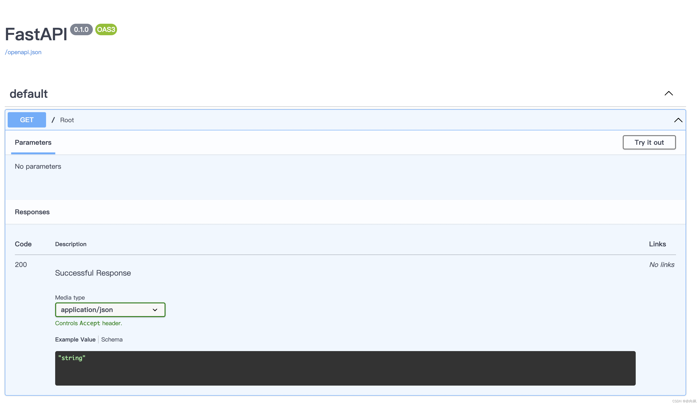
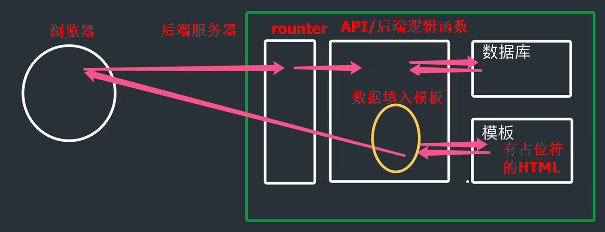
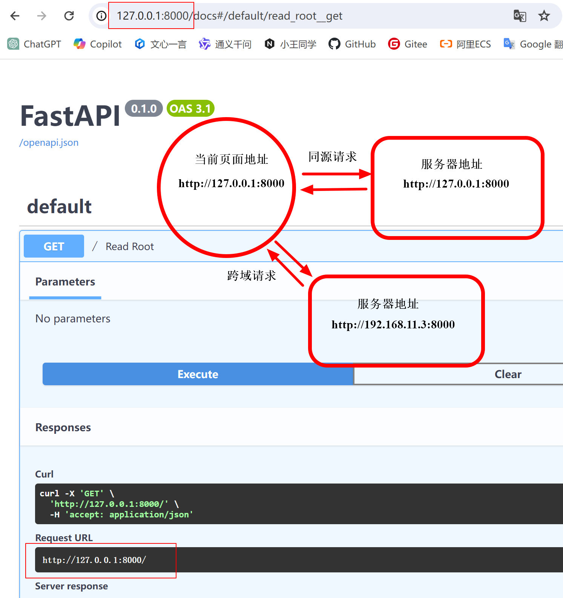

https://blog.csdn.net/weixin_53909748/article/details/131747197

https://www.bilibili.com/video/BV1Ya4y1D7et/

# FastAPI 框架

1. fastapi，一个用于构建 API 的现代、快速（高性能）的web框架。 

2. fastapi是建立在`Starlette`和`Pydantic`基础上的，

   - Starlette，负责 web 部分(Asyncio)，是一种轻量级的ASGI框架/工具包，是构建高性能Asyncio服务的理性选择。

   - Pydantic，负责数据部分(类型提示)，是一个基于Python类型提示来定义数据验证、序列化和文档的库。

3.  fastapi特点

   - 快速：可与 NodeJS 和 Go 比肩的极高性能（归功于 Starlette 和 Pydantic），是最快的 Python web 框架之一。
   - 高效编码：提高功能开发速度约 200％ 至 300％。
   - 更少bug：减少约 40％ 的人为（开发者）导致错误。
   - 智能：极佳的编辑器支持。处处皆可自动补全，减少调试时间。
   - 简单：设计的易于使用和学习，阅读文档的时间更短。
   - 简短：使代码重复最小化。通过不同的参数声明实现丰富功能。
   - 健壮：生产可用级别的代码。还有自动生成的交互式文档。 

4. 依赖：Python 3.6 及更高版本，FastAPI 站在以下巨人的肩膀之上


# 1. 预备知识点 
## 1.1 http协议 

1. 什么是请求头请求体，响应头响应体
2. URL地址包括什么
3. get请求和post请求到底是什么
4. Content-Type是什么


### 1.1.1 http简介 
HTTP协议是Hyper Text Transfer Protocol（超文本传输协议）的缩写,是用于万维网（WWW:World Wide Web ）服务器与本地浏览器之间传输超文本的传送协议。HTTP是一个属于应用层的面向对象的协议，由于其简捷、快速的方式，适用于分布式超媒体信息系统。它于1990年提出，经过几年的使用与发展，得到不断地完善和扩展。HTTP协议工作于客户端-服务端架构为上。浏览器作为HTTP客户端通过URL向HTTP服务端即WEB服务器发送所有请求。Web服务器根据接收到的请求后，向客户端发送响应信息。 


### 1.1.2 http协议特性 
- 基于TCP/IP协议

  HTTP协议是基于TCP/IP协议之上的应用层协议。

  

- 基于请求－响应模式

  1. HTTP协议规定,请求从客户端发出,最后服务器端响应该请求并返回。

  2. 换句话说，肯定是先从客户端开始建立通信的，服务器端在没有接收到请求之前不会发送响应

  

- 无状态保存

  1. HTTP是一种不保存状态,即无状态(stateless)协议。HTTP协议 自身不对请求和响应之间的通信状态进行保存。也就是说在HTTP这个 级别,协议对于发送过的请求或响应都不做持久化处理。

  2. 使用HTTP协议,每当有新的请求发送时,就会有对应的新响应产 生。协议本身并不保留之前一切的请求或响应报文的信息。这是为了更快地处理大量事务,确保协议的可伸缩性,而特意把HTTP协议设计成 如此简单的。

     

- 短连接

  1. HTTP1.0默认使用的是短连接。浏览器和服务器每进行一次HTTP操作，就建立一次连接，任务结束就中断连接。
   - 频繁的连接创建和释放，实际上是资源的浪费
  2. HTTP/1.1起，默认使用长连接。要使用长连接，客户端和服务器的HTTP首部的Connection都要设置为keep-alive，才能支持长连接。
3. HTTP长连接，指的是复用TCP连接。多个HTTP请求可以复用同一个TCP连接，这就节省了TCP连接建立和断开的消耗。


### 1.1.3 http请求协议与响应协议


1. socket属于代码层面的抽象层，封装了传输层和网络层的功能

   

2. http协议包含

   - 由浏览器发送数据到服务器的协议

   - 服务器发送数据到浏览器的协议

     

   用于HTTP协议交互的信被为HTTP报文。

   - 请求端(客户端)的HTTP报文做请求报文
   - 响应端(服务器端)的 做响应报文
   - HTTP报文本身是由多行数据构成的字文本

   

   

3. 一个完整的`URL`（例如https://www.baidu.com/s?wd=yuan）包括：
   
   - 协议：https
   - ip：www.baidu.com
   - 端口：（默认80）
   - 路径参数：/s
   - 请求参数 ：wd=yuan 


4. 请求方式：GET与POST请求 

   - `GET`提交的**数据会放在`URL`之后**，

     - 以`?`分割`URL`和传输数据，
     - 参数之间以`&`相连，

     如`EditBook?name=test1&id=123456. `

   - `POST`方法是把提交的**数据放在HTTP包的请求体中**

   GET提交的数据大小有限制（因为浏览器对URL的长度有限制），

   而POST方法提交的数据没有限制 

   

5.  响应状态码：

   - 状态码是当客户端向服务器端发送请求时，返回的请求结果。

   - 借助状态码，用户可以知道服务器端是正常出理了请求,还是错误出现了。

   - 状态·码如200 OK，以3位数字和原因组成。


6. 常见的`Content-Type: `

   - `application/x-www-form-urlencoded`：传输数据为`key=value`

   - `application/json`：json格式

   - `text/html`：传输的是html代码，接受后渲染成html

   - `text/plain`：传输的是纯文本

     

### 1.1.4 http的多种请求方式

（内容均由ChatGPT生成）

1. HTTP（Hypertext Transfer Protocol）是一种用于在网络上传输数据的协议。在HTTP中，有不同类型的请求方法（也称为“HTTP方法”或“HTTP动词”），每种方法都对服务器执行不同的操作。以下是一些常见的HTTP请求方法及其区别：
   1. **GET**：用于请求访问已被URI（统一资源标识符）识别的资源。GET方法的请求参数附在URL中，以查询字符串的形式发送给服务器。GET请求通常用于从服务器获取数据，而不会对服务器端资源产生任何影响。
   2. **POST**：用于向服务器提交数据，以便创建新的资源。POST方法的请求参数通常包含在请求的主体中，而不是URL中，因此可以用来传输较大量的数据。POST请求通常用于提交表单数据或上传文件等操作。
   3. **PUT**：用于向服务器发送数据，以更新或创建资源。PUT方法通常用于更新指定URI的资源，或在指定URI下创建一个新的资源。与POST方法不同，PUT方法是幂等的，即对同一资源的多次调用不会产生不同的结果。
   4. **DELETE**：用于请求服务器删除指定URI的资源。DELETE方法通常用于删除指定资源，使其不再可用。
   5. **PATCH**：用于对资源进行局部修改。PATCH方法允许客户端发送更新资源的部分内容，而不是整个资源。这对于对资源进行部分更新而不影响其余部分很有用。
   6. **HEAD**：类似于GET方法，但服务器不返回请求的实体主体，只返回响应头信息。HEAD方法通常用于检查资源的元数据，如检查资源的存在性或最后修改时间等。
   7. **OPTIONS**：用于请求服务器告知支持的HTTP方法和其他可用选项。OPTIONS方法通常用于跨域资源共享（CORS）预检请求，以确定是否允许特定HTTP方法或请求头进行跨域访问。
2. 每种HTTP请求方法对请求头（header）和请求主体（body）的要求
   1. **GET**：
      - 请求头：通常包含一些元数据，如用户代理信息、可接受的响应内容类型等。
      - 请求主体：GET请求**通常不包含请求主体**，因为它们用于从服务器获取数据。
   2. **POST**：
      - 请求头：通常包含一些元数据，如用户代理信息、内容类型（Content-Type）等。Content-Type头字段指定了请求主体的媒体类型。
      - 请求主体：POST请求的主体通常包含要发送给服务器的数据，比如表单字段、JSON数据或文件等。
   3. **PUT**：
      - 请求头：与POST请求类似，通常包含元数据和Content-Type头字段。
      - 请求主体：PUT请求的主体包含要更新或创建的资源的完整内容。
   4. **DELETE**：
      - 请求头：通常包含元数据，但**不一定需要包含请求主体**的信息。
      - 请求主体：DELETE请求通常不包含主体，因为它们用于请求删除指定的资源。
   5. **PATCH**：
      - 请求头：与PUT和POST请求类似，通常包含元数据和Content-Type头字段。
      - 请求主体：PATCH请求的主体包含对资源进行局部更新的数据。
   6. **HEAD**：
      - 请求头：通常包含一些元数据，但与GET请求相比，不需要返回请求实体主体的信息。
      - 请求主体：HEAD请求**通常不包含请求主体**，因为它们仅用于获取响应头信息。
   7. **OPTIONS**：
      - 请求头：通常包含一些元数据。
      - 请求主体：OPTIONS请求**通常不包含请求主体**，因为它们用于请求服务器告知支持的HTTP方法和其他可用选项。


### 1.1.5 手写http请求和响应

1. 服务端

   ```python
   import socket
   import os
   
   print("当前进程：", os.getpid())
   
   # 创建socket对象
   sock = socket.socket()
   
   # 绑定到127.0.0.1:8000
   # 注意传入的是元组
   sock.bind( ("127.0.0.1", 8080) ) 
   
   # 开始监听，最大排队数为5
   # 如果连接数量超过5，超出部分的连接，直接拒绝
   # 队列中的请求，依次处理
   sock.listen(5) 
   
   
   # sock.accept阻塞等待
   # conn 是一个新的socket对象，对象与客户端之间的连接是独立的
   # addr 是一个包含客户端IP地址和端口号的元组
   conn, addr = sock.accept() 
   
   # 按http的headers中的格式进行解析
   data = conn.recv(1024)
   print(f"client send data: \n {data.decode('utf-8')}")
   
   # conn.send(b"hello world")
   # 注意：
   # - http中是\r\n
   # - 发送的是bytes类型
   bstr=b"HTTP/1.1 200 OK\r\nsever:8080\r\n\r\nhello world"
   conn.send(bstr)
   
   conn.close()
   
   ```

2. 客户端（requests模拟）

   ```python
   import requests
   
   url = "http://127.0.0.1:8080"
   
   response = requests.get(url=url, data={"data":1})
   
   print(response.text)
   ```


### 1.1.6 POSTMAN

网络请求测试工具

1. https://www.postman.com/downloads/

2. GET请求

   


3. POST请求

   - Content-Type: application/x-www-form-urlencoded

     

   - Content-Type: application/json

     


## 1.3 API接口

### 1.3.1 开发模式

在开发Web应用中，有两种应用模式： 

1. 前后端不分离

   - 客户端看到的内容和所有界面效果都是由服务端提供出来的。

   

2. 前后端分离

   - 把前端的界面效果html，css，js分离到另一个服务端，

   - python服务端只需要返回数据即可

   

前端形成一个独立的网站，服务端构成一个独立的网站 


### 1.3.2 接口规范

1. 应用程序编程接口：Application Programming Interface，API接口

   - 应用程序对外提供了一个操作数据的入口，这个入口可以是
     - 一个函数或类方法，
     - 一个url地址或者一个网络地址。

   当客户端调用这个入口，应用程序则会执行对应代码操作，给客户端完成相对应的功能。

2. 为了在团队内部形成共识、防止个人习惯差异引起的混乱，我们都需要找到一种大家都觉得很好的**接口实现规范**，而且这种规范能够让后端写的接口，用途一目了然，减少客户端和服务端双方之间的合作成本。

   目前市面上大部分公司开发人员使用的接口实现规范主要有：

   - RESTful
   - RPC

### 1.3.3 RESTful

1. RESTful是一种专门为Web 开发而定义API接口的设计风格，尤其适用于前后端分离的应用模式中。

   
   
   REST全称是Representational State Transfer，中文意思是表征性状态转移。它首次出现在2000年Roy Fielding的博士论文中。 
   
   


2. 面向资源开发

   这种风格的理念认为**后端开发任务就是提供数据的**，

   提供的是数据资源的访问接口，

   所以在定义接口时，客户端访问的URL路径就表示这种要操作的数据资源。
   
   


3.  例如对于学生数据，我们可能存在查找，添加，等操作

    普通的接口设计

    - api `/student/add`  --> 后端 add 函数
    - api `/student/select` --> 后端 select 函数

    Restful接口设计

    - 对于数据资源分别使用`POST`、`DELETE`、`GET`、`UPDATE`等请求动作来表达对数据的增删查改。

      | 请求方法 | 请求地址   | 后端操作        |
      | -------- | ---------- | --------------- |
      | POST     | /student/  | 增加学生        |
      | GET      | /student/  | 获取所有学生    |
      | GET      | /student/1 | 获取id为1的学生 |
      | PUT      | /student/1 | 修改id为1的学生 |
      | DELETE   | /student/1 | 删除id为1的学生 |
      
      GET一般用于查看
      
      

 

# 2. 快速开始

1. 安装

   ```
   pip install fastapi
   ```

   你还会需要一个 ASGI 服务器（web服务器），生产环境可以使用 [Uvicorn](https://www.uvicorn.org/)

   ```
   pip install uvicorn
   ```

2. `uvicorn`的作用

   
   
   
   
2. 代码与运行

   ```python
   from fastapi import FastAPI  # FastAPI 是一个为你的 API 提供了所有功能的 Python 类。
   
   app = FastAPI()  # 这个实例将是创建你所有 API 的主要交互对象。这个 app 同样在如下命令中被 uvicorn 所引用
   
   @app.get("/")
   async def root():
       return {"message": "Hello yuan"}
   ```

   

   通过以下命令运行服务器：
   
   ```
   uvicorn main:app --reload
   ```

   得到
   
   ```
   INFO:     Uvicorn running on http://127.0.0.1:8000 (Press CTRL+C to quit)
   INFO:     Started reloader process [73408]
   INFO:     Started server process [73408]
   INFO:     Waiting for application startup
   INFO:     Application startup complete
   ```
   
   
   
   也可以直接运行：

   ```python
   if __name__ == '__main__':
       import uvicorn
   
       uvicorn.run("main:app", host="127.0.0.1", port=8080)


3. 交互

   跳转到`http://127.0.0.1:8080/docs`。你将会看到**自动生成**的交互式 API 文档。

   


# 3. 路径操作

## 3.1 路径操作装饰器


1. fastapi支持各种请求方式（装饰器）：

   ```python
   @app.get()		# 查看
   @app.post()		# 添加
   @app.put()		# 更新
   @app.patch()	# 更新
   @app.delete()	# 删除
   @app.options()
   @app.head()
   @app.trace()
   ```

   

2. 代码样例

   ```python
   from typing import Union
   
   from fastapi import FastAPI
   
   app = FastAPI()
   
   
   @app.get("/get")
   def get_test():
       return {"method": "get方法"}
   
   
   @app.post("/post")
   def post_test():
       return {"method": "post方法"}
   
   
   @app.put("/put")
   def put_test():
       return {"method": "put方法"}
   
   
   @app.delete("/delete")
   def delete_test():
       return {"method": "delete方法"}
   
   ```


3. 装饰器参数（注释部分）

   ```python
   @app.post(
       "/root",
       response_model=Item,
       status_code=status.HTTP_200_OK,
       tags=["root"],
       summary="概述：Create a new user",
       description="详情：创建一个新用户",
       response_description="返回：一个新用户的信息",
       deprecated=False,
   )
   ```

   访问`http://127.0.0.1:8080/docs`可以看到对应的修改
   
   

## 3.2 include_router

1. 目录

   ```
   3.2
   |-- apps
   |   |-- __init__.py
   |   |-- app01
   |   |   |-- __init__.py
   |   |   `-- app01.py
   |   `-- app02
   |       |-- __init__.py
   |       `-- app02.py
   `-- main.py
   ```

2. 代码

   ```python
   # main.py
   
   from fastapi import FastAPI
   import uvicorn
   
   from apps import shop, user
   
   app = FastAPI()
   
   app.include_router(shop, prefix="/shop", tags=["第一章节：商城接口", ])
   app.include_router(user, prefix="/user", tags=["第二章节：用户中心接口", ])
   
   if __name__ == '__main__':
       uvicorn.run("main:app", host="127.0.0.1", port=8080)
   ```
   
   
   
   ```python
   # app01.py
   
   from fastapi import APIRouter
   
   shop = APIRouter()
   
   @shop.get("/food")
   def shop_food():
       return {"shop": "food"}
   
   
   @shop.get("/bed")
   def shop_food():
       return {"shop": "bed"}
   ```
   
   ```python
   # __init__.py
   from .app01 import shop
   from .app02 import user
   
   # apps/__init__.py
   from .app01 import shop
   from .app02 import user
   
   # apps/app01/__init__.py
   from .app01 import shop
   ```
   
   

3. 效果

   


# 4. 请求与响应

## 4.1 路径参数

1. 基本用法：使用与 Python 格式化字符串相同的语法来声明路径"参数"或"变量"

   ```python
   @app.get("/user/{user_id}")
   def get_user(user_id):
       print(user_id, type(user_id))
       return {"user_id": user_id}
   ```

   路径参数 `user_id` 的值将作为参数 `user_id` 传递给你的函数。

   

2. 有类型的路径参数：使用标准的 Python 类型标注为函数中的路径参数声明类型

   ```python
   @app.get("/user/{user_id}")
   def get_user(user_id: int):
       print(user_id, type(user_id))
       return {"user_id": user_id}
   ```

   在这个例子中，`user_id` 被声明为 `int` 类型。

   > 这将为你的函数提供编辑器支持，包括错误检查、代码补全等等。

   

3. 次序：路径操作是按顺序依次运行的

   比如

   - 路径` /users/me`，用来获取关于当前用户的数据.

   - 路径 `/user/{username} `，来通过用户名获取关于特定用户的数据

   由于路径操作是按顺序依次运行的，你需要确保路径 `/user/me `声明在路径 `/user/{username}`之前：

   ```python
   @app.get("/user/me")
   async def read_user_me():
       return {"username": "the current user"}
   
   @app.get("/user/{username}")
   async def read_user(username: str):
       return {"username": username}
   ```

   否则，`/user/{username}` 的路径还将与 `/user/me` 相匹配，认为自己正在接收一个值为 `"me"` 的 `username` 参数。

   

## 4.2 请求参数

1. 请求参数：http的路径中声明不属于路径参数的其他参数
   - url中路径参数和请求参数使用`?`分割

   例如

   ```python
   @app02.get("/jobs/{category}")
   async def get_jobs(category: str, city: str, ages: int):
   
       # 数据库查询
       pass
   
       return {
           "category": category,
           "city": city
           }
   ```

   - 路径参数为category，请求参数为city

   - url为：http://127.0.0.1:8000/app02/jobs/1?city=2&ages=3

   - 路径参数和请求参数使用`?`分割
     请求参数之间使用`&`分割

   

2. 例如

   ```python
   @app.get("/jobs/{kd}")
   async def search_jobs(kd: str, city: Union[str, None] = None, xl: Union[str, None] = None):  # 有默认值即可选，否则必选
       if city or xl:
           return {"kd": kd, "city": city, "xl": xl}
       return {"kd": kd}
   ```

   

   在这个例子中，函数参数 city和xl 是可选的，并且默认值为 None。


### 4.2.1 Type Hints

1. python3.5开始，PEP484引入

   - 类型检查，防止运行时出现参数、返回值类型不符。
   - 作为开发文档附加说明，方便使用者调用时传入和返回参数类型。
   - 模块加入不会影响程序的运行不会报正式的错误，pycharm支持typing检查错误时会出现黄色警告。


2. 常用的

   - `Union` 是当有多种可能的数据类型时使用，比如函数有可能根据不同情况有时返回str或返回list，那么就可以写成`Union[list, str]`
   - `Optional` 是`Union`的一个简化， 当 数据类型中有可能是None时，比如有可能是str也有可能是None，
     - `Optional[str]`相当于`Union[str, None]`


## 4.3 请求体数据

1. 请求体：客户端发送给 API 的数据

   响应体：API 发送给客户端的数据

2. FastAPI 基于 Pydantic 

   - Pydantic 主要用来做类型强制检查（校验数据）。不符合类型要求就会抛出异常。
   - 对于 API 服务，支持类型检查非常有用，会让服务更加健壮，也会加快开发速度，因为开发者再也不用自己写一行一行的做类型检查。

### 4.3.1 Pydantic

1. pydantic安装

   ```
   pip install pydantic
   ```
   
2. 基础使用
   ```python
   from pydantic import BaseModel
   from datetime import date
   from typing import List
   
   
   class User(BaseModel):
       name: str
       age: int
       birth: date
       friends: List[int]
   
   # 以key-value形式传递参数
   user = User(name="小明", age=18, birth="2002-02-02", friends=[1, 2, 3])
   
   # 以json字符串形式传递参数
   user2 = User.parse_raw(user.json())
   
   # 自动转化不符合类型的参数（如果该类型提供了转化函数，未提供则报错）
   user3 = User(name="小明", age=18, birth="2002-02-02", friends=[1, '2', 3])
   
   # 打印对象
   print(user)
   
   # 访问其中元素
   print(user.name)
   
   # 将对象转换成字典
   user_dict = user.dict()
   
   # 将字典转换成json字符串
   user_json = user.json()
   
   
   # 无法转化的参数会报错
   # user4 = User(name="小明", age=18, birth="2002-02-02", friends=[1, '2', 's'])
   ```

   
   
   对于无法转化的参数，报错信息
   
   ```bash
   Traceback (most recent call last):
     File "/mnt/lr_fastapi/4_请求与相应/test.py", line 19, in <module>
       user3 = User(name="小明", age=18, birth="2002-02-02", friends=[1, '2', 's'])
               ^^^^^^^^^^^^^^^^^^^^^^^^^^^^^^^^^^^^^^^^^^^^^^^^^^^^^^^^^^^^^^^^^^
     File "/root/miniconda3/lib/python3.11/site-packages/pydantic/main.py", line 171, in __init__
       self.__pydantic_validator__.validate_python(data, self_instance=self)
   pydantic_core._pydantic_core.ValidationError: 1 validation error for User
   friends.2
     Input should be a valid integer, unable to parse string as an integer [type=int_parsing, input_value='s', input_type=str]
       For further information visit https://errors.pydantic.dev/2.6/v/int_parsing
   ```
   
   即，`User`的`friends`元素的第`2`个元素，Input should be a valid integer, unable to parse string as an integer

### 4.3.2 Pydantic进阶与FastAPI

1. Pydantic进阶用法

   ```python
   from pydantic import BaseModel, Field, validator
   from datetime import date
   from typing import List, Optional, Union
   
   class Addr(BaseModel):
       province: str
       city: str
   
   
   class User(BaseModel):
   
       name: str
   
       # 通过python的正则表示式限制name的值必须以a开头
       actor: str = Field(default="admin", pattern="^a") 
   
       # age 的默认值为 0，且必须大于 0小于100，描述为"年龄"
       age: int = Field(default=0, lt=100, gt=0, description="年龄")
   
       # birth 的默认值为 None，可选类型为 date 或 None
       # Optional[date] = None 相当于 Union[date, None] = None
       birth: Optional[date] = None
   
       friends: List[int] = []
   
       description: Union[str, None] = None
   
       # 类型嵌套
       addr: Union[Addr, None] = None  
   
   
       # 通过validator自定义校验规则
       @validator("actor")
       def actor_must_start_with_a(cls, v):
           if v[0] != "a":
               raise ValueError("name must start with a")
           return v
   
   class Data(BaseModel):  # 类型嵌套
       users: List[User]
   ```

   

2. 与FastAPI结合

   ```python
   from fastapi import APIRouter
   
   app03 = APIRouter()
   
   @app03.post("/data/")
   async def create_data(data: Data):
       # 添加数据库
       return data
       
       # FASTAPI 会自动将 User 类型对象转换成json字符串
       # 而不必 return data[0].json()
       # return data[0]
   ```
   
   测试数据
   
   ```json
   {
     "users": [
       {
         "name": "string",
         "actor": "admin",
         "age": 0,
         "birth": "2024-03-21",
         "friends": [],
         "description": "string",
         "addr": {
           "province": "string",
           "city": "string"
         }
       }
     ]
   }
   ```


3. FastAPI 会自动将定义的模型类转化为`JSON Schema`，Schema 成为 OpenAPI 生成模式的一部分，并显示在 API 交互文档中，查看 API 交互文档如下，该接口将接收`application/json`类型的参数。

   

4. FastAPI 支持同时定义路径参数、请求参数和请求体参数，FastAPI 将会正确识别并获取数据。

   - 路径参数：参数在 url 中声明
   - 请求参数：（url或body中）参数是单一类型（例如int、float、str、bool等）
   - 请求体参数：body中参数类型为继承 Pydantic 模块的`BaseModel`类的数据模型类


## 4.4 form表单数据

1. 在 OAuth2 规范的一种使用方式（密码流）中，需要将用户名、密码作为表单字段发送，而不是 JSON。

2. FastAPI 可以使用**Form**组件来接收表单数据

   ```
   pip install python-multipart
   ```

   ```python
   from fastapi import APIRouter
   from fastapi import Form
   
   app04 = APIRouter()
   
   """
    url:  'http://127.0.0.1:8000/app04/login/' 
    header: 'Content-Type: application/x-www-form-urlencoded' \
    body: 'username=h&password=w'
   """
   
   @app04.post("/login/")
   async def login(username: str = Form(), 
                   password: str = Form()):
       print(username, password)
       return {"username": username}
   
   ```
   
   


## 4.5 文件上传和下载

### 4.5.1 文件上传

```python
from fastapi import FastAPI, File, UploadFile
from typing import List

app = FastAPI()

# file: bytes = File()：适合小文件上传
@app.post("/files/")
async def create_file(file: bytes = File()):
    print("file:", file)
    return {"file_size": len(file)}


@app.post("/multiFiles/")
async def create_files(files: List[bytes] = File()):
    return {"file_sizes": [len(file) for file in files]}


# file: UploadFile：适合大文件上传

@app.post("/uploadFile/")
async def create_upload_file(file: UploadFile):
    with open(f"{file.filename}", 'wb') as f:
        for chunk in iter(lambda: file.file.read(1024), b''):
            f.write(chunk)

    return {"filename": file.filename}


@app.post("/multiUploadFiles/")
async def create_upload_files(files: List[UploadFile]):
    return {"filenames": [file.filename for file in files]}


```


### 4.5.2 文件下载

```python
from fastapi.responses import FileResponse

@app05.get("/download")
async def download():

    print( "download" )

    return FileResponse("files/random_image.jpg", filename="1.jpg")
```

https://fastapi.tiangolo.com/zh/advanced/custom-response/?h=filer#fileresponse


## 4.6 Request对象

有些情况下我们希望能直接访问Request对象。例如我们在路径操作函数中想获取客户端的IP地址，需要在函数中声明Request类型的参数，FastAPI 就会自动传递 Request 对象给这个参数，我们就可以获取到 Request 对象及其属性信息，例如 header、url、cookie、session 等。

```python
from fastapi import Request

@app.get("/items")
async def items(request: Request):
    return {
        "请求URL：": request.url,
        "请求ip：": request.client.host,
        "请求宿主：": request.headers.get("user-agent"),
        "cookies": request.cookies,
    }
```


## 4.7 请求静态文件

在 Web 开发中，需要请求很多静态资源文件（即，不是由服务器生成的文件），如 css/js 和图片文件等。

假设`statics`文件夹下有`common.css`文件

```python
from fastapi.staticfiles import StaticFiles

app = FastAPI()
app.mount("/static",StaticFiles(directory="statics"))
```

访问`http://127.0.0.1:8000/static/common.css`，即可获取`statics/common.css`


## 4.8 响应模型相关参数

### 4.8.1 response_model

1. 前面写的这么多路径函数最终 return 的都是自定义结构的字典，FastAPI 提供了 response_model 参数，声明 return 响应体的模型
   
    ```python
    # 路径操作
    @app.post("/items/", response_model=Item)
    # 路径函数
    async def create_item(item: Item):
        ...
    ```

   注意：response_model 是路径操作的参数，并不是路径函数的参数
   
   

2. FastAPI将使用response_model进行以下操作：

   - 将输出数据转换为response_model中声明的数据类型
   - 验证数据结构和类型
   - 将输出数据限制为该model定义的
   - 添加到OpenAPI中
   - 在自动文档系统中使用

   你可以在任意的路径操作中使用 response_model 参数来声明用于响应的模型


3. 案例

   - 注册功能
   - 输入账号、密码、昵称、邮箱，注册成功后返回个人信息

   ```python
   from typing import Union
   
   from fastapi import FastAPI
   from pydantic import BaseModel, EmailStr
   
   app = FastAPI()
   
   
   class UserIn(BaseModel):
       username: str
       password: str
       email: EmailStr
       full_name: Union[str, None] = None
   
   
   class UserOut(BaseModel):
       username: str
       email: EmailStr
       full_name: Union[str, None] = None
   
   
   @app.post("/user/", response_model=UserOut)
   async def create_user(user: UserIn):
       return user
   ```

   


### 4.8.2 response_model_exclude_unset

通过上面的例子，我们学到了如何用response_model控制响应体结构，但是如果它们实际上没有存储，则可能要从结果中忽略它们。例如，如果model在NoSQL数据库中具有很多可选属性，但是不想发送很长的JSON响应，其中包含默认值。


**案例**：

```python
from typing import List, Union

from fastapi import FastAPI
from pydantic import BaseModel

app = FastAPI()


class Item(BaseModel):
    name: str
    description: Union[str, None] = None
    price: float
    tax: float = 10.5
    tags: List[str] = []


items = {
    "foo": {"name": "Foo", "price": 50.2},
    "bar": {"name": "Bar", "description": "The bartenders", "price": 62, "tax": 20.2},
    "baz": {"name": "Baz", "description": None, "price": 50.2, "tax": 10.5, "tags": []},
}


@app.get("/items/{item_id}", response_model=Item, response_model_exclude_unset=True)
async def read_item(item_id: str):
    return items[item_id]

```

请求：http://127.0.0.1:8080/items/foo

不设置unset参数：

```json
{
  "name": "Foo",
  "description": null,
  "price": 50.2,
  "tax": 10.5,
  "tags": []
}
```

设置unset参数：

```
{
  "name": "Foo",
  "price": 50.2
}
```

使用路径操作装饰器的 `response_model` 参数来定义响应模型，特别是确保私有数据被过滤掉。使用 `response_model_exclude_unset` 来仅返回显式设定的值。

除了response_model_exclude_unset以外，还有

- response_model_exclude_defaults 不返回是默认值的字段
- response_model_exclude_none 不返回是None的字段
  


### 4.8.3 INCLUDE和EXCLUDE

```python
# response_model_exclude
@app.get("/items/{item_id}", response_model=Item, response_model_exclude={"description"}, )
async def read_item(item_id: str):
    return items[item_id]

# response_model_include  
@app.get("/items/{item_id}", response_model=Item, response_model_include={"name", "price"}, )
async def read_item(item_id: str):
    return items[item_id]

```


# 5. jinja2模板

1. 模板在Python的web开发中广泛使用，它能够有效的将业务逻辑和页⾯逻辑分开，使代码可读性增强、并且更加容易理解和维护。

2. 模板简单来说就是⼀个其中包含占位变量表示动态的部分的文件，模板文件在经过动态赋值后，返回给用户。

3. jinja2是Flask作者开发的⼀个模板系统，起初是仿django模板的⼀个模板引擎，为Flask提供模板支持，由于其灵活，快速和安全等优点被广泛使用。

4. 前后端不分离的开发
    


## 5.1 jinja2 的变量

1. 代码

   ```python
   # Main.py
   from fastapi import FastAPI, Request
   from fastapi.templating import Jinja2Templates
   import uvicorn
   
   app = FastAPI()  # 实例化 FastAPI对象
   templates = Jinja2Templates(directory="templates")  # 实例化Jinja2对象，并将文件夹路径设置为以templates命令的文件夹
   
   
   @app.get('/')
   def hello(request: Request):
       return templates.TemplateResponse(
           'index.html',
           {
               'request': request,  # 注意，返回模板响应时，必须有request键值对，且值为Request请求对象
               'user': 'yuan',
               "books": ["金瓶梅", "聊斋", "剪灯新话", "国色天香"],
               "booksDict": {
                   "金瓶梅": {"price": 100, "publish": "苹果出版社"},
                   "聊斋": {"price": 200, "publish": "橘子出版社"},
               }
           }
       )
   if __name__ == '__main__':
       uvicorn.run("main:app", port=8080, debug=True, reload=True)
   
   
   ```

2. HTML

   对于 list / dict 等类型，访问其内部元素使用`.`
   
   - `book.0`
   - `dictory.name`
   
   ```html
   <!DOCTYPE html>
   <html lang="en">
   <head>
       <meta charset="UTF-8">
       <title>Title</title>
   </head>
   <body>
   
   
   <h1>{{ user}}</h1>
   
   <p>{{ books.0 }}</p>
   <p>{{ books.1 }}</p>
   <p>{{ books.2 }}</p>
   <p>{{ books.3 }}</p>
   
   <p>{{ booksDict.金瓶梅.price }}</p>
   
   
   </body>
   </html>
   
   ```
   
   

## 5.2 jinja2 的过滤器

1. 变量可以通过“过滤器”修改，过滤器可以理解为是jinja2里面的内置函数和字符串处理函数。

2. 常用的过滤器有：

   | 过滤器名称  |                     说明                     |
   | :---------: | :------------------------------------------: |
   | capitialize |  把值的首字母转换成大写，其他字母转换为小写  |
   |    lower    |              把值转换成小写形式              |
   |    title    |      把值中每个单词的首字母都转换成大写      |
   |    trim     |              把值的首尾空格去掉              |
   |  striptags  |      渲染之前把值中所有的HTML标签都删掉      |
   |    join     |              拼接多个值为字符串              |
   |    round    | 默认对数字进行四舍五入，也可以用参数进行控制 |
   |    safe     |                渲染时值不转义                |

3. 使用方法

   - 用管道`|`分割
   - 多个过滤器可以链式调用，前⼀个过滤器的输出会作为后⼀个过滤

   ```
   {{ 'abc'| captialize  }}  # Abc
   
   {{ 'abc'| upper  }} # ABC
   
   {{ 'hello world'| title  }} # Hello World
   
   {{ "hello world"| replace('world','yuan') | upper }} # HELLO YUAN
   
   {{ 18.18 | round | int }} # 18
   ```

   

## 5.3 jinja2 的控制结构

### 5.3.1 分支控制

1. 样例

   ```
   
   
       <p>成年区</p>
   
   
       
       <p>未成年区</p>
   
   
   ```

   

### 5.3.2 循环控制

1. jinja2中的for循环用于迭代Python的数据类型，包括列表，元组和字典。

   - jinja2中不存在while循环

2. 样例

   ```
   
       <p>{{ book }}</p>
   
   ```

   

# 6. ORM操作

## 6.1 基础介绍

1. ORM：Object Relational Mapper 对象关系映射器
   - 教程以SQLite为例

2. FastAPI官方使用SQLAlchemy

   https://fastapi.tiangolo.com/zh/tutorial/sql-databases/

   


# 7. 中间件与CORS

## 7.1 中间件

1. 中间件：是一个函数,它在每个**请求**被特定的路径操作处理之前,以及在每个**响应**之后工作

   

   - 如果你使用了 `yield` 关键字依赖, 依赖中的退出代码将在执行中间件*后*执行
   - 如果有任何后台任务(稍后记录), 它们将在执行中间件*后*运行

2. 创建中间件

   使用装饰器`@app.middleware("http")`

3. 可接受的参数

   - `request`
   - 一个函数`call_next`，它将接收request，作为参数
     - 这个函数将 `request` 传递给相应的 *路径操作*
     - 然后它将返回由相应的*路径操作*生成的 `response`
   - 然后你可以在返回 `response` 前进一步修改它

4. 中间件的异步和同步

   ```python
   @app.middleware("http")
   async def m2(request: Request, call_next):
       print("m2")
       response = await call_next(request)
       print("m2")
       return response
   
   @app.middleware("http")
   def m1(request: Request, call_next):
       print("m1")
       response = call_next(request)
       print("m1")
       return response
   ```

   

   

5. ==中间件的路径判断==

   如果客户端发送的url为`http://127.0.0.1:8000/docs`，

   通过`request.url.path`可以获取`/docs`

   以此可以用来对某些api进行特殊处理

   ```python
   if request.url.path in ["/docs", "/users"]:
       pass
   ```

   

7. 使用

   注意：中间件类似于装饰器，声明越晚，越先执行，此处先执行`m1`后执行`m2`
   
   ```python
   import uvicorn
   from fastapi import FastAPI
   
   from fastapi import Request
   from fastapi.responses import Response
   import time
   
   app = FastAPI()
   
   
   @app.middleware("http")
   async def m2(request: Request, call_next):
       # 请求代码块
       print("m2 request")
       response = await call_next(request)
       # 响应代码块
       response.headers["author"] = "yuan"
       print("m2 response")
       return response
   
   
   @app.middleware("http")
   async def m1(request: Request, call_next):
       # 请求代码块
       print("m1 request")
       # if request.client.host in ["127.0.0.1", ]:  # 黑名单
       #     return Response(content="visit forbidden")
   
       # if request.url.path in ["/user"]:
       #     return Response(content="visit forbidden")
   
       start = time.time()
   
       response = await call_next(request)
       # 响应代码块
       print("m1 response")
       end = time.time()
       response.headers["ProcessTimer"] = str(end - start)
       return response
   
   
   @app.get("/user")
   def get_user():
       time.sleep(3)
       print("get_user函数执行")
       return {
           "user": "current user"
       }
   
   
   @app.get("/item/{item_id}")
   def get_item(item_id: int):
       time.sleep(2)
       print("get_item函数执行")
       return {
           "item_id": item_id
       }
   
   
   if __name__ == '__main__':
       uvicorn.run('main:app', host='127.0.0.1', port=8030, reload=True,
                   debug=True, workers=1)
   
   ```
   
   

## 7.2 CORS

### 7.2.1 跨域请求

（通常为前端进行处理的问题）

针对浏览器的区分（此为浏览器的防御机制造成的）：

   - 同源请求：在浏览器中，页面地址（http协议，ip，端口）和请求发送地址是相同的

   - 跨域请求：地址（http协议，ip，端口）只要有一项不一样

   


### 7.2.2 样例

1. 产生跨域请求的html样例

    ```html
    <!DOCTYPE html>
    <html lang="en">
    <head>
        <meta charset="UTF-8">
        <title>Title</title>
        <script src="https://cdn.bootcdn.net/ajax/libs/jquery/3.6.0/jquery.js"></script>
    </head>
    <body>

    <p>click</p>

    <script>

        $("p").click(function () {
            $.ajax({
                url: "http://127.0.0.1:8080/",
                success: function (res) {
                    $("p").html(res.message)
                },
            })
        })

    </script>
    </body>
    </html>

    ```

2. 后端代码

    ```python
    from fastapi import FastAPI
    from fastapi.middleware.cors import CORSMiddleware
    import uvicorn
    
    app = FastAPI()
    origins = [
        "http://localhost:63342"
    ]
    
    # allow_origins="*"相当于对响应的headers进行添加键值对
    # response.headers["Access-Control-Allow-Origin"] = "*"
    app.add_middleware(
        CORSMiddleware,
        allow_origins=origins,  # *：代表所有客户端
        allow_credentials=True,  # 是否需要认证，默认为True即可
        allow_methods=["GET"],   # 允许哪些方法
        allow_headers=["*"],    # 允许所有的
    )
    
    @app.get("/")
    def main():
        return {"message": "Hello World"}
    
    if __name__ == '__main__':
        uvicorn.run("main:app", host="127.0.0.1", port=8080)


