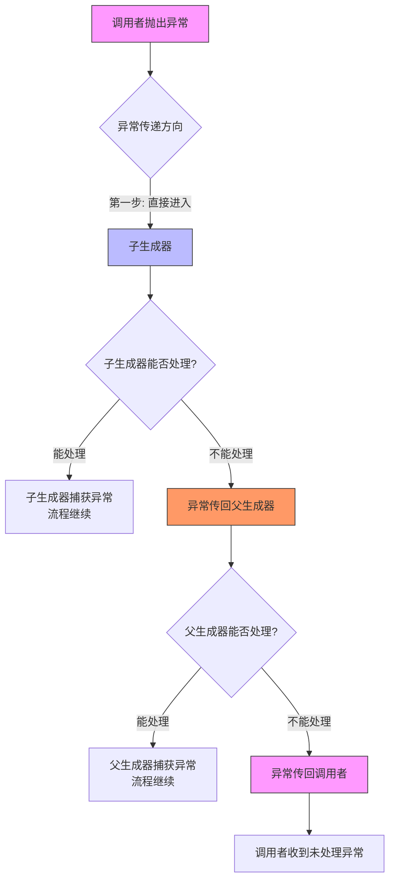
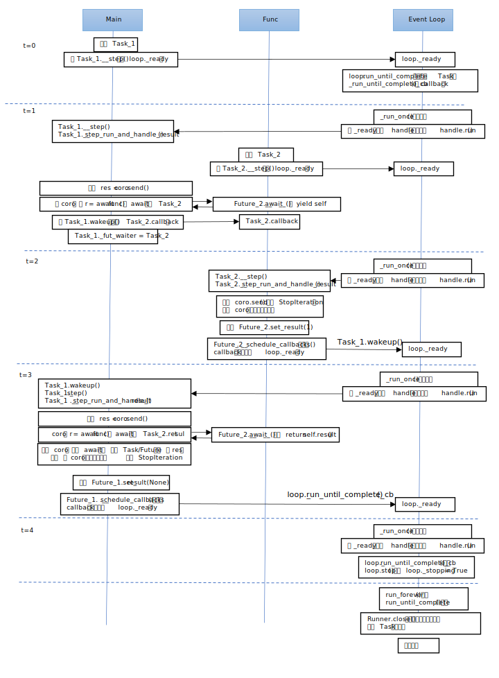

# 0. 前言

1. 目标：了解Python的async运行机制的核心逻辑

   - 并非介绍asyncio为用户提供的接口的具体使用方式

   因此，这是一个进阶版笔记，不适合async的初学者

2. 笔记大概分两部分

   - 基于小王利用DeepSeek探究若干专题的记录的整理和补充

   - 对Python async源码中关键函数以及核心运行流程的分析

   

3. Python 3.13.2

   - async部分的官方文档：https://docs.python.org/zh-cn/3.13/library/asyncio.html#module-asyncio


# 1. 概念引入

通过一个asyncio的使用例子，引入python的async机制的几个核心概念。

后续的大部分分析围绕这个例子进行

## 1.1 引例

```python
import asyncio

# 协程函数
async def func(num):
    print(num)
    await asyncio.sleep(num)
    return num
    
async def main():
    
    # 创建两个任务
    task_list = [
        asyncio.create_task(func(1), name="n1"),
        asyncio.create_task(func(2), name="n2")
    ]
    
    # 执行
    done, pending = await asyncio.wait(task_list)
    
    # 获取执行结果
    for task in done:
        print("[result]", task.result())
    
    
if __name__ == "__main__":
    asyncio.run(main())
```


执行结果

```
1
2
[result] 1
[result] 2
```


## 1.2 核心概念

### 1.2.1 异步与并发

1. 同步（Synchronous）：任务必须顺序执行，阻塞式

   ```python
   def func1():
   	time.sleep(6)
   
   def main():
       func1()
       print("image")
   ```

   调用者`main()`必须等待`func1()`执行完才能向下执行

   

2. 异步（Asynchronous）：单线程内通过调度（如事件循环）实现非阻塞并发，核心是I/O操作时的任务切换。

   - 通常利用回调函数实现

   **后续提到的异步是指单线内异步，即特指Python的async方式**

   >  引例中`task2` 并没有在`task1`结束后才开始执行，而是调度机制当看到`task1`需要`sleep(1)`时，立刻让`task2`开始执行。这样对于程序执行而言，没有阻塞，对于CPU而言，没有空闲。
   
   

3. 并行（Parallelism）和并发（Concurrency）

   - 并行：在多个处理器内核上，多个任务**同时执行**

   - 并发（Concurrency）：同时管理多个任务，使它们在一段时间内**交替执行**，看上去像是在同时进行（逻辑并行）

   从实际应用角度上考虑，

   - 并发考虑的是软件设计中任务调度的问题，如何让多个任务高效交替执行
   - 并行考虑的是硬件应用层面的问题，如何最大化发挥多核CPU、分布式的计算能力

   

4. 并发的实现

   - 单线程内实现并发：**异步是并发的一种实现方式**
   - 多线程并发：C++的多线程中使用一些线程同步机制（比如锁）

   

5. 多线程和并发：多线程既可以是并发（单核交替执行），也可以是并行（多核同时执行）

6. Python与C++的多线程

   - Python中的多线程实际上是并发，每个线程都运行在同一个CPU核上
     - （尽管python3.13开始尝试去掉全局解释器锁GIL，打破这个限制，但仍未推广）
   - C++的多线程是运行在多核上的，可以做到并行
     - 当然，通过使用线程同步机制，也可以做成并发

   

4. 两种场景：高IO和高计算

   - ==**Python的async是单线程内的并发，针对的是高IO的场景**==
   - C++的多线程，既可以处理高CPU（运行在多核上），又可以处理高IO的场景（新建线程）


### 1.2.2 Coroutine / Task / Future

1. async中的三个重要概念

   - 协程（Coroutine）：指具体执行的函数逻辑

     ```python
     async def func(num):
         print(num)
         await asyncio.sleep(num)
         return num
     
     coro = func(num)
     ```

     详细的说，

     - `func`是协程函数（coroutine function），`coro`是协程对象（coroutine object）

     - `coro = func(num)`，调用协程函数返回一个协程对象，而不是结果

     但研究执行机制的时候，通常不会区分，因为一般指代的都是coroutine object

   - 任务（Task）：事件循环的调度单位（具体的调度对象）
   - Future：用于管理回调函数和部分机制的底层对象

   

2. 三个概念的关系

   ```python
   class Task(Future):
       def __init__(self, coro):
           self._coro = coro
   ```

   

### 1.2.3 Event Loop

1. 事件循环（Event Loop）是async的调度机制，由它去决定现在运行哪个task

2. Event Loop的简化模型， 维持两个容器

   - 就绪队列（ready queue）：先进先出，在这里的task都可以立即执行
   - 等待队列：存放当前不能执行的任务
     - 这是一个为了方便理解，合并了代码中Schedule和selector的功能捏造出来的概念，实际代码中并不存在。

3. Event Loop简化的逻辑

   ```python
   while True:
       
       # step 1: 检查等待队列中的task是否可以执行
       waiting = event_loop.waiting_list
       for task in waiting:
           if is_ready(task):
               event_loop.ready_queue.push(task)
               event_loop.waiting_list.remove(task)
       
       # step 2: 执行全部的就绪task
       while event_loop.ready_queue:
           task = event_loop.ready_queue.pop(0)  # FIFO
           task.run()
       	
       # step 3: 退出条件，没有事件需等待或可执行
       if event_loop.waiting_list == [] and not event_loop.ready_queue:
           break
   ```

   

   


## 1.3 引例执行过程分析

1. `asyncio.run(main())` 启动 Event Loop

   - `asyncio.run()` 会创建一个新的事件循环，并运行 `main()` 协程。

   - 此时，`main()` 成为 `Event Loop` 的第一个任务。

     

2. `main()` 内部创建两个 Task

   ```python
   task_list = [
       asyncio.create_task(func(1), name="n1"),
       asyncio.create_task(func(2), name="n2")
   ]
   ```

   - `asyncio.create_task()` 会把协程 `func(1)` 和 `func(2)` **封装成 `Task` 对象**，

     并 **立即调度它们**（加入 `Event Loop` 的任务队列）。

   - 此时，`Event Loop` 的任务队列有 3 个任务：

     1. `main()`（当前正在运行）

     2. `func("n1")`（已就绪，等待执行）

     3. `func("n2")`（已就绪，等待执行）

        


3. 协程对象中的await（比如 `await asyncio.sleep(1)` ）**主动让出执行权**

   - `Event Loop` 决定接下来执行哪个task

   

4. `await asyncio.wait(task_list)` 的作用

   - `asyncio.wait()` 会等待 `task_list` 里的所有任务完成。
- `Event Loop` 会在这期间不断检查哪些任务已经就绪（比如 `sleep` 完成），并恢复它们的执行。


5. 完整的调度流程

   | 时间线 | `Event Loop` 行为                                            | `Task` 状态变化                      | 输出                      |
   | :----- | :----------------------------------------------------------- | :----------------------------------- | :------------------------ |
   | t=0    | `asyncio.run(main())` 启动事件循环，`main()` 开始运行        | `main()` 进入运行状态                | -                         |
   | t=0    | 在 `main()` 中创建 `task1`（`func(1)`）和 `task2`（`func(2)`） | `task1` 和 `task2` 进入 **就绪队列** | -                         |
   | t=0    | `main()` 执行到 `await asyncio.wait(task_list)`，**让出控制权** | `main()` 挂起                        | -                         |
   | t=0    | `Event Loop` 选择 `task1` 执行                               | `task1` 运行                         | `1`                       |
   | t=0    | `task1` 遇到 `await asyncio.sleep(1)`，挂起                  | `task1` 进入 **等待队列**            | -                         |
   | t=0    | `Event Loop` 选择 `task2` 执行                               | `task2` 运行                         | `2`                       |
   | t=0    | `task2` 遇到 `await asyncio.sleep(2)`，挂起                  | `task2` 进入 **等待队列**            | -                         |
   | t=1    | `task1` 的 `sleep(1)` 完成，`task1` 移回 **就绪队列**        | `task1` 恢复运行                     | -                         |
   | t=1    | `Event Loop` 选择 `task1` 执行                               | `task1` 完成（返回结果1）            | -                         |
   | t=2    | `task2` 的 `sleep(2)` 完成，`task2` 移回 **就绪队列**        | `task2` 恢复运行                     | -                         |
   | t=2    | `Event Loop` 选择 `task2` 执行                               | `task2` 完成（返回结果2）            | -                         |
   | t=2    | 所有任务完成，`asyncio.wait()` 返回，`main()` 恢复执行       | `main()` 恢复运行                    | `[result] 1` `[result] 2` |
   | t=2    | `main()` 执行完毕，事件循环结束                              | 所有任务结束                         | -                         |
   
   

# 2. 理论基础

了解引例是如何运行的，重点在于对async的调度机制Event Loop的了解。

在Event Loop的简化逻辑中可以看到，是从就绪队列中选取task执行。这解决了“执行哪个task"的问题。

此时引出两个问题：

- 具体任务在执行时，什么情况下调度机制会决定切换任务

- 任务执行时所依赖的各种变量，如何切换

  

## 2.1 调度方式

非抢占式调度，它决定了 Python 异步编程的执行方式，与操作系统线程的“抢占式调度“形成鲜明对比。

### 2.1.1 抢占式调度

（Preemptive Scheduling）

1. 代表场景：操作系统线程（如 Python 的 `threading` 模块）。

2. 特点：

   - 由 **操作系统** 强制决定何时切换线程（例如基于时间片或优先级）。

   - 线程 **不需要主动让出 CPU**，操作系统会在任意时刻中断它，并切换到另一个线程。

   - 适合 **CPU 密集型任务**（如科学计算），但线程切换成本较高（上下文切换、GIL 竞争等）。

3. 优点：公平性高，避免单个线程长时间占用 CPU。

4. 缺点：切换开销大，容易导致竞争条件（Race Conditions），需要加锁（Lock）来保护共享数据。


### 2.1.2 非抢占式调度

（Non-Preemptive Scheduling）

1. 代表场景：Python 的 `asyncio` 协程（Coroutine）。
2. 特点：

   - 由 **程序员显式控制** 任务切换（通过 `await` 关键字）。

   - 协程 **必须主动让出 CPU**（比如 `await asyncio.sleep()` 或 `await network_request()`），否则会一直占用 `Event Loop`。

   - 适合 **I/O 密集型任务**（如网络请求、文件读写），因为切换成本极低（无线程上下文切换）。
3. 优点：轻量级、高效，适合高并发 I/O 操作。
4. 缺点：如果一个协程不主动 `await`，它会阻塞整个 `Event Loop`
   - 比如在协程里跑 `time.sleep(1)` 就会卡住整个程序
5. **为什么 `asyncio` 选择非抢占式**？

   - **更轻量**：协程切换不需要线程上下文切换，性能极高。

   - **更可控**：程序员明确知道 `await` 会发生任务切换，避免竞态条件（Race Condition）。

   - **适合 I/O 密集型**：==异步编程的核心是 **I/O 等待时切换任务**，而不是计算时切换。==


### 2.1.3 两种调度方式对比

| 特性         | 非抢占式（`asyncio`）     | 抢占式（`threading`）  |
| :----------- | :------------------------ | :--------------------- |
| **调度方式** | 协程主动 `await` 让出     | 操作系统强制中断线程   |
| **切换开销** | 极低（无上下文切换）      | 高（需保存线程状态）   |
| **适用场景** | I/O 密集型（网络、文件）  | CPU 密集型（计算任务） |
| **并发问题** | 无竞争条件（单线程）      | 需加锁（Lock）避免竞争 |
| **阻塞风险** | 协程不 `await` 会卡住程序 | 线程不会卡住其他线程   |


### 2.1.4 引例代码与非抢占式

```python
async def func(num):
    print(num)          		# (1) 同步代码，不会让出控制权
    await asyncio.sleep(num)  	# (2) 主动让出控制权
    return num					# (3) 恢复执行后继续运行
```

- **(1) `print(num)`**：这是 **同步代码**，`Event Loop` 不会强制中断它，协程会一直执行到 `await`。

- **(2) `await asyncio.sleep(num)`**：这里协程 **主动放弃 CPU**，

  告诉 `Event Loop`：“我要等 num 秒，这段时间你可以去运行其他任务”。

- **(3) `Event Loop` 调度**：在 `sleep(num)` 期间，`Event Loop` 会切换到其他就绪的协程（比如 `func(2)`）。

 **关键点**：如果没有 `await`，`func(1)` 会一直占用 `Event Loop`，导致 `func(2)` 无法执行！


### 2.1.5 非抢占式的极端情况：协程不 `await`

如果协程不主动 `await`，它会一直占用 `Event Loop`，导致其他任务饿死（Starvation）：

```python
async def bad_coroutine():
    print("Start")
    time.sleep(1)  # ❌ 错误！用了同步的 time.sleep，阻塞 Event Loop！
    print("End")   # 其他协程在这 1 秒内无法运行！

async def main():
    await asyncio.gather(bad_coroutine(), good_coroutine())  # bad_coroutine 会卡住整个程序
```

**正确做法**：必须用 `await asyncio.sleep(1)` 替代 `time.sleep(1)`。


## 2.2 现场切换

1. 在Event Loop进行Task调度时，涉及到当前执行Task的切换。

   - 每个Task的切换涉及到当前函数运行现场（比如当前变量以及对应的值）的切换

2. 因此，需要搞清楚的是

   - async的现场切换是怎么进行的
   - 为什么 `asyncio` 的非抢占式调度不涉及上下文切换？
     - 即，和线程切换中的上下文切换的区别

3. 这个两个问题涉及到 **协程（Coroutine）** 和 **线程（Thread）** 在调度机制上的本质区别。

   要理解这一点，我们需要深入分析上下文切换（Context Switching）在两种模型下的不同表现。


### 2.2.1 上下文切换

1. 上下文切换：CPU 从一个执行单元（如线程、进程）切换到另一个时，需要保存当前状态（**寄存器、栈、程序计数器等**），并加载新任务的状态。

   - 这个过程由 **操作系统内核** 管理，成本较高。

     

2. 线程的上下文切换（抢占式调度）

   - 触发方式：由 **操作系统强制调度**（如时间片用完、更高优先级线程就绪）。

   - 切换成本：
     - 需要保存/恢复寄存器、内存页表、栈指针、程序计数器等。
     - 可能涉及 CPU 缓存失效（Cache Miss），导致性能下降。
     - 在 Python 中，还涉及 GIL（全局解释器锁）的竞争，进一步增加开销。

   结论：线程切换是 **重量级** 的，每次切换可能消耗几微秒到几毫秒。

   

3. **协程为什么没有上下文切换**

   - `asyncio` 的协程是 **用户态任务**，由 `Event Loop` 管理，**不依赖操作系统线程调度**。
   - 协程切换本质上是 **函数调用 + 状态保存**，而不是真正的线程/进程切换。


### 2.2.2 协程的切换

1. 协程的本质：可挂起的函数

   Python 的协程（`async/await`）是基于 **生成器（Generator）** 实现的：

   - 每次 `await` 时，协程 保存当前状态（**局部变量、程序计数器**） 并让出控制权

   - `Event Loop` 选择一个新协程执行，**直接跳转到它的代码位置（==类似函数调用==）**

     

2. **为什么协程切换成本极低？**

   - 状态保存在 Python 堆栈，协程挂起时，`Event Loop` 只需保存：

     - 当前函数的局部变量（在 Python 帧对象中）

     - `await` 的位置（程序计数器）

   - **切换是「函数调用」级别**

     - 协程恢复时，`Event Loop` 直接调用 `coro.send()`（生成器协议），跳转到上次 `await` 的位置。

     - 本质是 Python 解释器内部的跳转，**不涉及系统调用**。
   
     - 单线程运行
   
       - 所有协程在 同一个 OS 线程内执行，无需切换线程上下文。
   
       - **没有 GIL 竞争**。


3. 什么时候协程仍会有上下文切换？

   虽然协程自身切换不涉及 OS 上下文切换，但以下情况可能引入额外开销：

   - **跨线程调用**：如果用 `asyncio.to_thread()` 或 `run_in_executor()`，会涉及线程池，触发真正的线程切换。

   - C 扩展阻塞：如果协程调用了 **未适配 `asyncio` 的 C 扩展**（如某些同步数据库驱动），可能阻塞 `Event Loop`。


### 2.2.3 线程切换vs协程切换

1. 对比线程 vs 协程的切换

   |         **操作**          |    **线程（Thread）**    |       **协程（Coroutine）**        |
   | :-----------------------: | :----------------------: | :--------------------------------: |
   |        **调度者**         |       操作系统内核       | 用户态 `Event Loop`（Python 代码） |
   |       **切换触发**        | 强制抢占（时间片、中断） |     非抢占式（需主动 `await`）     |
   |     **状态保存位置**      |  内核栈（需要系统调用）  |     Python 堆栈（无系统调用）      |
   |    **寄存器是否保存**     |      是（硬件层面）      |      否（纯 Python 状态管理）      |
   | **是否涉及 CPU 缓存失效** |            是            |                 否                 |
   |       **切换成本**        |       高（微秒级）       |   极低（纳秒级，相当于函数调用）   |


2. 代码示例：协程切换 vs 线程切换

   ```python
   import asyncio
   import threading
   import time
   
   # 协程切换测试
   async def coro_switch():
       start = time.time()
       for _ in range(100000):
           await asyncio.sleep(0)  # 主动让出控制权
       print(f"Coroutine switch: {time.time() - start:.4f}s")
   
   # 线程切换测试
   def thread_switch():
       start = time.time()
       for _ in range(100000):
           time.sleep(0)  # 强制线程切换（实际最小间隔约 1ms）
       print(f"Thread switch: {time.time() - start:.4f}s")
   
   # 运行测试
   asyncio.run(coro_switch())  # 输出：Coroutine switch: 0.2888s
   threading.Thread(target=thread_switch).start()  # 输出：Thread switch: 5.5452s
   ```


### 2.2.4 小结

- 协程的「切换」是用户态的 Python 状态管理，不涉及 OS 上下文切换，因此极高效。
- 线程的切换由 OS 内核管理，涉及硬件状态保存，成本高。
- `asyncio` 的高并发能力正是基于这种轻量级协程调度，适合每秒处理数万到百万级的 I/O 操作（如 Web 服务器、爬虫等）。


# 3. 实现基础

## 3.1 最小堆

### 3.1.1 概念

1. 最小堆的定义

   - 结构：是一棵**完全二叉树**（所有层除最后一层外必须填满，最后一层从左到右填充）

   - 堆序：每个节点的值 **≤** 其子节点的值（根节点是整个堆的最小值）

   最小堆的逻辑结构示例

   ```
           1
          / \
         3   2
        / \ / \
       4  7 6  9
   ```

   对应的列表存储（**采用层级遍历**）：`[1, 3, 2, 4, 7, 6, 9]`

   

2. 插入元素（`heappush`）

   - 步骤：
     1. 将新元素添加到堆的末尾（列表末尾）
     2. 从该节点开始向上调整（与父节点比较，若更小则交换），直到恢复堆序性质

   - 时间复杂度：O(log n)

   示例：向堆 `[1, 3, 2, 4, 7]` 插入 `0`：

   ```
   插入后列表: [1, 3, 2, 4, 7, 0]
   调整过程:
     0 < 2 → 交换 [1, 3, 0, 4, 7, 2]
     0 < 1 → 交换 [0, 3, 1, 4, 7, 2]
   最终堆: [0, 3, 1, 4, 7, 2]
   ```

   

   

3. 弹出最小值（`heappop`）

   - 步骤：
     1. 取出根节点（最小值）。
     2. 将堆末尾元素移到根位置。
     3. 从根开始向下调整（与较小的子节点交换），直到恢复堆序性质。

   - 时间复杂度：O(log n)

   示例：从 `[0, 1, 2, 4, 3, 7]` 弹出最小值：

   ```
   弹出后列表: [7, 1, 2, 4, 3]
   调整过程:
     7 > 1 → 交换  → [1, 7, 2, 4, 3]
     7 > 3 → 交换  → [1, 3, 2, 4, 7]
   最终堆: [1, 3, 2, 4, 7]
   ```

   

4. 构建堆

   - Python中采用自底向上堆化法（Heapify）：从最后一个非叶子节点开始，向前逐个调整。

   - 时间复杂度：O(n)


### 2.1.2 自底向上堆化法

1. 核心思想

   - 从最后一个非叶子节点开始，向前遍历所有非叶子节点，对每个节点执行 **向下调整**，使该子树符合堆性质。

   - 最后一个非叶子节点的索引：
     - 在数组表示中（层级遍历），如果堆有 `n` 个元素，最后一个非叶子节点的索引是 `(n // 2) - 1`。
   - 时间复杂度：O(n)

2. 步骤

   1. 找到最后一个非叶子节点（`i = (n // 2) - 1`）

   2. 从该节点开始，向前遍历到根节点（`i = 0`）：
      - 对当前节点 `i` 执行 **向下调整（Sift Down）**：
        - 比较该节点与其左右子节点，找到最小的
        - 如果当前节点比子节点大，则交换，并**递归调整**受影响子树
   3. 最终整个数组构成一个合法的堆


3. 示例

   - **初始数组**：

     ```
     [9, 4, 7, 1, 3, 6, 5]
     ```

     对应的完全二叉树结构：

     ```
             9
            / \
           4   7
          / \ / \
         1  3 6  5
     ```

     

   - **找到最后一个非叶子节点**：

     - 数组长度 `n = 7`，所以 `i = (7 // 2) - 1 = 2`（即 `7`）

       

   - **从 `i = 2` 开始向前调整**：

     - **调整 `i = 2`（值为 `7`）**：

       左子节点 `6`，右子节点 `5`，最小值是 `5`。交换 `7` 和 `5`，交换后

       ```
       [9, 4, 5, 1, 3, 6, 7]
       ```

       子树调整完成（`7` 是叶子节点，无需继续）

       ```
               9
              / \
             4   5
            / \ / \
           1  3 6  7
       ```

       

     - **调整 `i = 1`（值为 `4`）**：

       - 左子节点 `1`，右子节点 `3`，最小值是 `1`。交换 `4` 和 `1`，交换后

         ```
         [9, 1, 5, 4, 3, 6, 7]
         ```

         子树调整完成（`4` 是叶子节点，无需继续）

         ```
                 9
                / \
               1   5
              / \ / \
             4  3 6  7
         ```

       

     - **调整 `i = 0`（值为 `9`）**：

       - 左子节点 `1`，右子节点 `5`，最小值是 `1`。交换 `9` 和 `1`：

         ```
         交换后数组: [1, 9, 5, 4, 3, 6, 7]
         对应二叉树：
                 1
                / \
               9   5
              / \ / \
             4  3 6  7
         ```

         

       - 现在 `9` 位于 `i = 1`，需要继续向下调整：

         - 左子节点 `4`，右子节点 `3`，最小值是 `3`。交换 `9` 和 `3`：

           ```
           交换后数组: [1, 3, 5, 4, 9, 6, 7]
           对应二叉树：
                   1
                  / \
                 3   5
                / \ / \
               4  9 6  7
           ```

            `9` 位于叶子节点），调整结束。


### 2.1.3 Python中的heapq

```python
import heapq

x = [9, 4, 7, 1, 3, 6, 5]

# 构建最小堆
heapq.heapify(x)
print(x)  # Output: [1, 3, 4, 9, 6, 7, 5]

# 压入元素
heapq.heappush(x, 2)
print(x)  # Output: [1, 2, 4, 3, 6, 7, 5, 9]

# 弹出最小元素
element = heapq.heappop(x)
print(element)  # Output: 1
print(x)  # Output: [2, 3, 4, 9, 6, 7, 5]


# 获取前n个最大/最小的元素, 并不改变原列表
n = 2
largest = heapq.nlargest(n, x)
smallest = heapq.nsmallest(n, x)

print(largest)  # Output: [9, 7]
print(smallest)  # Output: [2, 3]
print(x)  # Output: [2, 3, 4, 9, 6, 7, 5]
```


## 3.2 迭代器

迭代器是生成器的基础

1. 可迭代对象（iterable）

   - list, str, set, dict, file
   - 数据保存者，**没有状态**，但需要有能力产生iterator
   - 必需有`__iter__()`或者`__getitem__()`来保证在调用iter()时返回iterator

2. 迭代器（iterator）：

   - 一个表示数据流的对象，通过调用`__next__()`获取下一个对象

   - **有状态的**

3. 样例

   ```python
   # lst 是一个iteratable
   lst = [0, 1, 3]
   
   # for-loop 首先会执行iter(lst)，提取一个迭代器
   # 再执行next(lst)
   for i in lst:
       print(i)
       
   ```


4. 可迭代对象可以生成一个迭代器

   **之所以区分出两个概念，是保证可迭代对象可以被迭代多次（可迭代对象没有状态）**

   比如可以多次`for i in lst`，每次执行都会先生成一个迭代器


5. 手动实现一个可迭代器和可迭代对象

   ```python
   class Iterator:
       def __init__(self, data):
           self.data = data
           self.idx = 0
       
       def __next__(self):
           if self.idx >= len(self.data):
               print("StopIteration")
               raise StopIteration("iterator finished")
           
           res = self.data[self.idx]
           self.idx += 1
           return res
       
       def __iter__(self):
           # 为了满足一些特殊用法，迭代器也会有__iter__
           return self
   
   class Iteratable:
       def __init__(self, num):
           self.data = [i for i in range(num)]
       
       def __iter__(self):
           return Iterator(self.data)
   
   # 构建一个可迭代对象    
   ita = Iteratable(3)
   
   # 使用for循环遍历
   for i in ita:
       print(i)
   
   # for-loop的等价逻辑
   iter = iter(ita)
   while True:
       try:
           print(next(iter))
       except StopIteration as e:
           # for-loop不会打印这个StopIteration
           # 但我们可以打印出来
           print(e)  
           break
   ```

   输出

   ```
   0
   1
   2
   StopIteration
   0
   1
   2
   StopIteration
   iterator finished
   ```


## 3.3 生成器

生成器是通过`yield`语句实现的迭代器


### 3.2.1 yield基础用法

1. 可以粗暴的认为，带yield都是生成器

2. 生成器的特点

   - **调用生成器函数返回生成器对象（不立即执行）**
   - 可通过`next()`触发执行至下一个`yield`语句
   - **每次`yield`返回右值并暂停，下一次执行时从暂停点继续执行代码**
   - **如果触发`StopIteration`，生成器生命结束**
   
   
   
3. 先看一个简单的例子

   ```python
   def count_up_to(n):
       for i in range(n):
           yield i
           
   
   counter = count_up_to(3)
   for i in counter:
       print(i)  # 输出0, 1, 2
   
   counter = count_up_to(3)
   print(next(counter))  # 输出0
   print(next(counter))  # 输出1
   print(next(counter))  # 输出2
   print(next(counter))  # 抛出 StopIteration 异常
   ```

   

4. 为了实现"可以多次`for-loop`"，再看一个例子

   ```python
   class Iteratable:
       def __init__(self, num):
           self.data = [i for i in range(num)]
           
       def __iter__(self):
           for i in self.data:
               yield i
           
           return "generator finished"
   
   counter = Iteratable(3)
   for i in counter:
       print(i)  # 输出0, 1, 2
   
   
   # for-loop的等价逻辑
   iter = iter(counter)
   while True:
       try:
           print(next(iter))
       except StopIteration as e:
           # for-loop不会打印这个StopIteration
           # 但我们可以打印出来
           print(e)  
           break
   ```
   
   可以发现，输出结果和上一节中手动实现的可迭代对象和可迭代器的输出相同
   
   于是，我们可以感受到这句话的含义
   
   - **生成器是通过`yield`语句实现的迭代器**，这是生成器的本质
   
   
   
5. 对上述代码再进行简化

   ```python
   def iterator(num):
       data = [i for i in range(num)]
       for i in data:
           yield i
           
   iter = iterator(3)
   for i in iter:
       print(i)
   ```
   
   这种使用方式更接近对yield的一般使用方式
   
   
   
5. 使用生成器时要注意的两个特点

   - 生成器是有状态的
   - 具备“暂停+恢复执行”的能力
   
   如果仅仅是想实现“函数的多次返回”（流式输出），了解到此处就足够了
   
   
   
5. 生成器的主要用法，不在于简化迭代器的代码编写

   - 而**在于如何充分利用生成器在执行时的“暂停-恢复”能力和多次返回的能力**
   
   python中的asyncio的核心逻辑，正是从 yield + 回调函数 演变而来


### 3.2.2 send(value)

通过`for-loop`或者`next`，可以从生成器中不断获取数据，直到触发生成器内部的`StopIteration`

有没有什么办法能在每次获取获取数据的同时，向生成器中传入一些数据呢？使用`send(value)`

这样就实现了生成器和调用者之间的双向通信


1. 功能

   - 恢复生成器执行并向暂停的`yield`表达式传入值

   - `yield`表达式可以接收`send`发送的`value`保存到`received`中：`received = yield produced`

2. 示例

   ```python
   def accumulator():
       total = 0
       while True:
           value = yield total
           if value is None: break
           total += value
   
   gen = accumulator()
   next(gen)  # 启动生成器
   print(gen.send(10))  # 输出10
   print(gen.send(20))  # 输出30
   ```

   - `next(generator)`相当于`generator.send(None)`

   - 生成器的第一次调用不能发送除`None`之外的值，否则报错

   - `value = yield total`中，`total`是生成器每次向调用者返回的值，`value`是调用者向生成器传入的值

     

3. 注意事项

   - 首次调用必须用`next()`或`send(None)`启动生成器

   - 最后一个`yield`不能接收send的值（已终止）

     ```python
     def iterator(num):
         data = [i for i in range(num)]
         for i in data:
             yield i
             
     iter = iterator(3)
     print(iter.send(None))
     print(iter.send("n0"))
     print(iter.send("n1"))
     print(iter.send("n2"))	# 触发错误
     ```

     ```
     Traceback (most recent call last):
       File "/home/dell/wh/code/test/test_mcp/lr_epoll/zz.py", line 10, in <module>
         print(iter.send("n2"))
               ~~~~~~~~~^^^^^^
     StopIteration
     ```


4. `x = yield` 这种形式主要用于接收外部传入的值，而不主动向外返回数据，相当于`x = yield None`

   ```python
   def receiver():
       print("Ready to receive")
       while True:
           x = yield  # 只接收数据，不主动返回数据（yield None）
           print(f"Received: {x}")
   
   r = receiver()
   next(r)  # 启动生成器，执行到 `x = yield` 并暂停
   r.send(10)  # 输出 "Received: 10"
   ```

   


### 3.2.3 throw(exc_type)

在生成器的执行过程中，生成器可以一直被`next`/`send`调用，直到触发`StopIteration`结束。

迭代器中可以对何时触发`StopIteration`，以及触发后的逻辑进行设定，比如

```python
    def __next__(self):
        if self.idx >= len(self.data):
            print("StopIteration")
            raise StopIteration
```

生成器触发`StopIteration`的默认逻辑是生成器代码全部执行完毕

为实现接近迭代器的逻辑，调用者使用`throw(exc)`在生成器中触发对应异常，在生成器中使用`try-except`处理异常。


1. `generator.throw()` 的工作原理
   1. 生成器在 `yield` 处暂停，**等待外部交互`send()`/`next()`/`throw()`**。
   
   2. 调用者执行 `throw(exc_type)` 后：
      - 生成器会在当前暂停的 `yield` 语句处**引发指定的异常**
      
      - 如果生成器内部有 `try-except` 捕获该异常，则执行对应的异常处理逻辑
      
      - 如果没有捕获，异常会传播到调用方（就像普通函数抛出异常一样）
      
        
   
2. 当生成器内部在`value = yield res`，调用者使用`throw`触发异常，

   此时异常传入生成器内部，`value`属于一个未赋值的变量，对`value`的使用直接会报错

   ```python
   def gen():
       try:
           v = yield 1
       except StopIteration:
           print(v)
           
               
   g = gen()
   print("Outside: ", g.send(None))  # 1
   g.throw(StopIteration)
   ```

   输出
   
   ```
   UnboundLocalError: cannot access local variable 'v' where it is not associated with a value
   ```
   
   


3. 示例

   ```python
   def robust_generator():
       value = 0
       while True:
           try:
               received = yield value
               if received is not None:
                   value = received
               else:
                   value += 1
           except ValueError as e:
               print(f"捕获到ValueError: {e}, 重置值为0")
               value = 0
           except TypeError:
               print("捕获到TypeError, 跳过此次迭代")
           except StopIteration:
               print("捕获到StopIteration, 优雅地结束生成器")
               return "生成器已停止"
           except Exception as e:
               print(f"捕获到意外异常: {e}, 继续执行")
           finally:
               # 确保每次迭代都执行一些清理工作
               print(f"当前值: {value}")
   
   # 使用示例
   gen = robust_generator()
   print(next(gen))  # 输出: 当前值: 0 \n 0
   print("------------------")
   
   print(gen.send(10))  # 输出: 当前值: 10 \n 10
   print("------------------")
   
   # 使用throw抛出ValueError
   print(gen.throw(ValueError, "值错误"))  # 输出: 捕获到ValueError... \n 当前值: 0 \n 0
   print("------------------")
   
   # 使用throw抛出TypeError
   print(gen.throw(TypeError))  # 输出: 捕获到TypeError... \n 当前值: 1 \n 1
   print("------------------")
   
   # 使用throw抛出StopIteration
   try:
       gen.throw(StopIteration)
   except StopIteration as e:
       print(e)  # 输出: 捕获到StopIteration... \n 生成器已停止
   print("------------------")
   
   # 尝试继续使用已停止的生成器
   try:
       next(gen)
   except StopIteration as e:
       print(e)
       print("捕获到StopIteration, 无法继续使用已停止的生成器")
   print("------------------")
   ```

   

4. 当结合`throw`和`try-except`时，生成器可以具有纠错能力

   ```python
   def generator(para):
       while True:
           try:
               # 正常返回逻辑
               receive = yield value
           except StopIteration:
               # 最重要的退出逻辑
               return
           except ...
           	# 其他错误处理
   ```

   - 此时生成器的内部变成一个`while True`循环，何时结束取决于调用者何时`throw(StopIteration)`
   - 若出现其他错误，可以执行对应的处理逻辑，然后依照`while True`进行下一轮循环

   此种方式是python的async机制核心逻辑的实现方式


### 3.2.4 close() 

在 Python 中，`generator.close()` 是一种用于**主动终止生成器**的方法，

- 它会在生成器内部当前暂停的 `yield` 语句处抛出一个 `GeneratorExit` 异常，
- 从而让生成器有机会执行清理操作（如关闭文件、释放资源等），然后终止生成器的执行。


1. 生成器的处理方式：

   - 如果生成器**捕获 `GeneratorExit` 并正常返回**（或继续执行到结束），`close()` 正常完成。

     ```python
     def gen():
         try:
             while True:
                 x = yield
                 print(f"收到: {x}")
         except GeneratorExit:
             print("生成器被关闭！")
     
     g = gen()
     next(g)  # 启动生成器，运行到 `x = yield` 暂停
     g.close()  # 抛出 GeneratorExit，生成器捕获并终止
     ```

     

   - 如果生成器**不捕获 `GeneratorExit`**，生成器会直接终止，`close()` 静默完成。

     ```python
     def gen():
         while True:
             x = yield
             print(f"收到: {x}")
     
     g = gen()
     next(g)  # 启动生成器
     g.close()  # 抛出 GeneratorExit，生成器未捕获，直接终止
     ```

     

   - 如果生成器**捕获 `GeneratorExit` 但又 yield 另一个值**（即不终止），Python 会抛出 `RuntimeError`（因为生成器应该在 `GeneratorExit` 后终止）。

     ```python
     def gen():
         try:
             while True:
                 x = yield
                 print(f"收到: {x}")
         except GeneratorExit:
             yield "不能在这里 yield！"  # 错误！GeneratorExit 后不能 yield
     
     g = gen()
     next(g)  # 启动生成器
     g.close()  # 抛出 GeneratorExit，生成器 yield 新值，导致 RuntimeError
     ```

     

2. 在`gen.close()`之后，再调用生成器会抛出 `StopIteration`：

   - 一旦 `close()` 被调用，生成器就无法再恢复，后续的 `next()`、`send()` 或 `throw()` 都会抛出 `StopIteration`。

     

3. 注意：

   - 与`StopIteration`不同，`gen.close()`触发的 `GeneratorExit`不会向调用者传播

   - `throw(GeneratorExit)` 也能达到类似效果，但推荐使用专门设计的`gen.close()`

   - 生成器并不支持python的上下文管理器`with`

     ```
     with gen() as g:
     ```

     ```
     TypeError: 'generator' object does not support the context manager protocol
     ```

     

### 3.2.5 生命周期

生成器的生命周期可以分为以下几个阶段：

1. **创建阶段**：调用生成器函数返回生成器对象，此时代码尚未执行

   ```python
   g = gen()
   ```

   

2. **运行阶段**：第一次调用`next()`或`send(None)`时开始执行，直到遇到`yield`暂停

   ```
   g.send(None)
   ```

   

3. **运行/暂停阶段**：在`yield`表达式处暂停，等待下一次激活

   

4. **关闭阶段**：通过`close()`方法或垃圾回收触发，在生成器内部抛出`GeneratorExit`异常

   - **主动关闭**：调用`gen.close()`方法
   - **自动关闭**：当生成器被垃圾回收时也会自动关闭

   在此之后的每次调用，都会触发`StopIteration`

   

5. **终止阶段**：生成器函数执行完毕或异常终止

   - 抛出`StopIteration`，并传递给调用者


垃圾回收：采用引用计数方式，当没有变量指向这个生成器时进行回收。


## 3.4 拓展：yield from

在python早期，`yield from`实际上起到了`await`关键字的作用

当前python 3.13，`yield from`早已被`await`替代

而在生成器的使用中，也少见`yield from`与`send/throw/close`同时使用

但通过对`yield from`与`send/throw/close`同时使用时的子生成器的行为观察，可以更加全面的了解生成器

### 3.4.1 嵌套生成器

1. 嵌套生成器之间的调用问题

   ```python
   def subgen():
   	for i in range(3):
           yield "[sub gen] " + i
   
   def generate():
       for i in subgen():
           yield i
           
   for i in generate():
       print(i)
   ```

   

   使用`yield from`可以简化调用逻辑

   ```python
   def subgen():
   	for i in range(3):
           yield "[sub gen] " + i
   
   def generate():
       yield from subgen()
           
   for i in generate():
       print(i)
   ```

   

3. `yield from` 的主要作用是：

   - **自动启动子生成器**（无需手动 `send(None)`）。
   - **代理 `send()` 和 `throw()` 到子生成器**。
   - **捕获子生成器的 `StopIteration` 并提取返回值**。
   - **处理异常传播**（包括从调用者或父生成器抛出的异常）。
   
   https://peps.python.org/pep-0380/ 中有yield from 伪代码


### 3.4.2 子生成器的生命周期

`yield from` 自动管理子生成器的生命周期

1. 启动阶段
   - `yield from` **自动调用 `send(None)` 启动子生成器**（无需手动 `next()`）。
   - 如果子生成器尚未启动，`yield from` 会先发送 `None` 使其运行到第一个 `yield`。
2. 运行/暂停阶段
   - 子生成器 `yield` 的值直接传递给最外层调用者（不经过父生成器）。
   - 调用者 `send(value)` 时，`yield from` 自动将 `value` 传递给子生成器。
3. 终止阶段
   - 子生成器 `return` 时，`StopIteration.value` 会作为 `yield from` 的返回值。
   - 如果子生成器抛出异常，`yield from` 会将其传播给父生成器。


注意：

- 当调用 `gen.close()` 时，`yield from` 会先关闭子生成器，再关闭自身

- 可以通过`yield from `直接接收子生成器的`return`值（并不仅限于`StopIteration`）

  ```python
  def subgen():
      yield 1
      return 5
  
  def main():
      result = yield from subgen()
      print("Result:", result)
  
  if __name__ == "__main__":
      gen = main()
      print(next(gen))  
      print(next(gen))  
  ```

  

### 3.4.3 异常传播

**从最外层调用者抛出**  → 先进入子生成器  → 如果子生成器不处理，再回到父生成器  → 如果父生成器不处理，再回到调用者




案例

```python
def subgen():
    try:
        yield 1
    except ValueError:
        print("Subgen caught ValueError")
        yield "Recovered"

def delegating_gen():
    try:
        yield from subgen()
    except RuntimeError:
        print("Delegator caught RuntimeError")

gen = delegating_gen()
print(next(gen))  # 输出 1
gen.throw(RuntimeError)  # 子生成器未捕获，传播到父生成器
```


### 3.4.4 复杂场景

#### 3.4.4.1 官方伪代码

在 [PEP380](https://peps.python.org/pep-0380/) 中，包含`yield from`实现的伪代码：

1. The statement

   ```python
   RESULT = yield from EXPR
   ```

   is semantically equivalent to

   ```python
   _i = iter(EXPR)
   try:
       _y = next(_i)
   except StopIteration as _e:
       _r = _e.value
   else:
       while 1:
           try:
               _s = yield _y
           except GeneratorExit as _e:
               try:
                   _m = _i.close
               except AttributeError:
                   pass
               else:
                   _m()
               raise _e
           except BaseException as _e:
               _x = sys.exc_info()
               try:
                   _m = _i.throw
               except AttributeError:
                   raise _e
               else:
                   try:
                       _y = _m(*_x)
                   except StopIteration as _e:
                       _r = _e.value
                       break
           else:
               try:
                   if _s is None:
                       _y = next(_i)
                   else:
                       _y = _i.send(_s)
               except StopIteration as _e:
                   _r = _e.value
                   break
   RESULT = _r
   ```

2. In a generator, the statement

   ```python
   return value
   ```

   is semantically equivalent to

   ```python
   raise StopIteration(value)
   ```

   except that, as currently, the exception cannot be caught by `except` clauses within the returning generator.


真正的`yield from`的实现，应该在Cpython中寻找

- [cpython/Python at main · python/cpython · GitHub](https://github.com/python/cpython/tree/main/Python)

我们难以在python中手动复刻`yield from`的逻辑：

- `yield from`属于关键字，由Python解释器定义其行为，底层使用C语言编写。
- 比如`result = yield from gen()`，我们就无法使用yield模拟出来，`result = yield v`和`result = yield from gen()`中的两个`result`截然不同


#### 3.4.4.2 案例

一个较为通用的场景

```python
def subgen():

    v = 1
    while True:
        try:
            v = yield v

        except ValueError:
            print("[Subgen] caught ValueError")
            yield "Recovered"

        except GeneratorExit:
            print("[Subgen] caught GeneratorExit")
            break

        except StopIteration:
            print("[Subgen] caught StopIteration")
            break

    return v


def delegating_gen():
    result = None

    try:
        result = yield from subgen()
    except RuntimeError:
        print("[Delegator] caught RuntimeError")
        result = "Delegator"

    else:
        print("[Delegator] received:", result)
    
    return result

def test_1():

    gen = delegating_gen()
    print(next(gen))  # 输出 1
    print(gen.send(2))  # 输出 2

    try:
        # case 1
        gen.throw(RuntimeError)  # 子生成器未捕获，传播到父生成器

        # case 2
        # gen.throw(StopIteration) 

        # case 3
        # gen.throw(ValueError)  # 子生成器捕获，父生成器继续
        # print(gen.send(None))

    except Exception as e:
        print("[Main] caught:", e)

    finally:
        gen.close()
        
if __name__ == "__main__":
    test_1()
```

前两个`print`的输出

```
1
2
```

case 1 对应的输出

```
[Delegator] caught RuntimeError
[Main] caught: Delegator
```

case 2 对应的输出

```
[Subgen] caught StopIteration
[Delegator] received: 2
[Main] caught: 2
```

 case 3 对应的输出

```
[Subgen] caught ValueError
2
[Subgen] caught GeneratorExit
```


### 3.4.5 await与yield from的历史关系

1. Python 3.3 引入 `yield from` 作为协程的基础机制

     - PEP 380（[PEP 380 — Syntax for Delegating to a Subgenerator](https://peps.python.org/pep-0380/)）

     - 该提案在 Python 3.3 中引入 `yield from`，允许生成器将部分操作委托给另一个生成器。

     - 虽然 `yield from` 最初是为生成器设计的，但它后来成为 Python 3.4 之前协程实现的基础（因为早期的协程是基于生成器的）。


2. Python 3.4 的 `asyncio` 库基于 `yield from` 构建

   - PEP 3156（[PEP 3156 — Asynchronous IO Support Rebooted: the "asyncio" Module](https://peps.python.org/pep-3156/)）

     明确提到

     > The proposal includes a pluggable event loop, transport and protocol abstractions similar to those in Twisted, and a higher-level scheduler based on `yield from` ([PEP 380](https://peps.python.org/pep-0380/)). The proposed package name is `asyncio`.

   - 文档明确提到 https://docs.python.org/3.4/library/asyncio.html#module-asyncio ：

     > "Coroutines are based on generators enhanced with `yield from`."

   - Python 3.4 引入了 `asyncio` 库，其协程是通过 `@asyncio.coroutine` 装饰器和 `yield from` 实现的。

     （此种方式现已废弃）

     ```python
     @asyncio.coroutine
     def old_coroutine():
         yield from asyncio.sleep(1)
     ```

     

3. Python 3.5 引入 `async/await` 语法，`await` 取代 `yield from`

   - PEP 492（[PEP 492 — Coroutines with async and await syntax](https://peps.python.org/pep-0492/)）

   - Python 3.5 引入了原生协程（`async def`）和 `await` 关键字，旨在取代 `yield from` 在协程中的使用。

     ```python
     async def new_style():
         await asyncio.sleep(1)
     ```

     

4. Python 3.7 后，`@asyncio.coroutine` 和 `yield from` 被标记为 **已弃用**（[Deprecated in 3.7](https://docs.python.org/3.7/library/asyncio-task.html#coroutine)），最终在 Python 3.10 中移除。

   > Support for generator-based coroutines is **deprecated** and is scheduled for removal in Python 3.10.

  

5. 注意：

   - 被弃用的是`yield from`

   - Python 3.13 中的async机制，仍然使用了生成器的`send/throw`方法

     

### 3.4.6 await字节码

1. 在Python中，**每一行代码会被编译为多个字节码指令（bytecode instructions）的组合**

   - 可以使用`dis`模块查看字节码

   - 官方对于字节码的介绍：[dis --- Python 字节码反汇编器 — Python 3.13.3 文档](https://docs.python.org/zh-cn/3.13/library/dis.html)

   

2. 比如查看`yield`的字节码

   ```python
   import dis
   
   def generate():
       yield 1
       return
   
   dis.dis(generate)
   ```

   输出

   ```
      3           RETURN_GENERATOR
                  POP_TOP
          L1:     RESUME                   0
   
      4           LOAD_CONST               1 (1)
                  YIELD_VALUE              0
                  RESUME                   5
                  POP_TOP
   
      5           RETURN_CONST             0 (None)
   
     --   L2:     CALL_INTRINSIC_1         3 (INTRINSIC_STOPITERATION_ERROR)
                  RERAISE                  1
   ExceptionTable:
     L1 to L2 -> L2 [0] lasti
   ```

   可以看到在第4行代码`yield i`中涉及的

   ```
   4           LOAD_CONST       1 (1)    # 将常量1压入栈顶
               YIELD_VALUE      0        # 弹出栈顶值作为yield的返回值
               RESUME           5        # 恢复生成器状态
               POP_TOP                   # 丢弃可能的send()传入值
   ```

   [dis — Disassembler for Python bytecode — Python 3.13.3 documentation](https://docs.python.org/3.13/library/dis.html#opcode-YIELD_VALUE)


3. await的字节码对比

   ```python
   import dis
   import asyncio
   
   async def func_1():
       await asyncio.sleep(1)
       return
   
   async def func_2():
       await func_1()
       return
   
   dis.dis(func_2)
   ```
   输出
   ```
      8           RETURN_GENERATOR
                  POP_TOP
          L1:     RESUME                   0
   
      9           LOAD_GLOBAL              1 (func_1 + NULL)
                  CALL                     0
                  GET_AWAITABLE            0
                  LOAD_CONST               0 (None)
          L2:     SEND                     3 (to L5)
          L3:     YIELD_VALUE              1
          L4:     RESUME                   3
                  JUMP_BACKWARD_NO_INTERRUPT 5 (to L2)
          L5:     END_SEND
                  POP_TOP
   
     10           RETURN_CONST             0 (None)
   
      9   L6:     CLEANUP_THROW
          L7:     JUMP_BACKWARD_NO_INTERRUPT 5 (to L5)
   
     --   L8:     CALL_INTRINSIC_1         3 (INTRINSIC_STOPITERATION_ERROR)
                  RERAISE                  1
   ExceptionTable:
     L1 to L3 -> L8 [0] lasti
     L3 to L4 -> L6 [2]
     L4 to L7 -> L8 [0] lasti
   ```


4. yield from

   ```python
   import dis
   import asyncio
   
   def gen_1():
       yield 1
       
   
   def gen_2():
       yield from gen_1()
   
   
   dis.dis(gen_2)
   
   
   ```

   输出

   ```
      8           RETURN_GENERATOR
                  POP_TOP
          L1:     RESUME                   0
   
      9           LOAD_GLOBAL              1 (gen_1 + NULL)
                  CALL                     0
                  GET_YIELD_FROM_ITER
                  LOAD_CONST               0 (None)
          L2:     SEND                     3 (to L5)
          L3:     YIELD_VALUE              1
          L4:     RESUME                   2
                  JUMP_BACKWARD_NO_INTERRUPT 5 (to L2)
          L5:     END_SEND
                  POP_TOP
                  RETURN_CONST             0 (None)
          L6:     CLEANUP_THROW
          L7:     JUMP_BACKWARD_NO_INTERRUPT 5 (to L5)
   
     --   L8:     CALL_INTRINSIC_1         3 (INTRINSIC_STOPITERATION_ERROR)
                  RERAISE                  1
   ExceptionTable:
     L1 to L3 -> L8 [0] lasti
     L3 to L4 -> L6 [2]
     L4 to L7 -> L8 [0] lasti
   ```

   可以看到 `await`和 `yield from`  对应的字节码仍然有很大相似性


## 3.5 垃圾回收相关

### 3.5.1 引用计数

1. Python中的垃圾回收机制是基于引用计数的：

   - 每个对象都有一个引用计数器，记录有多少引用指向该对象

   - 当引用计数变为0时，对象占用的内存会被立即回收


2. **引用增加**的情况：

     - 对象被创建时（如`x = SomeClass()`）
     - 对象被引用时（如`y = x`）
     - 对象作为参数传递给函数（如`func(x)`）
     - 对象成为容器元素（如`list.append(x)`）

     

     示例代码

     ```python
     import sys
     
     # 创建对象，引用计数=1
     a = [1, 2, 3]
     print(sys.getrefcount(a))  # 输出2，因为getrefcount调用也创建了一个临时引用
     
     # 增加引用，引用计数+1
     b = a
     print(sys.getrefcount(a))  # 输出3
     
     # 离开作用域时引用会自动减少
     def func(obj):
         print(sys.getrefcount(obj))  # 函数内引用计数会增加
     
     func(a)  # 输出3（函数调用+1）
     print(sys.getrefcount(a))  # 输出2，函数调用结束后恢复
     ```

     

     

3. **引用减少**的情况：

     ```python
     class OBJ:
         def __del__(self):
             print("Destructor called")
     ```

     - 引用离开作用域（如函数执行结束）

       ```python
       def main():
           obj = OBJ()
       
       main()
       print("End of script")
       ```

       注意：**离开作用域不等于立刻析构，只是引用计数减少**。何时析构取决于引用计数归零.

       

     - 引用被显式删除（如`del x`）

       ```python
       def main():
           obj = OBJ()
           del obj
           print("Object deleted")
       
       main()
       print("End of script")
       ```

       

     - 引用被重新赋值（如`x = None`）

       ```python
       def main():
           obj = OBJ()
           obj = None
           print("Object deleted")
       
       main()
       print("End of script")
       ```

       

     - 容器被销毁或元素被移除

       ```python
       def main():
           li = [OBJ()]
           li.pop(0)
           print("Object deleted")
       
       main()
       print("End of script")
       ```

       


### 3.5.2 循环引用

基于引用计数的垃圾回收机制，当遇到循环引用会怎么样？

```python
import sys
import gc

class MyClass:
    def __init__(self, name, obj=None):
        self.name = name
        self.child = obj

    def __del__(self):
        print(f"{self.name} is deleted")

h1 = MyClass("h1")
h2 = MyClass("h2")
h3 = MyClass("h3")

# 创建循环引用
h1.child = h2
h2.child = h1


print(sys.getrefcount(h1))  # 输出3：h1自身，h2中的引用，getrefcount导致的引用
print(sys.getrefcount(h2))  # 输出3
print(sys.getrefcount(h3))  # 输出2

# 删除变量
del h1
del h2
del h3

# 由于h1和h2互相引用，导致它们的引用计数不为0
print("=====After del h1 h2====")

gc.collect()  # 手动触发垃圾回收

print("=====Main END====")
```

输出

```python
3
3
h3 is deleted
=====After del h1 h2====
h1 is deleted
h2 is deleted
=====Main END====
```


1. `h1`与`h2`之间存在循环引用，`h3`作为对照
   - 当`del h3`之后，原`h3`对应的对象引用计数归零，立刻析构
   - 由于`h1`与`h2`之间存在循环引用，即便`del h1`，`h1`也不会立刻析构
2. **python的`gc.collect()`可以清理循环引用**
   - 通常在脚本将要退出时自动运行，手动使用需要消耗一部分计算资源

3. 在实际开发中，如果可能涉及循环引用，可以考虑`weakref`

   

### 3.5.3 self是什么

对于python的类和对象来讲，对象方法转入的self本身是什么

- `self` 实际上是指向**当前对象实例本身的引用**


1. 当调用 `obj.method(args)` 时，Python 会自动将其转换为 `Class.method(obj, args)`，即 `obj` 作为第一个参数 `self` 传入。

   ```python
   class Dog:
       def __init__(self, name):
           self.name = name  # self.name 是实例属性
       
       def bark(self):
           print(f"{self.name} says Woof!")
   
   # 创建实例
   my_dog = Dog("Buddy")
   my_dog.bark()  # 输出: Buddy says Woof!
   Dog.bark(my_dog)  # 输出: Buddy says Woof!
   ```

   

2. `self`作用域：**方法内部**

   - `self` 对于对象方法而言，本质上是一个 **局部变量**

   ```python
   class MyClass:
       def __init__(self):
           self.value = 42
   
       def method(self):
           print("Original self:", self)  # 正常对象实例
           self = None  # 仅修改局部变量 self
           print("After self=None:", self)  # 输出 None
   
   obj = MyClass()
   obj.method()  # 调用方法，输出原始对象实例和 None
   print(obj.value) # 输出 42，表明 obj 仍然是原始对象实例
   ```

   在函数中的`self = None`不会导致对象的析构


### 3.5.4 函数栈帧

在 Python 中，函数栈帧（Stack Frame）和函数局部变量（Local Variables）的关系是紧密相连的。

- 栈帧是函数调用时在内存中创建的数据结构，而**局部变量则是存储在该栈帧**中的一部分内容。
- 每次函数调用都会创建一个新的栈帧，**函数执行完毕后该栈帧会被销毁**。

栈帧是“舞台”，局部变量相当于“舞台上的演员”


1. 栈帧存储了函数执行所需的所有上下文信息
   - 局部变量（包括参数，如 `self`）
   - 函数的返回地址（执行完毕后回到哪里）
   - 当前代码的执行位置（如字节码的偏移量）
   - 其他运行时状态（如异常处理信息）


2. 栈帧的生命周期

   - 函数调用时：

     - Python解释器为函数创建一个新的栈帧，并将其压入调用栈（Call Stack）。

     - 参数和局部变量被初始化（例如，方法中的 `self` 被赋值为当前实例）。

   - 函数执行中：

     - 所有局部操作（如变量赋值、嵌套函数调用）都基于当前栈帧进行。

     - 如果函数内调用其他函数，会生成新的栈帧并压栈。

   - 函数返回时：
     - 栈帧被弹出调用栈，局部变量随之销毁（除非被闭包或全局变量引用）。
     - 返回值传递给调用方的栈帧。


3. 查看栈帧

   Python 的 `inspect` 模块可以查看当前栈帧

   ```python
   import inspect
   
   def foo():
       f = 1
       frame = inspect.currentframe()
       print("Local variables:", frame.f_locals)  # 打印局部变量
       print("Caller:", frame.f_back)            # 调用者的栈帧
   
   
   def main():
       m = 1
       foo()
   
   if __name__ == "__main__":
       main()
   ```

   

4. 查看当前栈帧中保存的局部变量

   ```python
   def foo(x):
       a = 10
       print(locals())  # 输出: {'x': 5, 'a': 10}
   
   foo(5)
   ```

   

### 3.5.5 Traceback

1. Traceback（回溯信息）是当程序运行出现错误或异常时，Python解释器提供的一种错误报告机制。

   `traceback.tb_frame`包含两部分信息

   - `f_locals`：当前栈中的局部变量

   - `stack`：完整的栈帧

     

2. 如何获取Traceback，可以通过底层接口

   ```python
   import sys
   
   try:
       1 / 0  # 触发 ZeroDivisionError
   except:
       exc_type, exc_value, exc_traceback = sys.exc_info()
       print("异常类型:", exc_type)          # 输出: <class 'ZeroDivisionError'>
       print("异常值:", exc_value)           # 输出: division by zero
       print("Traceback对象:", exc_traceback) # 输出: <traceback object at ...>
       print("local变量:", exc_traceback.tb_frame.f_locals)  # 输出: {'a': 1, ...}
   ```

   得到

   ```
   异常类型: <class 'ZeroDivisionError'>
   异常值: division by zero
   Traceback对象: <traceback object at 0x7f7f0ac8bd80>
   local变量: {'__name__': '__main__', '__doc__': None, '__package__': None, '__loader__': <_frozen_importlib_external.SourceFileLoader object at 0x7f7f0ae01e00>, '__spec__': None, '__annotations__': {}, '__builtins__': <module 'builtins' (built-in)>, '__file__': '/mnt/lr_async/trace_.py', '__cached__': None, 'sys': <module 'sys' (built-in)>, 'a': 1, 'exc_type': <class 'ZeroDivisionError'>, 'exc_value': ZeroDivisionError('division by zero'), 'exc_traceback': <traceback object at 0x7f7f0ac8bd80>}
   ```

   可以看到`a`, `exc_type`, `exc_value`, `exc_traceback`

   

3. 如何获取Traceback，也可以通过现代接口

   ```python
   import sys
   
   try:
       1 / 0  # 触发 ZeroDivisionError
   
   except Exception as e:
       print(e.__traceback__)  # 获取异常的 traceback 对象
       print(type(e))  # 获取异常的类型
       print(e)  # 获取异常的值
   ```
   
   输出
   
   ```
   <traceback object at 0x7fa17d847580>
   <class 'ZeroDivisionError'>
   division by zero
   ```
   
   
   
   **通常我们只关注，错误类型和错误值，不会手动处理traceback**
   
   
   
4. 手动处理`traceback`信息的风险：**易导致循环引用**


 #### 3.5.5.1 Traceback循环与self=None 

```python
import gc

class A:
    def __init__(self):
        self.exc = None

    def __del__(self):
        print("Deleting A")


    def run(self):
        try:
            raise ValueError("An error occurred")
        except ValueError as exc:
            self.exec = exc
            self = None             # 关键点


def test_tb():
    li = []
    
    li.append( A() )  # A() 的引用计数 +1 
    li[0].run()

    li.pop(0)		 # A() 的引用计数 -1 

test_tb()

print("After test_tb")
print(gc.collect())

```


1. 在`A.run()`中存在一个循环引用

   ```mermaid
   flowchart LR
   	A["exec"] --> B["f_locals"]
   	B --> C["self"]
   	C --> A
   ```

   

2. 输出

   - 当注释掉`self=None`时

     ```
     After test_tb
     Deleting A
     7
     ```

     

   - 当使用`self=None`时

     ```
     Deleting A
     After test_tb
     0
     ```

   

   可以观察到`self = None`打断了循环引用，使得`A()`的实例的引用计数，提前归零，进而在`gc.collect()`之前析构

   

3.  `self = None` 是如何打断循环引用的

   `traceback.tb_frame.f_locals`保存的是当前栈中的局部变量的值，

   `self = None`是把当前栈中的`self`值设为`None`了，并没有指向真正的对象，由此打破循环引用

   ```mermaid
   flowchart LR
   	A["exec"] --> B["f_locals"]
   	B --"x"--> C["self"]
   	C --> A
   ```

   （整个第3.6 节就是为这两句话做铺垫）

   在python的async的实现逻辑中，大量的应用了这种方法

   

4. 注意：`self = None`打断循环引用的这种方式，巧妙的结合了

   - `traceback.tb_frame.f_locals`的含义
   - `self`的作用域仅在当前对象方法中

   因此，对于普通的循环引用，毫无帮助

   ```python
   class MyClass:
       def __init__(self, name, obj=None):
           self.name = name
           self.child = obj
   
       def __del__(self):
           print(f"{self.name} is deleted")
   
   h1 = MyClass("h1")
   h2 = MyClass("h2")
   
   # 此类循环引用的处理方式
   h1.child = None
   h2.child = None
   ```


# 4. Event Loop核心代码逻辑

在经历了理论和实现基础的铺垫后，终于可以探究`asyncio.run()`中的逻辑了

注意：

- 以下py文件，未做特殊说明的情况下，均存在于`/root/miniconda3/envs/asy/lib/python3.13/asyncio`
- 在linux上运行，运行的是`_UnixSelectorEventLoop`，和windows上不同，但都继承自`BaseEventLoop`。我们的分析主要针对`BaseEventLoop`


`Event Loop`的构造：在`BaseSelectorEventLoop.__init__()`中打断点，即可观察到完整构造流程

- `asyncio.run()` --> `Runner._lazy_init()` --> `BaseDefaultEventLoopPolicy.new_event_loop()`  --> `_UnixSelectorEventLoop.__init__()`

- 三级继承关系

  ```python
  class BaseEventLoop(events.AbstractEventLoop):
  class BaseSelectorEventLoop(base_events.BaseEventLoop):
  class _UnixSelectorEventLoop(selector_events.BaseSelectorEventLoop):
  ```

  


## 4.1 核心逻辑 _run_once

回到引例中，对`asyncio.run()`中使用`step in `进行调试，逐层深入，可获得调用栈

```
runners.py 中 run()
runners.py 中 Runner.run()
base_events.py 中 BaseEventLoop.run_until_complete()
base_events.py 中 BaseEventLoop.run_forever()
base_events.py 中 BaseEventLoop._run_once()	
```

`BaseEventLoop._run_once()`为**核心逻辑**：事件循环中一次完整的调度


加入注释后的源码：

```python
    def _run_once(self):
        """Run one full iteration of the event loop.

        This calls all currently ready callbacks, polls for I/O,
        schedules the resulting callbacks, and finally schedules
        'call_later' callbacks.
        """
		
        # 1. 清理已取消的定时器
        sched_count = len(self._scheduled)
        if (sched_count > _MIN_SCHEDULED_TIMER_HANDLES and
            self._timer_cancelled_count / sched_count >
                _MIN_CANCELLED_TIMER_HANDLES_FRACTION):
            # 当取消的定时器比例过高时，重建堆
            new_scheduled = []
            for handle in self._scheduled:
                if handle._cancelled:
                    handle._scheduled = False
                else:
                    new_scheduled.append(handle)

            heapq.heapify(new_scheduled)
            self._scheduled = new_scheduled
            self._timer_cancelled_count = 0
        else:
            # 否则只清理堆顶的已取消定时器
            while self._scheduled and self._scheduled[0]._cancelled:
                self._timer_cancelled_count -= 1
                handle = heapq.heappop(self._scheduled)
                handle._scheduled = False
		
        # 2. 计算超时时间
        timeout = None
        if self._ready or self._stopping:
            # 有就绪回调或正在停止，立即返回
            timeout = 0
        elif self._scheduled:
            # 计算下一个定时器的等待时间
            timeout = self._scheduled[0]._when - self.time()
            if timeout > MAXIMUM_SELECT_TIMEOUT:
                timeout = MAXIMUM_SELECT_TIMEOUT
            elif timeout < 0:
                timeout = 0
		
        # 3. I/O轮询
        event_list = self._selector.select(timeout)
        self._process_events(event_list)
        # 打破循环引用
        event_list = None

        # 4. 处理到期的定时器
        end_time = self.time() + self._clock_resolution
        while self._scheduled:
            handle = self._scheduled[0]
            if handle._when >= end_time:
                break
            handle = heapq.heappop(self._scheduled)
            handle._scheduled = False
            self._ready.append(handle)
		
        # 5. 执行就绪回调
        # This is the only place where callbacks are actually *called*.
        # All other places just add them to ready.
        # Note: We run all currently scheduled callbacks, but not any
        # callbacks scheduled by callbacks run this time around --
        # they will be run the next time (after another I/O poll).
        # Use an idiom that is thread-safe without using locks.
        ntodo = len(self._ready)
        for i in range(ntodo):
            handle = self._ready.popleft()
            if handle._cancelled:
                continue
            if self._debug:
                try:
                    self._current_handle = handle
                    t0 = self.time()
                    handle._run()
                    dt = self.time() - t0
                    if dt >= self.slow_callback_duration:
                        logger.warning('Executing %s took %.3f seconds',
                                       _format_handle(handle), dt)
                finally:
                    self._current_handle = None
            else:
                handle._run()
        handle = None  # 打破循环引用
```


因此，这个核心代码可分为5部分

1.  清理已取消的定时器

2. 计算超时时间

3. I/O轮询

4. 处理到期的定时器

5. 执行就绪回调

   

## 4.2 定时器 与 _scheduled 

### 4.2.1 什么是定时器

1. 在编程中，**定时器（Timer）** 是一种用于在**指定时间**后**触发特定操作**（通常是回调函数）的机制。

   它允许开发者延迟执行代码（一次性）或按固定间隔重复执行代码（周期性），是异步编程中的重要工具。

2. 特点

   - 定时触发：设定一个时间（延迟时间或间隔时间），到期后自动执行回调函数，而无需阻塞主线程。

   - 回调函数（Callback）：用户定义的函数，由定时器在条件满足时调用。

   - 非阻塞性：定时器通常是异步的，不会阻塞代码的后续执行。

3. async 中定时器的具体实现是 `TimeHandle`类

### 4.2.2 Handle对象

`BaseEventLoop._scheduled`中存储的是`TimeHandle`对象

在`/events.py`中的`Handle`类和`TimeHandle`类

```python
class Handle:
    """Object returned by callback registration methods."""

    def __init__(self, callback, args, loop, context=None):
        if context is None:
            context = contextvars.copy_context() # 复制当前上下文（环境变量）
        self._context = context					 # 环境变量
        self._loop = loop					     # 正在运行的event loop
        self._callback = callback				 # 注册的回调函数
        ...
    
    def _run(self):
        try:
            self._context.run(self._callback, *self._args)  # 在当前上下文中运行回调函数
        except:
            ...
        self = None    # Needed to break cycles when an exception occurs
```


#### 4.2.2.1 contextvar

1. 从Python 3.7 引入，专门用于管理协程的上下文，对协程安全。

   典型应用有asyncio，分布式追踪的上下文传播

2. 对协程安全

   ```python
   import asyncio
   import contextvars
   
   var = contextvars.ContextVar('var', default='default')
   
   async def task(name):
       var.set(name)
       await asyncio.sleep(1)
       print(f"{name}: {var.get()}")  # 会正确显示各自的name
   
   async def main():
       await asyncio.gather(task('A'), task('B'))  # 输出 "A: A" 和 "B: B"
   
   
   if __name__ == "__main__":
       asyncio.run(main())
   ```

   

3. `context.run(callback)`在指定上下文中运行回调函数

   ```python
   import contextvars
   
   # 创建一个上下文变量
   var = contextvars.ContextVar('var', default='default')
   
   def function():
       print(var.get())  # 获取当前上下文中的变量值
   
   # 获取当前上下文副本
   context = contextvars.copy_context()
   
   # 在新的上下文中运行函数
   context.run(function)  # 输出: 'default'
   
   # 设置变量值并再次运行
   var.set('new value')
   context.run(function)  # 仍然输出: 'default'，因为上下文是之前复制的
   ```


4. 因此，可以看到，协程上下文的切换完全是用户态的代码切换，不涉及内核态


#### 4.2.2.2 self = None

1. `self = None`是为了打破`self`与`exc`之间可能存在的循环引用，进而在`gc.collect()`之前释放资源，是一种防御性编程。

   

2. 参考：

   - [python - What does self = None do? - Stack Overflow](https://stackoverflow.com/questions/22245002/what-does-self-none-do/22267840#22267840)

   - 第3.5.5.1小节关于`self = None`的介绍

     

3. 简化版的示例

   ```python
   import sys
   import gc
   
   class EventLoop:
       def __init__(self):
           self.last_exception = None  # 存储最后一个异常
       
       def store_exception(self, exc):
           self.last_exception = exc  # 存储异常对象（包含 traceback）
   
       def __del__(self):
           # 模拟事件循环的清理操作
           print("EventLoop instance is being deleted.")
   
   class Task:
       def __init__(self, loop):
           self.loop = loop  # 持有事件循环的引用
       
       def run(self):
           try:
               raise ValueError("Something went wrong!")
           except Exception as exc:
               # 模拟事件循环存储异常（可能间接引用 traceback）
               self.loop.store_exception(exc)
               # 此时，exc.__traceback__ 会引用当前 frame，而 frame.f_locals 又引用 self
               # 如果不清理，就会形成循环引用
           finally:
               # 关键：清除局部变量 self，打破 exc → locals → self → loop → last_exception → exc 的循环
               self = None
               pass
       
       def __del__(self):
           # 模拟清理操作
           print("Task instance is being deleted.")
   
   # 创建事件循环和任务
   loop = EventLoop()
   task = Task(loop)
   
   # 运行任务（会抛出异常）
   task.run()
   
   refs = sys.getrefcount(task)
   print(f"引用计数: {refs}")
   
   del task
   
   # 手动触发垃圾回收（观察是否释放）
   print("手动触发垃圾回收...")
   gc.collect()
   ```
   
   

4. 输出

   - 注释掉`self = None `

     ```
     引用计数: 3
     手动触发垃圾回收...
     EventLoop instance is being deleted.
     Task instance is being deleted.
     ```

   - 使用`self=None`

     ```
     引用计数: 2
     Task instance is being deleted.
     手动触发垃圾回收...
     EventLoop instance is being deleted.
     ```


### 4.2.3 TimeHandle 对象

```python
class TimerHandle(Handle):
    """Object returned by timed callback registration methods."""

    def __init__(self, when, callback, args, loop, context=None):
        super().__init__(callback, args, loop, context)
        ...
        self._when = when

    def when(self):
        """Return a scheduled callback time.

        The time is an absolute timestamp, using the same time
        reference as loop.time().
        """
        return self._when   
    
    # 若干比较TimerHandle对象大小的函数，用于最小堆的构建
    def __eq__(self, other):
    def __ge__(self, other):
    ...
```


## 4.3 I/O selector

I/O selector 的基础知识可以详见"第 6 节 拓展：linux的epoll机制"

简单地说，

- selector 可以利用操作系统提供的底层机制（linux上是epoll），在设定的`timeout`时间内，同时监听多个预设的I/O事件。
- 当预设的I/O事件发生时，立即通知selector的调用者。这属于典型的事件驱动。

在Linux中，async使用的selector是`EpollSelector`


## 4.4 Event loop 执行逻辑梳理

（不考虑取消的情况下）

`asyncio.run(main())`的调用栈

```
runners.py 中 run()
runners.py 中 Runner.run()
base_events.py 中 BaseEventLoop.run_until_complete()
base_events.py 中 BaseEventLoop.run_forever()
base_events.py 中 BaseEventLoop._run_once()	
```


### 4.4.1 三层rund对应功能


```python
def run_until_complete():
    # 1. 为main()这个最外层的task添加结束函数
    future.add_done_callback(_run_until_complete_cb)
    
    # 2. 运行事件循环
    try:
        self.run_forever()
    except:
        ...
    finally:
        # 移除结束函数
        future.remove_done_callback(_run_until_complete_cb)
    
    # 3. 返回执行结果
    return future.result()  
```


```python
def run_forever():
    """Run until stop() is called."""
    try:
        # 1. 运行前环境准备相关
        while True:
            # 2. 运行
            _run_once()
            if stop_flag:
                break
    finally:
        # 3. 运行后环境清理相关
```


```python
def _run_once():
    """Run one full iteration of the event loop.

    This calls all currently ready callbacks, polls for I/O,
    schedules the resulting callbacks, and finally schedules
    'call_later' callbacks.
    """     
    # 1. 清理已取消的定时器
    	if 定时器取消比例 > 预设值:
            重建最小堆scheduled
        else:
            清理堆顶的已取消定时器
    
    # 2. 计算timeout
    	if 有task就绪 or stop_flag:
            timeout = 0
        else:
            根据scheduled中的定时器计算timeout

    # 3. I/O 轮询：linux 上使用 epoll 进行监听
        selector.select(timeout)  # 阻塞
        
    # 4. 更新scheduled，
         while self._scheduled:
            if 定时器handle过时:
                 scheduled删除过时的定时器handle
                 _ready中添加handle
            
    # 5. 执行回调
         for handle in _ready:
            if handle 已取消:
                continue
            # 运行定时器中的回调函数，会最终执行到task._coro中的逻辑
            handle._run() 
```


### 4.4.2 循环如何结束

1. 当程序进入`run_forever`时，会不断运行`run_once()`，直到检测到`stop_flag = True`

   

3. 可以给`stop_flag`设置为`True`的函数`_run_until_complete_cb()`，

   由`run_until_complete()`自动添加到`main()`这个task的回调函数中

   ```python
   def stop(self):
       self._stopping = True  # stop_flag
       
   def _run_until_complete_cb(self):
   	self.stop()
   ```

   

3. 上述为用户逻辑实现的循环如何结束

   Event Loop在真正结束前，还会自动创建并运行一个清理task。这个task运行完，Event Loop才真正退出。

   

## 4.5 其他重要函数

当运行一个协程函数时，如果其中产生了一个新的task（比如出现`await Task/Future`）是通过下面三个函数的某个，添加到事件循环中的。

### 4.5.1 call_soon

将回调函数封装成Handle对象，**立刻将其添加到就绪队列`_ready`中**，下一次执行`run_once`会被执行

```python
    def _call_soon(self, callback, args, context):
        handle = events.Handle(callback, args, self, context)
        if handle._source_traceback:
            del handle._source_traceback[-1]
        self._ready.append(handle)
        return handle
```


### 4.5.2 call_at

将回调函数封装成TimeHandle对象，**将其添加到最小堆`_scheduled`中**，等到对应时间再将其移入`_ready`中

```python
def call_at(self, when, callback, *args, context=None):     
    ...
    timer = events.TimerHandle(when, callback, args, self, context)
    heapq.heappush(self._scheduled, timer)
    ...
    return timer
```


### 4.5.3 call_later

计算时间，并调用`call_at()`

```python
def call_later(self, delay, callback, *args, context=None):
    ...
    timer = self.call_at(self.time() + delay, callback, *args, context=context)
    ...
    return timer        
```


# 5. Task/Future 核心代码逻辑

对`Event Loop`的探究，可以帮助我们从宏观上了解到python的async运行机制，

而对Task/Future的探究，才能将async运行机制和我们写的协程函数结合起来。


1. 首先我们要明确，Task与corotine function、future之间的关系

   ```python
   class Task(Future):
       def __init__(self, coro):
           self._coro = coro
   ```

   

2. 特别注意：
   - coro和future可以单独存在与使用
   - 但task的使用一定涉及到coro和future


## 5.1 Future

Future可以理解成一个回调管理器，将

- 回调函数
- 状态
- 结果
- 一些管理函数

封装在一起


**从完整的`Future`中提炼出的关键属性和方法**（忽略了异常处理和cancel逻辑）

- 通过`set_result`触发Event Loop对 callback的执行

```python
class Future:

    def __init(self, ...):
        self._loop = event_loop  # 当前正在运行的事件循环
        self._callbacks = []     # 回调函数列表

    def __schedule_callbacks(self):
        """使用call_soon，把全部回调函数添加到事件循环中的_ready队列中。
        下一次运行run_once时会执行这些回调函数。
        """
        callbacks = self._callbacks[:]
        if not callbacks:
            return

        self._callbacks[:] = []
        for callback, ctx in callbacks:
            self._loop.call_soon(callback, self, context=ctx)


    def done(self):
        """返回当前Future对象的状态
        """
        return self._state != _PENDING
    

    def result(self):
        """返回结果, 主要由Task.__wakeup()调用
        """
        
        # 如果不符合某些条件，就raise
        if self._state == _CANCELLED:
            raise ...
        if self._state != _FINISHED:
            raise ...
        ...
        if self._exception is not None:
            raise ...
            
        return self._result
    

    def add_done_callback(self, fn, *, context=None):
        """添加一个回调函数
        """
        if self._state != _PENDING:
            self._loop.call_soon(fn, self, context=context)
        else:
            if context is None:
                context = contextvars.copy_context()
            self._callbacks.append((fn, context))


    def remove_done_callback(self, fn):
        """移除某个回调函数
        """
        ...
        return ...
    

    def set_result(self, result):
        """设置result和状态, 并通过__schedule_callbacks()调用所有的回调函数
           Task.__step_run_and_handle_result() 中当coro.send触发StopIteration时（协程函数执行完毕）会调用
        """
        if self._state != _PENDING:
            raise exceptions.InvalidStateError(f'{self._state}: {self!r}')
        self._result = result
        self._state = _FINISHED
        self.__schedule_callbacks()


    def __await__(self):
        """
        __await__ 方法定义了 await 这个对象时的执行逻辑。
        """
        # step 1: 如果当前Future对象，处于_PENDING状态(尚未执行完成)，将自己返回给await
        if not self.done():
            self._asyncio_future_blocking = True
            yield self  # This tells Task to wait for completion.
        
        # step 2: 异常处理
        if not self.done():
            raise RuntimeError("await wasn't used with future")
        
        # step 3: 执行结束，返回结果（以触发StopIteration异常的方式）
        return self.result()  # May raise too.

    __iter__ = __await__  # make compatible with 'yield from'.
    
_PyFuture = Future 
```


有趣的是，尽管Python官方从3.10开始，彻底移除async对`yield from`的支持，但代码中仍然可以看到

```
__iter__ = __await__  # make compatible with 'yield from'.
```

不过，强烈不推荐async程序中再使用`yield from`，用`await`就挺好的


## 5.2 Task

**从完整的`Task`中提炼出的关键属性和方法**（忽略了异常处理和cancel逻辑）

```python
class Task(futures._PyFuture):
    """A coroutine wrapped in a Future."""

    def __init__(self, ...):
        super().__init__(...)
        
        ...

        # 1. 自动分配name
        if name is None:
            self._name = f'Task-{_task_name_counter()}'
        else:
            self._name = str(name)

        self._fut_waiter = None		# 用于保留子task
        self._coro = coro           # 传入的协程对象
        self._context = context     # 传入的上下文对象

		# 2. 立刻将其加入到事件循环的_ready中
        self._loop.call_soon(self.__step, context=self._context)


    def __step(self, exc=None):

        ...
        self._fut_waiter = None

        _enter_task(self._loop, self)     # 环境处理
        try:
            self.__step_run_and_handle_result(exc)
        finally:
            _leave_task(self._loop, self)   # 环境处理
            self = None  # Needed to break cycles when an exception occurs.

    def __step_run_and_handle_result(self, exc):
        coro = self._coro

        # step 1: 执行coro对象，直到遇见 yield 或者 await 
        # 通常，这里返回的是一个future/task
        try:
            if exc is None:
                result = coro.send(None)
            else:
                result = coro.throw(exc)

        # step 2: StopIteration 是coro对象全部逻辑执行完成，
        # 最后退出时触发的异常
        except StopIteration as exc:
            ...
            # 通过 Future.set_result() 方法设置结果，
            # 并让Event loop执行Future的全部callback函数
            super().set_result(exc.value)

        # step 3: 其余异常处理
        except ...:
			...

        else:
            blocking = getattr(result, '_asyncio_future_blocking', None)
            if blocking is not None:
                result._asyncio_future_blocking = False
                
                # 关键点：把当前task的__wakeup()作为回调函数给子task
                result.add_done_callback(self.__wakeup, context=self._context)
                self._fut_waiter = result

            elif result is None:
                # Bare yield relinquishes control for one event loop iteration.
                # 使用asyncio.sleep(0)时会调用到
                # asyncio.sleep(0)用途是向Event Loop交出执行权
                self._loop.call_soon(self.__step, context=self._context)
            
            else:
                # Yielding something else is an error.
                new_exc = RuntimeError(f'Task got bad yield: {result!r}')
                self._loop.call_soon(
                    self.__step, new_exc, context=self._context)            
        finally:
            self = None  # Needed to break cycles when an exception occurs.   


    def __wakeup(self, future):
        try:
            future.result()
        except BaseException as exc:
            # This may also be a cancellation.
            self.__step(exc)
        else:
            self.__step()
        self = None  # Needed to break cycles when an exception occurs.
    
```


### 5.2.1 单个Task：如何执行coro

1. 在`__init__()`中`__step()`就被添加到了`loop._ready`中

   - 这表明在下一次运行`loop._run_once()`时，`__step()`会被执行

2. 调用关系

   - `__step()`会调用`__step_run_and_handle_result()`

   - `__step_run_and_handle_result()`中的以下代码，会调用`coro`

     ```python
             coro = self._coro
             try:
                 if exc is None:
                     result = coro.send(None)
                 else:
                     result = coro.throw(exc)
     ```

     直到`coro`中出现了`await task/future`或者`yield None`, 结果保存成result

     如果`coro`中抛出异常，比如执行结束导致的`StopIteration`则进入对应处理逻辑

     

3. `coro`的结果获取

   将结果保存到`Future._result`中

   ```python
           except StopIteration as exc:
               ...
               super().set_result(exc.value)
   ```

   等到本task的调用者**再次执行`await task`**时，根据`Future.__await__()`中的逻辑返回

   ```python
       def __await__(self):
           ...
           # step 3: 执行结束，返回结果（以触发StopIteration异常的方式）
           return self.result()  # May raise too.
   ```


4. 关于`await task`为什么能再次执行

   可以参看“第3.4.5节 await与yield from的历史关系”和”第 3.4.6 await字节码“


### 5.2.2 多个Task之间：如何串联

函数的调用是一定存在的，Task之间的相互调用，如何确保实行顺序正确？

```python
async def func():
    return 1

async def main():
    t = asyncio.create_task(func(), name="Task-func")
    res = await t
```


根据`Task`的实现，可知：


1. `Task_main` 的执行：关系绑定

   - `Event Loop`的`_run_once()`调用`Task_main.__step()`

   - `Task_main.__step_run_and_handle_result()`开始执行自己的`coro`

     即`result = coro.send(None)`

     - 当执行到`coro`的`res = await t`时，`result = Task_func`，`Task_main` 捕获 `Task_func`

   - 对应处理逻辑

     ```python
     # 将 Task_main.__wakeup() 添加到 Task_func._callback 中
     result.add_done_callback(self.__wakeup, context=self._context)  
     # Task_main 保留对 Task_func 的引用
     self._fut_waiter = result
     ```


2. `Task_func` 执行结束：将`Task_main.__wakeup()`添加到`Event Loop`中

   - `Task_func`的`coro`执行结束，触发`StopIteration`

   - 对应处理逻辑

     ```python
             except StopIteration as exc:
                 ...
                 super().set_result(exc.value)
     ```

   - `Future.set_result()` 会调用`Future__schedule_callbacks()` 将`Task_func._callback`添加到`Event Loop`中
     - 这其中就包括`Task_main.__wakeup()`


3. 下一次`loop._run_once()`的运行

   - `loop._ready`中包含`Task_main.__wakeup()`（间接包含）

   - 执行`Task_main.__wakeup()`，调用`Task_main.__step()`

     - `Task_main`恢复执行

       

4. 我们可以看到，async机制通过**回调函数+引用**，构建了父子Task之间的链接关系

   在可以Task可以交出执行权的情况下，保证执行顺序不出错

   


## 5.3 从Event Loop到coro

作为开发者，我们感受到的是Event Loop似乎在直接管理coro的运行

网上的资料也都表明，Task是Event Loop的调度单位

可事实如此吗？


1. 代码实现中的关系

   ```
   Event Loop --> Handle/TimeHandle --> Task.__step() --> Task.__step_run_and_handle_result()
   								 --> Future._callback --> Task.__wakeup() --> Task.__step()
   ```

   `Task_main.__step_run_and_handle_result()`中通过`result = coro.send(None)`调用`coro`

   

2. `Event Loop`中的 `_run_once()`处理的对象是存在于`_ready`（就绪队列）和`_scheduled`（等待最小堆）中的`Handle`对象

   - 在执行的时候，也是执行`handle.run()`
   - 而`handle.run()`执行的是`handle.callback`，对应的就是如`Task.__step()`功能函数


3. 当`Task/Future`使用`loop.call_soon()`/`loop.call_at()`/`loop.call_later()`时
   - 传入的是功能函数，如`Task.__step()`
   - `loop.call_soon/at/later`中会自动将其封装成`Handle/TimeHandle`对象，添加到`_ready/_scheduled`中
     - 详见 “第4.5节 其他重要函数”


4. 因此，严谨的说法是，**Event Loop调度的是Handle对象**

   Handle对象的回调函数

   - 可以来自于Task / Future
   - 也可以来自于Event Loop自身（如`loop._run_until_complete_cb`）


## 5.4 Task相关函数

有几个有意思的函数，逻辑不难，但值得关注

### 5.4.1 _enter_task 与 _leave_task

在`Task.__step`中调用，确保loop不能同时运行多个task

```python
def _enter_task(loop, task):
    current_task = _current_tasks.get(loop)
    if current_task is not None:
        raise RuntimeError(f"Cannot enter into task {task!r} while another "
                           f"task {current_task!r} is being executed.")
    _current_tasks[loop] = task


def _leave_task(loop, task):
    current_task = _current_tasks.get(loop)
    if current_task is not task:
        raise RuntimeError(f"Leaving task {task!r} does not match "
                           f"the current task {current_task!r}.")
    del _current_tasks[loop]
```


### 5.4.2 _wait

引例中使用的`asyncio.wait()`的核心代码

可先大致阅览，在看完"第6.4节 await future"后，回过头来看

```python
async def _wait(fs, timeout, return_when, loop):
    """Internal helper for wait().

    The fs argument must be a collection of Futures.
    """
    assert fs, 'Set of Futures is empty.'
    
    # step 1: 构造一个future对象
    waiter = loop.create_future()
    timeout_handle = None
    
    # step 2：设置超时清理机制
    if timeout is not None:
        timeout_handle = loop.call_later(timeout, _release_waiter, waiter)
    
    # 统计传入task(future)个数    
    counter = len(fs)

    def _on_completion(f):
        nonlocal counter
        counter -= 1
        
        # 由于是多个task(future)并发执行，并且之间可能相互独立
        # 由最后一个执行完成的task(future)，完成对timeout_handle的清理，
        # 并通过set_result触发waiter的回调函数的执行
        if (counter <= 0 or
            return_when == FIRST_COMPLETED or
            return_when == FIRST_EXCEPTION and (not f.cancelled() and
                                                f.exception() is not None)):
            if timeout_handle is not None:
                timeout_handle.cancel()
            if not waiter.done():
                waiter.set_result(None)
	
    # step 3: 在每个task(future)的callback中添加结束退出机制
    for f in fs:
        f.add_done_callback(_on_completion)

    try:
        # step 4: await future方式，在Task.__step_run_and_handle_result()中
        # 将当前task.__wakeup() 添加到waiter的回调函数中
        await waiter
    finally:
        if timeout_handle is not None:
            timeout_handle.cancel()
        for f in fs:
            f.remove_done_callback(_on_completion)
	
    # step 5: 整理多个task(future)的执行结果
    done, pending = set(), set()
    for f in fs:
        if f.done():
            done.add(f)
        else:
            pending.add(f)
    return done, pending
```


# 6. 典型流程分析

## 6.1 调试相关

1. 使用VS Code进行调试，在`lanuch.json`中添加`"justMyCode": false`，以便可以 step in 库代码
   - 但是仍然有一些类或者函数，添加断点无效或者无法step in，比如 `Task`类

2. 这是因为python解释器在运行时，对于这些模块使用的是基于C语言的实现，而不是基于Python的实现

   - 基于C的实现是对基于Python的实现的优化，会更高效。

   - 两者在细节上有不同，但在原理上是一致的。


3. 简单的解决方案：删掉基于C语言的动态链接库。

   这样Python解释器就只能使用基于Python的实现，进而可以打断点或者step in

   ```bash
   find /root/miniconda3/envs/test/ -name "_asyncio*.so"
   rm <搜索结果>
   ```

   

4. 真正使用时的基于C语言的实现

   - https://github.com/python/cpython/blob/3.13/Modules/_asynciomodule.c


5. 建议在分析代码逻辑时，

   - 先不要开始就执行调试，而是通过对代码的理解，先让代码能在脑子里转起来，然后再进行调试，对之前的理解进行修正。
   - 因为在对代码没有任何理解的情况下直接调试，很有可能会使关注点发生偏离或导致无目的的反复调试，最后消耗的时间反而更多。

   比如第6.1节，小王就是先凭借自己的理解，先画出流程图，然后再运行代码，对流程图修正。

   

## 6.2 await task

### 6.2.1 例子

从了解async执行机制角度而言，这是最简单的一个例子

`main()` 中创建一个`task`，并等待这个`task`执行结束

```python
import asyncio

async def func():
    return 1

async def main():
    t = asyncio.create_task(func(), name="Task-func")
    res = await t
    print("Result:", res)

asyncio.run(main())
```


### 6.2.2 时序图

结合`Event Loop`和`Task`等概念，对应的时序图

- 可以认为，这个文档中的一切前文，都是为了能画出这份时序图
- 三条竖线不是表示三个线程，而是表示三个对象的自身运行状态或逻辑处理。


这里要补充说明的是

- `asyncio.run(main())`会将`main()`封装成Task，而且是最外层的Task

- `r = await func()`一行代码被调用两次，并且在第二次还能接受生成器的`return`值

  - 可以将`await`替换成`yield from`进行逻辑上的理解
  - 参看“第3.4.5节 await与yield from的历史关系”和”第 3.4.6 await字节码“

- `Runner.close()`会创建一个`Task`去实现清理工作。由于这个Task的运行，仍然会触发几次`_run_once()`，图中未展示。

  




### 6.2.3 输出验证

1. 让python解释在运行时基于Python的实现，还有一个好处，我们可以在其中添加大量的print。

   这样可以验证和完善，对程序的理解。

   

2. 小王添加print后的asyncio，在 [assets/asyncio.zip](assets/asyncio.zip) ，

   - 解压替换掉conda环境中的asyncio文件夹即可


   - 注意要先按照  “第6.1节 调试相关” 中的方法删掉`_asyncio*.so`才起作用

     


执行例子，对应的输出

```
[Task-1.__init__()]  Finished. <coroutine object main at 0x7f309b055460>
[Future.add_done_callback] <function _run_until_complete_cb at 0x7f309a485120>
==============_run_once====================
[Task-1.__step_run_and_handle_result()] start
[Task-1.__step_run_and_handle_result()] send
[Task-func.__init__()]  Finished. <coroutine object func at 0x7f309a46cca0>
[Task-1.__step_run_and_handle_result()] send return: <Task pending name='Task-func' coro=<func() running at /mnt/lr_async/e_task.py:3>>
[Task-1.__step_run_and_handle_result()] add_done_callback(self.__wakeup)
[Future.add_done_callback] <bound method Task.__wakeup of <Task pending name='Task-1' coro=<main() running at /mnt/lr_async/e_task.py:8> cb=[_run_until_complete_cb() at /root/miniconda3/envs/asy/lib/python3.13/asyncio/base_events.py:181]>>
==============_run_once====================
[Task-func.__step_run_and_handle_result()] start
[Task-func.__step_run_and_handle_result()] send
[Task-func.__step_run_and_handle_result()] StopIteration
[Task-func.__step_run_and_handle_result()] set_result: 1
[Future.__schedule_callbacks] [(<bound method Task.__wakeup of <Task pending name='Task-1' coro=<main() running at /mnt/lr_async/e_task.py:8> wait_for=<Task finished name='Task-func' coro=<func() done, defined at /mnt/lr_async/e_task.py:3> result=1> cb=[_run_until_complete_cb() at /root/miniconda3/envs/asy/lib/python3.13/asyncio/base_events.py:181]>>, <_contextvars.Context object at 0x7f309a4c1100>)]
==============_run_once====================
[Task-1.__wakeup()]
[Task-1.__step_run_and_handle_result()] start
[Task-1.__step_run_and_handle_result()] send
[Future.__await__] return result
Result: 1
[Task-1.__step_run_and_handle_result()] StopIteration
[Task-1.__step_run_and_handle_result()] set_result: None
[Future.__schedule_callbacks] [(<function _run_until_complete_cb at 0x7f309a485120>, <_contextvars.Context object at 0x7f309a4c1140>)]
==============_run_once====================
[EventLoop] set stop
[Future.remove_done_callback] [] <function _run_until_complete_cb at 0x7f309a485120>
=========================Runner.close()===============================
[Task-2.__init__()]  Finished. <coroutine object BaseEventLoop.shutdown_asyncgens at 0x7f309a439ad0>
[Future.add_done_callback] <function _run_until_complete_cb at 0x7f309a485120>
==============_run_once====================
[Task-2.__step_run_and_handle_result()] start
[Task-2.__step_run_and_handle_result()] send
[Task-2.__step_run_and_handle_result()] StopIteration
[Task-2.__step_run_and_handle_result()] set_result: None
[Future.__schedule_callbacks] [(<function _run_until_complete_cb at 0x7f309a485120>, <_contextvars.Context object at 0x7f309a4c1280>)]
==============_run_once====================
[EventLoop] set stop
[Future.remove_done_callback] [] <function _run_until_complete_cb at 0x7f309a485120>
[Task-3.__init__()]  Finished. <coroutine object BaseEventLoop.shutdown_default_executor at 0x7f309a455e40>
[Future.add_done_callback] <function _run_until_complete_cb at 0x7f309a485120>
==============_run_once====================
[Task-3.__step_run_and_handle_result()] start
[Task-3.__step_run_and_handle_result()] send
[Task-3.__step_run_and_handle_result()] StopIteration
[Task-3.__step_run_and_handle_result()] set_result: None
[Future.__schedule_callbacks] [(<function _run_until_complete_cb at 0x7f309a485120>, <_contextvars.Context object at 0x7f309a4c1280>)]
==============_run_once====================
[EventLoop] set stop
[Future.remove_done_callback] [] <function _run_until_complete_cb at 0x7f309a485120>
```


注意：在`=========================Runner.close()===============================`之后，均属于`Runner.close()`的处理流程


## 6.3 await coro

### 6.3.1 例子

`await coro` 和 `await task`的行为不同

- `main()`中的`res = await intermediate()`是`await coro`方式，也是实际中更常见的那种
-  `intermediate()`中的`res = await task` 是`await task`方式

为了更清楚的对比两种方式对应的行为，现在同时使用两种

```python
import asyncio

async def func():
    return 1


async def intermediate():
    task = asyncio.create_task(func(), name="Task-func")
    res = await task
    return res


async def main():
    res = await intermediate()
    print("Result:", res)

asyncio.run(main())
```


### 6.3.2 行为分析

（此部分若不看`await`的实现代码，很难分析。此处根据网上提示和输出结果综合分析得到。）

1. **`await coro`并不会自动将`coro`封装为`task`，然后执行`await task`的逻辑**

2. `await coro`会立即执行`coro`

   - 直到遇见`await task`或者`await future`
   - 否则，一直到执行到`return`，就像普通函数那样

   有点像C++的内联函数展开


3. 这两部分在执行逻辑上等价

   ```python
   async def main():
       res = await intermediate()
       print("Result:", res)
   ```

   ```python
   async def main():
       task = asyncio.create_task(func(), name="Task-func")
       res = await task
       print("Result:", res)
   ```


4. 因此，**对于`await coro`而言，可以看成一个内联函数展开**

   - 若 `coro`中没有`await task/future`，在执行上就是一个同步的函数调用（与普通函数调用一样），
   - 若 `coro`中有`await task/future`，在执行到`await something`时，会将`something`与`coro`的调用者之间建立联系
     - 通过`Task-func.__step_run_and_handle_result()`中的`result = coro.send(None)`获取

   

   因此，阅读`await coro`的程序，可以把`await`忽略掉而不影响逻辑，是合理的。


### 6.3.3 输出验证

```
[Task-1.__init__()]  Finished. <coroutine object main at 0x7f36b41a5a80>
[Future.add_done_callback] <function _run_until_complete_cb at 0x7f36b4205120>
==============_run_once====================
[Task-1.__step_run_and_handle_result()] start
[Task-1.__step_run_and_handle_result()] send
[Task-set_after.__init__()]  Finished. <coroutine object set_after at 0x7f36b4f9eb50>
hello ...
[Task-1.__step_run_and_handle_result()] send return: <Future pending>
[Task-1.__step_run_and_handle_result()] add_done_callback(self.__wakeup)
[Future.add_done_callback] <bound method Task.__wakeup of <Task pending name='Task-1' coro=<main() running at /mnt/lr_async/e_coro.py:21> cb=[_run_until_complete_cb() at /root/miniconda3/envs/asy/lib/python3.13/asyncio/base_events.py:181]>>
==============_run_once====================
[Task-set_after.__step_run_and_handle_result()] start
[Task-set_after.__step_run_and_handle_result()] send
Task Running ...
[Future.__schedule_callbacks] [(<bound method Task.__wakeup of <Task pending name='Task-1' coro=<main() running at /mnt/lr_async/e_coro.py:21> wait_for=<Future finished result='... world'> cb=[_run_until_complete_cb() at /root/miniconda3/envs/asy/lib/python3.13/asyncio/base_events.py:181]>>, <_contextvars.Context object at 0x7f36b4241480>)]
[Task-set_after.__step_run_and_handle_result()] StopIteration
[Task-set_after.__step_run_and_handle_result()] set_result: None
==============_run_once====================
[Task-1.__wakeup()]
[Task-1.__step_run_and_handle_result()] start
[Task-1.__step_run_and_handle_result()] send
[Future.__await__] return result
... world
[Task-1.__step_run_and_handle_result()] StopIteration
[Task-1.__step_run_and_handle_result()] set_result: None
[Future.__schedule_callbacks] [(<function _run_until_complete_cb at 0x7f36b4205120>, <_contextvars.Context object at 0x7f36b4241380>)]
==============_run_once====================
[EventLoop] set stop
[Future.remove_done_callback] [] <function _run_until_complete_cb at 0x7f36b4205120>
=========================Runner.close()===============================
...
```


通过其中的输出可以看到，`main`和`func`这两个Task直接建立了联系，而不通过`intermediate`

```
[Task-1.__step_run_and_handle_result()] send return: <Task pending name='Task-func' coro=<func() running at /mnt/lr_async/e_coro.py:3>>
```


## 6.4 await future

`Future`是一个底层对象，初级开发者不会用到`await future`。

但了解`await future`，对于把握async执行机制是有帮助的，特别是对了解 `await asyncio.sleep(1)`有巨大帮助。


### 6.4.1 例子

在官方样例上微调了一下：[Futures — Python 3.13.3 documentation](https://docs.python.org/3/library/asyncio-future.html)

```python
import asyncio

async def set_after(fut, value):

    print('Task Running ...')

    # Set *value* as a result of *fut* Future.
    fut.set_result(value)

async def main():
    # Get the current event loop.
    loop = asyncio.get_running_loop()
    fut = loop.create_future()

    asyncio.create_task(
        set_after(fut, '... world'), name="Task-set_after")

    print('hello ...')

    # Wait until *fut* has a result (1 second) and print it.
    print(await fut)

asyncio.run(main())
```


### 6.4.2 分析

1. `Task-set_after`与`fut`之间的关系

   - 当`set_after`完成时，调用`fut.set_result()`，触发`fut.__schedule_callbacks()`，将`fut`的回调函数都添加到`Event Loop`中

   同时要注意的是，`Task-set_after`在`__init__()`时，就已添加到`Event Loop`中

   

2. `await fut`的动作，由于`main()`会被封装成一个`Task`，我们可以根据`Task.__step_run_and_handle_result()`来分析

   - `Task-1`（`main()`对应的Task）通过`result = coro.send(None)`捕获`fut`

   - 将`Task-1.__wakeup()`添加到`fut._callback`中

     ```
     result.add_done_callback(self.__wakeup, context=self._context)
     ```


3. 此时的执行流程应该是

   `Task-set_after.coro`（`set_after`）  --> `fut.set_result()` --> `fut.__schedule_callbacks()`  --> `Task-1.__wakeup()` -->  `fut.__await__()` 返回`set_after`的结果


### 6.4.3 输出验证

```
[Task-1.__init__()]  Finished. <coroutine object main at 0x7f0f231a1c60>
[Future.add_done_callback] <function _run_until_complete_cb at 0x7f0f231fd1c0>
==============_run_once====================
[Task-1.__step_run_and_handle_result()] start
[Task-1.__step_run_and_handle_result()] send
[Task-set_after.__init__()]  Finished. <coroutine object set_after at 0x7f0f23f96b50>
hello ...
[Task-1.__step_run_and_handle_result()] send return: <Future pending>
[Task-1.__step_run_and_handle_result()] add_done_callback(self.__wakeup)
[Future.add_done_callback] <bound method Task.__wakeup of <Task pending name='Task-1' coro=<main() running at /mnt/lr_async/e_coro.py:21> cb=[_run_until_complete_cb() at /root/miniconda3/envs/asy/lib/python3.13/asyncio/base_events.py:181]>>
==============_run_once====================
[Task-set_after.__step_run_and_handle_result()] start
[Task-set_after.__step_run_and_handle_result()] send
Task Running ...
[Future.__schedule_callbacks] [(<bound method Task.__wakeup of <Task pending name='Task-1' coro=<main() running at /mnt/lr_async/e_coro.py:21> wait_for=<Future finished result='... world'> cb=[_run_until_complete_cb() at /root/miniconda3/envs/asy/lib/python3.13/asyncio/base_events.py:181]>>, <_contextvars.Context object at 0x7f0f2320b300>)]
[Task-set_after.__step_run_and_handle_result()] StopIteration
[Task-set_after.__step_run_and_handle_result()] set_result: None
==============_run_once====================
[Task-1.__wakeup()]
[Task-1.__step_run_and_handle_result()] start
[Task-1.__step_run_and_handle_result()] send
[Future.__await__] return result
... world
[Task-1.__step_run_and_handle_result()] StopIteration
[Task-1.__step_run_and_handle_result()] set_result: None
[Future.__schedule_callbacks] [(<function _run_until_complete_cb at 0x7f0f231fd1c0>, <_contextvars.Context object at 0x7f0f23239e00>)]
==============_run_once====================
[EventLoop] set stop
[Future.remove_done_callback] [] <function _run_until_complete_cb at 0x7f0f231fd1c0>
=========================Runner.close()===============================
...
```


## 6.5 asyncio.sleep()

有了之前这么多的知识，现在看`asyncio.sleep()`的源码就很轻松了

```python
@types.coroutine
def __sleep0():
    """Skip one event loop run cycle.

    This is a private helper for 'asyncio.sleep()', used
    when the 'delay' is set to 0.  It uses a bare 'yield'
    expression (which Task.__step knows how to handle)
    instead of creating a Future object.
    """
    yield  # 相当于 yield None
 

async def sleep(delay, result=None):
    """Coroutine that completes after a given time (in seconds)."""
    
    # asyncio.sleep(0)用途是向Event Loop交出执行权
    if delay <= 0:
        await __sleep0()
        return result

    if math.isnan(delay):
        raise ValueError("Invalid delay: NaN (not a number)")
	
    # 创建一个future对象
    loop = events.get_running_loop()
    future = loop.create_future()
    
    h = loop.call_later(delay,
                        futures._set_result_unless_cancelled,
                        future, result)
    try:
        return await future
    finally:
        h.cancel()
```


1. `asyncio.sleep(0)`用途是向`Event Loop`交出执行权

   

2. 核心逻辑

   - 使用`loop.call_later`创建一个`Timehandle`对象，并添加到`loop._scheduled`中

   - `Timehandle`对象的回调函数是`futures._set_result_unless_cancelled()`

   - `futures._set_result_unless_cancelled()`的执行会触发将`future._callback`添加到`loop._ready`中

   - 由于`await future``

     - `future._callback`会包含当前Task的`__wakeup()`
     - 当前Task向`Event Loop`交出执行权

     

3. 在delay时间之后

   - `Event Loop`将这个`Timehandle`对象从`loop._scheduled`中移动到`loop._ready`中，
   - 并执行`Timehandle`的回调函数，即`futures._set_result_unless_cancelled()`

   - `futures._set_result_unless_cancelled()`触发`future.__schedule_callbacks()`

     当前Task的`__wakeup()`被添加到`loop._ready`中

   - 当前Task重新获得执行权


# 7. 拓展：linux的epoll机制

1. 分析此部分主要是为了解asyncio中event_loop的底层支持

   - 重点在于这些底层支持提供了什么样的功能，而不是这些底层支持到底如何实现

2. I/O多路复用背景：

   - **需要一种机制，单个线程能同时监控多个 IO资源 的状态（比如socket是否可读/可写），并在事件发生时通知程序**

3. linux内核本身是用C语言编写的，但考虑到目前小王基本上只会用python

   - 基于pyhton对文件描述符和epoll的理解（DeepSeek）

   - **全部代码均为DeepSeek生成，并且均未执行，只用于查看大致思路**


## 7.1 一切皆文件

Linux 的 **"一切皆文件"（Everything is a File）** 设计理念是理解文件描述符的重要基础。

这个理念的核心在于：**用统一的文件接口（读写、权限等）抽象所有系统资源**。

以下是一个循序渐进的解释：


1. **什么是"一切皆文件"**

   - 字面文件：普通文件（文本、二进制）、目录、设备文件（如磁盘 `/dev/sda`）。
   - 抽象资源：
     - 硬件设备（键盘、鼠标、打印机通过 `/dev` 下的文件操作）。
     - 进程信息（`/proc/[PID]` 下的文件）。
     - 网络套接字（Socket）、管道（Pipe）。

   - 甚至包括：系统时钟、随机数生成器（如 `/dev/random`）。


2. 为什么这样设计

   - **统一接口**：所有资源通过 `open()`、`read()`、`write()`、`close()` 等文件操作函数访问，降低学习成本。

   - **简化编程**：开发者无需为每种资源（如网络、磁盘）学习不同的API。

   - **灵活性**：管道、重定向等功能可以无缝组合不同资源（如将命令输出直接写入设备文件）。

     

## 7.2 文件描述符

1. 基于python

   ```python
   import os
   
   # 打开文件并获取文件描述符
   fd = os.open("example.txt", os.O_RDONLY)  # 只读模式
   print(f"File descriptor: {fd}")
   
   # 使用完毕后关闭文件描述符
   os.close(fd)
   ```


2. 文件描述符（File Descriptor）的角色

   - **本质**：一个非负整数（如 `0、1、2`），代表进程打开的文件或资源的引用。
   - **标准文件描述符**：
     - `0`：标准输入（stdin）
     - `1`：标准输出（stdout）
     - `2`：标准错误（stderr）

   

3. 文件描述符在进程内是唯一的，但在不同进程间可以重复

   - **同一进程内**：每个文件描述符（如 `0`、`1`、`2`...）唯一对应一个打开的资源（如文件、管道、套接字等）

     - 例如，一个进程内不能有两个相同的 FD（如两个 `3`）同时指向不同的资源。

   - **不同进程间**：不同进程的 FD 号可以重复，因为它们彼此独立。例如：

     - 进程 A 的 FD `3` 可能指向 `/tmp/file1`。

     - 进程 B 的 FD `3` 可能指向 `/dev/null`。

     - 这两个 `3` 互不干扰，因为每个进程有自己的文件描述符表。

       

4. 文件描述符集合操作：

   - `FD_ZERO(fd_set *set)`: 清空集合

   - `FD_SET(int fd, fd_set *set)`: 添加fd到集合

   - `FD_CLR(int fd, fd_set *set)`: 从集合移除fd

   - `FD_ISSET(int fd, fd_set *set)`: 检查fd是否在集合中

     

## 7.3 阻塞IO/非阻塞IO

阻塞IO和非阻塞IO是操作系统提供的两种不同的I/O操作模式，它们决定了当应用程序进行I/O操作时的行为方式。


### 7.3.1 阻塞IO (Blocking I/O)

1. 基本概念：阻塞IO是指当应用程序调用I/O操作时，如果所需资源不可用，调用线程会被挂起（阻塞），直到操作完成或超时。

2. 特点

   - **同步等待：调用线程会一直等待操作完成**

   - 简单易用：编程模型简单直接

   - 线程挂起：在等待期间线程不消耗CPU资源

   - 默认模式：**大多数系统调用默认是阻塞模式**

3. 典型场景

   ```c
   // 阻塞读示例
   char buf[1024];
   ssize_t n = read(fd, buf, sizeof(buf)); // 这里会阻塞直到有数据可读
   // 只有当read返回后才会继续执行
   ```

4. 优点：

   - 编程简单直观

   - 不需要轮询检查状态


5. 缺点：

   - 每个阻塞操作需要一个独立线程处理
   
   
      - 大量并发连接时线程资源消耗大
   
   
      - 整体吞吐量受限
   
        
   

### 7.3.2 非阻塞IO (Non-blocking I/O)

1. 基本概念：非阻塞IO是指当应用程序调用I/O操作时，**如果资源不可用，调用立即返回一个错误码（通常是EAGAIN或EWOULDBLOCK），而不是阻塞线程。**

2. 特点

   - **立即返回**：无论操作是否完成都立即返回

   - **需要轮询**：应用程序需要自己检查操作状态

   - **高效利用CPU**：线程不会被挂起

   - **必须显式设置**：需要通过fcntl设置O_NONBLOCK标志

3. 典型场景

   （需要使用`fcntl`对`fd`进行设置）

   ```c
   // 设置非阻塞
   int flags = fcntl(fd, F_GETFL, 0);
   fcntl(fd, F_SETFL, flags | O_NONBLOCK);
   
   // 非阻塞读示例
   char buf[1024];
   ssize_t n = read(fd, buf, sizeof(buf));
   if (n == -1) {
       if (errno == EAGAIN || errno == EWOULDBLOCK) {
           // 数据暂时不可用，稍后重试
       } else {
           // 真实错误处理
       }
   }
   ```

   

4. 优点：

   - 单线程可处理多个I/O操作

   - 适合高并发场景

   - 更高效的CPU利用率


5. 缺点：

   - 编程复杂度高


   - 需要配合I/O多路复用(如epoll)使用


   - 需要正确处理各种错误情况


## 7.4 基础版：select

只是了解大概逻辑，并未进行代码实践

### 7.3.1 场景引出

1. 假设我们要实现一个简单的聊天服务器，它需要：
   - 监听新的客户端连接（`listen_fd` 可读时 `accept()`）
   - 接收已连接客户端的消息（`client_fd` 可读时 `recv()`）
   - 向多个客户端广播消息（`client_fd` 可写时 `send()`）
2. 如果只用阻塞 I/O（如 `accept()`、`recv()`），服务器一次只能处理一个客户端，其他客户端必须等待。
   **我们需要一种机制，能同时监控多个 socket 的状态（是否可读/可写），并在事件发生时通知程序。**


### 7.3.2 select函数

```C
int select(int nfds, 
           fd_set *readfds, 
           fd_set *writefds,
           fd_set *exceptfds, 
           struct timeval *timeout);
```


1. 传入参数

   - `nfds`：`max_fd + 1` 
     - 作用：告诉内核需要检查的文件描述符范围（从 0 到 `max_fd`）

     - 示例：如果监控fd 1,3,5，那么max_fd=5，nfds=6（检查0-5共6个描述符）
   
   - `readfds`: 监视可读的文件描述符集合
   
   
   - `writefds`: 监视可写的文件描述符集合
   
   
   - `exceptfds`: 监视异常条件的文件描述符集合
   
   
   - `timeout`: 超时时间，NULL表示无限等待，0表示立即返回
   


2. 返回参数

   - 非零：就绪的fd总数

   - 0：超时且无fd就绪

   - -1：出错（errno会被设置）

3. 具体就绪的fd的返回方式：

   - `select` 会修改你传入的 `readfds`、`writefds` 和 `exceptfds`，**只保留就绪的文件描述符**，未就绪的文件描述符会被清除。

     

### 7.3.3 等待时间

`select` 的阻塞行为主要由最后一个参数 `timeout` 控制，有三种不同的阻塞模式：


1. 无限期阻塞（完全阻塞）

   ```C
   select(nfds, readfds, writefds, exceptfds, NULL);
   ```

   - 行为：`select` 会一直阻塞，直到以下情况之一发生：

     - 至少一个被监控的文件描述符就绪
     - 被信号中断（返回-1，errno=EINTR）

   - 用途：适用于不需要超时处理的场景，如长期运行的服务器

     


2. 非阻塞（立即返回当前结果）

   ```c
   struct timeval timeout = {0, 0}; // 秒和微秒都设为0
   select(nfds, readfds, writefds, exceptfds, &timeout);
   ```

   - 行为：`select` 会立即返回，即使没有文件描述符就绪

     - 非零：有文件描述符就绪
     - 0：没有文件描述符就绪
     - -1：出错

   - 用途：**用于轮询**检查I/O状态，不会阻塞进程

     


3. 有限时间阻塞（超时阻塞）

   ```C
   struct timeval timeout = {5, 0}; // 阻塞5秒
   select(nfds, readfds, writefds, exceptfds, &timeout);
   ```

   - 行为：`select` 会阻塞，直到：

     - 有文件描述符就绪
     - 指定的超时时间到达
     - 被信号中断

   - 注意：`timeout` 参数在返回时可能被修改（剩余时间），每次调用前需要重置

     


4. 阻塞期间的进程状态

   1. 进程会被操作系统挂起，进入睡眠状态（TASK_INTERRUPTIBLE）

   2. 不占用CPU资源

   3. 当以下事件发生时会被唤醒：
      - 监控的文件描述符就绪
      - 超时时间到
      - 收到信号（signal）


### 7.3.4 案例：与socket函数对应

`socket`的 `listen`、`recv`和 `send`是 socket 编程的基本操作

如何与 `select` 的 `readfds`、`writefds` 和 `exceptfds` 相互对应


1. `socket`的 `listen` 与 `select` 的 `readfds`

   - `listen`：将 socket 设为监听状态，等待客户端连接。

   - 对应 `select`：
     当有新的连接到达（客户端调用 `connect`）时，**监听 socket** 会变为**可读状态**（`readfds` 被触发）。
     此时应调用 `accept` 接受连接。

   示例：

   ```C
   fd_set readfds;
   FD_ZERO(&readfds);
   FD_SET(listen_sockfd, &readfds); // 监听 socket 加入 readfds
   
   select(listen_sockfd + 1, &readfds, NULL, NULL, NULL);
   
   if (FD_ISSET(listen_sockfd, &readfds)) {
       int client_sockfd = accept(listen_sockfd, ...); // 接受新连接
   }
   ```


2. `socket`的 `recv`与 `select` 的 `readfds`

   - `recv`：从已连接的 socket 读取数据。
   - 对应 `select`：
     当 socket 接收缓冲区有数据可读（或连接关闭）时，**已连接的 socket** 会触发 `readfds`。

   示例：

   ```C
   FD_SET(client_sockfd, &readfds); // 客户端 socket 加入 readfds
   
   select(client_sockfd + 1, &readfds, NULL, NULL, NULL);
   
   if (FD_ISSET(client_sockfd, &readfds)) {
       char buf[1024];
       int n = recv(client_sockfd, buf, sizeof(buf), 0); // 安全读取数据
       if (n == 0) {
           // 连接已关闭
       }
   }
   ```

   

3. `socket`的`send`与 `select` 的 `writefds`

   - `send`：向 socket 发送数据。
   - 对应 `select`：
     当 socket 发送缓冲区有空间（可以写入数据）时，**已连接的 socket** 会触发 `writefds`。

   示例：

   ```C
   fd_set writefds;
   FD_ZERO(&writefds);
   FD_SET(client_sockfd, &writefds); // 客户端 socket 加入 writefds
   
   select(client_sockfd + 1, NULL, &writefds, NULL, NULL);
   
   if (FD_ISSET(client_sockfd, &writefds)) {
       send(client_sockfd, data, data_len, 0); // 安全发送数据
   }
   ```

   


4. 异常情况与 `select` 的 `exceptfds`

   - 异常场景：
     - TCP 接收到带外数据（OOB，如紧急指针）。
     - 非阻塞 `connect` 失败。

   - 对应 `select`：
     这些情况会触发 `exceptfds`，通常需要特殊处理（如调用 `getsockopt` 检查错误）。

   示例：

   ```C
   fd_set exceptfds;
   FD_ZERO(&exceptfds);
   FD_SET(client_sockfd, &exceptfds); // 监控异常
   
   select(client_sockfd + 1, NULL, NULL, &exceptfds, NULL);
   
   if (FD_ISSET(client_sockfd, &exceptfds)) {
       // 处理异常（如连接失败或带外数据）
   }
   ```

   


### 7.3.5 整体应用流程

1. 整体流程

   | **步骤** |       **操作**       |            **说明**             |
   | :------: | :------------------: | :-----------------------------: |
   |    1     | `FD_ZERO` + `FD_SET` |     设置要监控的文件描述符      |
   |    2     |    `select` 调用     | 阻塞等待，直到有文件描述符就绪  |
   |    3     |   检查 `FD_ISSET`    |  遍历所有可能的 fd，找出就绪的  |
   |    4     |    处理就绪的 fd     | 调用 `recv`、`send` 或 `accept` |


2. 代码（未执行）

   ```c
   #include <sys/select.h>
   #include <stdio.h>
   #include <unistd.h>
   
   int main() {
       int sock1, sock2; // 假设已经创建并绑定了两个 socket
       fd_set readfds;
       int max_fd = (sock1 > sock2) ? sock1 : sock2; // 计算最大 fd
   
       while (1) {
           FD_ZERO(&readfds);
           FD_SET(sock1, &readfds); // 监控 sock1
           FD_SET(sock2, &readfds); // 监控 sock2
   
           int ready = select(max_fd + 1, &readfds, NULL, NULL, NULL);
           if (ready == -1) {
               perror("select");
               break;
           }
   
           if (FD_ISSET(sock1, &readfds)) {
               printf("sock1 可读！\n");
               // 调用 recv() 或 accept()
           }
   
           if (FD_ISSET(sock2, &readfds)) {
               printf("sock2 可读！\n");
               // 调用 recv()
           }
       }
       return 0;
   }
   ```


### 7.3.6 缺陷

- 每次调用都需要重新设置文件描述符集合
- 需要遍历所有被监控的文件描述符来检查状态
- 文件描述符数量受限（通常1024）


## 7.5 升级版：epoll

epoll是Linux系统中高性能的I/O事件通知机制，是对select/poll的改进。

相比select，epoll在处理大量文件描述符时具有显著优势。


### 7.5.1 基本介绍

1. epoll的核心思想是：

   - 使用一个文件描述符管理多个文件描述符

   - 采用事件驱动机制，只关注活跃的文件描述符

   - 避免了select/poll的线性扫描问题

      

2. 工作流程

   1. **创建 epoll 实例**：

      ```
      int epfd = epoll_create1(0);
      ```

   2. **添加/修改/删除监控的 FD**：
      使用 `epoll_ctl()` 注册需要监视的文件描述符和事件（如 `EPOLLIN`、`EPOLLOUT`）

   3. **等待事件**：
      调用 `epoll_wait()` 阻塞等待事件发生

   4. **处理就绪事件**：
      遍历 `events` 数组，处理每个就绪的 FD

      

3. epoll的三大核心函数（按使用顺序）

   - `epoll_create`

   - `epoll_ctl`

   - `epoll_wait`

     

4. `epoll_create(int size)`：创建一个epoll实例，返回一个文件描述符。

   - `size`: 建议内核初始分配的事件数量(内核2.6.8后忽略此参数)
   - 返回: epoll文件描述符，使用完后需要close


​       


5. `epoll_ctl(int epfd, int op, int fd, struct epoll_event *event)`：管理epoll监控的文件描述符。

   维护一个需要监控的fd列表（后续会详细介绍）

   - `epfd`: epoll_create返回的文件描述符
   - `op`: 操作类型(EPOLL_CTL_ADD/MOD/DEL)
   - `fd`: 要监控的文件描述符
   - `event`: 监控的事件设置


​       


6. `int epoll_wait(int epfd, struct epoll_event *events, int maxevents, int timeout)`：等待I/O事件的发生。

   **参数**

   - `epfd`：由 `epoll_create()` 或 `epoll_create1()` 创建的 epoll 实例的文件描述符。
   - `events`：指向 `epoll_event` 结构体数组的指针，**用于存储就绪的事件**。
     - 内核会将发生的事件填充到这个数组中。

   - `maxevents`：`events` 数组的大小（能接收的最大事件数），必须大于 0。
- `timeout`：超时时间（毫秒）：
     - `-1`：无限阻塞，直到有事件发生。
     - `0`：立即返回，即使没有事件（非阻塞模式）。
     - `>0`：等待指定毫秒数后超时。

**返回值**

  - 成功：返回就绪的文件描述符数量（可能为 0，表示超时）。
   
  - 失败：返回 `-1`，并设置 `errno`（如被信号中断时 `errno=EINTR`）。


7. 示例代码

   ```C
   #define MAX_EVENTS 10
   struct epoll_event ev, events[MAX_EVENTS];
   int epfd = epoll_create1(0);
   
   // 添加一个 FD 到 epoll 实例（例如监听 socket）
   ev.events = EPOLLIN;  // 监视可读事件
   ev.data.fd = sockfd;
   epoll_ctl(epfd, EPOLL_CTL_ADD, sockfd, &ev);
   
   // 等待事件
   int nfds = epoll_wait(epfd, events, MAX_EVENTS, -1);
   for (int i = 0; i < nfds; i++) {
       if (events[i].events & EPOLLIN) {
           // 处理可读事件（如 accept() 或 read()）
       }
   }
   ```

   

8. epoll的优势

   - **高效性**：不需要每次调用都传递所有文件描述符

   - **可扩展性**：处理大量文件描述符时性能不会明显下降

   - **精准通知**：只返回就绪的文件描述符，不需要遍历

   - **内存效率**：使用mmap加速内核与用户空间的消息传递


### 7.5.2 epoll_ctl 详细介绍

`epoll_ctl(int epfd, int op, int fd, struct epoll_event *event)`：管理epoll监控的文件描述符。

- `epfd`: epoll_create返回的文件描述符
- `op`: 操作类型(EPOLL_CTL_ADD/MOD/DEL)
- `fd`: 要监控的文件描述符
- `event`: 监控的事件（重点在设置事件类型）


维护一个监控列表，其中每个元素是待监控的事件


#### 7.5.2.1 操作类型op

**针对epoll对象维护的监控列表，有三种操作**

1. `EPOLL_CTL_ADD` - 添加监控

   - 功能：将一个新的文件描述符添加到 epoll 实例的监控列表中

   - 使用场景：

     - 添加监听套接字（`listen_fd`）
     - 接受新连接后添加客户端套接字

   - 示例：

     ```c
     struct epoll_event ev;
     ev.events = EPOLLIN;  // 监控读事件
     ev.data.fd = new_fd;  // 要监控的文件描述符
     epoll_ctl(epoll_fd, EPOLL_CTL_ADD, new_fd, &ev);
     ```


2. `EPOLL_CTL_MOD`  - 修改监控

   - 功能：修改已监控文件描述符的事件设置

   - 使用场景：

     - 从监控可读变成监控可写
   
     - 更改监控的事件类型（如添加/删除边缘触发标志）
   
   - 示例：
   
     ```c
     struct epoll_event ev;
     ev.events = EPOLLOUT | EPOLLET;  // 改为监控写事件+边缘触发
     ev.data.fd = conn_fd;
     epoll_ctl(epoll_fd, EPOLL_CTL_MOD, conn_fd, &ev);
     ```


3. `EPOLL_CTL_DEL` - 移除监控

   - 功能：从 epoll 实例中移除对文件描述符的监控

   - 使用场景：

     - 连接关闭时
     - 不再需要监控该文件描述符时

   - 特殊说明：

     - 最后一个参数（`event`）可以设为 NULL（Linux 2.6.9+）
     - 移除后文件描述符不会被自动关闭

   - 示例：

     ```c
     epoll_ctl(epoll_fd, EPOLL_CTL_DEL, conn_fd, NULL);
     close(conn_fd);  // 通常需要额外关闭文件描述符
     ```


#### 7.5.2.2 事件类型

`epoll_event.events` ，用于指定要监控的事件类型。以下是主要的事件类型及其用途：

1. **`EPOLLIN`** - 可读事件
   - 当文件描述符可读取数据时触发
   - 典型场景：
     - 新连接到达（监听socket）
     - TCP数据到达
     - 对端关闭连接（会触发读事件，read返回0）
2. **`EPOLLOUT`** - 可写事件

   - 当文件描述符可写入数据时触发
   - 典型场景：
     - TCP发送缓冲区有空闲空间
     - 非阻塞connect完成
3. **`EPOLLRDHUP`** (since Linux 2.6.17) - 对端关闭连接或半关闭

   - 比`EPOLLIN`更精确的连接关闭检测
   - 不需要等待read返回0就能检测到连接关闭

4. **`EPOLLERR`** - 错误条件
   - 文件描述符发生错误
   - 会自动监控，无需显式设置


5. **`EPOLLET`** - 边缘触发模式（后续有介绍）

   - 设置边缘触发(Edge-Triggered)行为
   - 不设置则为水平触发(Level-Triggered)

   

**组合使用示例**

```c
struct epoll_event ev;

// 常规读监控(水平触发)
ev.events = EPOLLIN;

// 边缘触发读监控
ev.events = EPOLLIN | EPOLLET;

// 监控读写事件+边缘触发+对端关闭检测
ev.events = EPOLLIN | EPOLLOUT | EPOLLET | EPOLLRDHUP;

// 一次性监控读事件
ev.events = EPOLLIN | EPOLLONESHOT;
```


### 7.5.3 触发模式

事件触发有两种模式

- 水平触发：类似于水位检测器，只要水位高于某个水平线就会持续报警。

- 边缘触发：水位高于某个水平线，只报警一次。

  

#### 7.5.3.1 水平触发

1. 基本特点

   - **默认模式**：如果不指定 `EPOLLET` 标志，默认就是水平触发模式。

   - 触发条件：只要文件描述符处于就绪状态（如缓冲区有数据可读或可写），`epoll_wait` 就会持续通知。

   - 行为类比：类似于水位检测器，只要水位高于某个水平线就会持续报警。

2. 示例代码

   以EPOLLIN为例，持续通知的意思是：

   - 只要缓存区还有数据，`epoll_wait`就会一直把对应的`fd`放在`events`中

   ```C
   char buf[1024];
   while (1) {
       int nready = epoll_wait(epfd, events, MAX_EVENTS, -1);
       for (int i = 0; i < nready; i++) {
           if (events[i].events & EPOLLIN) {
               ssize_t n = read(events[i].data.fd, buf, sizeof(buf));
               if (n > 0) {
                   // 处理数据（可能只读了部分）
               } else if (n == 0) {
                   // 对端关闭连接
               } else if (errno == EAGAIN || errno == EWOULDBLOCK) {
                   // 非阻塞模式下数据已读完（LT模式下一般不会触发）
               } else {
                   // 真实错误
               }
           }
       }
   }
   ```

   

#### 7.5.3.2 边缘触发

1. 基本特点

   - **需要显式设置**：必须指定 `EPOLLET` 标志。
   - 触发条件：只在文件描述符状态发生变化时通知一次（如从不可读变为可读）。
   - 行为类比：类似于边缘检测电路，只在上升沿或下降沿触发。
   - 必须使用非阻塞IO

2. 工作方式

   - **读事件**：只有当新数据到达时才会通知一次，即使缓冲区中还有未读数据也不会再次通知。

   - **写事件**：只有当发送缓冲区从满变为有空闲空间时才会通知一次。

3. 示例代码

   以EPOLLIN为例，只通知一次的意思是，

   - 当缓存区来数据后，`epoll_wait`只向`events`中添加一次对应的`fd`，无论缓存区是否处理完。

   因此，该`fd`对应的处理程序必须一次性处理完数据。

   ```C
   // 设置非阻塞（ET模式必须）
   int flags = fcntl(fd, F_GETFL, 0);
   fcntl(fd, F_SETFL, flags | O_NONBLOCK);
   
   // epoll_ctl 设置 ET 模式
   struct epoll_event ev;
   ev.events = EPOLLIN | EPOLLET;  // 边缘触发
   ev.data.fd = fd;
   epoll_ctl(epfd, EPOLL_CTL_ADD, fd, &ev);
   
   // 读取数据（必须循环读完）
   char buf[1024];
   while (1) {
       int nready = epoll_wait(epfd, events, MAX_EVENTS, -1);
       for (int i = 0; i < nready; i++) {
           if (events[i].events & EPOLLIN) {
               while (1) {  // 循环读取直到 EAGAIN
                   ssize_t n = read(events[i].data.fd, buf, sizeof(buf));
                   if (n > 0) {
                       // 处理数据
                   } else if (n == 0) {
                       // 对端关闭连接
                       break;
                   } else if (errno == EAGAIN || errno == EWOULDBLOCK) {
                       break;  // 数据已读完
                   } else {
                       // 真实错误
                       break;
                   }
               }
           }
       }
   }
   ```

   

#### 7.5.3.3 两种模式对比

|    特性    |   水平触发（LT）   |   边缘触发（ET）   |
| :--------: | :----------------: | :----------------: |
|  触发时机  | 只要条件满足就触发 | 只在状态变化时触发 |
| 默认/显式  |      默认模式      |  需要设置 EPOLLET  |
|  事件丢失  |    不会丢失事件    |    可能丢失事件    |
| 编程复杂度 |        简单        |        复杂        |
|    性能    |        一般        |        更高        |
|   IO模式   |  阻塞/非阻塞均可   |     必须非阻塞     |
|  数据处理  |   可以分多次处理   |  必须一次性处理完  |
|  适用场景  |      常规应用      |    高性能服务器    |

**注意：**使用边缘触发时，必须使用非阻塞IO


### 7.5.4 案例：与socket函数对应

1. `listen()` 对应的事件`EPOLLIN`

   - 作用：监听 socket（`listen_fd`）有新连接到达时触发。


   - 典型代码：

     ```c
     struct epoll_event ev;
     ev.events = EPOLLIN;  // 监听可读事件（新连接到达）
     ev.data.fd = listen_fd;
     epoll_ctl(epoll_fd, EPOLL_CTL_ADD, listen_fd, &ev);
     ```


   - 说明：

     - 当 `listen_fd` 有新连接时，`epoll_wait` 会返回该 fd 的可读事件。
     - 此时应调用 `accept()` 接受新连接。


2. `recv()`对应的事件`EPOLLIN`

   - 作用：当 socket 有数据可读时触发。


   - 典型代码：

     ```c
     if (events[i].events & EPOLLIN) {
         char buf[1024];
         ssize_t n = recv(conn_fd, buf, sizeof(buf), 0);
         if (n > 0) {
             // 处理接收到的数据
         } else if (n == 0) {
             // 对端关闭连接
             close(conn_fd);
         } else if (errno == EAGAIN || errno == EWOULDBLOCK) {
             // 数据已读完（边缘触发模式）
         }
     }
     ```


   - 说明：

     - 水平触发（默认）：只要缓冲区有数据，`EPOLLIN` 会持续触发。
     - 边缘触发（`EPOLLET`）：必须一次性读完所有数据，否则可能丢失事件。


3. `send()`（发送数据）对应的事件`EPOLLOUT`

   - 作用：当 socket 可写（发送缓冲区有空闲空间）时触发。


   - 典型代码：

     ```c
     if (events[i].events & EPOLLOUT) {
         const char *data = "Hello, client!";
         ssize_t sent = send(conn_fd, data, strlen(data), 0);
         if (sent == -1) {
             if (errno == EAGAIN || errno == EWOULDBLOCK) {
                 // 发送缓冲区满，等待下次 EPOLLOUT
             } else {
                 // 其他错误，关闭连接
                 close(conn_fd);
             }
         } else {
             // 发送成功，可以改回监听 EPOLLIN
             ev.events = EPOLLIN | EPOLLET;
             epoll_ctl(epoll_fd, EPOLL_CTL_MOD, conn_fd, &ev);
         }
     }
     ```


   - 说明：

     - 默认不监听 `EPOLLOUT`，只有在发送缓冲区满时（`send()` 返回 `EAGAIN`）才需要监听。

     - 发送完成后，应改回监听 `EPOLLIN`，避免 CPU 空转。

       


4. 连接关闭事件对应`EPOLLRDHUP`或`EPOLLHUP`

   - 作用：检测对端是否关闭连接（比 `EPOLLIN` + `recv() == 0` 更高效）。


   - 典型代码：

     ```c
     ev.events = EPOLLIN | EPOLLRDHUP;  // 同时监控可读和对端关闭
     ```


   - 说明：

     - 如果对端调用 `close()` 或 `shutdown(SHUT_WR)`，会触发 `EPOLLRDHUP`。
     - 不需要等待 `recv()` 返回 0 才能检测连接关闭。


### 7.5.5 整体应用流程

下面将结合socket的四个基本函数(`listen`、`accept`、`send`、`recv`)来讲解epoll的基础执行流程，

帮助理解epoll如何管理网络套接字。


1. 服务端基础设置阶段

   ```c
   // 1. 创建监听socket
   int listen_fd = socket(AF_INET, SOCK_STREAM, 0);
   
   // 2. 设置socket为非阻塞
   int flags = fcntl(listen_fd, F_GETFL, 0);
   fcntl(listen_fd, F_SETFL, flags | O_NONBLOCK);
   
   // 3. 绑定地址和端口
   struct sockaddr_in server_addr;
   // ...设置server_addr...
   bind(listen_fd, (struct sockaddr*)&server_addr, sizeof(server_addr));
   
   // 4. 开始监听
   listen(listen_fd, SOMAXCONN);
   ```

   

2. epoll初始化阶段

   ```c
   // 1. 创建epoll实例
   int epoll_fd = epoll_create1(0);
   
   // 2. 将监听socket加入epoll监控
   struct epoll_event ev;
   ev.events = EPOLLIN | EPOLLET;  // 监听读事件，边缘触发模式
   ev.data.fd = listen_fd;
   epoll_ctl(epoll_fd, EPOLL_CTL_ADD, listen_fd, &ev);
   ```

   

3. epoll事件循环流程

   ```c
   #define MAX_EVENTS 64
   struct epoll_event events[MAX_EVENTS];
   
   while (1) {
       // 等待事件发生
       int n = epoll_wait(epoll_fd, events, MAX_EVENTS, -1);
       
       for (int i = 0; i < n; i++) {
           // 处理新连接
           if (events[i].data.fd == listen_fd) {
               while (1) {  // 边缘触发模式需要循环accept
                   struct sockaddr_in client_addr;
                   socklen_t addr_len = sizeof(client_addr);
                   
                   // 接受新连接
                   int conn_fd = accept(listen_fd, 
                                       (struct sockaddr*)&client_addr, 
                                       &addr_len);
                   
                   if (conn_fd == -1) {
                       if (errno == EAGAIN || errno == EWOULDBLOCK) {
                           break;  // 没有更多连接了
                       }
                       // 其他错误处理...
                       break;
                   }
                   
                   // 设置新连接为非阻塞
                   int flags = fcntl(conn_fd, F_GETFL, 0);
                   fcntl(conn_fd, F_SETFL, flags | O_NONBLOCK);
                   
                   // 将新连接加入epoll监控
                   ev.events = EPOLLIN | EPOLLET | EPOLLRDHUP;
                   ev.data.fd = conn_fd;
                   epoll_ctl(epoll_fd, EPOLL_CTL_ADD, conn_fd, &ev);
               }
           }
           // 处理数据接收
           else if (events[i].events & EPOLLIN) {
               int conn_fd = events[i].data.fd;
               char buffer[1024];
               
               while (1) {  // 边缘触发模式需要循环读取
                   ssize_t count = recv(conn_fd, buffer, sizeof(buffer), 0);
                   
                   if (count == -1) {
                       if (errno == EAGAIN || errno == EWOULDBLOCK) {
                           break;  // 数据读取完毕
                       }
                       // 其他错误处理...
                       close(conn_fd);
                       break;
                   }
                   else if (count == 0) {
                       // 客户端关闭连接
                       close(conn_fd);
                       break;
                   }
                   
                   // 处理接收到的数据
                   process_data(buffer, count);
                   
                   // 可以在这里添加写事件监控，准备发送响应
                   ev.events = EPOLLOUT | EPOLLET;
                   ev.data.fd = conn_fd;
                   epoll_ctl(epoll_fd, EPOLL_CTL_MOD, conn_fd, &ev);
               }
           }
           // 处理数据发送
           else if (events[i].events & EPOLLOUT) {
               int conn_fd = events[i].data.fd;
               
               // 发送数据
               const char* response = "HTTP/1.1 200 OK\r\n\r\nHello";
               ssize_t sent = send(conn_fd, response, strlen(response), 0);
               
               if (sent == -1) {
                   // 错误处理...
                   close(conn_fd);
               }
               
               // 发送完成后，可以改回监听读事件
               ev.events = EPOLLIN | EPOLLET;
               ev.data.fd = conn_fd;
               epoll_ctl(epoll_fd, EPOLL_CTL_MOD, conn_fd, &ev);
           }
           // 处理连接关闭
           else if (events[i].events & (EPOLLRDHUP | EPOLLHUP | EPOLLERR)) {
               close(events[i].data.fd);
           }
       }
   }
   ```

   

4. 关键点说明

   - `listen_fd`监控：

     - 使用`EPOLLIN`事件监听新连接
     - 边缘触发模式下需要循环`accept`直到返回`EAGAIN`

   - `accept`处理：

     - 每个新连接都设置为非阻塞模式
     - 新连接加入epoll监控，通常监听`EPOLLIN`(读)事件

   - `recv`处理：

     - 边缘触发模式下需要循环读取直到返回`EAGAIN`
     - 读取完数据后可以修改为监听`EPOLLOUT`(写)事件准备发送响应

   - `send`处理：

     - 发送数据后可以改回监听读事件
     - 注意处理发送失败的情况

   - 连接关闭：

     - 通过`EPOLLRDHUP`/`EPOLLHUP`/`EPOLLERR`检测连接关闭

     - 需要及时关闭文件描述符并清理资源

       

5. 完整流程总结

   1. 创建监听socket → `socket()`

   2. 设置非阻塞 → `fcntl()`

   3. 绑定地址 → `bind()`

   4. 开始监听 → `listen()`

   5. 创建epoll实例 → `epoll_create1()`

   6. 添加监听socket到epoll → `epoll_ctl()`

   7. 进入事件循环 → `epoll_wait()`
      - 新连接到达 → `accept()`
      - 数据可读 → `recv()`
      - 数据可写 → `send()`
      - 连接关闭 → `close()`


# 8. 结语

现在是2025年4月25日 23:22:18，Typora的字数统计告诉我份文档有26500+字，当然这里面包含大量代码。

这份文档消耗掉了我大量的休息时间，甚至是睡眠时间。写到现在，我也不在乎再次晚睡一会，写个结语。


构建这份文档的动力，不是工作任务，只是我认为Python的async在未来会越发重要。更重要的原因是对async的学习，因为缺乏相应的基础支撑，屡战履败。而现在，代码中出现几个`async/await`就把小王吓倒的时代，正在远去。

没有用“一去不复返”来形容，“正在远去”是个严谨的说法。因为如果没有学会对async有效调试和测试，我是不敢大量使用async的。当然，也有许多待探索的问题，比如基于生成器send/throw协议的async中如何用生成器，并发编程的设计基础，等等。这些问题不搞清楚就贸然使用async搞并发，无异于自讨苦吃。


这份文档，从内容编排上力求“铺平垫稳”，到最后再讲最核心的部分。但是，我的实际学习情况不是这样的。

这份文档是，

- 先有的第 1 节，相当于概论
- 然后投入大量精力，搞出来当时认为是核心点的第 7 节（现在已沦为“拓展”章节）
- 回过头来就是针对系统调度机制的第 4 节，在这期间产生了第2、3节的大量内容。
  - 通常是看着第4节的内容，发现有几个问题要研究清楚，就逐步变成了第2、3节的一个个专题
  - 因此，第2、3节的东西不是我提前预料到的，是我一步一个坑踩出来的
- 然后是从个体角度的第5节，同样产生了大量第3节的内容
  - 一开始没有规划第6节。这是为想明白个体间到底怎么交互，才出现的章节


如果回到一年半之前，23年底24年初，刚刚接触python的async语法，一头雾水的时候，如何研究呢？

当时的情况是，async对我来说像个黑盒：

- 既不了解它的组成部分
- 又不了解各组成部分之间的作用方式
- 仅能从它提供的接口，观察其外在的表现行为

问题是它的表现行为经常让我迷惑。铁板一块，无从下手。

从调研手段上看：

- 周围也没有深入了解这块的人，既便有，也没时间教我

- 网上教程大多都停留在表面接口的使用，少有介绍其本质的
- 当时的ChatGPT能力也有限，不如现在的DeepSeek强大

我敢肯定，以后我还会遇到类似的场景。


那我现在能给出的研究建议有3条：

1. 绕行

   这有堵墙，没必要非得把墙撞碎，绕过去。

2. 积蓄力量，来日方长

   对于这个黑盒，你不知道哪部分知识未来探索时可能用的上。所以，要广泛地积攒一些知识，特别是可能相关的。

   在未来的某个时刻，你可能突然会感觉到，我现在有可能解决掉它了。

3. 动手调研的时候，从系统的角度考虑问题

   - 先想办法对这个黑盒的核心组成部分有了解

   - 然后站在系统整体的角度，了解核心部分之间的主要交互机制

   - 站在其中一个核心部分的角度上观察系统，了解它和其他部分的交互

   - 了解其他部分，串通整个系统

     

   事实上，站位不同，看到的内容也不同。

   - 如果在整体的角度，思考的问题可能是各模块之间功能如何划分，又怎么管理；
   - 如果站在部分的角度，我这个模块什么时候执行，怎么和其他模块交互。

   如果硬要问我，组成部分和组成部分之间作用关系哪个更重要，小王目前给出的结论是：

   相互关系更重要。一个不存在大象的系统，有别于其他系统的根本差异是，系统结构不同。结构决定了它的功能，用途，甚至生命力。而大多数组成部分是可以替换的。不同的但都合格的模块对于系统而言，只是功能完成的好坏上的区别，至于功能能不能完成，这是系统结构决定的。


现在是2025年4月26日 01:09:06，不知道刚才写了什么。

