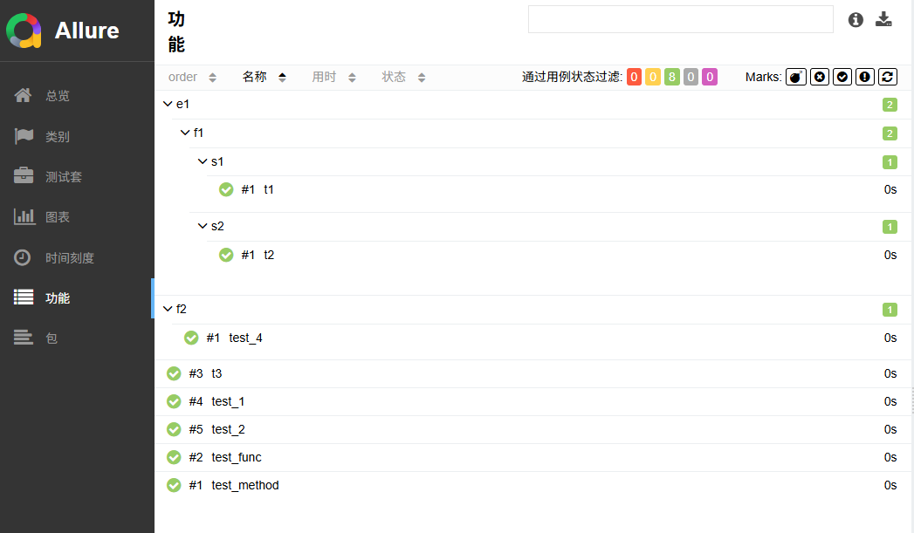

# 1. pytest介绍

1. 测试框架：抽象出来的工具集合，提供大量组件、工具、功能

   - 用例发现

   - 用例管理

   - 环境管理

   - 用例执行

   - 测试报告


2. `pytest` **完全兼容** `unittest`
   - `pytest`对 assert 进行高级封装 （AST），这对python数据结构很友好 


3. pytest官方
   - https://docs.pytest.org/en/stable/


# 2. 快速上手

1. 安装

   ```
   pip install pytest
   ```

   

2. 脚本编写

   ```python
   def test_number():
       assert 1 == 2
   ```
   
   
   
2. 两种执行方式

   - 终端执行

     ```
     pytest
     # pytest -vs
     ```
   
   - 代码执行
   
     ```python
     # main.py
     import pytest
     # 代码内容
     pytest.main()
     # pytest.main(["-v", "-s"])
     ```
     
     

# 3. 看懂结果

## 3.1 样例

```python
# main.py
import pytest

def test_number():
    assert 1 == 2

def test_str():
    assert "aaa" == "aaac"
    
def test_list():
    a = [1, 2, 3]
    b = [1, 2, 4]
    assert a == b    
    
def test_dict():
    a = {"a": 1, "b": 2}
    b = {"a": 1, "b": 3}
    assert a == b
    
pytest.main()
```


输出

```bash
============================================ test session starts ===========================================
platform linux -- Python 3.12.10, pytest-8.3.5, pluggy-1.6.0
rootdir: /home/dell/wh/code/test/lr_pytest
configfile: pytest.ini
collected 4 items                                                                                              

test_demo.py FFFF                                                                                        [100%]

=============================================== FAILURES ==================================================
_____________________________________________ test_number __________________________________________________

    def test_number():
>       assert 1 == 2
E       assert 1 == 2

test_demo.py:4: AssertionError
_______________________________________________ test_str __________________________________________________

    def test_str():
>       assert "aaa" == "aaac"
E       AssertionError: assert 'aaa' == 'aaac'
E         
E         - aaac
E         ?    -
E         + aaa

test_demo.py:7: AssertionError
_______________________________________________ test_list _______________________________________________

    def test_list():
        a = [1, 2, 3]
        b = [1, 2, 4]
>       assert a == b
E       assert [1, 2, 3] == [1, 2, 4]
E         
E         At index 2 diff: 3 != 4
E         Use -v to get more diff

test_demo.py:12: AssertionError
__________________________________________________ test_dict _______________________________________________

    def test_dict():
        a = {"a": 1, "b": 2}
        b = {"a": 1, "b": 3}
>       assert a == b
E       AssertionError: assert {'a': 1, 'b': 2} == {'a': 1, 'b': 3}
E         
E         Omitting 1 identical items, use -vv to show
E         Differing items:
E         {'b': 2} != {'b': 3}
E         Use -v to get more diff

test_demo.py:17: AssertionError
=========================================== warnings summary ===============================================
../../../../miniconda3/envs/wh_test/lib/python3.12/site-packages/_pytest/config/__init__.py:1500
  /home/dell/miniconda3/envs/wh_test/lib/python3.12/site-packages/_pytest/config/__init__.py:1500: PytestConfigWarning: No files were found in testpaths; consider removing or adjusting your testpaths configuration. Searching recursively from the current directory instead.
    self.args, self.args_source = self._decide_args(

-- Docs: https://docs.pytest.org/en/stable/how-to/capture-warnings.html
======================================= short test summary info ============================================
FAILED test_demo.py::test_number - assert 1 == 2
FAILED test_demo.py::test_str - AssertionError: assert 'aaa' == 'aaac'
FAILED test_demo.py::test_list - assert [1, 2, 3] == [1, 2, 4]
FAILED test_demo.py::test_dict - AssertionError: assert {'a': 1, 'b': 2} == {'a': 1, 'b': 3}
====================================== 4 failed, 1 warning in 0.05s ========================================
```


## 3.2 结果构成

1. 执行环境：版本、根目录、用例数量

   ```
   ========================================== test session starts =========================================
   platform linux -- Python 3.12.10, pytest-8.3.5, pluggy-1.6.0
   rootdir: /home/dell/wh/code/test/lr_pytest
   configfile: pytest.ini
   collected 4 items  
   ```

   

2. 执行过程：文件名称、用力结果、执行进度

   ```
   test_demo.py FFFF                                                                              [100%]
   ```


3. 失败原因：用例内容、断言提示

   ```
   ___________________________________________ test_number ________________________________________________
   
       def test_number():
   >       assert 1 == 2
   E       assert 1 == 2
   
   test_demo.py:4: AssertionError
   ```

   

4. 整体摘要：结果情况、结果数量、花费时间

   ```
   ======================================= short test summary info =========================================
   FAILED test_demo.py::test_number - assert 1 == 2
   FAILED test_demo.py::test_str - AssertionError: assert 'aaa' == 'aaac'
   FAILED test_demo.py::test_list - assert [1, 2, 3] == [1, 2, 4]
   FAILED test_demo.py::test_dict - AssertionError: assert {'a': 1, 'b': 2} == {'a': 1, 'b': 3}
   ====================================== 4 failed, 1 warning in 0.05s =====================================
   ```

   

## 3.3 结果类型

用例结果缩写

| 缩写 |  单词   | 含义                       |
| :--: | :-----: | -------------------------- |
|  .   | passed  | 通过                       |
|  F   | failed  | 失败（用例执行报错）       |
|  E   |  error  | 出错（fixture执行报错）    |
|  s   | skipped | 跳过                       |
|  X   | xpassed | 预期外的通过（不符合预期） |
|  x   | xfailed | 预期内的失败（符合预期）   |


# 4. 用例规则

## 4.1 用例发现规则

1. 用例发现：测试框架在识别、加载用例的过程

2. pytest的用例发现

   - 遍历所有的目录，对目录名没有要求

     （跳过`venv`和隐藏目录）

   - 打开以`test_`开头或以`_test`结尾的python文件
   - 遍历所有的以`Test`开头的类
     - 搜集所有的以`test_`开头的函数或方法

   

   注意：按目前发现规则：
   
   ```python
   def test_func():
       pass
   
   a = test_func
   ```

   pytest 会将 `a` 也看做测试用例
   
   

## 4.2 用例内容规则

pytest对用例的要求：

1. 可调用的（函数、方法、类、对象）
2. 以`test_`开头
3. 没有参数（参数有另外含义）
4. 没有返回值（默认为None）


```python
def add(a, b):
    return a+b

class TestAdd:
    def test_int(self):
        res = add(1,3)
        assert res == 4
        
    def test_str(self):
        res = add("1", "3")
        assert res == "13"
```


#  5. 配置框架

配置可以改变pytest默认的规则：

## 5.1 命令参数

比如`pytest -v`

常用参数

1. `-v`：显示更多信息

2. `-s`：停止IO捕获，在用例中正常使用输入输出。

   比如，当测试用例中出现`a = input()`时，需要使用

   - 但在自动化测试中，不应该出现输入输出

3. `-x`：快速退出。出现一个失败用例，立刻停止全部测试

4. `-m`：用例筛选

   

## 5.2 配置文件

在`pytest.ini`中的进行配置

- `addopts`用于添加启动项参数

```ini
# pytest.ini

[pytest]
addopts = -v -s
```


# 6. 标记mark

对用例进行标记，进而进行不同处理

- 一个用例可以添加多个标记


## 6.1 用户自定义标记

1. 效果：**只能实现用例筛选**

2. 步骤

   - 注册

   - 标记

   - 筛选


2. 注册

   编写配置文件

   ```ini
   # pytest.ini
   [pytest]
   
   markers = 
       api: 接口测试
       web: UI测试
       ut: 单元测试
       login: 登录测试
       ddt: 数据驱动测试
   ```
   
   
   
3. 查看已注册的mark
   
   ```bash
   pytest --markers
   ```
   
   输出
   
   ```
   @pytest.mark.api: 接口测试
   
   @pytest.mark.web: UI测试
   
   @pytest.mark.ut: 单元测试
   
   @pytest.mark.login: 登录测试
   
   ...
   ```
   
   
   
4. 标记

   ```python
   @pytest.mark.api
   def test_api():
   	pass
   ```
   
   
   
5. 筛选

   只执行标记为`api`的测试用例

   ```bash
   pytest -m api
   ```

   

## 6.2 框架内置标记

1. 效果：用例增加特殊执行效果

2. 常用的的内置标记

   - `skip`：无条件跳过

   - `skipif`：有条件跳过

   - `xfail`：预期失败

   - `parametrize`：参数化

   - `usefixtures`：使用fixtures


3. 样例

   ```python
   import pytest
   
   def add(a, b):
       return a+b
   
   class TestAdd:
       
       @pytest.mark.api
       @pytest.mark.skipif(True, reason="Skipping this test")
       def test_int(self):
           res = add(1,3)
           assert res == 4
       
       @pytest.mark.xfail
       def test_str(self):
           res = add("1", "3")
           assert res == "14"
   ```


### 6.2.1 parametrize简单使用

1. 使用参数化标记

   - 用于对多组数据执行相同的测试逻辑（共用同一套测试代码）
   - 每组数据都会生成一个测试报告

   

2. 传入的两个参数

   - argnames：字符串形式的参数名
   - argvalues：参数具体的值，每列要和参数名对的上

   ```python
   @pytest.mark.parametrize("arg1, arg2", [
       (1, 2),
       (2, 3),
       # 更多参数组...
   ])
   ```


3. 参数的使用

   - 作为参数传入测试函数

   ```python
   @pytest.mark.parametrize("arg1, arg2", [
       (1, 2),
       (2, 3),
   ])
   def test_add(arg1, arg2):
       assert arg1 + 1 == arg2
   ```

   执行可以看到

   ```bash
   ==================================== test session starts ====================================
   platform linux -- Python 3.11.5, pytest-8.4.1, pluggy-1.6.0 -- /root/miniconda3/bin/python
   cachedir: .pytest_cache
   rootdir: /mnt/lr_pytest
   configfile: pytest.ini
   plugins: anyio-4.2.0
   collecting ... ==================================== test session starts ====================================
   platform linux -- Python 3.11.5, pytest-8.4.1, pluggy-1.6.0 -- /root/miniconda3/bin/python
   cachedir: .pytest_cache
   rootdir: /mnt/lr_pytest
   configfile: pytest.ini
   plugins: anyio-4.2.0
   collected 2 items                                                                                                                               
   
   test_main.py::test_add[1-2] PASSED
   test_main.py::test_add[2-3] PASSED
   
   ===================================== 2 passed in 0.01s =====================================
   collected 2 items                                                                                                                               
   
   test_main.py::test_add[1-2] PASSED
   test_main.py::test_add[2-3] PASSED
   
   ===================================== 2 passed in 0.08s =====================================
   ```

   

### 6.2.2 fixture简单使用

1. 可以将 fixture 理解成 FastAPI 中的 `lifespan`

   - 或者粗略理解成python普通意义上的装饰器

   用于测试用例执行前后的逻辑统一实现

2. fixture的声明与使用

   ```python
   # 注册fixture
   @pytest.fixture
   def fun():
       # 执行前
       print("Starting test function")
       
       yield
       
       # 执行后
       print("\nEnding test function")
   
   # fixture作为参数，被测试用例使用
   def test_function(fun):
       assert True
   ```

   输出

   ```bash
   ==================================== test session starts ====================================
   platform linux -- Python 3.11.5, pytest-8.4.1, pluggy-1.6.0 -- /root/miniconda3/bin/python
   cachedir: .pytest_cache
   rootdir: /mnt/lr_pytest
   configfile: pytest.ini
   plugins: anyio-4.2.0
   collecting ... ==================================== test session starts ====================================
   platform linux -- Python 3.11.5, pytest-8.4.1, pluggy-1.6.0 -- /root/miniconda3/bin/python
   cachedir: .pytest_cache
   rootdir: /mnt/lr_pytest
   configfile: pytest.ini
   plugins: anyio-4.2.0
   collected 1 item                                                                                                                                
   
   test_main.py::test_function Starting test function
   PASSED
   Ending test function
   
   
   ==================================== 1 passed in 0.01s ====================================
   collected 1 item                                                                                                                                
   
   test_main.py::test_function Starting test function
   PASSED
   Ending test function
   
   
   ==================================== 1 passed in 0.07s ====================================
   ```

   


# 7. 数据驱动测试

1. 数据驱动测试

   - 数据驱动测试 = 参数化测试 + 数据文件
   
   
      - 根据数据文件的内容，动态决定用例的数量和内容
      - 通常使用parametrize来配合实现
   
2. 数据驱动测试有助于用例编写人员不必熟悉测试程序，**只需构建输入和输出即可**

3. 构成

   - 数据

   - 数据载入程序

   - 测试函数


## 7.1 数据

数据格式没有硬性要求，但通常会选择更接近于表格的`csv`

此处使用`json`

```json
[
    {"arg1": 1, "arg2": 2, "res": 3},
    {"arg1": 4, "arg2": 5, "res": 9},
    {"arg1": 6, "arg2": 7, "res": 13},
    {"arg1": 8, "arg2": 9, "res": 17},
    {"arg1": 10, "arg2": 11, "res": 21}
]
```


## 7.2 数据载入

```python
# utils.py
import json

def data_load(file_path: str):
    
    with open(file_path, 'r', encoding='utf-8') as f:
        dataset = json.load(f)

    test_data = [tuple(data.values()) for data in dataset]
    return test_data
```


## 7.3 测试函数

```python
@pytest.mark.parametrize("arg1, arg2, res", dataloader("data.json"))
def test_add(arg1, arg2, res):
    assert arg1 + arg2 == res
```

输出

```
==================================== test session starts ====================================
platform linux -- Python 3.11.5, pytest-8.4.1, pluggy-1.6.0 -- /root/miniconda3/bin/python
cachedir: .pytest_cache
rootdir: /mnt/lr_pytest
configfile: pytest.ini
plugins: anyio-4.2.0
collecting ... ==================================== test session starts ====================================
platform linux -- Python 3.11.5, pytest-8.4.1, pluggy-1.6.0 -- /root/miniconda3/bin/python
cachedir: .pytest_cache
rootdir: /mnt/lr_pytest
configfile: pytest.ini
plugins: anyio-4.2.0
collected 5 items                                                                                                                               

test_main.py::test_add[1-2-3] PASSED
test_main.py::test_add[4-5-9] PASSED
test_main.py::test_add[6-7-13] PASSED
test_main.py::test_add[8-9-17] PASSED
test_main.py::test_add[10-11-21] PASSED

==================================== 5 passed in 0.02s ====================================
collected 5 items                                                                                                                               

test_main.py::test_add[1-2-3] PASSED
test_main.py::test_add[4-5-9] PASSED
test_main.py::test_add[6-7-13] PASSED
test_main.py::test_add[8-9-17] PASSED
test_main.py::test_add[10-11-21] PASSED

==================================== 5 passed in 0.10s ====================================
```


# 8. 夹具fixture

1. 夹具：在用例**执行之前、执行之后**，自动运行代码

2. 场景：

   - 之前：加密参数，之后：解密结果

   - 之前：启动浏览器，之后：关闭浏览器

   - 之前：注册、登录账号，之后：删除账号  


## 8.1 创建fixture

```python
@pytest.fixture
def f():
    # 前置操作
    print(time.time(), "开始执行")
    
    yield # 执行用例
    
    # 后置操作
    print(time.time(), "执行结束")
    
```


## 8.2 使用fixture

1. 第一种方式：推荐方式

   ```python
   def test_1(f):
       pass
   ```

   

2. 第二种方式：给用例加上标记

   ```python
   @pytest.mark.usefixtures("f")
   def test_2():
       pass
   ```

   


## 8.3 自动使用和范围共享

1. 自动使用：所有用例自动使用

   ```python
   @pytest.fixture(autouse=True)
   def f():
       pass
   ```

   

2. 范围共享

   适用于昂贵的初始化（如数据库连接、浏览器启动）

   - 默认范围：`function`，本函数内

   - 全局范围：`session`

     - 在根目录下，创建`conftest.py`，需要共享的`fixture`放此处。
     - `pytest`会自动发现`conftest.py`，保证全局用例都能获取到。

   

3. `conftest.py`样例，正常编写即可

   ```python
   # conftest.py
   @pytest.fixture(autouse=True, scope="session")
   def f():
       # 前置操作
       print(time.time(), "开始执行")
       
       yield "fixture_result"  # 执行用例
       
       # 后置操作
       print(time.time(), "执行结束")
       
   ```
   
   
   
4. 使用效果


   ```python
   # test_1.py
   def test_1(f):
       print("收到fixture的结果", f)
   ```

   ```python
   # test_2.py 
   def test_2(f):
       print("收到fixture的结果", f)
   ```

   

   输出

   ```bash
   test_fixture.py::test_1 1749631063.1157985 开始执行
   收到fixture的结果 fixture_result
   PASSED
   test_fixture.py::test_2 收到fixture的结果 fixture_result
   PASSED1749631063.1164677 执行结束
   ```

   可以看到，`开始执行`只输出了一次


## 8.4 高级方法

1. 依赖使用

   `f`在执行前先执行`ff`

   ```python
   @pytest.fixture()
   def ff():
       pass
   
   @pytest.fixture()
   def f(ff):
       pass
   ```

   

2. 返回内容

   ```python
   @pytest.fixture
   def f():
       # 前置操作
       print(time.time(), "开始执行")
       
       yield 1, 2, 3  # 执行用例
       
       # 后置操作
       print(time.time(), "执行结束")
       
   
   def test(f):
       a, b, c = f  # 解包元组
   ```

   

   


# 9. 插件管理

1. 插件类型：
   - 内置插件：不需要安装
   - 第三方插件

2. 插件启用管理
   - 启用：`-p <插件名>`
   - 禁用：`-p no:<插件名>`

3. 插件使用方式
   - 参数方式
   - 配置文件
   - `fixture`
   - 标记mark


## 9.1 常用第三方插件

1. pytest收录的插件

   https://docs.pytest.org/en/stable/reference/plugin_list.html


### 9.1.1 pytest-html

1. 用途：生成HTML报告

2. 安装

   ```
   pip install pytest-html
   ```

3. 使用

   ```
   pytest --html=report.html --self-contained-html
   ```

   也可以在`pytest.ini`中添加

   ```
   addopts = -s --html=report.html --self-contained-html
   ```


### 9.1.2 pytest-xdist

1. 用途：分布式执行。**默认使用多进程实现**

   **注意**：

   - 启动多进程，本身就有时间消耗
   - 分布式执行，有并发、资源竞争等问题

2. 安装

   ```
   pip install pytest-xdist
   ```

3. 使用

   ```
   -n 12
   ```

   创建12个进程
   
   


### 9.1.3 pytest-rerunfailures

1. 用途：用例失败后，重新执行

   针对网络波动、UI渲染等问题

2. 安装

   ```
   pip install pytest-rerunfailures
   ```

3. 使用

   ```
   --reruns 5 --reruns-delay 1
   ```

   - 失败后重新执行5次，若有一次成功，则用例通过
   - 在重试前先等待1秒

   

### 9.1.4 pytest-result-log

1. 用途：把用例的执行结果记录到日志文件中

   - 不需要在测试函数中做特殊处理

2. 安装：

   ```
   pip install pytest-result-log
   ```

3. 使用

   ```ini
   # pytest.ini
   
   log_file = logs/test.log
   log_file_level = INFO
   log_file_format = %(asctime)s - %(name)s - %(levelname)s - %(message)s
   log_file_date_format = %Y-%m-%d %H:%M:%S
   
   ; 是否启用结果日志
   result_log_enable = 1
   ; 结果日志分隔线                
   result_log_separator = 1
   ; 分割线等级
   result_log_level_separator = warning
   ; 结果日志详细等级
   result_log_level_verbose = info
   ```

   注意：`ini`文件中的注释是以`;`开头


## 9.2 企业级测试报告allure

`allure`是一个测试报告框架，支持多种语言

- **allure网页效果很友好**
- allure为pytest用户开发了一个pytest适配版


### 9.2.1 基础使用

1. 先安装allure

   - https://allurereport.org/docs/install-for-linux/#install-from-a-deb-package
   - https://github.com/allure-framework/allure2/releases/tag/2.34.0

   下载对应`deb`包，然后`sudo dpkg -i <allure包>.deb`

   

2. 安装对应pytest插件

   ```
   pip install allure-pytest
   ```

   

3. 配置

   ```
   --alluredir=temps --clean-alluredir
   ```

   - 执行pytest时，只是将数据保存到`temps`，并没有生成报告
   - 新生成的数据覆盖已有的报告

   

4. 生成报告

   ```
   allure generate -o report -c temps
   ```

   生成报告到`report`文件夹，数据来源是`temps`文件夹


### 9.2.2 分组和关联

1. allure 支持对用例进行分组和关联（敏捷开发术语）

   四个级别

   ```python
   @allure.epic		# 史诗，表示里程碑
   @allure.feature		# 主题，表示模块
   @allure.story		# 故事，表示功能
   @allure.title		# 标题，表示用例
   ```

   - 使用相同装饰器，自动分为一组

   - 一个用例可以在很多组

     

2. 脚本

   ```python
   import allure
   
   @allure.epic("e1")		
   @allure.feature("f1")	
   @allure.story("s1")		
   @allure.title("t1")		
   def test_1():
       """
       测试用例1
       """
       assert True
   
   
   @allure.epic("e1")		
   @allure.feature("f1")	
   @allure.story("s2")		
   @allure.title("t2")
   def test_2():
       """
       测试用例2
       """
       assert True
   
   
   @allure.title("t3")
   def test_3():
       """
       测试用例3
       """
       assert True
       
       
   @allure.feature("f2")
   def test_4():
       """
       测试用例4
       """
       assert True    
   
   ```

   

3. 执行效果

   

   - 建议四个级别写完整


# 10. 封装接口自动化测试框架

## 10.1 框架封装


1. 接口自动化封装：

   - 使用yaml作为用例，降低自动化门槛

   - 自动请求接口、断言接口

   - 自动在日志记录HTTP报文

   - 自动生成`allure`测试报告


2. 接口测试用例内容

   - 请求接口：GET https://www.baidu.com

   - 响应断言：status_code == 200

   - 提取变量：json()['code']


3. yaml样例

   内容格式和项目高度绑定，没有统一的标准

   ```yaml
   name: 登录成功用例
   description: 测试用户登录功能，验证登录成功后返回的令牌
   tag: ["标签用于用例分类"]
   
   steps:
     send: # 发送请求
       method: POST
       url: http://127.0.0.1:8000/login
       headers:
         Content-Type: application/json
       body:
         username: admin
         password: password
     
     validate: # 响应验证
       body:
         status_code: 200
         message: Login successful
       
     extract: # 提取令牌
       token: $.body.token
   ```

   

## 10.2 框架目录

详见[codes/pytest_example](codes/pytest_example)

```bash
.
├── cache					# allure生成的缓存
│   └── xxx.txt
├── data
│   ├── data.csv
│   └── test_api.yaml
├── logs					
│   ├── __init__.py
│   └── xxx.log
├── report					# allure生成的网页
│   └── xxx
│   └── index.html
├── tests
│   ├── test_xxx.py
│   └── test_demo.py
├── utils
│   ├── __init__.py
│   └── xxx.py
├── .gitignore
├── pytest.ini
├── requirements.txt
├── conftest.py    
└── main.py					# 测试入口
```


1. `.gitignore`

   ```
   cache
   report
   .log
   
   ...
   ```

   

2. `pytest.ini`

   ```ini
   [pytest]
   
   addopts = -v -s --alluredir=cache --clean-alluredir
   markers = 
       unit: 单元测试
       api: 接口测试
       ddt: 数据驱动测试
   
   
   log_file = logs/test.log
   log_file_level = INFO
   log_file_format = %(asctime)s - %(name)s - %(levelname)s - %(message)s
   log_file_date_format = %Y-%m-%d %H:%M:%S
   
   ; 是否启用结果日志
   result_log_enable = 1
   ; 结果日志分隔线                
   result_log_separator = 1
   ; 分割线等级
   result_log_level_separator = warning
   ; 结果日志详细等级
   result_log_level_verbose = info
   ```


3. `requirements.txt`

   ```
   pytest
   fastapi
   uvicorn
   requests
   pytest-result-log
   allure-pytest
   pyyaml
   jsonschema
   jsonpath-ng
   ```

   

3. `main.py`

   ```python
   import os
   import pytest
   
   pytest.main()
   os.system("allure generate -o report -c cache")
   ```

   

## 10.3 测试程序

### 10.3.1 用例程序

```python
import pytest
import allure
import requests
from jsonpath_ng.ext import parse

from utils import load_test_case, validate_response

@allure.title("demo")
@pytest.mark.api
@pytest.mark.parametrize("send, validate, extract", load_test_case())
def test_demo(send, validate, extract):
    """
    Test case for API requests.
    
    :param send: The request data for the API call.
    :param validate: The validation rules for the response.
    :param extract: The extraction rules for the response.
    """
    
    # step 1: send the request
    url = send.get("url")
    method = send.get("method")
    headers = send.get("headers", {})
    body = send.get("body", {})

    response = requests.request(method=method, url=url, headers=headers, json=body)

    # step 2: validate the response
    val_result = validate_response(response, validate)
    assert val_result is None
    
    # step 3: extract data if needed
    if extract:
        for key, expr in extract.items():
            jsonpath_expr = parse(expr)
            matches = jsonpath_expr.find(response.json())
            if matches:
                extracted_value = matches[0].value
                allure.attach(name=key, body=str(extracted_value), attachment_type=allure.attachment_type.TEXT)
            else:
                allure.attach(name=key, body="No match found", attachment_type=allure.attachment_type.TEXT)
```


### 10.3.2 响应验证


1. 可以考虑使用 jsonschema

   ```
   pip install jsonschema
   ```

   

2. jsonschema的基础使用

   ```python
   from jsonschema import validate
   
   # 定义schema
   schema = {
       "type": "object",
       "properties": {
           "name": {"type": "string"},
           "age": {"type": "number"}
       },
       "required": ["name"]
   }
   
   # 有效数据
   valid_data = {"name": "John", "age": 30}
   validate(instance=valid_data, schema=schema)  # 不会抛出异常
   
   # 无效数据
   invalid_data = {"age": 30}
   try:
       validate(instance=invalid_data, schema=schema)
   except Exception as e:
       print(f"验证失败: {e}")
   ```

   详细使用方式，可参考 [JSONSchema.md](JSONSchema.md)


3. `utils/validate.py`

   ```python
   from jsonschema import Draft7Validator
   
   
   def create_schema(validate):
       """
       Create a JSON schema from the validation rules.
       
       :param validate: The validation rules for the response.
       :return: A JSON schema object.
       """
       
       schema = {
           "type": "object",
           "properties": {}
       }
       
       bodys = validate.get("body", {})
       for key, value in bodys.items():
           if isinstance(value, str):
               key_type = "string"
           elif isinstance(value, int):
               key_type = "integer"
           elif isinstance(value, bool):
               key_type = "boolean"
           # ....
           
           schema["properties"][key] = {
               "type": key_type,
               "const": value 
           }
       
       return schema
   
   
   def validate_response(response, validate):
       """
       Validate JSON data against a given schema.
       
       :param json_data: The JSON data to validate.
       :param schema: The JSON schema to validate against.
       :return: True if valid, raises ValidationError if invalid.
       """
       
       schema = create_schema(validate)
       validator = Draft7Validator(schema)
       errors = list(validator.iter_errors(response.json()))
       
       if errors:
           error_details = []
           for error in errors:
               error_details.append(
                   f"Error: {error.message}, Schema Path: {list(error.schema_path)}, Instance Value: {error.instance}"
               )
   
           return error_details
       
       elif response.status_code != 200:
           return f"Request failed with status code: {response.status_code}"
       
       else:
           return None
   ```

   

### 10.3.3 参数提取

```bash
    # step 3: extract data if needed
    if extract:
        for key, expr in extract.items():
            jsonpath_expr = parse(expr)
            matches = jsonpath_expr.find(response.json())
            if matches:
                extracted_value = matches[0].value
                allure.attach(name=key, body=str(extracted_value), attachment_type=allure.attachment_type.TEXT)
            else:
                allure.attach(name=key, body="No match found", attachment_type=allure.attachment_type.TEXT)
```


1. 使用了 jsonpath-ng

   ```
   pip install jsonpath-ng
   ```


2. jsonpath-ng 的基础使用

   ```python
   from jsonpath_ng.ext import parse
   
   # 示例 JSON 数据
   data = {
       "store": {
           "book": [
               {
                   "category": "reference",
                   "author": "Nigel Rees",
                   "title": "Sayings of the Century",
                   "price": 8.95
               },
               {
                   "category": "fiction",
                   "author": "Evelyn Waugh",
                   "title": "Sword of Honour",
                   "price": 12.99
               }
           ],
           "bicycle": {
               "color": "red",
               "price": 19.95
           }
       }
   }
   
   # 解析 JSONPath 表达式
   expr = parse("$.store.book[*].price")
   
   # 查找匹配项
   for match in expr.find(data):
       print(match.value)
   ```

   详细使用方式，参考[JSONPath.md](JSONPath.md)


## 10.4 个人体会

1. 对于简单的项目，没有必要封装接口自动化测试框架

   - 测试用例文件 (`yaml`)内容格式的确定、对应解析程序的开发，这本身就要大量精力

2. 对于简单且格式易变的响应，没必要使用 JSON Schema，

   提取其中的参数，也没有必要使用 JSONPath

 	3. 重点是在于有测试用例，并且能正常承担测试功能
     - 复杂插件/工具，取决于项目是否有明显需求
     - 小项目没必要一开始就按照企业级的大项目来开发测试框架


# 11. 参考

1. https://www.bilibili.com/video/BV1rDdHYCEUP/

   本笔记在此基础上整理、改进，添加个人见解得到
