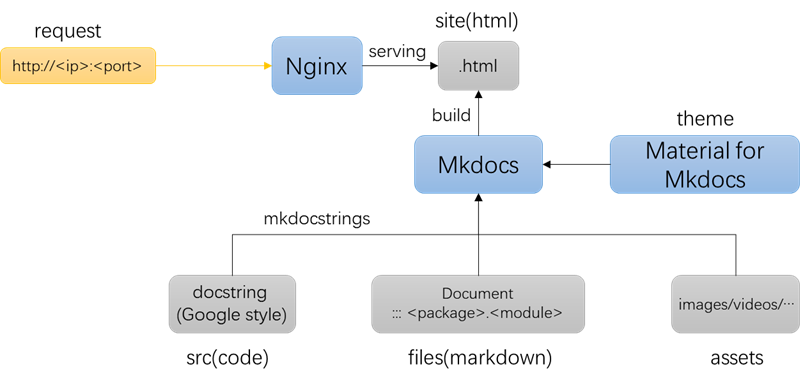
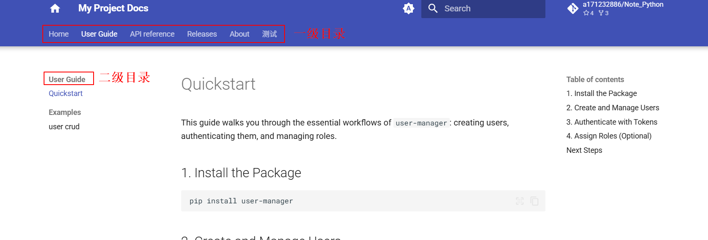

# 文档网站搭建

快速搭建一个自己项目的“官方文档”网站

1. 框架示意图
   
   

2. 样例代码

   [a171232886/example_apisite](https://github.com/a171232886/example_apisite)
   
   

3. 样例代码目录

   ```
   .
   ├── docs
   │   ├── api_reference
   │   │   ├── auth_service.md
   │   │   ├── exception.md
   │   │   ├── index.md
   │   │   ├── role_service.md
   │   │   └── user_service.md
   │   ├── assets
   │   │   ├── images
   │   │   │   └── test.png
   │   │   └── videos
   │   │       └── test.mp4
   │   ├── concepts
   │   │   ├── authentication.md
   │   │   └── user.md
   │   ├── examples
   │   │   └── user_crud.md
   │   ├── about.md
   │   ├── index.md
   │   ├── quickstart.md
   │   ├── release_notes.md
   │   └── test.md
   ├── src
   │   └── user_manager
   │       ├── __init__.py
   │       ├── exceptions.py
   │       ├── models
   │       │   ├── __init__.py
   │       │   ├── role.py
   │       │   ├── token.py
   │       │   └── user.py
   │       └── services
   │           ├── __init__.py
   │           ├── auth_service.py
   │           ├── role_service.py
   │           └── user_service.py
   ├── examples
   │   ├── basic_usage.py
   │   └── user_crud.py
   ├── tests
   │   ├── main.py
   │   ├── test_auth_service.py
   │   └── test_user_service.py
   ├── .gitignore
   ├── mkdocs.yml
   ├── pyproject.toml
   ├── pytest.ini
   └── readme.md
   ```

   


# 1. 官方文档内容

1. 参考
   - AutoGen：https://microsoft.github.io/autogen/stable/index.html
   - Pytorch：https://docs.pytorch.org/docs/stable/index.html
   - Transformers：https://huggingface.co/docs/transformers/index
   - Numpy：https://numpy.org/doc/stable/user/index.html

2. 官方文档大致包含以下几块内容
   - 用户指南（User Guide）
   - API 参考文档（API reference）
   - 发行说明（Release Notes）
3. 用户指南应包含以下几部分核心内容：
   - 快速开始（Quick Start）
     - 主要功能说明
     - 安装
     - 一个简单的样例：用于验证安装成功，为用户上手提供最基础的支点
   - 核心概念
     - 代码框架中的核心类（模块）
     - 核心类之间的交互方式
   - **样例（Example）**
4. API 参考文档
   - **通常由代码注释直接生成**
   - 按照源码的层级结构进行
     - 通常一个类或者一个模块作为一个网页
   - 每个函数接口对应的文档
     - 功能描述
     - 输入
     - 输出
     - 样例（特别是面向用户的关键接口）
     - 异常（可选）


# 2. Python文档字符串

## 2.1 风格种类

1. Python的docstring格式主要有3种：

   - Google

   - Numpy

   - Sphinx

   **推荐 Google 风格**


2. Google 风格

   ```python
   def example_function(param1: int, param2: str) -> bool:
       """Example function with types documented in the docstring.
   
       Args:
           param1 (int): The first parameter.
           param2 (str): The second parameter.
   
       Returns:
           bool: The return value. True for success, False otherwise.
   
       Raises:
           ValueError: If param1 is negative.
       """
   ```

   

3. Numpy 风格

   ```python
   def example_function(param1, param2):
       """Example function with NumPy-style docstring.
   
       Extended summary can go here.
   
       Parameters
       ----------
       param1 : int
           The first parameter.
       param2 : str
           The second parameter.
   
       Returns
       -------
       bool
           The return value. True for success, False otherwise.
   
       Raises
       ------
       ValueError
           If param1 is negative.
       """
   ```

   

4. Sphinx 风格

   ```python
   def example_function(param1, param2):
       """Example function with Sphinx-style docstring.
   
       :param param1: The first parameter.
       :type param1: int
       :param param2: The second parameter.
       :type param2: str
       :returns: The return value.
       :rtype: bool
       :raises ValueError: If param1 is negative.
       """
   ```


## 2.2 Google 风格

### 2.2.1 介绍

1. Google代码编写规范：https://google.github.io/styleguide/

   Google代码编写规范-Python注释：https://google.github.io/styleguide/pyguide.html#38-comments-and-docstrings

2. Google代码编写规范中支持的关键字有：

   - Attributes
   - Args
   - Returns
   - Yields
   - Raises

3. 经过第三方扩展后的关键字

   - Examples

   - Notes

   - Warning

   - See Also

     

### 2.2.2 样例

（Qwen生成）涉及常用的情况：

- 类属性
- 对象属性
- 类方法
- 对象方法（同步、异步）
- 静态方法
- @property装饰

```python
from typing import Iterable, Generator, AsyncIterable, AsyncGenerator
import asyncio

class CoordinateParser:
    """A utility class for parsing coordinate strings into (x, y) float pairs.

    This class provides one-off, batch, asynchronous, validation, and introspection
    utilities for coordinate strings in the format 'x,y'.

    Class Attributes:
        - DEFAULT_SEPARATOR (str): The expected separator between x and y values. Defaults to ','.
        - ALLOWED_WHITESPACE (bool): Indicates that surrounding whitespace is permitted and stripped.

    Attributes:
        separator (str): The character used to split x and y. Set at initialization.

    Note:
        This class does not validate whether coordinates fall within any specific
        geographic or application-specific bounds (e.g., latitude/longitude ranges).
        It only ensures syntactic correctness of the input format.

    Warning:
        Passing user-provided input without sanitization may lead to unexpected
        ``ValueError`` exceptions if the format is malformed. Always validate or
        catch exceptions in production code when the input source is untrusted.

    See Also:
        - func `json.loads`: For parsing structured data that may include coordinates.
        - class `shapely.geometry.Point`: For geometric operations using parsed coordinates.
    """

    DEFAULT_SEPARATOR: str = ','
    ALLOWED_WHITESPACE: bool = True

    def __init__(self, separator: str = DEFAULT_SEPARATOR):
        """Initialize a CoordinateParser instance.

        Args:
            separator: The character used to separate x and y in input strings.
                Defaults to ','.
        """
        self.separator = separator

    @classmethod
    def parse(cls, coord_str: str) -> tuple[float, float]:
        """Parse a single coordinate string into an (x, y) tuple.

        Uses the default comma separator and strips whitespace.

        Args:
            coord_str: A string representing coordinates, e.g., '1.5, -2.3'.

        Returns:
            x: The horizontal coordinate as a float.
            y: The vertical coordinate as a float.

        Raises:
            ValueError: If the string does not contain exactly two comma-separated values.
            TypeError: If coord_str is not a string.
            ValueError: If either part cannot be converted to a float.

        Examples:
            >>> CoordinateParser.parse("3.14, -2.5")
            (3.14, -2.5)

            >>> CoordinateParser.parse(" 0 , 10 ")
            (0.0, 10.0)
        """
        if not isinstance(coord_str, str):
            raise TypeError("Input must be a string.")

        parts = coord_str.split(cls.DEFAULT_SEPARATOR)
        if len(parts) != 2:
            raise ValueError("Input must contain exactly two comma-separated values.")

        try:
            x = float(parts[0].strip())
            y = float(parts[1].strip())
        except ValueError as e:
            raise ValueError("Both parts must be valid numbers.") from e

        return x, y

    def parse_batch(self, coord_strings: Iterable[str]) -> Generator[tuple[float, float], None, None]:
        """Parse an iterable of coordinate strings, yielding (x, y) tuples one by one.

        Uses this instance's separator. Memory-efficient via lazy evaluation.

        Args:
            coord_strings: An iterable (e.g., list, generator) of coordinate strings.

        Yields:
            x: The horizontal coordinate as a float.
            y: The vertical coordinate as a float.

        Raises:
            ValueError: If any string does not contain exactly two values separated by
                this instance's separator.
            TypeError: If any item in coord_strings is not a string.
            ValueError: If any part cannot be converted to a float.

        Examples:
            >>> parser = CoordinateParser()
            >>> list(parser.parse_batch(["1,2", "3.5, -4"]))
            [(1.0, 2.0), (3.5, -4.0)]
        """
        for s in coord_strings:
            if not isinstance(s, str):
                raise TypeError("All inputs must be strings.")

            parts = s.split(self.separator)
            if len(parts) != 2:
                raise ValueError(
                    f"Input must contain exactly two {repr(self.separator)}-separated values."
                )

            try:
                x = float(parts[0].strip())
                y = float(parts[1].strip())
            except ValueError as e:
                raise ValueError("Both parts must be valid numbers.") from e

            yield x, y

    @staticmethod
    def is_valid_format(coord_str: str, separator: str = ',') -> bool:
        """Check if a string has the correct format to be a coordinate pair.

        This is a lightweight pre-check that verifies:
        - Input is a string
        - Contains exactly two parts when split by the separator
        - Does not attempt to validate numeric convertibility

        Args:
            coord_str: The candidate string to check.
            separator: The separator to use (default: ',').

        Returns:
            True if the string has exactly two parts after splitting; False otherwise.

        Examples:
            >>> CoordinateParser.is_valid_format("1.5,-2")
            True
            >>> CoordinateParser.is_valid_format("1,2,3")
            False
            >>> CoordinateParser.is_valid_format("abc")
            False
            >>> CoordinateParser.is_valid_format(123)
            False
        """
        if not isinstance(coord_str, str):
            return False
        parts = coord_str.split(separator)
        return len(parts) == 2

    async def parse_batch_async(
        self, coord_stream: AsyncIterable[str]
    ) -> AsyncGenerator[tuple[float, float], None]:
        """Asynchronously parse an async iterable of coordinate strings.

        Useful when coordinates are read from an async source (e.g., network stream,
        async file reader, or message queue).

        Args:
            coord_stream: An asynchronous iterable of coordinate strings.

        Yields:
            x: The horizontal coordinate as a float.
            y: The vertical coordinate as a float.

        Raises:
            ValueError: If any string is malformed (wrong number of parts or non-numeric).
            TypeError: If any item is not a string.

        Examples:
            >>> async def example():
            ...     async def gen():
            ...         yield "1,2"
            ...         yield "3.5, -4"
            ...     parser = CoordinateParser()
            ...     coords = [c async for c in parser.parse_batch_async(gen())]
            ...     return coords
            >>> asyncio.run(example())
            [(1.0, 2.0), (3.5, -4.0)]
        """
        async for s in coord_stream:
            if not isinstance(s, str):
                raise TypeError("All inputs must be strings.")

            parts = s.split(self.separator)
            if len(parts) != 2:
                raise ValueError(
                    f"Input must contain exactly two {repr(self.separator)}-separated values."
                )

            try:
                x = float(parts[0].strip())
                y = float(parts[1].strip())
            except ValueError as e:
                raise ValueError("Both parts must be valid numbers.") from e

            yield x, y

    @property
    def description(self) -> str:
        """Return a human-readable description of this parser's configuration.

        This property reflects the current separator and whitespace handling behavior.

        Returns:
            A string describing how this parser interprets input.

        Examples:
            >>> parser = CoordinateParser()
            >>> parser.description
            "Parses coordinate strings using separator ',' with whitespace stripping."

            >>> parser2 = CoordinateParser(separator=';')
            >>> parser2.description
            "Parses coordinate strings using separator ';' with whitespace stripping."
        """
        return (
            f"Parses coordinate strings using separator {repr(self.separator)} "
            f"with whitespace stripping."
        )
```


# 3. Mkdocs(Material主题)

## 3.1 介绍

1. 关系说明

   - Mkdocs是一个快速搭建文档网站的开源框架

   - Material for Mkdocs是 Mkdocs的一个网站开源主题（theme）

     - “material design” 是Google提出的一套前端UI设计框架，类似vue 

   - mkdocstrings, mkdocs-video, ... 是Mkdocs框架的插件

     

2. 官方文档

   - Mkdocs官方文档：https://www.mkdocs.org/
   - Material for Mkdocs 官方文档：https://squidfunk.github.io/mkdocs-material/reference/
     - 主要设置点：https://squidfunk.github.io/mkdocs-material/setup/

   - mkdocs-video：https://pypi.org/project/mkdocs-video/

   

3. FastAPI官网采用了Material for Mkdocs主题 

   - https://fastapi.tiangolo.com/

   

## 3.2 快速开始

1. 安装

   ```bash
   pip install mkdocs-material			# 会自动安装mkdocs框架相关
   
   # 以下为搭建文档网站所需插件，
   # 不属于Material for Mkdocs基础部分，但建议安装
   pip install mkdocstrings[python] mkdocs-video
   ```

   

2. 创建目录和对应文件

   - 目录

     ```
     .
     ├── docs
     │   ├── index.md
     │   └── user_guide
     │       └── hello.md
     └── mkdocs.yml
     ```

   - 对应文件

     - index.md

       ```
       # Index
       ```

       

     - hello.md

       ```
       # hello
       ```

       

     - mkdocs.yml

       ```yaml
       site_name: My Project Docs
       
       # 网站风格相关，默认主题mkdocs，也可以选readthedocs
       theme:
         name: material
       
       
       # 导航栏相关
       nav:
         - Home: index.md
         - UserGuide: user_guide/hello.md
       ```

       

3. 启动

   ```bash
   mkdocs serve
   ```

   输出

   ```
   INFO    -  Building documentation...
   INFO    -  Cleaning site directory
   INFO    -  Documentation built in 0.12 seconds
   INFO    -  [17:00:31] Serving on http://127.0.0.1:8000/
   ```

   

4. 网页效果

   http://127.0.0.1:8000/

   


## 3.3 文档编写

### 3.3.1 代码文档引用

（按照包导入方式）

```
:::<package>.<module>
:::<package>.<module>.<class>/<func>
```

例如

```
:::user_manager.AuthService
```


### 3.3.2 视频插入

1. markdown未提供视频插入语法

   `mkdocs build`将markdown生成html后（`site`文件夹中），资源路径会发生变化。

   - 针对markdown语法涉及的路径（如图片）会自动处理
   - 非markdown语法中涉及的路径则不调整

   

2. 方式一：使用 HTML 标签

   **需要自行处理视频路径**

   ```html
   <video width="100%" controls>
     <source src="../assets/videos/test.mp4" type="video/mp4">
     你的浏览器不支持 video 标签
   </video>
   ```

   

3. 方式二：使用 Markdown 语法

   基于[mkdocs-video](https://pypi.org/project/mkdocs-video/)插件，会自动处理视频路径

   - 在`mkdocs.yml`中添加配置
   
     ```yml
     plugins:
       - mkdocs-video:
           is_video: True
           video_muted: True
           video_controls: True
           css_style:
             width: "50%"
     ```
   
   - 使用方式
   
     ```
     
     ```
   
     

## 3.4 编写配置

`mkdocs.yml`编写规则

### 3.4.1 导航目录

1. 可支撑多级目录结构

   ```yml
   nav:
     - Home: index.md
     - User Guide:
         - Quickstart: quickstart.md
         - Examples: 
             - user crud: examples/user_crud.md
     - API reference: 
       - Introduction: api_reference/index.md
       - UserService: api_reference/user_service.md
       - AuthService: api_reference/auth_service.md
       - RoleService: api_reference/role_service.md
       - Exception: api_reference/exception.md
     
     - Releases: release_notes.md
     - About: about.md
     - 测试: test.md
   ```

   若不使用其他设置，全部目录均在左侧导航栏中

2. 可添加设置

   ```yml
   theme:
     name: material
     features:
       - navigation.tabs             # 启用标签式导航（一级目录）
       - navigation.sections         # 启用分节导航（二级目录）
   ```

   
   
   之后各级目录则不受影响


### 3.4.2 样例配置

```yml
site_name: My Project Docs

# 仓库链接相关设置
repo_name: a171232886/Note_Python
repo_url: https://github.com/a171232886/Note_Python

# 导航栏设置
nav:
  - Home: index.md
  - User Guide:
      - Quickstart: quickstart.md
      - Concepts:
          - Users: concepts/user.md
          - Authentication: concepts/authentication.md
      - Examples: 
          - user crud: examples/user_crud.md
  - API reference: 
    - Introduction: api_reference/index.md
    - UserService: api_reference/user_service.md
    - AuthService: api_reference/auth_service.md
    - RoleService: api_reference/role_service.md
    - Exception: api_reference/exception.md
  
  - Releases: release_notes.md
  - About: about.md
  - 测试: test.md

# 网站风格相关
theme:
  name: material
  features:
    - navigation.instant          # 即时加载页面
    - navigation.tabs             # 启用标签式导航
    - navigation.tabs.sticky      # 粘性标签导航
    - navigation.sections         # 启用分节导航
    - navigation.tracking         # URL 跟踪
    - navigation.footer           # 启用页脚导航
    - content.code.select         # 代码行选择按钮
    - content.code.copy           # 代码复制按钮
    - search.highlight            # 高亮搜索结果

  # 亮暗模式设置
  palette:
    # Palette toggle for automatic mode
    - media: "(prefers-color-scheme)"
      toggle:
        icon: material/brightness-auto
        name: Switch to light mode

    # Palette toggle for light mode
    - media: "(prefers-color-scheme: light)"
      scheme: default 
      toggle:
        icon: material/brightness-7
        name: Switch to dark mode

    # Palette toggle for dark mode
    - media: "(prefers-color-scheme: dark)"
      scheme: slate
      toggle:
        icon: material/brightness-4
        name: Switch to system preference
  
  # 图标设置
  icon:
    logo: material/home
    repo: fontawesome/brands/git-alt

copyright: Copyright &copy; 2026 - 2025 WH      # 页脚版权信息
extra:
  generator: false      # 关闭底部的 MkDocs 生成标志

# 插件设置
plugins:
  - search
  - mkdocs-video:
      is_video: True
      video_muted: True
      video_controls: True
      css_style:
        width: "50%"
  - mkdocstrings:
      handlers:
        python:
          paths: [src/user_manager]
          options:
            members_order: source
            docstring_style: google
            show_root_heading: true         # 为顶级对象生成标题
            show_symbol_type_heading: true  # 为不同类型doc生成类型标志(func,class,meth...)
            show_source: false              # 不显示源码链接
            separate_signature: True        # 将函数名与描述分开 

markdown_extensions:
  # 代码块显示效果设置
  - pymdownx.highlight:
      anchor_linenums: true
      line_spans: __span
      pygments_lang_class: true
  - pymdownx.inlinehilite
  - pymdownx.snippets
  - pymdownx.superfences

  # 扩展语法
  - admonition
  - pymdownx.details
  - pymdownx.superfences
```

注：对中文检索支持有限，material for mkdocs正在考虑将jieba分词加入项目中


# 4. Nginx

使用Nginx部署静态资源网站

## 4.1 配置

1. 安装

   ```
   sudo apt install nginx
   ```

2. 添加代理设置

   ```
   sudo vim /etc/nginx/sites-available/api-9081
   ```

   ```nginx
   server {
       listen 9081;								# 使用本机的9081端口
       server_name _;								# 没有域名，直接留空
       root /home/wh/code/api_generate/site;		# 对应的网站文件夹
       index index.html index.htm;
   
       location / {
           try_files $uri $uri/ =404;
       }
   }
   ```

3. 启用站点，创建软连接

   ```
   sudo ln -s /etc/nginx/sites-available/api-9081 /etc/nginx/sites-enabled/
   ```

4. 检查nginx状态

   ```
   sudo nginx -t
   ```

   ```
   nginx: the configuration file /etc/nginx/nginx.conf syntax is ok
   nginx: configuration file /etc/nginx/nginx.conf test is successful
   ```

5. 重启nginx

   ```bash
   sudo systemctl reload nginx		# 重新加载配置
   # sudo systemctl res nginx	# 重新启动nginx
   ```

6. 调整防火墙

   ```
   sudo ufw allow 9081/tcp
   ```

   查看防火墙状态

   ```
   sudo ufw status
   ```

   

## 4.2  常见问题

如遇访问权限问题，

- 可尝试对网站文件夹读写权限变成755

- 或可尝试在`/etc/nginx/nginx.conf`的第一行，将`user www-data`改为`user <当前用户名>`，（存在安全隐患）

然后重启nginx

```
sudo systemctl restart nginx
```


# 5. Dockerfile

创建一个自动部署网页的镜像

```dockerfile
FROM nginx:alpine

WORKDIR /site
ENV PORT=9082

RUN chmod -R 755 /site
RUN cat > /etc/nginx/conf.d/default.conf << 'EOF'
server {
    listen 9082;
    server_name _;
    root /site;
    index index.html index.htm;
    
    location / {
        try_files $uri $uri/ =404;
    }
}
EOF

RUN cat > /start.sh << 'EOF'
#!/bin/sh
chmod -R 755 /site
# 以前台模式运行 Nginx，防止容器退出
nginx -g 'daemon off;'
EOF

RUN chmod +x /start.sh

EXPOSE ${PORT}
CMD ["/start.sh"]
```


构建镜像

```
docker build -t apisiteL:v0.0.1 .
```


运行容器

```
docker run -it -v ./site:/site -p 9082:9082 apisiteL:v0.0.1
```

